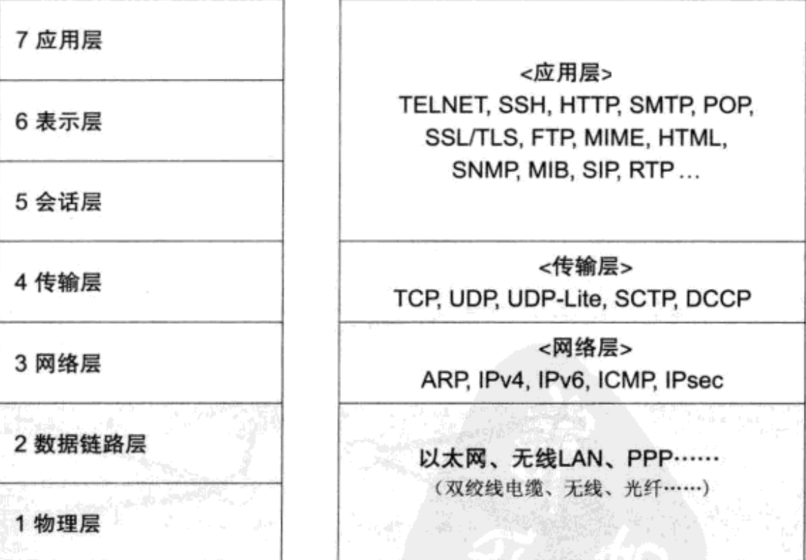
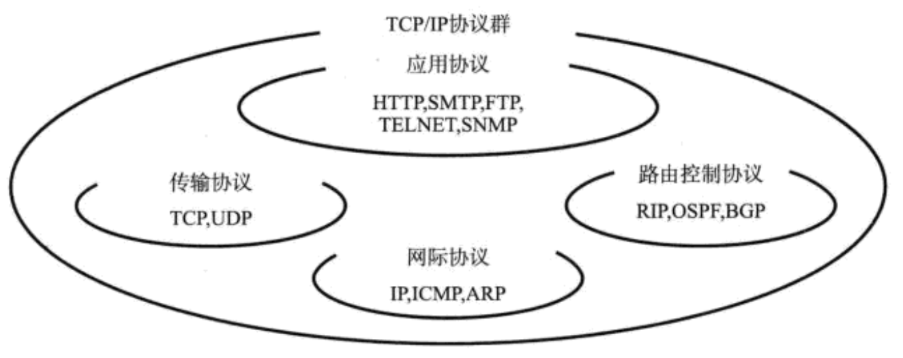
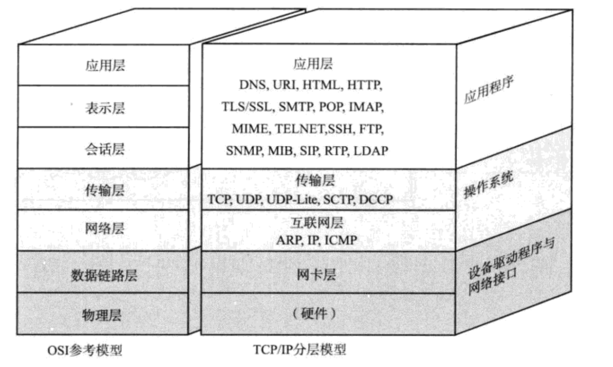

- 应用层：主机特有的数据格式
- 表示层：将主机特有的数据格式转换为网络标准传输格式
- 会话层：采用哪种连接发送
- 传输层：确认和断开链接
- 网络层：从主机 A 到主机 B 的数据通信处理
- 数据链路层：在通过传输介质互联的设备之间进行数据处理
- 物理层：将数据的 0、1 转换为电压和脉冲光传输给物理的传输介质，而相互直连的设备之间使用地址直接实现传输

**传输方式分类**

- 有连接和无连接

**地址**

- 地址的唯一性
- 地址的层次性

**网络构成的要素**

- 网卡 插网线的
- 中继器 第一层——物理层面上延长网络的设备，由电缆传过来的电信号或光信号经由中继器的波形调整和放大再传递给另一个电缆
- 网桥/2 层交换机 数据链路层连接 2 个网络的设备，能够识别数据帧，
- 路由器/3 层交换机 网络层面连接 2 个网络、并对分组报文进行转发的设备
- 4-7 层交换机 负责处理 OSI 从传输层到应用层的数据，如果用 TCP/IP 分层模型来表示，4-7 层交换机就是以 TCP 等协议的传输层机器上面的应用层为基础，分析收发数据，并对其进行特定的处理
- 网关 就是 OSI 参考模型中负责将从传输层到应用层的数据进行转换和转发的设备

## 网络的结构

TCP/IP 基础

TCP/IP 具体含义

使用 IP 进行通信时所必须用到的协议群的统称。

TCP/IP 标准化的精髓

开发性 和 实用性

TCP/IP 规范——RFC

互联网基础知识

TCP/IP 与 OSI 参考模型

- 硬件（物理层）：负责数据传输的硬件
- 网络接口层（数据链路层）：利用以太网中的数据链路层进行通信
- 互联网层（网络层） IP 协议基于 IP 地址转发分包数据
- 传输层 该层功能与 OSI 传输层类似，最主要的功能能够让应用程序之间实现通信（TCP/UDP）
- 应用层（会话层以上的分层）

> www => 协议 HTTP =》 OSI 应用层的协议 HTML 属于表示层的协议
>
> E-Mail => 协议 SMTP =》 MIME 协议扩展 => MIME 属于 OSI 表示层的协议
>
> 文件传输（FTP） =>
>
> 远程登录（TELNET 和 SSH）
>
> 网络管理(SNMP)

## MAC 地址

MAC 用于识别数据链路中互联的节点

## IP 协议

IP 作为整个 TCP/IP 中至关重要的协议。主要负责将数据包发送给最终的目标计算机。

IP 相当于 OSI 参考模型的第三层——网络层

网络层的主要作用是——实现终端节点之间的通信

网络层和数据链路层的关系：

数据链路层提供直连俩个设备之间的通信功能，与之相比，作为网络层的 IP 则负责在没有直连的俩个网络之间进行通信传输。

IP 属于网络层地址

MAC 地址正是用来标识同一个链路中不同计算机的一种识别码
