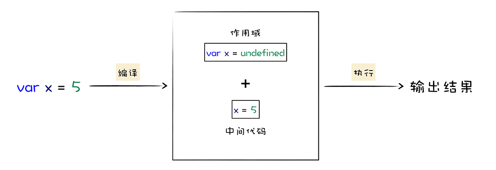
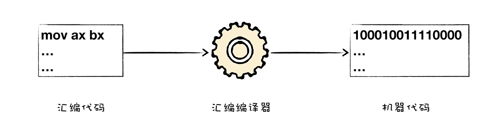
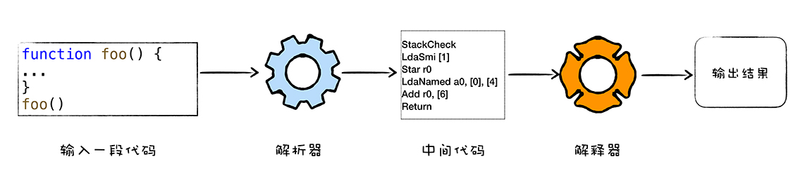
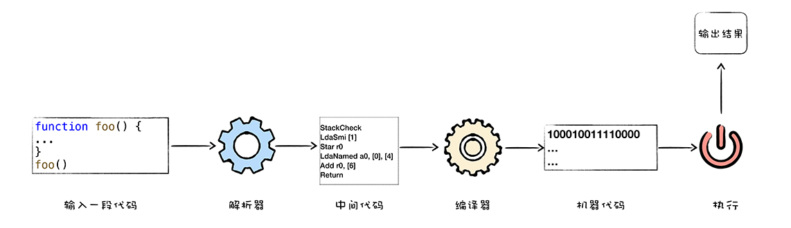
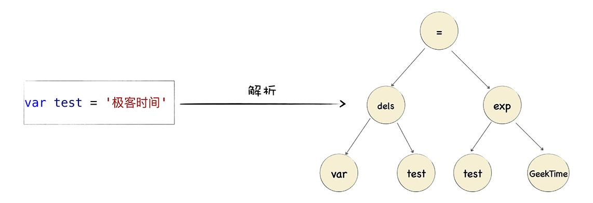

今天是我们整个课程的第一讲，我会从一个高层的宏观视角来解释什么是 V8，以及 V8 又是怎么执行一段 JavaScript 代码的。在这个过程中，我会引入一些核心概念，诸如 JIT、作用域、词法环境、执行上下文等，理解了这些概念，能够帮助你更好地理解 V8 是如何工作的，同时也能帮助你写出更加高效的 JavaScript 代码。

由于本节的目的是对 V8 做一个宏观的、全面的介绍，其目的是让你对 V8 的执行流程有个整体上的认识，所以涉及到的概念会比较多，如果你对其中一些概念不太理解也没有关系，在后面的章节中我会展开了详细地介绍。

## 什么是 V8？

首先我们来看看什么是 V8。

V8 是一个由 Google 开发的开源 JavaScript 引擎，目前用在 Chrome 浏览器和 Node.js 中，其核心功能是执行易于人类理解的 JavaScript 代码。


那么 V8 又是怎么执行 JavaScript 代码的呢？

其主要核心流程分为编译和执行两步。首先需要将 JavaScript 代码转换为低级中间代码或者机器能够理解的机器代码，然后再执行转换后的代码并输出执行结果。



你可以把 V8 看成是一个虚构出来的计算机，也称为虚拟机，虚拟机通过模拟实际计算机的各种功能来实现代码的执行，如模拟实际计算机的 CPU、堆栈、寄存器等，虚拟机还具有它自己的一套指令系统。

所以对于 JavaScript 代码来说，V8 就是它的整个世界，当 V8 执行 JavaScript 代码时，你并不需要担心现实中不同操作系统的差异，也不需要担心不同体系结构计算机的差异，你只需要按照虚拟机的规范写好代码就可以了。

既然 V8 是虚构出来的计算机，用来编译和执行 JavaScript 代码，那么接下来我们就看看，为什么计算机需要对 JavaScript 这样的高级语言进行编译，以及编译完成后又是如何执行的。

## 高级代码为什么需要先编译再执行？

我们先从 CPU 是怎么执行机器代码讲起，你可以把 CPU 看成是一个非常小的运算机器，我们可以通过二进制的指令和 CPU 进行沟通，比如我们给 CPU 发出“1000100111011000”的二进制指令，这条指令的意思是将一个寄存器中的数据移动到另外一个寄存器中，当处理器执行到这条指令的时候，便会按照指令的意思去实现相关的操作。

为了能够完成复杂的任务，工程师们为 CPU 提供了一大堆指令，来实现各种功能，我们就把这一大堆指令称为**指令集（Instructions）**，也就是**机器语言**。

注意，CPU 只能识别二进制的指令，但是对程序员来说，二进制代码难以阅读和记忆，于是我们又将二进制指令集转换为人类可以识别和记忆的符号，这就是**汇编指令集**，你可以参考下面的代码：

```bash
1000100111011000  机器指令
mov ax,bx         汇编指令
```

那么你可能会问，CPU 能直接识别汇编语言吗？

答案是“不能”，所以如果你使用汇编编写了一段程序，你还需要一个汇编编译器，其作用是将汇编代码编程成机器代码，具体流程你可以参考下图：



虽然汇编语言对机器语言做了一层抽象，减少了程序员理解机器语言的复杂度，但是汇编语言依然是复杂且繁琐的，即便你写一个非常简单的功能，也需要实现大量的汇编代码，这主要表现在以下两点。

首先，**不同的 CPU 有着不同的指令集**，如果要使用机器语言或者汇编语言来实现一个功能，那么你需要为每种架构的 CPU 编写特定的汇编代码，这会带来巨大的、枯燥繁琐的操作，你可以参看下图：


其次，**在编写汇编代码时，我们还需要了解和处理器架构相关的硬件知识**，比如你需要使用寄存器、内存、操作 CPU 等。大部分程序员在编写应用的时候，只想专心处理业务逻辑，并不想要过多地理会这些处理器架构相关的细节。

因此我们需要一种屏蔽了计算机架构细节的语言，能适应多种不同 CPU 架构的语言，能专心处理业务逻辑的语言，诸如 C、C++、Java、C#、Python、JavaScript 等，这些“高级语言”就应运而生了。

和汇编语言一样，处理器也不能直接识别由高级语言所编写的代码，那怎么办呢？通常，要有两种方式来执行这些代码。

第一种是解释执行，需要先将输入的源代码通过解析器编译成中间代码，之后直接使用解释器解释执行中间代码，然后直接输出结果。具体流程如下图所示：



第二种是编译执行。采用这种方式时，也需要先将源代码转换为中间代码，然后我们的编译器再将中间代码编译成机器代码。通常编译成的机器代码是以二进制文件形式存储的，需要执行这段程序的时候直接执行二进制文件就可以了。还可以使用虚拟机将编译后的机器代码保存在内存中，然后直接执行内存中的二进制代码。



以上就是计算机执行高级语言的两种基本的方式：解释执行和编译执行。但是针对不同的高级语言，这个实现方式还是有很大差异的，比如要执行 C 语言编写的代码，你需要将其编译为二进制代码的文件，然后再直接执行二进制代码。而对于像 Java 语言、JavaScript 语言等，则需要不同虚拟机，模拟计算机的这个编译执行流程。执行 Java 语言，需要经过 Java 虚拟机的转换，执行 JavaScript 需要经过 JavaScript 虚拟机的转换。

即便是 JavaScript 一门语言，也有好几种流行的虚拟机，它们之间的实现方式也存在着一部分差异，比如苹果公司在 Safari 中就是用 JavaScriptCore 虚拟机，Firefox 使用了 TraceMonkey 虚拟机，而 Chrome 则使用了 V8 虚拟机。

## V8 是怎么执行 JavaScript 代码的？

那么，V8 作为 JavaScript 的虚拟机的一种，它到底是怎么执行 JavaScript 代码的呢？是解释执行，还是编译执行呢？

实际上，V8 并没有采用某种单一的技术，而是混合编译执行和解释执行这两种手段，我们把这种混合使用编译器和解释器的技术称为 JIT（Just In Time）技术。

这是一种权衡策略，因为这两种方法都各自有自的优缺点，解释执行的启动速度快，但是执行时的速度慢，而编译执行的启动速度慢，但是执行时的速度快。你可以参看下面完整的 V8 执行 JavaScript 的流程图：


我们先看上图中的最左边的部分，在 V8 启动执行 JavaScript 之前，它还需要准备执行 JavaScript 时所需要的一些基础环境，这些基础环境包括了**“堆空间”“栈空间”“全局执行上下文”“全局作用域”“消息循环系统”“内置函数”**等，这些内容都是在执行 JavaScript 过程中需要使用到的，比如：

- JavaScript 全局执行上下文就包含了执行过程中的全局信息，比如一些内置函数，全局变量等信息；

- 全局作用域包含了一些全局变量，在执行过程中的数据都需要存放在内存中；

- 而 V8 是采用了经典的堆和栈的管理内存管理模式，所以 V8 还需要初始化了内存中的堆和栈结构；

- 另外，要我们的 V8 系统活起来，还需要初始化消息循环系统，消息循环系统包含了消息驱动器和消息队列，它如同 V8 的心脏，不断接受消息并决策如何处理消息。

基础环境准备好之后，接下来就可以向 V8 提交要执行的 JavaScript 代码了。

首先 V8 会接收到要执行的 JavaScript 源代码，不过这对 V8 来说只是一堆字符串，V8 并不能直接理解这段字符串的含义，它需要**结构化**这段字符串。结构化，是指信息经过分析后可分解成多个互相关联的组成部分，各组成部分间有明确的层次结构，方便使用和维护，并有一定的操作规范。

V8 源代码的结构化之后，就生成了抽象语法树 (AST)，我们称为 AST，AST 是便于 V8 理解的结构。

这里还需要注意一点，在生成 AST 的同时，V8 还会生成相关的作用域，作用域中存放相关变量，我们会在《 06 | 作用域链：V8 是如何查找变量的？》和《12 | 延迟解析：V8 是如何实现闭包的？》这两个节课中详细分析。

有了 AST 和作用域之后，接下来就可以生成字节码了，字节码是介于 AST 和机器代码的中间代码。但是与特定类型的机器代码无关，解释器可以直接解释执行字节码，或者通过编译器将其编译为二进制的机器代码再执行。我们会在 《13 ｜字节码（一）：V8 为什么又重新引入字节码》这节课中详细介绍字节码的前世今生。

好了，生成了字节码之后，解释器就登场了，它会按照顺序解释执行字节码，并输出执行结果。

相信你注意到了，我们在解释器附近画了个监控机器人，这是一个监控解释器执行状态的模块，在解释执行字节码的过程中，如果发现了某一段代码会被重复多次执行，那么监控机器人就会将这段代码标记为热点代码。

当某段代码被标记为热点代码后，V8 就会将这段字节码丢给优化编译器，优化编译器会在后台将字节码编译为二进制代码，然后再对编译后的二进制代码执行优化操作，优化后的二进制机器代码的执行效率会得到大幅提升。如果下面再执行到这段代码时，那么 V8 会优先选择优化之后的二进制代码，这样代码的执行速度就会大幅提升。

不过，和静态语言不同的是，JavaScript 是一种非常灵活的动态语言，对象的结构和属性是可以在运行时任意修改的，而经过优化编译器优化过的代码只能针对某种固定的结构，一旦在执行过程中，对象的结构被动态修改了，那么优化之后的代码势必会变成无效的代码，这时候优化编译器就需要执行反优化操作，经过反优化的代码，下次执行时就会回退到解释器解释执行。

## 跟踪一段实际代码的执行流程

我们以一段最简单的 JavaScript 代码为例，如果将这段非常简单的代码提交给 V8 引擎，V8 在处理过程中，中间所产生的结果是怎样的呢？下面我们就一步一步详细“追踪”下。

代码如下所示：

```js
// text.js
var test = 'GeekTime';
```

我们知道，首先这段代码会被解析器结构化称 AST，下面我们就来看看第一阶段生成的 AST 是什么样子的？

要查看 V8 中间生成的一些结构，可以使用 V8 提供的调试工具 D8 来查看，你可以将上面那段代码保存到 test.js 的文件中，然后执行下面命令：

```bash
d8 --print-ast test.js
```

执行这段命令之后，D8 会打印出如下内容：

```ast
--- AST ---
FUNC at 0
. KIND 0
. LITERAL ID 0
. SUSPEND COUNT 0
. NAME ""
. INFERRED NAME ""
. DECLS
. . VARIABLE (0x7ff0e3022298) (mode = VAR, assigned = true) "test"
. BLOCK NOCOMPLETIONS at -1
. . EXPRESSION STATEMENT at 11
. . . INIT at 11
. . . . VAR PROXY unallocated (0x7ff0e3022298) (mode = VAR, assigned = true) "test"
. . . . LITERAL "GeekTime"
```

上面这个结构就是 AST，它就是 JS 源代码的结构化表述，AST 是个树状结构，直观地理解，你可以将其转换为一个图形树，如下图所示：



从图中可以看出，AST 和代码结构也是一一对应关系，并且后续所有的操作都会直接或者间接基于它。

上面我们还提到了，在生成 AST 的同时，还会生成作用域，同样我们使用 D8 来看看它生成的作用域是什么样子，你可以使用下面的命令来查看作用域：

```js
d8 --print-scopes test.js
```

执行这段命令之后，D8 会打印出如下内容：

```bash
Global scope:
global { // (0x7fd974022048) (0, 24)
  // will be compiled
  // 1 stack slots
  // temporary vars:
  TEMPORARY .result;  // (0x7fd9740223c8) local[0]
  // local vars:
  VAR test;  // (0x7fd974022298)
}
```

上面这行代码生成了一个全局作用域，我们可以看到 test 变量被添加进了这个全局作用域中。

生成了 AST 和作用域之后，就可以使用解释器生成字节码了，同样你可以使用 D8 来打印生成后的字节码，打印的命令如下所示：

```bash
d8 --print-bytecode test.js
```

执行这段语句，最终打印出来的结果如下所示：

```bytecode
[generated bytecode for function:  (0x2b510824fd55 <SharedFunctionInfo>)]
Parameter count 1
Register count 4
Frame size 32
         0x2b510824fdd2 @    0 : a7                StackCheck
         0x2b510824fdd3 @    1 : 12 00             LdaConstant [0]
         0x2b510824fdd5 @    3 : 26 fa             Star r1
         0x2b510824fdd7 @    5 : 0b                LdaZero
         0x2b510824fdd8 @    6 : 26 f9             Star r2
         0x2b510824fdda @    8 : 27 fe f8          Mov <closure>, r3
         0x2b510824fddd @   11 : 61 32 01 fa 03    CallRuntime [DeclareGlobals], r1-r3
         0x2b510824fde2 @   16 : 12 01             LdaConstant [1]
         0x2b510824fde4 @   18 : 15 02 02          StaGlobal [2], [2]
         0x2b510824fde7 @   21 : 0d                LdaUndefined
         0x2b510824fde8 @   22 : ab                Return
Constant pool (size = 3)
0x2b510824fd9d: [FixedArray] in OldSpace
 - map: 0x2b51080404b1 <Map>
 - length: 3
           0: 0x2b510824fd7d <FixedArray[4]>
           1: 0x2b510824fd1d <String[#8]: GeekTime>
           2: 0x2b51081c8549 <String[#4]: test>
Handler Table (size = 0)
Source Position Table (size = 0)
```

上面就是这段代码生成的中间字节码，关于字节码，我们会在后续课程《14 | 字节码（二）：解释器是如何解释执行字节码的？》来介绍，在这里我们现有一个大致的认识就可以了。

生成字节码之后，解释器会解释执行这段字节码，如果重复执行了某段代码，监控器就会将其标记为热点代码，并提交给编译器优化执行，如果你想要查看那些代码被优化了，可以使用下面的命令：

```bash
d8 --trace-opt test.js
```

如果要查看那些代码被反优化了，可以使用如下命令行来查看：

```bash
pt --trace-deopt test.js
```

由于我们这段代码过于简单，没有触发 V8 的优化机制，在这里我们也就不展开介绍优化机制了，具体的流程我会在后续课程《15 | 隐藏类：如何在内存中快速查找对象属性？》这一节展开详细介绍。

## 总结

V8 是由 Google 开发的开源 JavaScript 引擎，也被称为虚拟机，模拟实际计算机各种功能来实现代码的编译和执行。那么，要想搞清楚 V8 内部的工作流程和原理，我们可以从分析计算机对语言的编译和执行过程入手。

因为计算机只能识别二进制指令，所以要让计算机执行一段高级语言通常有两种手段，第一种是将高级代码转换为二进制代码，再让计算机去执行；另外一种方式是在计算机安装一个解释器，并由解释器来解释执行。

解释执行和编译执行都有各自的优缺点，解释执行启动速度快，但是执行时速度慢，而编译执行启动速度慢，但是执行速度快。为了充分地利用解释执行和编译执行的优点，规避其缺点，V8 采用了一种权衡策略，在启动过程中采用了解释执行的策略，但是如果某段代码的执行频率超过一个值，那么 V8 就会采用优化编译器将其编译成执行效率更加高效的机器代码。

理解了这一点，我们就可以来深入分析 V8 执行一段 JavaScript 代码所经历的主要流程了，这包括了：

- 初始化基础环境；
- 解析源码生成 AST 和作用域；
- 依据 AST 和作用域生成字节码；
- 解释执行字节码；
- 监听热点代码；
- 优化热点代码为二进制的机器代码；
- 反优化生成的二进制机器代码。

这里你需要注意的是，V8 是一门动态语言，在运行过程中，某些被优化的结构可能会被 JavaScript 动态修改了，这会导致之前被优化的代码失效，如果某块优化之后的代码失效了，那么编译器需要执行反优化操作。

## 课后思考

最后，给你留一道思考题：除了 V8 采用了 JIT 技术，还有那些虚拟机采用了 JIT 技术？欢迎你在留言区与我分享讨论。
