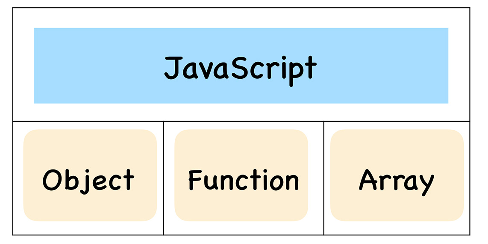
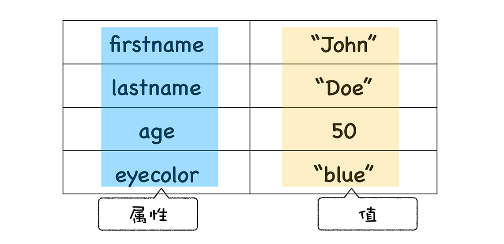
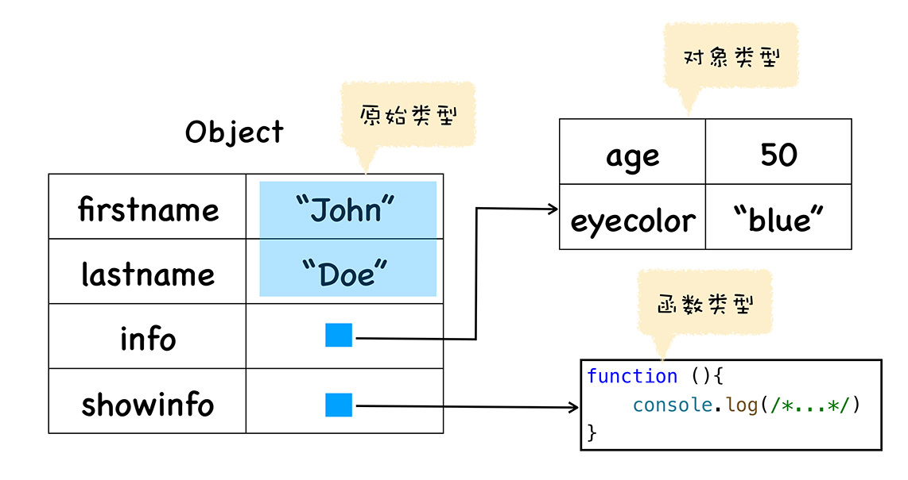
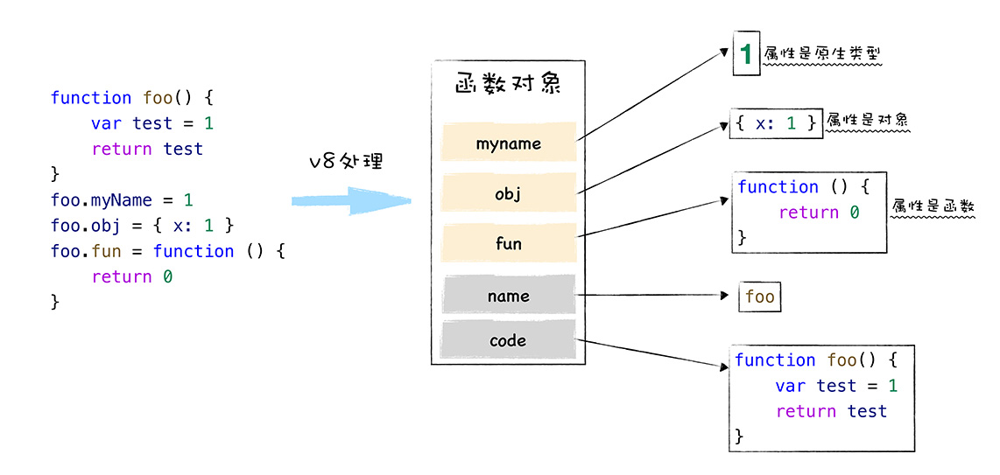
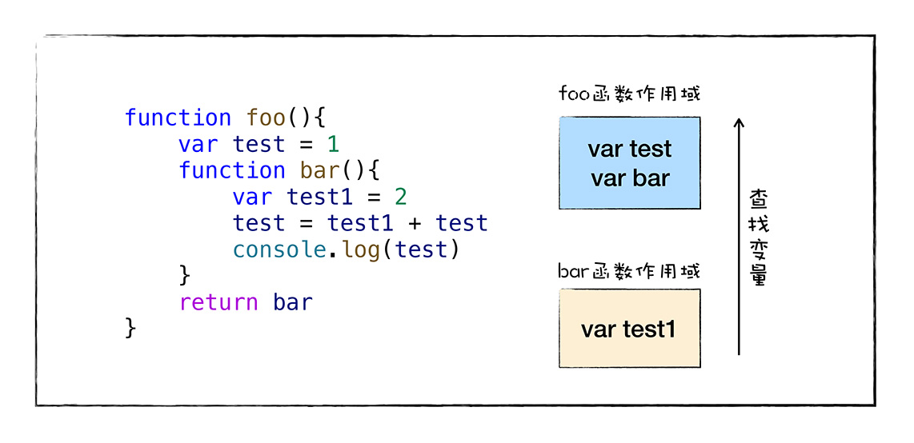

如果你熟悉了一门其他流行语言，再来使用 JavaScript，那么 JavaScript 中的函数可能会给你造成一些误解，比如在 JavaScript 中，你可以将一个函数赋值给一个变量，还可以将函数作为一个参数传递给另外一个函数，甚至可以使得一个函数返回另外一个函数，这在一些主流语言中都很难实现。

JavaScript 中的函数非常灵活，其根本原因在于 **JavaScript 中的函数就是一种特殊的对象**，我们把 JavaScript 中的函数称为**一等公民 (First Class Function)。**

基于函数是一等公民的设计，使得 JavaScript 非常容易实现一些特性，比如闭包，还有函数式编程等，而其他语言要实现这些特性就显得比较困难，比如要在 C++ 中实现闭包需要实现大量复杂的代码，而且使用起来也异常复杂。

函数式编程和闭包在实际的项目中会经常遇到，如果不了解这些特性，那么在你使用第三方代码时就会非常吃力，同时自己也很难使用这些特性写出优雅的代码，因此我们很有必要了解这些特性的底层机制。

另外，在我们后续课程介绍 V8 工作机制时，会学习 V8 是怎么实现闭包的，还会学习 V8 是如何将 JavaScript 的动态特性静态化以加快代码的执行速度，这些内容都涉及到 JavaScript 中的函数底层特性。

今天，我们就来深入分析下，JavaScript 中的“函数”到底有怎样的特点。

## 什么是 JavaScript 中的对象？

既然在 JavaScript 中，函数就是一种特殊的对象，那我们首先要明白，什么是 JavaScript 中的“对象”？它和面向对象语言中的“对象”有什么区别？

和其他主流语言不一样的是，JavaScript 是一门**基于对象 (Object-Based)** 的语言，可以说 JavaScript 中大部分的内容都是由对象构成的，诸如函数、数组，也可以说 JavaScript 是建立在对象之上的语言。



而这些对象在运行时可以动态修改其内容，这造就了 JavaScript 的超级灵活特性。不过，因为 JavaScript 太灵活了，也加大了理解和使用这门语言的难度。

虽然 JavaScript 是基于对象设计的，但是它却不是一门**面向对象的语言 (Object-Oriented Programming Language)**，因为面向对象语言天生支持**封装、继承、多态，**但是 JavaScript 并没有直接提供多态的支持，因此要在 JavaScript 中使用多态并不是一件容易的事。


除了对多态支持的不好，JavaScript 实现继承的方式和面向对象的语言实现继承的方式同样存在很大的差异。

面向对象语言是由语言本身对继承做了充分的支持，并提供了大量的关键字，如 public、protected、friend、interface 等，众多的关键字使得面向对象语言的继承变得异常繁琐和复杂，而 JavaScript 中实现继承的方式却非常简单清爽，**只是在对象中添加了一个称为原型的属性，把继承的对象通过原型链接起来，就实现了继承，我们把这种继承方式称为基于原型链继承。**关于 V8 是如何支持原型的，我们会在《05 | 原型链：V8 是如何实现对象继承的？》这节课做具体介绍。

既然“JavaScript 中的对象”和“面向对象语言中的对象”存在巨大差异，那么在 JavaScript 中，我们所谈论的对象到底是指什么呢？

其实 JavaScript 中的对象非常简单，每个对象就是由一组组属性和值构成的集合，比如我使用下面代码创建了一个 person 对象：

```javascript
var person = new Object();
person.firstname = 'John';
person.lastname = 'Doe';
person.age = 50;
person.eyecolor = 'blue';
```

这个对象里面有四个属性，为了直观理解，你可以参看下图：



上图展示了对象 person 的结构，我们可以看到蓝色的属性在左边，黄色的值在右边，有多组属性和值组成，这就是 JavaScript 中的对象，虽然 JavaScript 对象用途非常广泛，使用的方式也非常之多，但是万变不离其宗，其核心本质都就是由一组组属性和值组成的集合，抓住了这一点，当我们再分析对象时，就会轻松很多。

在 JavaScript 中，之所以它的对象的用途这么广，是因为对象的值可以是任意类型的数据，我们可以改造下上面的那段代码，来看看对象的值都有那些类型？改造后的代码如下所示：

```javascript
var person = new Object();
person.firstname = 'John';
person.lastname = 'Doe';
person.info = new Object();
person.info.age = 50;
person.info.eyecolor = 'blue';
person.showinfo = function () {
  console.log(/*...*/);
};
```

我们可以先画出这段代码的内存布局，如下图所示：



观察上图，我们可以看出来，对象的属性值有三种类型：

第一种是**原始类型 (primitive)**，所谓的原始类的数据，是指值本身无法被改变，比如 JavaScript 中的字符串就是原始类型，如果你修改了 JavaScript 中字符串的值，那么 V8 会返回给你一个新的字符串，原始字符串并没有被改变，我们称这些类型的值为“原始值”。

JavaScript 中的原始值主要包括 null、undefined、boolean、number、string、bigint、symbol 这七种。

第二种就是我们现在介绍的**对象类型 (Object)**，对象的属性值也可以是另外一个对象，比如上图中的 info 属性值就是一个对象。

第三种是**函数类型 (Function)**，如果对象中的属性值是函数，那么我们把这个属性称为方法，所以我们又说对象具备属性和方法，那么上图中的 showinfo 就是 person 对象的一个方法。


## 函数的本质

分析完对象，现在我们就能更好地理解 JavaScript 中函数的概念了。

在这节课开始我就提到，在 JavaScript 中，函数是一种特殊的对象，它和对象一样可以拥有属性和值，但是函数和普通对象不同的是，函数可以被调用。

我们先来看一段 JavaScript 代码，在这段代码中，我们定义了一个函数 foo，接下来我们给 foo 函数设置了 myName 和 uName 的属性。

```js
function foo() {
  var test = 1;
}
foo.myName = 1;
foo.uName = 2;
console.log(foo.myName);
```

既然是函数，那么它也可以被调用。比如你定义了一个函数，便可以通过函数名称加小括号来实现函数的调用，代码如下所示：

```js
function foo() {
  var test = 1;
  console.log(test);
}
foo();
```

除了使用函数名称来实现函数的调用，还可以直接调用一个匿名函数，代码如下所示：

```js
(function () {
  var test = 1;
  console.log(test);
})();
```

那么，V8 内部是怎么实现函数可调用特性的呢？

其实在 V8 内部，我们会为函数对象添加了两个隐藏属性，具体属性如下图所示：



也就是说，函数除了可以拥有常用类型的属性值之外，还拥有两个隐藏属性，分别是 name 属性和 code 属性。

隐藏 name 属性的值就是函数名称，如果某个函数没有设置函数名，如下面这段函数：

```js
(function () {
  var test = 1;
  console.log(test);
})();
```

该函数对象的默认的 name 属性值就是 anonymous，表示该函数对象没有被设置名称。另外一个隐藏属性是 code 属性，其值表示函数代码，以字符串的形式存储在内存中。当执行到一个函数调用语句时，V8 便会从函数对象中取出 code 属性值，也就是函数代码，然后再解释执行这段函数代码。

## 函数是一等公民

因为函数是一种特殊的对象，所以在 JavaScript 中，函数可以赋值给一个变量，也可以作为函数的参数，还可以作为函数的返回值。**如果某个编程语言的函数可以和它的数据类型做一样的事情，我们就把这个语言中的函数称为一等公民。**支持函数是一等公民的语言可以使得代码逻辑更加清晰，代码更加简洁。

但是由于函数的“可被调用”的特性，使得实现函数的可赋值、可传参和可作为返回值等特性变得有一点麻烦。为什么？

我们知道，在执行 JavaScript 函数的过程中，为了实现变量的查找，V8 会为其维护一个作用域链，如果函数中使用了某个变量，但是在函数内部又没有定义该变量，那么函数就会沿着作用域链去外部的作用域中查找该变量，具体流程如下图所示：



从图中可以看出，当函数内部引用了外部的变量时，使用这个函数进行赋值、传参或作为返回值，你还需要保证这些被引用的外部变量是确定存在的，这就是让函数作为一等公民麻烦的地方，因为虚拟机还需要处理函数引用的外部变量。我们来看一段简单的代码：

```javascript
function foo() {
  var number = 1;
  function bar() {
    number++;
    console.log(number);
  }
  return bar;
}
var mybar = foo();
mybar();
```

观察上段代码可以看到，我们在 foo 函数中定义了一个新的 bar 函数，并且 bar 函数引用了 foo 函数中的变量 number，当调用 foo 函数的时候，它会返回 bar 函数。

那么所谓的“函数是一等公民”就体现在，如果要返回函数 bar 给外部，那么即便 foo 函数执行结束了，其内部定义的 number 变量也不能被销毁，因为 bar 函数依然引用了该变量。

我们也把这种将外部变量和和函数绑定起来的技术称为闭包。V8 在实现闭包的特性时也做了大量的额外的工作，关于闭包的详细实现，我们会在《12 | 延迟解析：V8 是如何实现闭包的？》这节课再介绍。

另外基于函数是一等公民，我们可以轻松使用 JavaScript 来实现目前比较流行的函数式编程，函数式编程规则很少，非常优美，不过这并不是本专栏的重点，所以我们先略开不讲。

好了，今天的内容就介绍到这里，下面我来总结下本文的主要内容。

本文我们围绕 JavaScript 中的函数来展开介绍，JavaScript 中的函数非常灵活，既可以被调用，还可以作为变量、参数和返回值，这些特性使得函数的用法非常多，这也导致了函数变得有些复杂，因此本文的目的就是要讲清楚函数到底是什么？

因为函数是一种特殊的对象，所以我们先介绍了 JavaScript 中的对象，JavaScript 中的对象就是由一组一组属性和值组成的集合，既然函数也是对象，那么函数也是由一组组值和属性组成的集合，我们还在文中使用了一段代码证明了这点。

因为函数作为一个对象，是可以被赋值、作为参数，还可以作为返回值的，那么如果一个函数返回了另外一个函数，那么就应该返回该函数所有相关的内容。

接下来，我们又介绍了一个函数到底关联了哪些内容：

函数作为一个对象，它有自己的属性和值，所以函数关联了基础的属性和值；

函数之所以成为特殊的对象，这个特殊的地方是函数可以“被调用”，所以一个函数被调用时，它还需要关联相关的执行上下文。

结合以上两点，JavaScript 中的函数就实现了“函数是一等公民”的特性。

## 思考题

本文我们从对象聊到了闭包，那么留给你的问题是，哪些语言天生支持“函数是一等公民”？
