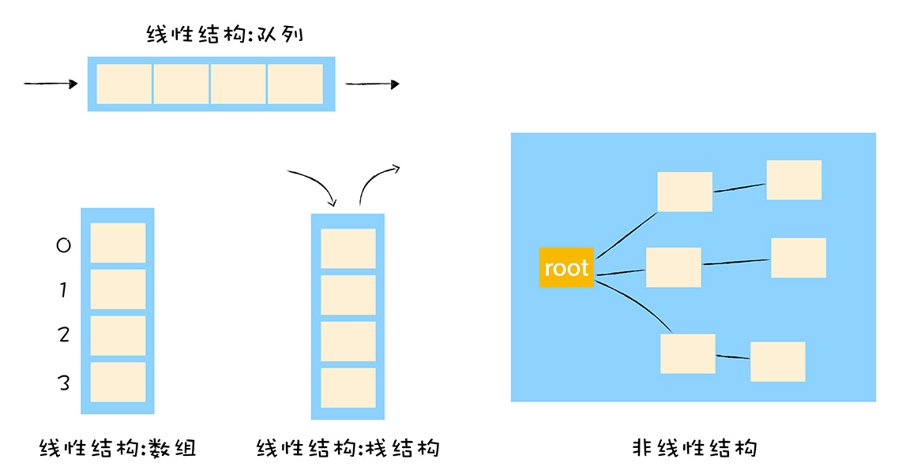
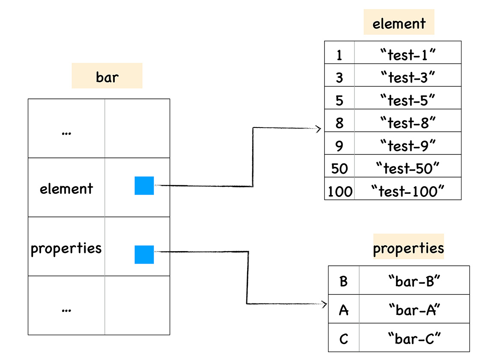
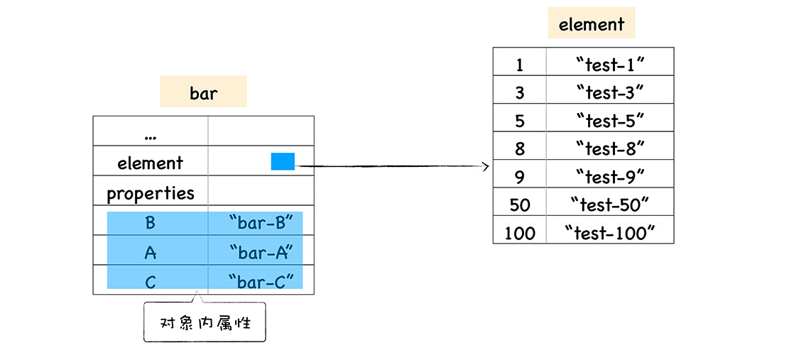
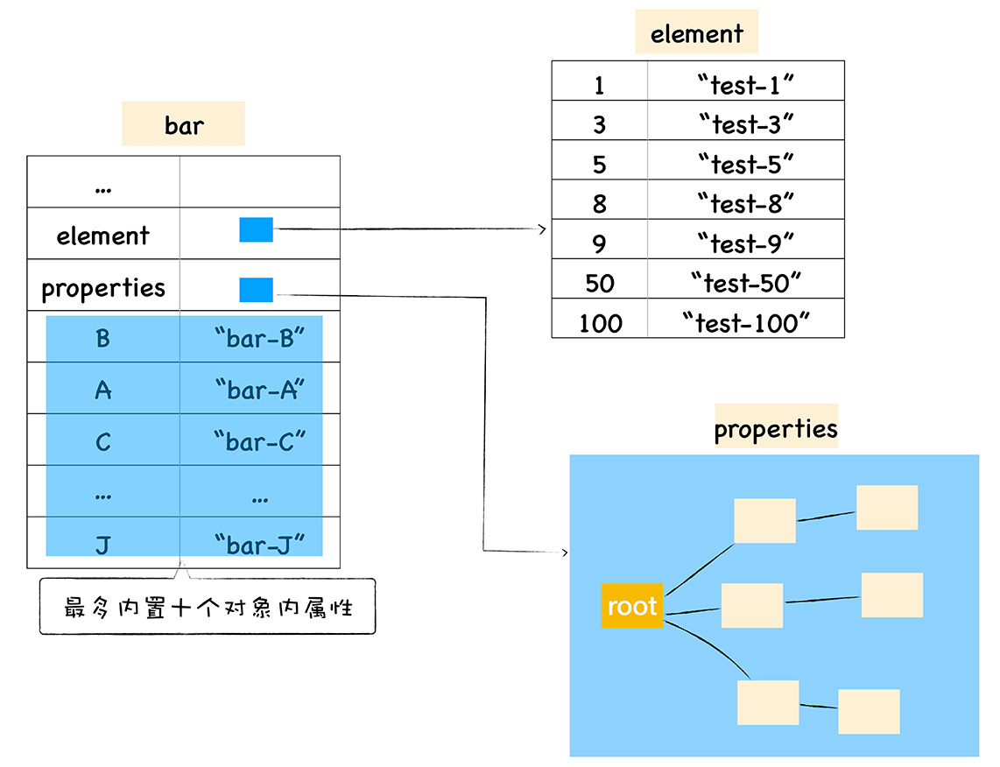
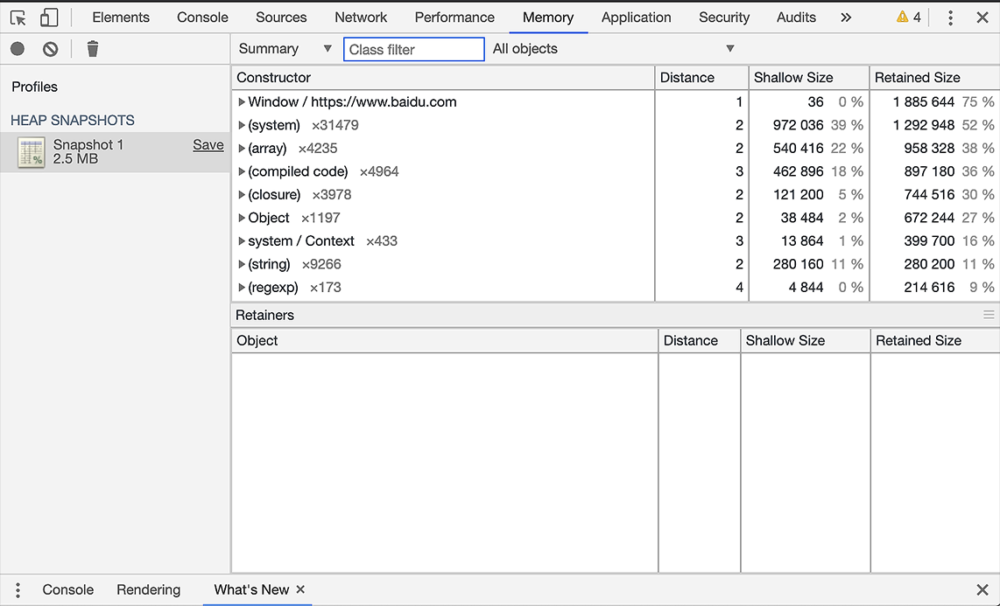
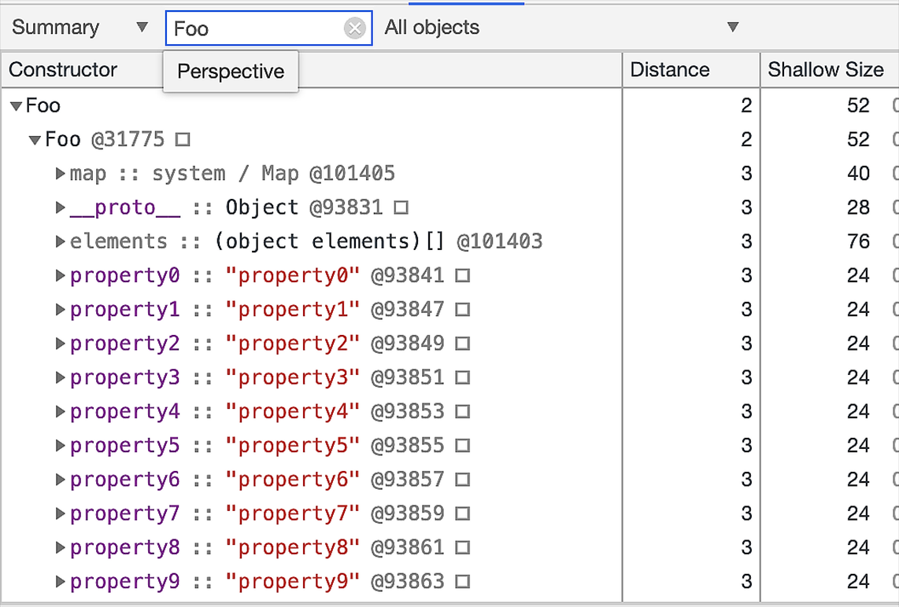
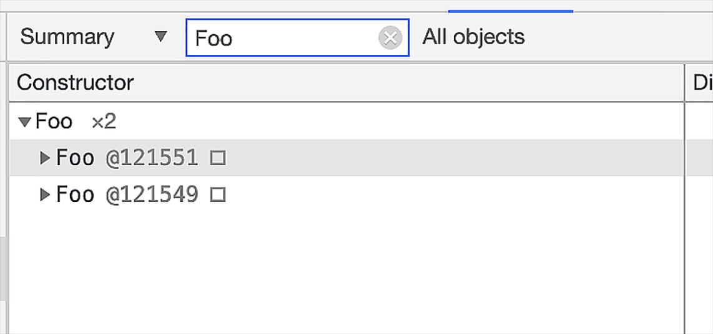
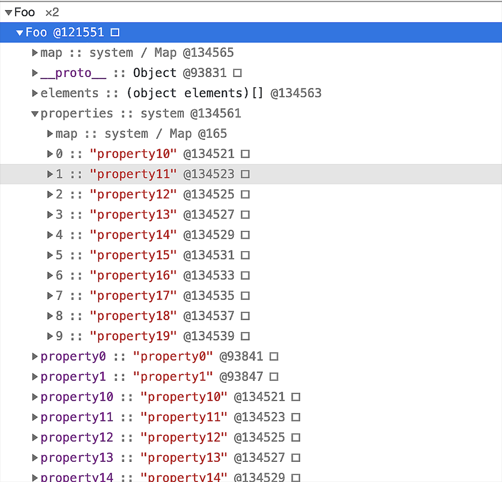
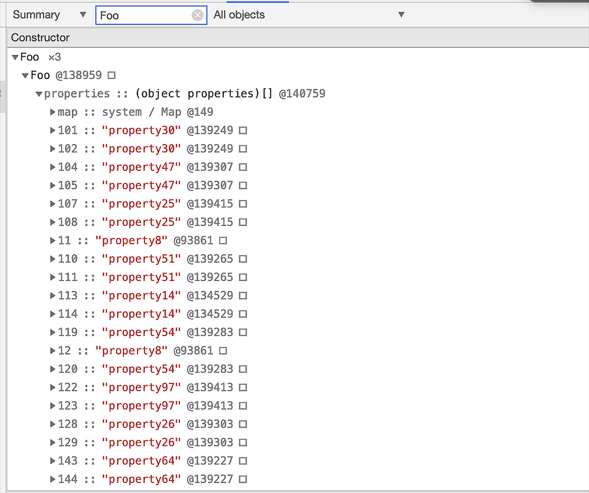
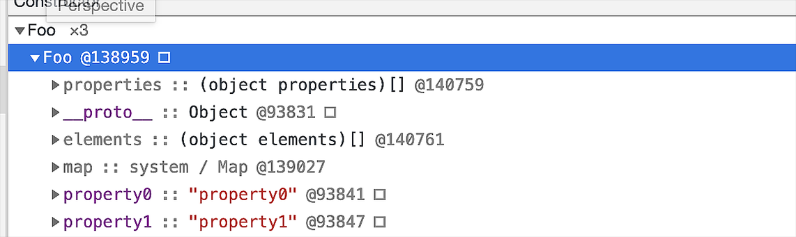

在前面的课程中，我们介绍了 JavaScript 中的对象是由一组组属性和值的集合，从 JavaScript 语言的角度来看，JavaScript 对象像一个字典，字符串作为键名，任意对象可以作为键值，可以通过键名读写键值。

然而在 V8 实现对象存储时，并没有完全采用字典的存储方式，这主要是出于性能的考量。因为字典是非线性的数据结构，查询效率会低于线性的数据结构，V8 为了提升存储和查找效率，采用了一套复杂的存储策略。



今天这节课我们就来分析下 V8 采用了哪些策略提升了对象属性的访问速度。

## 常规属性 (properties) 和排序属性 (element)

在开始之前，我们先来了解什么是对象中的**常规属性**和**排序属性**，你可以先参考下面这样一段代码：

```javascript
function Foo() {
  this[100] = 'test-100';
  this[1] = 'test-1';
  this['B'] = 'bar-B';
  this[50] = 'test-50';
  this[9] = 'test-9';
  this[8] = 'test-8';
  this[3] = 'test-3';
  this[5] = 'test-5';
  this['A'] = 'bar-A';
  this['C'] = 'bar-C';
}
var bar = new Foo();
for (key in bar) {
  console.log(`index:${key}  value:${bar[key]}`);
}
```

在上面这段代码中，我们利用构造函数 Foo 创建了一个 bar 对象，在构造函数中，我们给 bar 对象设置了很多属性，包括了数字属性和字符串属性，然后我们枚举出来了 bar 对象中所有的属性，并将其一一打印出来，下面就是执行这段代码所打印出来的结果：

```bash
index:1  value:test-1
index:3  value:test-3
index:5  value:test-5
index:8  value:test-8
index:9  value:test-9
index:50  value:test-50
index:100  value:test-100
index:B  value:bar-B
index:A  value:bar-A
index:C  value:bar-C
```

观察这段打印出来的数据，我们发现打印出来的属性顺序并不是我们设置的顺序，我们设置属性的时候是乱序设置的，比如开始先设置 100，然后有设置了 1，但是输出的内容却非常规律，总的来说体现在以下两点：

- 设置的数字属性被最先打印出来了，并且按照数字大小的顺序打印的；
- 设置的字符串属性依然是按照之前的设置顺序打印的，比如我们是按照 B、A、C 的顺序设置的，打印出来依然是这个顺序。

之所以出现这样的结果，是因为在 ECMAScript 规范中定义了**数字属性应该按照索引值大小升序排列，字符串属性根据创建时的顺序升序排列。**

在这里我们把对象中的数字属性称为**排序属性**，在 V8 中被称为 **elements**，字符串属性就被称为**常规属性**，在 V8 中被称为 **properties**。

在 V8 内部，为了有效地提升存储和访问这两种属性的性能，分别使用了两个**线性数据结构**来分别保存排序属性和常规属性，具体结构如下图所示：



通过上图我们可以发现，bar 对象包含了两个隐藏属性：elements 属性和 properties 属性，elements 属性指向了 elements 对象，在 elements 对象中，会按照顺序存放排序属性，properties 属性则指向了 properties 对象，在 properties 对象中，会按照创建时的顺序保存了常规属性。

分解成这两种线性数据结构之后，如果执行索引操作，那么 V8 会先从 elements 属性中按照顺序读取所有的元素，然后再在 properties 属性中读取所有的元素，这样就完成一次索引操作。

## 快属性和慢属性

将不同的属性分别保存到 elements 属性和 properties 属性中，无疑简化了程序的复杂度，但是在查找元素时，却多了一步操作，比如执行 bar.B 这个语句来查找 B 的属性值，那么在 V8 会先查找出 properties 属性所指向的对象 properties，然后再在 properties 对象中查找 B 属性，这种方式在查找过程中增加了一步操作，因此会影响到元素的查找效率。

基于这个原因，V8 采取了一个权衡的策略以加快查找属性的效率，这个策略是将部分常规属性直接存储到对象本身，我们把这称为**对象内属性 (in-object properties)。**对象在内存中的展现形式你可以参看下图：



采用对象内属性之后，常规属性就被保存到 bar 对象本身了，这样当再次使用 bar.B 来查找 B 的属性值时，V8 就可以直接从 bar 对象本身去获取该值就可以了，这种方式减少查找属性值的步骤，增加了查找效率。

不过对象内属性的数量是固定的，默认是 10 个，如果添加的属性超出了对象分配的空间，则它们将被保存在常规属性存储中。虽然属性存储多了一层间接层，但可以自由地扩容。

通常，我们将保存在线性数据结构中的属性称之为“快属性”，因为线性数据结构中只需要通过索引即可以访问到属性，虽然访问线性结构的速度快，但是如果从线性结构中添加或者删除大量的属性时，则执行效率会非常低，这主要因为会产生大量时间和内存开销。

因此，如果一个对象的属性过多时，V8 为就会采取另外一种存储策略，那就是“慢属性”策略，但慢属性的对象内部会有独立的非线性数据结构 (词典) 作为属性存储容器。所有的属性元信息不再是线性存储的，而是直接保存在属性字典中。



## 实践：在 Chrome 中查看对象布局

现在我们知道了 V8 是怎么存储对象的了，接下来我们来结合 Chrome 中的内存快照，来看看对象在内存中是如何布局的？

你可以打开 Chrome 开发者工具，先选择控制台标签，然后在控制台中执行以下代码查看内存快照：

```javascript
function Foo(property_num, element_num) {
  //添加可索引属性
  for (let i = 0; i < element_num; i++) {
    this[i] = `element${i}`;
  }
  //添加常规属性
  for (let i = 0; i < property_num; i++) {
    let ppt = `property${i}`;
    this[ppt] = ppt;
  }
}
var bar = new Foo(10, 10);
```

上面我们创建了一个构造函数，可以利用该构造函数创建了新的对象，我给该构造函数设置了两个参数 property_num、element_num，分别代表创建常规属性的个数和排序属性的个数，我们先将这两种类型的个数都设置为 10 个，然后利用该构造函数创建了一个新的 bar 对象。

创建了函数对象，接下来我们就来看看构造函数和对象在内存中的状态。你可以将 Chrome 开发者工具切换到 Memory 标签，然后点击左侧的小圆圈就可以捕获当前的内存快照，最终截图如下所示：



上图就是收集了当前内存快照的界面，要想查找我们刚才创建的对象，你可以在搜索框里面输入构造函数 Foo，Chrome 会列出所有经过构造函数 Foo 创建的对象，如下图所示：



观察上图，我们搜索出来了所有经过构造函数 Foo 创建的对象，点开 Foo 的那个下拉列表，第一个就是刚才创建的 bar 对象，我们可以看到 bar 对象有一个 elements 属性，这里面就包含我们创造的所有的排序属性，那么怎么没有常规属性对象呢？

这是因为只创建了 10 个常规属性，所以 V8 将这些常规属性直接做成了 bar 对象的对象内属性。

所以这时候的数据内存布局是这样的：

- 10 个常规属性作为对象内属性，存放在 bar 函数内部；

- 10 个排序属性存放在 elements 中。

接下来我们可以将创建的对象属性的个数调整到 20 个，你可以在控制台执行下面这段代码：

```javascript
var bar2 = new Foo(20, 10);
```

然后我们再重新生成内存快照，再来看看生成的图片：



我们可以看到，构造函数 Foo 下面已经有了两个对象了，其中一个 bar，另外一个是 bar2，我们点开第一个 bar2 对象，内容如下所示：



由于创建的常用属性超过了 10 个，所以另外 10 个常用属性就被保存到 properties 中了，注意因为 properties 中只有 10 个属性，所以依然是线性的数据结构，我们可以看其都是按照创建时的顺序来排列的。

所以这时候属性的内存布局是这样的：

- 10 属性直接存放在 bar2 的对象内 ;

- 10 个常规属性以线性数据结构的方式存放在 properties 属性里面 ;

- 10 个数字属性存放在 elements 属性里面。

如果常用属性太多了，比如创建了 100 个，那么我们再来看看其内存分布，你可以执行下面这段代码：

```javascript
var bar3 = new Foo(100, 10);
```

然后以同样的方式打开 bar3，查看其内存布局，最终如下图所示：



结合上图，我们可以看到，这时候的 properties 属性里面的数据并不是线性存储的，而是以非线性的字典形式存储的，所以这时候属性的内存布局是这样的：

- 10 属性直接存放在 bar3 的对象内 ;
- 90 个常规属性以非线性字典的这种数据结构方式存放在 properties 属性里面 ;
- 10 个数字属性存放在 elements 属性里面。

## 其他属性

好了，现在我们知道 V8 是怎么存储对象的了，不过这里还有几个重要的隐藏属性我还没有介绍，下面我们就来简单地看下。你可以先看下图：



观察上图，除了 elements 和 properties 属性，V8 还为每个对象实现了 map 属性和 **proto** 属性。**proto** 属性就是原型，是用来实现 JavaScript 继承的，我们会在下一节来介绍；而 map 则是隐藏类，我们会在《15 | 隐藏类：如何在内存中快速查找对象属性？》这一节中介绍其工作机制。

## 总结

好了，本节的内容就介绍到这里，下面我来总结下本文的主要内容：

本文我们的主要目标是介绍 V8 内部是如何存储对象的，因为 JavaScript 中的对象是由一组组属性和值组成的，所以最简单的方式是使用一个字典来保存属性和值，但是由于字典是非线性结构，所以如果使用字典，读取效率会大大降低。

为了提升查找效率，V8 在对象中添加了两个隐藏属性，排序属性和常规属性，指向了 elements 对象，在 elements 对象中，会按照顺序存放排序属性。properties 属性则指向了 properties 对象，在 properties 对象中，会按照创建时的顺序保存常规属性。

通过引入这两个属性，加速了 V8 查找属性的速度，为了更加进一步提升查找效率，V8 还实现了内置内属性的策略，当常规属性少于一定数量时，V8 就会将这些常规属性直接写进对象中，这样又节省了一个中间步骤。

但是如果对象中的属性过多时，或者存在反复添加或者删除属性的操作，那么 V8 就会将线性的存储模式降级为非线性的字典存储模式，这样虽然降低了查找速度，但是却提升了修改对象的属性的速度。

## 思考题

通常，我们不建议使用 delete 来删除属性，你能结合文中介绍的快属性和慢属性，给出不建议使用 delete 的原因吗？欢迎你在留言区与我分享讨论。

## 其他博客

- [V8 是怎么跑起来的 —— V8 中的对象表示](https://www.cnblogs.com/chargeworld/p/12236848.html)
- [漫画：什么是 HashMap？](https://juejin.cn/post/6844903518264885256)
- [v8 引擎原博客](https://v8.dev/blog/fast-properties)
  > "The number of in-object properties is predetermined by the initial size of the object" in-object properties size 取决于初始化对象的大小。
