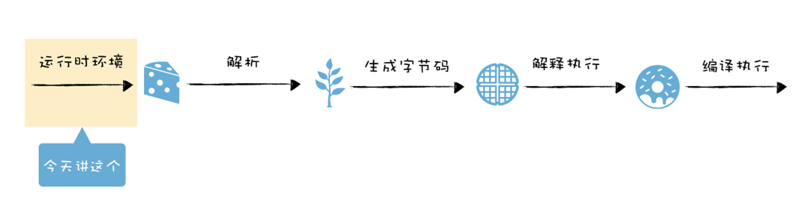
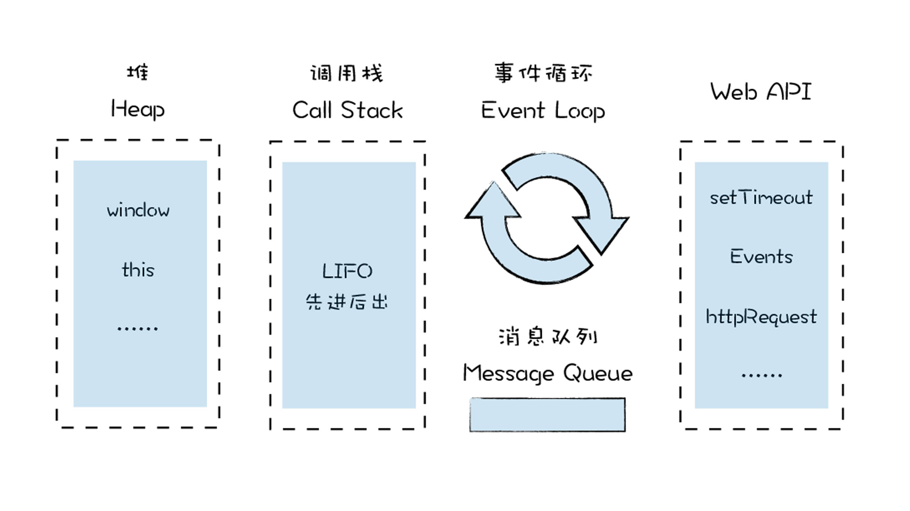
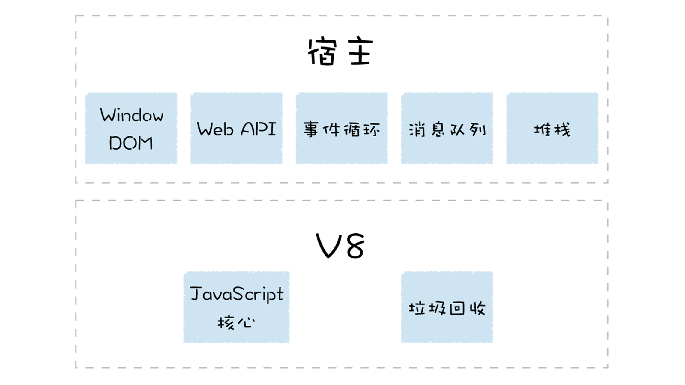
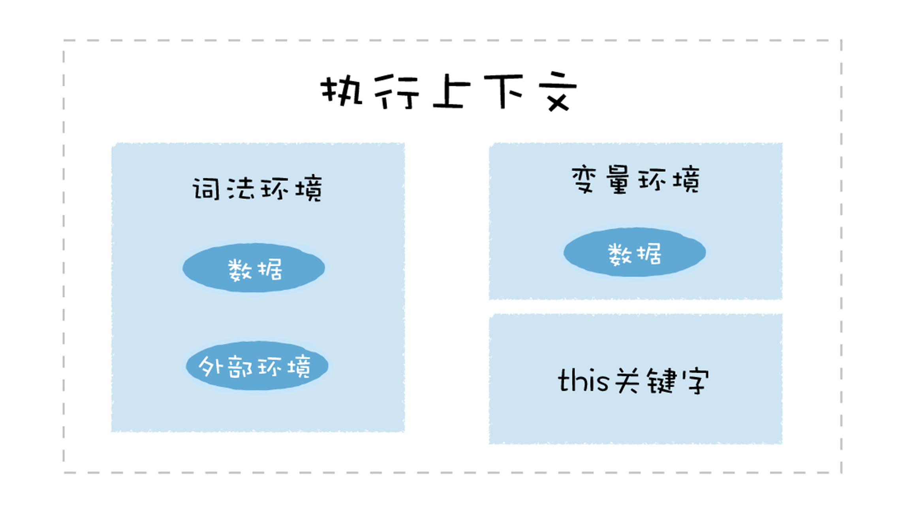
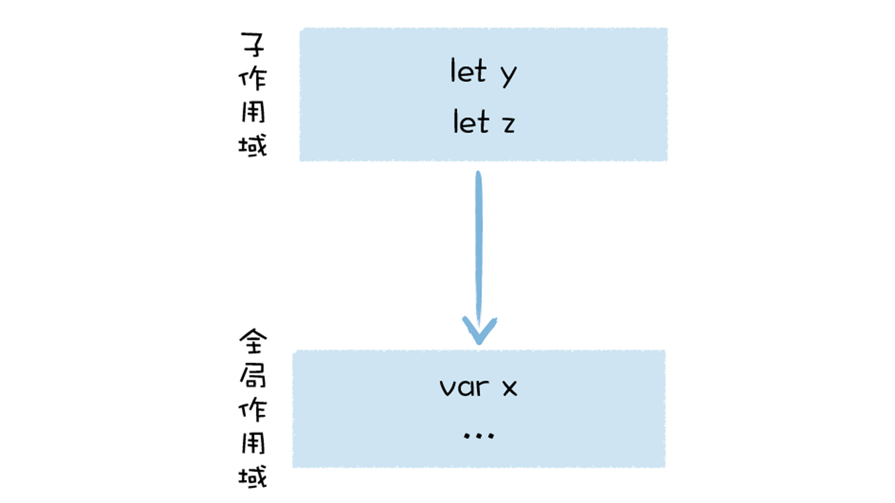
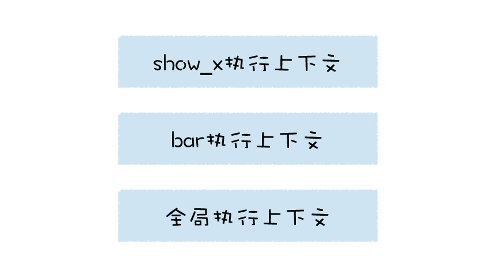

通过前面几节课的学习，我们理解了 JavaScript 是一门基于对象的语言，它能实现非常多的特性，诸如函数是一等公民、闭包、函数式编程、原型继承等，搞懂了这些特性，我们就可以来打开 V8 这个黑盒，深入了解它的编译流水线了。

我们知道，当你想执行一段 JavaScript 代码时，只需要将代码丢给 V8 虚拟机，V8 便会执行并返回给你结果。

其实在执行 JavaScript 代码之前，V8 就已经准备好了代码的运行时环境，这个环境包括了堆空间和栈空间、全局执行上下文、全局作用域、内置的内建函数、宿主环境提供的扩展函数和对象，还有消息循环系统。准备好运行时环境之后，V8 才可以执行 JavaScript 代码，这包括解析源码、生成字节码、解释执行或者编译执行这一系列操作。



对运行时环境有足够的了解，能够帮助我们更好地理 V8 的执行流程。比如事件循环系统可以让你清楚各种回调函数是怎么被执行的，栈空间可以让你了解函数是怎么被调用的，堆空间和栈空间让你了解为什么要有传值和传引用，等等。

运行时环境涉及到的知识都是非常基础，但又非常容易被忽视的。今天这节课，我们就来分析下这些基础的运行时环境。



## 什么是宿主环境？

要聊运行 V8 的运行时环境，我们不得不聊 V8 的宿主环境，什么是 V8 的宿主环境呢？

在生物学上，宿主是指为病毒等寄生物提供生存环境的生物，宿主有的自己的完整的代谢系统，而病毒则没有自己的代谢系统，也没有自己的酶系统，它只是由核酸长链和蛋白质外壳构成。

因此，病毒想要完成自我复制，则会和宿主共同使用一套代谢系统，当病毒离开了宿主细胞，就成了没有任何生命活动，也不能独立自我繁殖的化学物质。同时，如果病毒利用了太多的宿主细胞资源，也会影响到细胞的正常活动。

同样，你可以把 V8 和浏览器的渲染进程的关系看成病毒和细胞的关系，浏览器为 V8 提供基础的消息循环系统、全局变量、Web API，而 V8 的核心是实现了 ECMAScript 标准，这相当于病毒自己的 DNA 或者 RNA，V8 只提供了 ECMAScript 定义的一些对象和一些核心的函数，这包括了 Object、Function、String。除此之外，V8 还提供了垃圾回收器、协程等基础内容，不过这些功能依然需要宿主环境的配合才能完整执行。

如果 V8 使用不当，比如不规范的代码触发了频繁的垃圾回收，或者某个函数执行时间过久，这些都会占用宿主环境的主线程，从而影响到程序的执行效率，甚至导致宿主环境的卡死。

其实，除了浏览器可以作为 V8 的宿主环境，Node.js 也是 V8 的另外一种宿主环境，它提供了不同的宿主对象和宿主的 API，但是整个流程依然是相同的，比如 Node.js 也会提供一套消息循环系统，也会提供一个运行时的主线程。



好了，现在我们知道，要执行 V8，则需要有一个宿主环境，宿主环境可以是浏览器中的渲染进程，可以是 Node.js 进程, 也可以是其他的定制开发的环境，而这些宿主则提供了很多 V8 执行 JavaScript 时所需的基础功能部件，接下来我们就来一一分析下这些部件。

## 构造数据存储空间：堆空间和栈空间

由于 V8 是寄生在浏览器或者 Node.js 这些宿主中的，因此，V8 也是被这些宿主启动的。比如，在 Chrome 中，只要打开一个渲染进程，渲染进程便会初始化 V8，同时初始化堆空间和栈空间。

栈空间主要是用来管理 JavaScript 函数调用的，栈是内存中连续的一块空间，同时栈结构是“先进后出”的策略。在函数调用过程中，涉及到上下文相关的内容都会存放在栈上，比如原生类型、引用到的对象的地址、函数的执行状态、this 值等都会存在在栈上。当一个函数执行结束，那么该函数的执行上下文便会被销毁掉。

栈空间的最大的特点是空间连续，所以在栈中每个元素的地址都是固定的，因此栈空间的查找效率非常高，但是通常在内存中，很难分配到一块很大的连续空间，因此，V8 对栈空间的大小做了限制，如果函数调用层过深，那么 V8 就有可能抛出栈溢出的错误。你可以在控制台执行下面这样一段代码：

```js
function factorial(n) {
  if (n === 1) {
    return 1;
  }
  return n * factorial(n - 1);
}
console.log(factorial(50000));
```

执行这段代码，便会报出这样的错误：

```bash
VM68:1 Uncaught RangeError: Maximum call stack size exceeded
```

这段提示是说，调用栈超出了最大范围，因为我们这里求阶乘的函数需要嵌套调用 5 万层，而栈提供不了这么大的空间，所以就抛出了栈溢出的错误。

如果有一些占用内存比较大的数据，或者不需要存储在连续空间中的数据，使用栈空间就显得不是太合适了，所以 V8 又使用了堆空间。

堆空间是一种树形的存储结构，用来存储对象类型的离散的数据，在前面的课程中我们也讲过，JavaScript 中除了原生类型的数据，其他的都是对象类型，诸如函数、数组，在浏览器中还有 window 对象、document 对象等，这些都是存在堆空间的。

宿主在启动 V8 的过程中，会同时创建堆空间和栈空间，再继续往下执行，产生的新数据都会存放在这两个空间中。

## 全局执行上下文和全局作用域

V8 初始化了基础的存储空间之后，接下来就需要初始化全局执行上下文和全局作用域了，这两个内容是 V8 执行后续流程的基础。

当 V8 开始执行一段可执行代码时，会生成一个执行上下文。V8 用执行上下文来维护执行当前代码所需要的变量声明、this 指向等。

执行上下文中主要包含了三部分，变量环境、词法环境、和 this 关键字。比如在浏览器的环境中，全局执行上下文中就包括了 window 对象，还有默认指向 window 的 this 关键字，另外还有一些 Web API 函数，诸如 setTimeout、XMLHttpRequest 等内容。

而词法环境中，则包含了使用 let、const 等变量的内容。

执行上下文所包含的具体内容，你可以参考下图：



全局执行上下文在 V8 的生存周期内是不会被销毁的，它会一直保存在堆中，这样当下次在需要使用函数或者全局变量时，就不需要重新创建了。另外，当你执行了一段全局代码时，如果全局代码中有声明的函数或者定义的变量，那么函数对象和声明的变量都会被添加到全局执行上下文中。比如下面这段代码：

```js
var x = 1;
function show_x() {
  console.log(x);
}
```

V8 在执行这段代码的过程中，会在全局执行上下文中添加变量 x 和函数 show_x。

在这里还有一点需要注意下，全局作用域和全局执行上下文的关系，其实你可以把作用域看成是一个抽象的概念，比如在 ES6 中，同一个全局执行上下文中，都能存在多个作用域，你可以看下面这段代码：

```js
var x = 5;
{
  let y = 2;
  const z = 3;
}
```

这段代码在执行时，就会有两个对应的作用域，一个是全局作用域，另外一个是括号内部的作用域，但是这些内容都会保存到全局执行上下文中。具体你可以参看下图：



当 V8 调用了一个函数时，就会进入函数的执行上下文，这时候全局执行上下文和当前的函数执行上下文就形成了一个栈结构。比如执行下面这段代码：

```js

var x = 1
function show_x(){
    console.log(x)
}
function bar(){
  show_x（）
}
bar()
```

当执行到 show_x 的时候，其栈状态如下图所示：



## 构造事件循环系统

有了堆空间和栈空间，生成了全局执行上下文和全局作用域，接下来就可以执行 JavaScript 代码了吗？

答案是不行，因为 V8 还需要有一个主线程，用来执行 JavaScript 和执行垃圾回收等工作。V8 是寄生在宿主环境中的，它并没有自己的主线程，而是使用宿主所提供的主线程，V8 所执行的代码都是在宿主的主线程上执行的。

只有一个主线程依然不行，因为如果你开启一个线程，在该线程执行一段代码，那么当该线程执行完这段代码之后，就会自动退出了，执行过程中的一些栈上的数据也随之被销毁，下次再执行另外一个段代码时，你还需要重新启动一个线程，重新初始化栈数据，这会严重影响到程序执行时的性能。

为了在执行完代码之后，让线程继续运行，通常的做法是在代码中添加一个循环语句，在循环语句中监听下个事件，比如你要执行另外一个语句，那么激活该循环就可以执行了。比如下面的模拟代码：

```js
while(1){
  Task task = GetNewTask()；
  RunTask(task)；
}
```

这段代码使用了一个循环，不同地获取新的任务，一旦有新的任务，便立即执行该任务。

如果主线程正在执行一个任务，这时候又来了一个新任务，比如 V8 正在操作 DOM，这时候浏览器的网络线程完成了一个页面下载的任务，而且 V8 注册监听下载完成的事件，那么这种情况下就需要引入一个消息队列，让下载完成的事件暂存到消息队列中，等当前的任务执行结束之后，再从消息队列中取出正在排队的任务。当执行完一个任务之后，我们的事件循环系统会重复这个过程，继续从消息队列中取出并执行下个任务。

有一点你需要注意一下，因为所有的任务都是运行在主线程的，在浏览器的页面中，V8 会和页面共用主线程，共用消息队列，所以如果 V8 执行一个函数过久，会影响到浏览器页面的交互性能。

## 总结

好了，这节课的内容就介绍到这里，下面我们来总结一下：

今天我们介绍了 V8 执行 JavaScript 代码时所需要的基础环境，因为 V8 并不是一个完整的系统，所以在执行时，它的一部分基础环境是由宿主提供的，这包括了全局执行上下文、事件循环系统，堆空间和栈空间。除了需要宿主提供的一些基础环境之外，V8 自身会提供 JavaScript 的核心功能和垃圾回收系统。

宿主环境在启动过程中，会构造堆空间，用来存放一些对象数据，还会构造栈空间，用来存放原生数据。由于堆空间中的数据不是线性存储的，所以堆空间可以存放很多数据，但是读取的速度会比较慢，而栈空间是连续的，所以堆空间中的查找速度非常快，但是要在内存中找到一块连续的区域却显得有点难度，于是所有的程序都限制栈空间的大小，这就是我们经常容易出现栈溢出的一个主要原因。

如果在浏览器中，JavaScript 代码会频繁操作 window(this 默认指向 window 对象)、操作 dom 等内容，如果在 node 中，JavaScript 会频繁使用 global(this 默认指向 global 对象)、File API 等内容，这些内容都会在启动过程中准备好，我们把这些内容称之为全局执行上下文。

全局执行上下文中和函数的执行上下文生命周期是不同的，函数执行上下文在函数执行结束之后，就会被销毁，而全局执行上下文则和 V8 的生命周期是一致的，所以在实际项目中，如果不经常使用的变量或者数据，最好不要放到全局执行上下文中。

另外，宿主环境还需要构造事件循环系统，事件循环系统主要用来处理任务的排队和任务的调度。

## 思考题

你认为作用域和执行上下文是什么关系？欢迎你在留言区与我分享讨论。

1. 作用域是静态的，函数定义的时候就已经确定了。
2. 执行上下文是动态的，调用函数时候创建，结束后还会释放。
