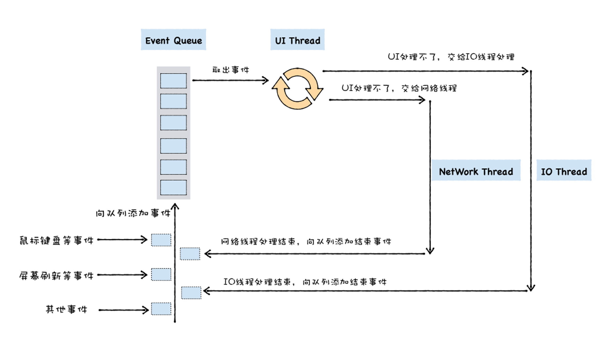
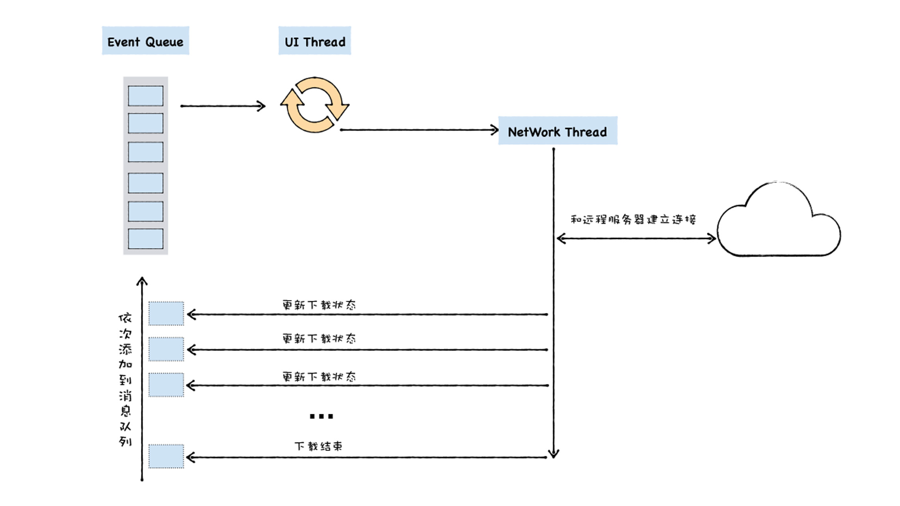
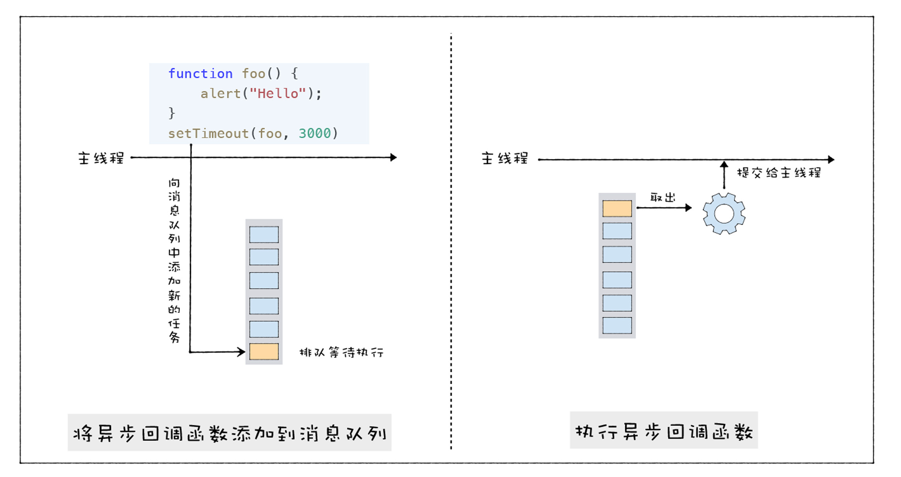

我们在使用 JavaScript 时，经常要用到大量的回调函数，比如在浏览器中可以使用 setTimeout 来设置定时器，使用 XMLHTTPRequest 来异步下载资源文件，在 Node 中可以使用 readFile 来读取文件，这些操作都有一个共同的特点，那就是需要给调用 API 传入回调函数，然后浏览器或者 Node 会将执行处理的结果通过回调函数来触发。

从内部了解回调函数，可以帮助我们梳理清楚很多问题：

有助于我们理解浏览器中的 Web API 到底是怎么工作的；

有助于我们理解宏任务和微任务到底有哪些区别；

理解回调函数，是理解异步编程模型 async/await 的基础。

这些内容在我们实际的项目中都会频繁使用到，所以理解 V8 是怎么实现回调函数的就显得至关重要了。

## 什么是回调函数？

那究竟什么是回调函数呢？其实回调函数也是个函数，就像白马也是马一样。它具有函数的所有特征，它可以有参数和返回值。如果单独给出一个函数，你是看不出来它是不是回调函数的。回调函数区别于普通函数，在于它的调用方式。只有当某个函数被作为参数，传递给另外一个函数，或者传递给宿主环境，然后该函数在函数内部或者在宿主环境中被调用，我们才称为回调函数。

具体地讲，回调函数有两种不同的形式，同步回调和异步回调。通常，我们需要将回调函数传入给另外一个执行函数，那么同步回调和异步回调的最大区别在于**同步回调函数是在执行函数内部被执行的，而异步回调函数是在执行函数外部被执行的。**

我们先看一个同步回调的例子，你可以先看下面这段代码：

```js
var myArray = ['water', 'goods', '123', 'like'];
function handlerArray(indexName, index) {
  console.log(index + 1 + '. ' + indexName);
}
myArray.forEach(handlerArray);
```

在这段代码中，我们通过 JavaScript 自带的 forEach 方法来枚举数字中的每个项，这里的逻辑很简单：

- 调用 forEach 时，需要使用回调函数 handlerArray 作为其参数；
- 在 forEach 方法内部，会遍历 myArray 数组，每遍历一次都会调用一次回调函数 handlerArray。

因为 handlerArray 是 forEach 的参数，而且 handlerArray 是在 forEach 函数内部执行，所以这是一个同步回调。

和同步回调函数不同的是，异步回调函数并不是在它的执行函数内部被执行的，而是在其他的位置和其他的时间点被执行的，比如下面这段 setTimeout 代码：

```js
function foo() {
  alert('Hello');
}
setTimeout(foo, 3000);
```

在这段代码中，我们使用了 setTimeout 函数，setTimeout 的第一个参数 foo 就是一个回调函数，V8 执行 setTimeout 时，会立即返回，等待 3000 毫秒之后，foo 函数才会被 V8 调用，foo 函数并不是在 setTimeout 函数内部被执行的，所以这是一个异步回调。

对于同步回调函数的执行时机，我们理解起来比较简单，就是回调函数在执行函数内部被执行，那么异步回调函数在什么时机和什么位置被调用的呢？

要解释清楚这个问题，我们就需要了解 V8 在运行时的线程模型，因为这涉及到了消息队列，事件循环等概念，这些概念都和线程模型是直接相关的，所以接下来我们就先来分析下 V8 的线程架构模型。

## UI 线程的宏观架构

早期浏览器的页面是运行在一个单独的 UI 线程中的，所以要在页面中引入 JavaScript，那么 JavaScript 也必须要运行在和页面相同的线程上，这样才能方便使用 JavaScript 来操纵 DOM，所以从一开始，JavaScript 就被设计成了运行在 UI 线程中。

所谓 UI 线程，是指运行窗口的线程，当你运行一个窗口时，无论该页面是 Windows 上的窗口系统，还是 Android 或者 iOS 上的窗口系统，它们都需要处理各种事件，诸如有触发绘制页面的事件，有鼠标点击、拖拽、放大缩小的事件，有资源下载、文件读写的事件，等等。

在页面线程中，当一个事件被触发时，比如用户使用鼠标点击了页面，系统需要将该事件提交给 UI 线程来处理。

在大部分情况下，UI 线程并不能立即响应和处理这些事件，比如在你在移动鼠标的过程中，每移动一个像素都会产生一个事件，所以鼠标移动的事件会频繁地被触发。在这种情况下，页面线程可能正在处理前一个事件，那么最新的事件就无法被立即执行。

针对这种情况，我们为 UI 线程提供一个消息队列，并将这些待执行的事件添加到消息队列中，然后 UI 线程会不断循环地从消息队列中取出事件、执行事件。**我们把 UI 线程每次从消息队列中取出事件，执行事件的过程称为一个任务。**整个流程大致如下所示：



我们可以用一段 JavaScript 代码来模拟下这个过程：

```js
function UIMainThread() {
    while (queue.waitForMessage()) {
        Task task = queue.getNext()
        processNextMessage(task)
    }
}
```

在这段代码中，queue 是消息队列，queue.waitForMessage() 会同步地等待消息队列中的消息到达，如果当前没有任何消息等待被处理，则这个函数会将 UI 线程挂起。如果消息队列中有消息，则使用 queue.getNext() 取出下一个要执行的消息，并交由 processNextMessage 函数来处理消息。

这就是通用的 UI 线程的结构，有消息队列，通过鼠标、键盘、触控板等产生的消息都会被添加进消息队列，主线程会循环地从消息队列中取出消息并执行。

## 异步回调函数的调用时机

理解了 UI 线程的基础架构模型，下面我们就可以来解释下异步函数的执行时机了，比如在页面主线程中正在执行 A 任务，在执行 A 任务的过程中调用 setTimeout(foo, 3000)，在执行 setTimeout 函数的过程中，宿主就会将 foo 函数封装成一个事件，并添加到消息队列中，然后 setTimeout 函数执行结束。

主线程会不间断地从消息队列中取出新的任务，执行新的任务，等到时机合适，便取出 setTimeout 设置的 foo 函数的回调的任务，然后就可以直接执行 foo 函数的调用了。

通过分析，相信你已经发现了，通过 setTimeout 的执行流程其实是比较简单的，在 setTimeout 函数内部封装回调消息，并将回调消息添加进消息队列，然后主线程从消息队列中取出回调事件，并执行。

还有一类比较复杂一点的流程，最典型的是通过 XMLHttpRequest 所触发的回调，它和 setTimeout 有一些区别。

因为 XMLHttpRequest 是用来下载网络资源的，但是实际的下载过程却并不适合在主线程上执行，因为下载任务会消耗比较久的时间，如果在 UI 线程上执行，那么会阻塞 UI 线程，这就会拖慢 UI 界面的交互和绘制的效果。所以当主线程从消息队列中取出来了这类下载任务之后，会将其分配给网络线程，让其在网络线程上执行下载过程，这样就不会影响到主线程的执行了。

那么下面我们就来分析下 XMLHttpRequest 是怎么触发回调函数的？具体流程你可以参看下图：



结合上图，我们就可以来分析下通用的 UI 线程是如何处理下载事件的，大致可以分为以下几步：

1. UI 线程会从消息队列中取出一个任务，并分析该任务。
2. 分析过程中发现该任务是一个下载请求，那么主线程就会将该任务交给网络线程去执行。
3. 网络线程接到请求之后，便会和服务器端建立连接，并发出下载请求；
4. 网络线程不断地收到服务器端传过来的数据；
5. 网络线程每次接收到数据时，都会将设置的回调函数和返回的数据信息，如大小、返回了多少字节、返回的数据在内存中存放的位置等信息封装成一个新的事件，并将该事件放到消息队列中 ;
6. UI 线程继续循环地读取消息队列中的事件，如果是下载状态的事件，那么 UI 线程会执行回调函数，程序员便可以在回调函数内部编写更新下载进度的状态的代码；
7. 直到最后接收到下载结束事件，UI 线程会显示该页面下载完成。

这就是 XMLHttpRequest 所触发的回调流程，除了下载以外，JavaScript 中获取系统设备信息、文件读取等都是采用了类似的方式来实现的，因此，理解了 XMLHttpRequest 的执行流程，你也就理解了这一类异步 API 的执行流程了。



## 总结

今天我们介绍了 V8 是如何执行回调函数的。回调函数有两种类型：同步回调和异步回调，同步回调函数是在执行函数内部被执行的，而异步回调函数是在执行函数外部被执行的。

那么，搞清楚异步回调函数在什么时机被执行就非常关键了。为了理清楚这个问题，我们分析了通用 UI 线程宏观架构。UI 线程提供一个消息队列，并将待执行的事件添加到消息队列中，然后 UI 线程会不断循环地从消息队列中取出事件、执行事件。

关于异步回调，这里也有两种不同的类型，其典型代表是 setTimeout 和 XMLHttpRequest。

setTimeout 的执行流程其实是比较简单的，在 setTimeout 函数内部封装回调消息，并将回调消息添加进消息队列，然后主线程从消息队列中取出回调事件，并执行回调函数。

XMLHttpRequest 稍微复杂一点，因为下载过程需要放到单独的一个线程中去执行，所以执行 XMLHttpRequest.send 的时候，宿主会将实际请求转发给网络线程，然后 send 函数退出，主线程继续执行下面的任务。网络线程在执行下载的过程中，会将一些中间信息和回调函数封装成新的消息，并将其添加进消息队列中，然后主线程从消息队列中取出回调事件，并执行回调函数。

## 思考题

分析 Node 中的 readFileSync 和 readFile 函数，其中一个是同步读文件操作，另外一个是异步读文件操作，这两段代码如下所示：

```js
var fs = require('fs');
var data = fs.readFileSync('test.js');
```

```js
fs.readFile('test.txt', function (err, data) {
  data.toString();
});
```

那么请你分别分析下它们的执行流程。欢迎你在留言区与我分享讨论。
