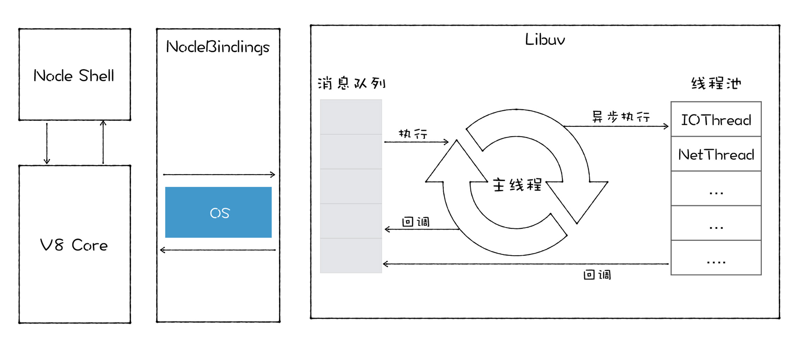
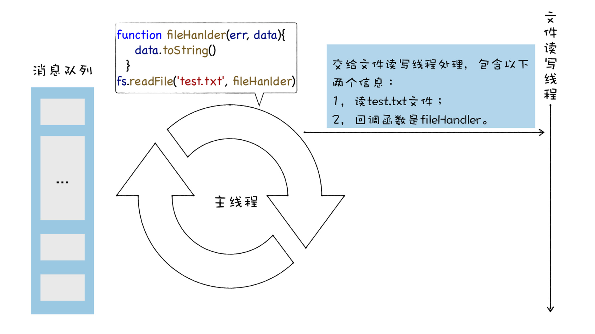
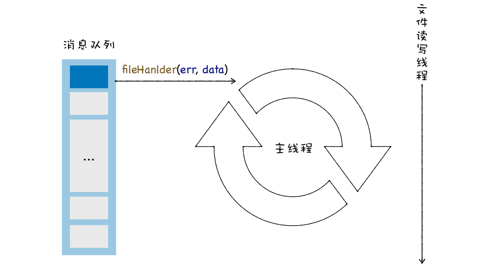
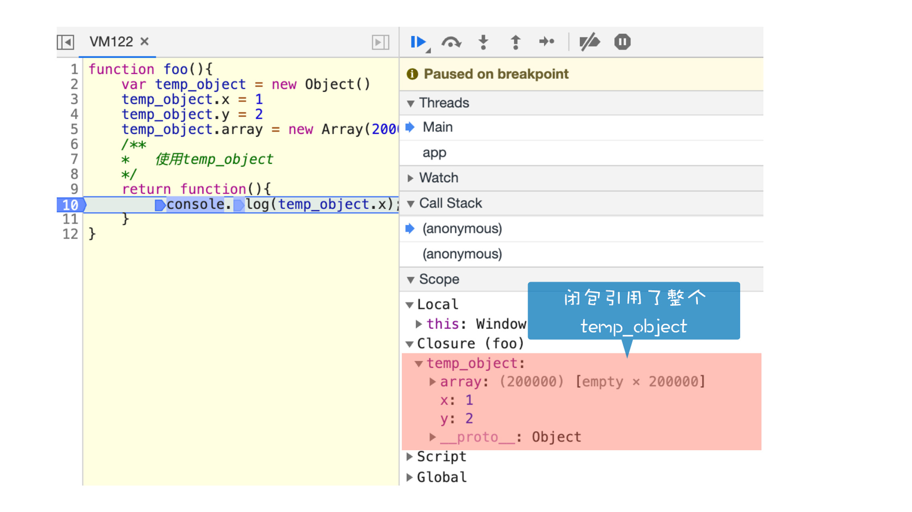
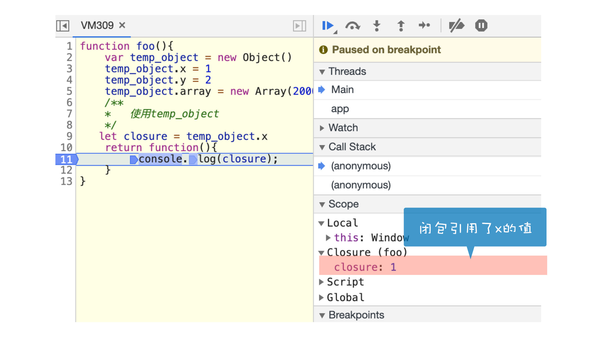
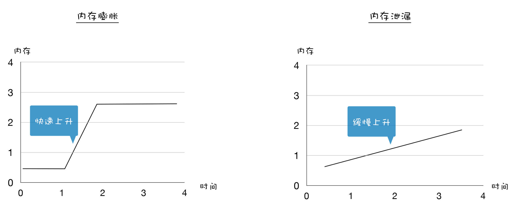

这是我们“事件循环和垃圾回收”这个模块的最后一讲。在这个模块中，我们讲了消息循环系统和垃圾回收机制，这两块内容涉及到了比较底层的知识，但是这些知识对实际的项目有着非常重要的指导作用，很多同学也比较关注这两部分内容。

今天这节答疑课，我们来结合 Node 中的读文件操作，分析下消息循环系统是怎么影响到异步编程的，然后我们再来结合 JavaScript 中的几种常见的内存问题，来分析下内存问题出现的原因和解决方法。

## Node 中的 readFile API 工作机制

Node 中很多 API 都提供了同步和异步两种形式，下面我们来看下《17 | 消息队列：V8 是怎么实现回调函数的？》这节课留的思考题。思考题中有两段代码，我们通过这两段代码来分析下同步和异步读文件 API 的区别。

```js
var fs = require('fs');
var data = fs.readFileSync('test.js');
```

```js
function fileHanlder(err, data) {
  data.toString();
}
fs.readFile('test.txt', fileHanlder);
```

在解答这个问题之前，我们来看看 Node 的体系架构。你可以先参考下图：



Node 是 V8 的宿主，它会给 V8 提供事件循环和消息队列。在 Node 中，事件循环是由 libuv 提供的，libuv 工作在主线程中，它会从消息队列中取出事件，并在主线程上执行事件。

同样，对于一些主线程上不适合处理的事件，比如消耗时间过久的网络资源下载、文件读写、设备访问等，Node 会提供很多线程来处理这些事件，我们把这些线程称为线程池。

通常，在 Node 中，我们认为读写文件是一个非常耗时的工作，因此主线程会将回调函数和读文件的操作一道发送给文件读写线程，并让实际的读写操作运行在读写线程中。

比如当在 Node 的主线程上执行 readFile 的时候，主线程会将 readFile 的文件名称和回调函数，提交给文件读写线程来处理，具体过程如下所示：



文件读写线程完成了文件读取之后，会将结果和回调函数封装成新的事件，并将其添加进消息队列中。比如文件线程将读取的文件内容存放在内存中，并将 data 指针指向了该内存，然后文件读写线程会将 data 和回调函数封装成新的事件，并将其丢进消息队列中，具体过程如下所示：



然后在回调函数中，我们就可以拿到读取的结果来实现一些业务逻辑了。

不过，总有些人觉得异步读写文件操作过于复杂了，如果读取的文件体积不大或者项目瓶颈不在文件读写，那么依然使用异步调用和回调函数的模式就显得有点过度复杂了。

因此 Node 还提供了一套同步读写的 API。第一段代码中的 readFileSync 就是同步实现的，同步代码非常简单，当 libuv 读取到 readFileSync 的任务后，就直接在主线程上执行读写操作，等待读写结束，直接返回读写的结果，这也是同步回调的一种应用。当然在读写过程中，消息队列中的其他任务是无法被执行的。

所以在选择使用同步 API 还是异步 API 时，我们要看实际的场景，并不是非 A 即 B。

## 几种内存问题

分析了异步 API，接下来我们再来看看 JavaScript 中的内存问题，内存问题至关重要，因为通过内存而造成的问题很容易被用户察觉。总的来说，内存问题可以定义为下面这三类：

- **内存泄漏 (\*\***Memory leak\***\*)**，它会导致页面的性能越来越差；

- **内存膨胀 (\*\***Memory bloat\***\*)**，它会导致页面的性能会一直很差；

- **频繁垃圾回收**，它会导致页面出现延迟或者经常暂停。

### 内存泄漏

我们先看内存泄漏。本质上，内存泄漏可以定义为：当进程不再需要某些内存的时候，这些不再被需要的内存依然没有被进程回收。

在 JavaScript 中，造成内存泄漏 (**Memory leak)** 的主要原因是不再需要 (没有作用) 的内存数据依然被其他对象引用着。

下面我们就来看几种实际的例子：

我们知道，JavaScript 是一门非常宽松的语言，你甚至可以使用一个未定义的变量，比如下面这样一段代码：

```js
function foo() {
  //创建一个临时的temp_array
  temp_array = new Array(200000);
  /**
   * 使用temp_array
   */
}
```

当执行这段代码时，由于函数体内的对象没有被 var、let、const 这些关键字声明，那么 V8 就会使用 this.temp_array 替换 temp_array。

```js
function foo() {
  //创建一个临时的temp_array
  this.temp_array = new Array(200000);
  /**
   * this.temp_array
   */
}
```

在浏览器，默认情况下，this 是指向 window 对象的，而 window 对象是常驻内存的，所以即便 foo 函数退出了，但是 temp_array 依然被 window 对象引用了， 所以 temp_array 依然也会和 window 对象一样，会常驻内存。因为 temp_array 已经是不再被使用的对象了，但是依然被 window 对象引用了，这就造成了 temp_array 的泄漏。

为了解决这个问题，我们可以在 JavaScript 文件头部加上 use strict，使用严格模式避免意外的全局变量，此时上例中的 this 指向 undefined。

另外，我们还要时刻警惕闭包这种情况，因为闭包会引用父级函数中定义的变量，如果引用了不被需要的变量，那么也会造成内存泄漏。比如你可以看下面这样一段代码：

```js
function foo() {
  var temp_object = new Object();
  temp_object.x = 1;
  temp_object.y = 2;
  temp_object.array = new Array(200000);
  /**
   *   使用temp_object
   */
  return function () {
    console.log(temp_object.x);
  };
}
```

可以看到，foo 函数使用了一个局部临时变量 temp_object，temp_object 对象有三个属性，x、y，还有一个非常占用内存的 array 属性。最后 foo 函数返回了一个匿名函数，该匿名函数引用了 temp_object.x。那么当调用完 foo 函数之后，由于返回的匿名函数引用了 foo 函数中的 temp_object.x，这会造成 temp_object 无法被销毁，即便只是引用了 temp_object.x，也会造成整个 temp_object 对象依然保留在内存中。我们可以通过 Chrome 调试工具查看下：



从上图可以看出，我们仅仅是需要 temp_object.x 的值，V8 却保留了整个 temp_object 对象。

要解决这个问题，我就需要根据实际情况，来判断闭包中返回的函数到底需要引用什么数据，不需要引用的数据就绝不引用，因为上面例子中，返回函数中只需要 temp_object.x 的值，因此我们可以这样改造下这段代码：

```js
function foo() {
  var temp_object = new Object();
  temp_object.x = 1;
  temp_object.y = 2;
  temp_object.array = new Array(200000);
  /**
   *   使用temp_object
   */
  let closure = temp_object.x;
  return function () {
    console.log(closure);
  };
}
```

当再次执行这段代码时，我们就可以看到闭包引用的仅仅是一个 closure 的变量，最终如下图所示：



我们再来看看由于 JavaScript 引用了 DOM 节点而造成的内存泄漏的问题，只有同时满足 DOM 树和 JavaScript 代码都不引用某个 DOM 节点，该节点才会被作为垃圾进行回收。 如果某个节点已从 DOM 树移除，但 JavaScript 仍然引用它，我们称此节点为“**detached** ”。“**detached ”**节点是 DOM 内存泄漏的常见原因。比如下面这段代码：

```js
let detachedTree;
function create() {
  var ul = document.createElement('ul');
  for (var i = 0; i < 100; i++) {
    var li = document.createElement('li');
    ul.appendChild(li);
  }
  detachedTree = ul;
}
create();
```

我们通过 JavaScript 创建了一些 DOM 元素，有了这些内存中的 DOM 元素，当有需要的时候，我们就快速地将这些 DOM 元素关联到 DOM 树上，一旦这些 DOM 元素从 DOM 上被移除后，它们并不会立即销毁，这主要是由于 JavaScript 代码中保留了这些元素的引用，导致这些 DOM 元素依然会呆在内存中。所以在保存 DOM 元素引用的时候，我们需要非常小心谨慎。

### 内存膨胀

了解几种可能造成内存泄漏的问题之后，接下来，我们再来看看另外一个和内存泄漏类似的问题：**内存膨胀（\*\***Memory bloat\***\*）**。

内存膨胀和内存泄漏有一些差异，内存膨胀主要表现在程序员对内存管理的不科学，比如只需要 50M 内存就可以搞定的，有些程序员却花费了 500M 内存。

额外使用过多的内存有可能是没有充分地利用好缓存，也有可能加载了一些不必要的资源。通常表现为内存在某一段时间内快速增长，然后达到一个平稳的峰值继续运行。

比如一次性加载了大量的资源，内存会快速达到一个峰值。内存膨胀和内存泄漏的关系你可以参看下图：



我们可以看到，内存膨胀是快速增长，然后达到一个平衡的位置，而内存泄漏是内存一直在缓慢增长。要避免内存膨胀，我们需要合理规划项目，充分利用缓存等技术来减轻项目中不必要的内存占用。

### 频繁的垃圾回收

除了内存泄漏和内存膨胀，还有另外一类内存问题，那就是频繁使用大的临时变量，导致了新生代空间很快被装满，从而频繁触发垃圾回收。频繁的垃圾回收操作会让你感觉到页面卡顿。比如下面这段代码：

```js
function strToArray(str) {
  let i = 0;
  const len = str.length;
  let arr = new Uint16Array(str.length);
  for (; i < len; ++i) {
    arr[i] = str.charCodeAt(i);
  }
  return arr;
}
function foo() {
  let i = 0;
  let str = 'test V8 GC';
  while (i++ < 1e5) {
    strToArray(str);
  }
}
foo();
```

这段代码就会频繁创建临时变量，这种方式很快就会造成新生代内存内装满，从而频繁触发垃圾回收。为了解决频繁的垃圾回收的问题，你可以考虑将这些临时变量设置为全局变量。

## 总结

这篇答疑主要分析了两个问题，第一个是异步 API 和同步 API 的底层差异，第二个是 JavaScript 的主要内存问题的产生原因和解决方法。

Node 为读写文件提供了两套 API，一套是默认的异步 API，另外一套是同步 API。

readFile 就是异步 API，主线程在执行 readFile 的时候，会将实际读写操作丢给文件读写线程，文件读写线程处理完成之后，会将回调函数读取的结果封装成新的消息，添加到消息队列中，然后等主线执行该消息的时候，就会执行 readFile 设置的回调函数，这就是 Node 中的异步处理过程。readFileSync 是同步 API，同步 API 很简单，直接在主线程上执行，执行完成直接返回结果给它的调用函数。使用同步 API 会比较方便简单，但是你需要考虑项目能否接受读取文件而造成的暂停。

内存问题对于前端开发者来说也是至关重要的，通常有三种内存问题：内存泄漏 (Memory leak)、内存膨胀 (Memory bloat)、频繁垃圾回收。

在 JavaScript 中，造成内存泄漏 (Memory leak) 的主要原因，是不再需要 (没有作用) 的内存数据依然被其他对象引用着。所以要避免内存泄漏，我们需要避免引用那些已经没有用途的数据。

内存膨胀和内存泄漏有一些差异，内存膨胀主要是由于程序员对内存管理不科学导致的，比如只需要 50M 内存就可以搞定的，有些程序员却花费了 500M 内存。要解决内存膨胀问题，我们需要对项目有着透彻的理解，也要熟悉各种能减少内存占用的技术方案。

如果频繁使用大的临时变量，那么就会导致频繁垃圾回收，频繁的垃圾回收操作会让你感觉到页面卡顿，要解决这个问题，我们可以考虑将这些临时变量设置为全局变量。

## 思考题

今天留给你的题目是，在实际的项目中，你还遇到过哪些具体的内存问题呢？这些问题都是怎么解决的？欢迎你在留言区与我分享讨论。
