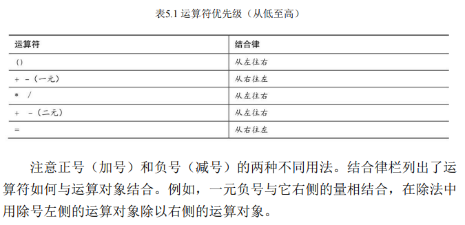
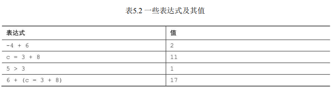

# 第5章 运算符、表达式和语句

- 关键字：while、typedef
- 运算符：=、-、*、/、%、++、--、(类型名)
- C语言的各种运算符，包括用于普通数学运算的运算符
- 运算符优先级以及语句、表达式的含义
- while循环
- 复合语句、自动类型转换和强制类型转换
- 如何编写带有参数的函数

## 循环

```cpp
/* shoes1.c -- 把鞋码转换成英寸 */
#include <stdio.h>
#define ADJUST 7.31 // 字符常量
int main(void)
{
	const double SCALE = 0.333; // const变量
	double shoe, foot;
	shoe = 9.0; // 鞋码
	foot = SCALE * shoe + ADJUST; // 脚长
	printf("脚长：\n");
	printf("%10.1f %15.2f inches\n", shoe, foot);
	return 0;
}
```

```cpp
/* shoes2.c -- 计算多个不同鞋码对应的脚长 */
#include <stdio.h>
#define ADJUST 7.31 // 字符常量
int main(void)
{
	const double SCALE = 0.333; // const变量
	double shoe, foot;
	printf("鞋码：\n");
	shoe = 3.0;
	// 鞋码小于18.5，则循环
	while (shoe < 18.5) /* while循环开始 */
	{					/* 块开始 */
		foot = SCALE * shoe + ADJUST;
		printf("%10.1f %15.2f inches\n", shoe, foot);
		shoe = shoe + 1.0;
	} /* 块结束 */
	printf("鞋子合适\n");
	return 0;
}
```

##  基本运算符

基本算术运算的运算符：=、+、-、*和/


```cpp
/* golf.c -- 高尔夫锦标赛记分卡 */
#include <stdio.h>
int main(void)
{
    // 赋值的顺序是从右往左：首先把68赋给jane，然后再赋给tarzan，最后赋给cheeta
	int jane, tarzan, cheeta;
	cheeta = tarzan = jane = 68;
	printf(" cheeta tarzan jane\n");
	printf("First round score %4d %8d %8d\n", cheeta, tarzan, jane);
	return 0;
}
```

```cpp
/* wheat.c -- 指数增长 */
#include <stdio.h>
#define SQUARES 64 // 棋盘中的方格数
int main(void)
{
	const double CROP = 2E16; // 世界小麦年产谷粒数
	double current, total;
	int count = 1;
	printf("正方形颗粒的总分数\n");
	printf(" 次数 颗粒 ");
	printf("世界 总数\n");
	total = current = 1.0; /* 从1颗谷粒开始 */
	printf("%4d %13.2e %12.2e %12.2e\n", count, current, total, total / CROP);
	while (count < SQUARES)
	{
		count = count + 1;
		current = 2.0 * current; /* 下一个方格谷粒翻倍 */
		total = total + current; /* 更新总数 */
		printf("%4d %13.2e %12.2e %12.2e\n", count, current,
			   total, total / CROP);
	}
	printf("That's all.\n");
	return 0;
}
```

**整数除法和浮点数除法不同。浮点数除法的结果是浮点数，而整数除法 的结果是整数。整数是没有小数部分的数。这使得5除以3很让人头痛，因为 实际结果有小数部分。**

```cpp
/* divide.c -- 演示除法 */
#include <stdio.h>
int main(void)
{
	printf("整数除法: 5/4 is %d \n", 5 / 4);
	printf("整数除法: 6/3 is %d \n", 6 / 3);
	printf("整数除法: 7/4 is %d \n", 7 / 4);
	printf("浮点数除法: 7./4. is %1.2f \n", 7. / 4.);
	printf("整数浮点数除法: 7./4 is %1.2f \n", 7. / 4);
	return 0;
}
```



## 其他运算符

1. sizeof运算符和size_t类型

sizeof运算符以字节为单位返回运算对象的大小

```cpp
// sizeof.c -- 使用sizeof运算符
// 使用C99新增的%zd转换说明 -- 如果编译器不支持%zd，请将其改
#include <stdio.h>
int main(void)
{
	int n = 12;
	size_t intsize;
	intsize = sizeof(int);
	printf("n = %d, n 有 %zd bytes; 总共有 %zd bytes.\n",n, sizeof n, intsize);
	return 0;
}
```

C 语言规定，sizeof 返回 size_t 类型的值。这是一个无符号整数类型， 但它不是新类型。size_t是语言定义的标准类型。C有一个 typedef机制（第14章再详细介绍），允许程序员为现有类型创建别名。

`typedef double real;`

这样，real就是double的别名。现在，可以声明一个real类型的变量：

`real deal; // 使用typedef`

2. 求模运算符`%` 递增运算符`++` 递减运算符`--`

```cpp
// sizeof.c -- 使用sizeof运算符
// 使用C99新增的%zd转换说明 -- 如果编译器不支持%zd，请将其改
#include <stdio.h>
int main(void)
{
	int n1 = 5;
	int n2 = 5;
	printf("n1 = %d, n2 = %d\n", --n1 * n2++, n2);
	return 0;
}
```

## 表达式和语句



```cpp
/* addemup.c -- 几种常见的语句 */
#include <stdio.h>
int main(void) /* 计算前20个整数的和 */
{
	int count, sum;		 /* 声明[1] */
	count = 0;			 /* 表达式语句 */
	sum = 0;			 /* 表达式语句 */
	while (count++ < 20) /* 迭代语句 */
		sum = sum + count;
	printf("sum = %d\n", sum); /* 表达式语句[2] */
	return 0;				   /* 跳转语句 */
}
```

## 类型转换

基本的类型转换规则：

1.当类型转换出现在表达式时，无论是unsigned还是signed的char和short 都会被自动转换成int，如有必要会被转换成unsigned int（如果short与int的大 小相同，unsigned short就比int大。这种情况下，unsigned short会被转换成 unsigned int）。在K&R那时的C中，float会被自动转换成double（目前的C不 是这样）。由于都是从较小类型转换为较大类型，所以这些转换被称为升级 （promotion）。

2.涉及两种类型的运算，两个值会被分别转换成两种类型的更高级别

3.类型的级别从高至低依次是long double、double、float、unsignedlong long、long long、unsigned long、long、unsigned int、int。例外的情况是，当 long 和 int 的大小相同时，unsigned int比long的级别高。之所以short和char类 型没有列出，是因为它们已经被升级到int或unsigned int。

4.在赋值表达式语句中，计算的最终结果会被转换成被赋值变量的类 型。这个过程可能导致类型升级或降级（demotion）。所谓降级，是指把一 种类型转换成更低级别的类型。

5.当作为函数参数传递时，char和short被转换成int，float被转换成 double。

```cpp
/* convert.c -- 自动类型转换 */
#include <stdio.h>

int main(void)
{
	char ch; // 1个字节 8bit -128~+127
	int i; // 4个字节 32bit
	float fl; // 4个字节 32bit
	fl = i = ch = 'C';
	printf("ch = %c, i = %d, fl = %2.2f\n", ch, i, fl); /* 第10行 */
	ch = ch + 1;										/* 第11行 */
	i = fl + 2 * ch;									/* 第12行 */
	fl = 2.0 * ch + i;									/* 第13行 */
	printf("ch = %c, i = %d, fl = %2.2f\n", ch, i, fl); /* 第14行 */
	ch = 1107;											/* 第15行 溢出 */
	printf("Now ch = %c\n", ch);						/* 第16行 */
	ch = 80.89;											/* 第17行 */
	printf("Now ch = %c\n", ch);						/* 第18行 */
	return 0;
}
/* 
ch = C, i = 67, fl = 67.00
ch = D, i = 203, fl = 339.00
Now ch = S
Now ch = P
 */
```

第9行和第10行：字符'C'被作为1字节的ASCII值储存在ch中。整数变量i 接受由'C'转换的整数，即按4字节储存67。最后，fl接受由67转换的浮点数 67.00。

第11行和第14行：字符变量'C'被转换成整数67，然后加1。计算结果是4 字节整数68，被截断成1字节储存在ch中。根据%c转换说明打印时，68被解 释成'D'的ASCII码。

第12行和第14行：ch的值被转换成4字节的整数（68），然后2乘以ch。 为了和fl相加，乘积整数（136）被转换成浮点数。计算结果（203.00f）被 转换成int类型，并储存在i中。

第13行和第14行：ch的值（'D'，或68）被转换成浮点数，然后2乘以 ch。为了做加法，i的值（203）被转换为浮点类型。计算结果（339.00）被 储存在fl中。 

第15行和第16行：演示了类型降级的示例。把ch设置为一个超出其类型 范围的值，忽略额外的位后，最终ch的值是字符S的ASCII码。或者，更确切 地说，ch的值是1107 % 265，即83。

第17行和第18行：演示了另一个类型降级的示例。把ch设置为一个浮点 数，发生截断后，ch的值是字符P的ASCII码。

**强制类型转换运算符**

强制类型转换（cast），即在某个量的前面放置用圆括号括起来 的类型名，该类型名即是希望转换成的目标类型。圆括号和它括起来的类型 名构成了强制类型转换运算符

```cpp
#include <stdio.h>

int main(void)
{
	int mice1 = 1.6 + 1.7;
	int mice2 = (int)1.6 + (int)1.7;
	printf("mice1 = %d, mice2 = %d\n", mice1, mice2 ); // mice1 = 3, mice2 = 2
	return 0;
}
```

## 待参数的函数

```cpp
/* pound.c -- 定义一个带一个参数的函数 */
#include <stdio.h>
void pound(int n); // ANSI函数原型声明
int main(void)
{
	int times = 5;
	char ch = '!'; // ASCII码是33
	float f = 6.0f;
	pound(times); // int类型的参数
	pound(ch);	  // 和pound((int)ch);相同
	pound(f);	  // 和pound((int)f);相同
	return 0;
}

void pound(int n) // ANSI风格函数头
{				  // 表明该函数接受一个int类型的参数
	printf("%d:\n", n);
	while (n-- > 0)
		printf("#");
	printf("\n");
}
/* 
5:
#####
33:
#################################
6:
######
 */
```

```cpp
#include <stdio.h>
const int S_PER_M = 60;			// 1分钟的秒数
const int S_PER_H = 3600;		// 1小时的分钟数
const double M_PER_K = 0.62137; // 1公里的英里数
int main(void)
{
	double distk, distm; // 跑过的距离（分别以公里和英里为单位）
	double rate;		 // 平均速度（以英里/小时为单位）
	int min, sec;		 // 跑步用时（以分钟和秒为单位）
	int time;			 // 跑步用时（以秒为单位）
	double mtime;		 // 跑1英里需要的时间，以秒为单位
	int mmin, msec;		 // 跑1英里需要的时间，以分钟和秒为单位
	printf("该程序将公制比赛的时间转换为跑步1英里的时间和以英里/小时为单位的平均速度\n");
	printf("请以公里为单位输入跑步距离。\n");
	scanf("%lf", &distk); // %lf表示读取一个double类型的值
	printf("接下来，以分钟和秒为单位输入时间\n");
	printf("从输入分钟开始\n");
	scanf("%d", &min);
	printf("现在输入秒数\n");
	scanf("%d", &sec);
	time = S_PER_M * min + sec;	   // 把时间转换成秒
	distm = M_PER_K * distk;	   // 把公里转换成英里
	rate = distm / time * S_PER_H; // 英里/秒×秒/小时 = 英里/小时
	mtime = (double)time / distm;  // 时间/距离 = 跑1英里所用的时间
	mmin = (int)mtime / S_PER_M;   // 求出分钟数
	msec = (int)mtime % S_PER_M;   // 求出剩余的秒数
	printf("你跑了 %1.2f km (%1.2f miles) 用了 %d 分, %d 秒.\n", distk, distm, min, sec);
	printf("这个速度相当于%d分%d秒跑一英里。\n", mmin, msec);
	printf("你的平均时速是%1.2f英里\n", rate);
	return 0;
}
```