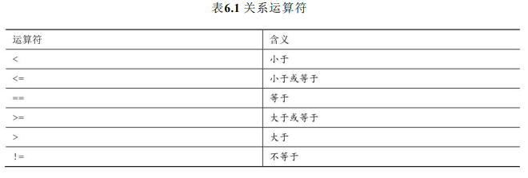
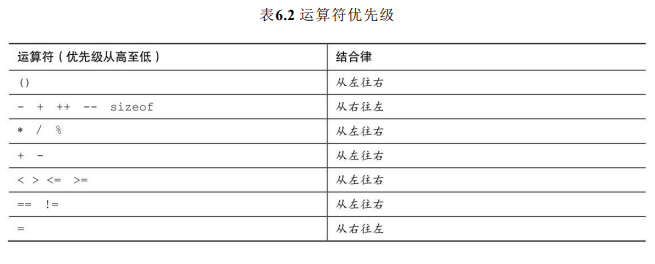

# C控制语句：循环

本章介绍以下内容：

- 关键字：for、while、do while
- 运算符：<、>、>=、<=、!=、==、+=、*=、-=、/=、%=
- 函数：fabs()
- C语言有3种循环：for、while、do while
- 使用关系运算符构建控制循环的表达式
- 其他运算符
- 循环常用的数组
- 编写有返回值的函数

## while 循环

如果scanf()成功读取一个整数，就把该数存入num并返回1，如果用户输入的不是数字（如， q），scanf()会读取失败并返回0。此时，status的值就是0，循环结束。

```cpp
/* summing.c -- 根据用户键入的整数求和 */
#include <stdio.h>
int main(void)
{
	long num;
	long sum = 0L; /* 把sum初始化为0 */
	int status;
	printf("输入整数，输入q退出\n");
	status = scanf("%ld", &num);
	while (status == 1) /* == 的意思是“等于” */
	{
		sum = sum + num;
		printf("输入下一个整数，输入q退出):\n");
		status = scanf("%ld", &num);
	}
	printf("根据用户键入的整数求和 %ld.\n", sum);
	return 0;
}
```

while循环的通用形式如下： 

while ( expression ) 

statement

**statement部分可以是以分号结尾的简单语句，也可以是用花括号括起来 的复合语句。**

## 用关系运算符和表达式比较大小



```cpp
/* summing.c -- 根据用户键入的整数求和 */
#include <stdio.h>
int main(void)
{
	int number = 0;
	while (number < 6)
	{
		printf("输入的数太小了\n");
		printf("重新输入：");
		scanf("%d", &number);
	}
	printf("OK了！");
	return 0;
}
```

```cpp
// cmpflt.c -- 浮点数比较
// 循环会一直提示用户继续输入，除非用户输入的值与正确值之间相差 0.0001
#include <math.h>
#include <stdio.h>
int main(void)
{
	const double ANSWER = 3.14159;
	double response;
	printf("What is the value of pi?\n");
	scanf("%lf", &response);
	while (fabs(response - ANSWER) > 0.0001)
	{
		printf("Try again!\n");
		scanf("%lf", &response);
	}
	printf("Close enough!\n");
	return 0;
}
```

关系运算符之间有两种不同的优先级。 

高优先级组： <<=、>>= 

低优先级组： ==、!=

关系运算符的优先级比算术运算符（包括+和-）低，比赋值运算符高。



## 不确定循环和计数循环

while 和 for

```cpp
// sweetie2.c -- 使用for循环的计数循环
#include <stdio.h>
int main(void)
{
	const int NUMBER = 22;
	int count;
	for (count = 1; count <= NUMBER; count++)
	{
		printf("Be my Valentine! %d\n", count);
	}
	return 0;
}
```

```cpp
/* for_cube.c -- 使用for循环创建一个立方表 */
#include <stdio.h>
int main(void)
{
	int num;
	printf(" n n cubed\n");
	for (num = 1; num <= 6; num++)
	{
		printf("%5d %5d\n", num, num * num * num);
	}
	return 0;
}
```

```cpp
#include <stdio.h>
int main(void)
{
	int secs;
	for (secs = 5; secs > 0; secs--)
	{
		printf("%d seconds!\n", secs);
	}
	printf("We have ignition!\n");
	return 0;
}
```

### 其他赋值运算

- `+=`
- `-=`
- `*=`
- `/=`
- `%=`

### 逗号运算符

逗号运算符扩展了for循环的灵活性，以便在循环头中包含更多的表达式。

```cpp
// postage.c -- 一类邮资
#include <stdio.h>
int main(void)
{
	const int FIRST_OZ = 46; // 2013邮资
	const int NEXT_OZ = 20;	 // 2013邮资
	int ounces, cost;
	printf(" ounces cost\n");
	for (ounces = 1, cost = FIRST_OZ; ounces <= 16; ounces++, cost += NEXT_OZ)
	{
		printf("%5d $%4.2f\n", ounces, cost / 100.0);
	}
	return 0;
}
```

## 出口条件循环：do while

```cpp
/* do_while.c -- 出口条件循环 */
#include <stdio.h>
int main(void)
{
	const int secret_code = 13;
	int code_entered;
	do
	{
		printf("To enter the triskaidekaphobia therapy club,\n");
		printf("please enter the secret code number: ");
		scanf("%d", &code_entered);
	} while (code_entered != secret_code);
	printf("Congratulations! You are cured!\n");
	return 0;
}
```

## 嵌套循环

```cpp
/* rows1.c -- 使用嵌套循环 */
#include <stdio.h>
#define ROWS 6
#define CHARS 10
int main(void)
{
	int row;
	char ch;
	for (row = 0; row < ROWS; row++) /* 第10行 */
	{
		printf("row = %d ", row);
		for (ch = 'A'; ch < ('A' + CHARS); ch++) /* 第12行 */
		{
			printf("%c", ch);
		}
		printf("\n");
	}
	return 0;
}
```

## 数组简介

数组可以作为一种储存多个相关项的便利方式。

数组（array）是按顺序储存的一系列类型相同的值，如10个char类型的 字符或15个int类型的值。整个数组有一个数组名，通过整数下标访问数组中 单独的项或元素（element）。例如，以下声明： `float debts[20];`

声明debts是一个内含20个元素的数组，每个元素都可以储存float类型的值。注意，数组元素的编号从0开始，不是从1开始。可以给每个元素 赋float类型的值。

`scanf("%f", &debts[4]);` // 把一个值读入数组的第5个元素

```cpp
int nannies[22]; /* 可储存22个int类型整数的数组 */
char actors[26]; /* 可储存26个字符的数组 */
long big[500]; /* 可储存500个long类型整数的数组 */
```

**在for循环中使用数组**

```cpp
// scores_in.c -- 使用循环处理数组
#include <stdio.h>
#define SIZE 3
#define PAR 72
int main(void)
{
	int index, score[SIZE];
	int sum = 0;
	float average;
	printf("输入 %d 次得分\n", SIZE);
	for (index = 0; index < SIZE; index++)
	{
		printf("输入第 %d 次得分：", index + 1);
		scanf("%d", &score[index]); // 读取3个分数
	}
	printf("每次得分是：\n");
	for (index = 0; index < SIZE; index++)
	{
		printf("%5d", score[index]); // 验证输入
	}
	printf("\n");
	for (index = 0; index < SIZE; index++)
	{
		sum += score[index]; // 求总分数
	}
	average = (float)sum / SIZE; // 求平均分
	printf("总分数 = %d, 平均分 = %.2f\n", sum, average);
	printf("高于平均分 %.0f 分\n", average - PAR);
	return 0;
}
```

## 使用函数返回值的循环示例

```cpp
// power.c -- 计算数的整数幂
#include <stdio.h>
double power(double n, int p); // ANSI函数原型
int main(void)
{
	double x, xpow;
	int exp;
	printf("输入一个数字和它的正整数幂\n");
	printf("这个数字将会提高。输入q退出。\n");
	while (scanf("%lf%d", &x, &exp) == 2)
	{
		xpow = power(x, exp); // 函数调用
		printf("%.3g 的 %d 次幂是 %.5g\n", x, exp, xpow);
		printf("输入下一对数字或q退出。\n");
	}
	printf("希望你喜欢这次权力之旅——再见！\n");
	return 0;
}
double power(double n, int p) // 函数定义
{
	double pow = 1;
	int i;
	for (i = 1; i <= p; i++)
	{
		pow *= n;
	}
	return pow; // 返回pow的值
}
```


