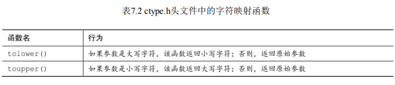
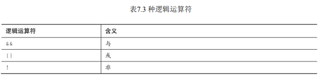

#  C控制语句：分支和跳转

本章介绍以下内容：

- 关键字：if、else、switch、continue、break、case、default、goto
- 运算符：&&、||、?:
- 函数：getchar()、putchar()、ctype.h系列
- 如何使用if和if else语句，如何嵌套它们
- 在更复杂的测试表达式中用逻辑运算符组合关系表达式
- C的条件运算符
- switch语句
- break、continue和goto语句
- 使用C的字符I/O函数：getchar()和putchar()
- ctype.h头文件提供的字符分析函数系列

## 介绍getchar()和putchar()

到目前为止，学过的大多数程序示例都要求输入数值。接下来，我们看看输入字符的示例。

用 scanf()和 printf()根据%c 转换说明读写字符

字符输入/输出函数：getchar()和putchar()。

getchar()和 putchar()不需要转换说明，因为它们只处理字符。

```cpp
// cypher1.c -- 更改输入，空格不变
#include <stdio.h>
#define SPACE ' ' // SPACE表示单引号-空格-单引号
int main(void)
{
	char ch;
	ch = getchar();	   // 读取一个字符
	while (ch != '\n') // 当一行未结束时
	{
		if (ch == SPACE) // 留下空格
			putchar(ch); // 该字符不变
		else
			putchar(ch + 1); // 改变其他字符
		ch = getchar();		 // 获取下一个字符 输入 A之后俺下了回车 \n
	}
	putchar(ch); // 打印换行符
	return 0;
}
```

```cpp
// cypher1.c -- 更改输入，空格不变
#include <stdio.h>
#define SPACE ' ' // SPACE表示单引号-空格-单引号
int main(void)
{
	char ch;
	while ((ch = getchar()) != '\n') // 当一行未结束时
	{
		if (ch == SPACE) // 留下空格
			putchar(ch); // 该字符不变
		else
			putchar(ch + 1); // 改变其他字符
		ch = getchar();		 // 获取下一个字符 输入 A之后俺下了回车 \n
	}
	putchar(ch); // 打印换行符
	return 0;
}
```
## ctype.h系列的字符函数

C 有一系列专门处理字符的函数，ctype.h头文件包含了这些函数的原型。

这些函数接受一个字符作为参数，如果该字符属于某特殊的类别，就返回一个非零值（真）；否则，返回0（假）。例如，如果isalpha() 函数的参数是一个字母，则返回一个非零值。

```cpp
// cypher1.c -- 更改输入，空格不变
#include <stdio.h>
#include <ctype.h> // 包含isalpha()的函数原型
#define SPACE ' '  // SPACE表示单引号-空格-单引号
int main(void)
{
	char ch;
	while ((ch = getchar()) != '\n') // 当一行未结束时
	{
		if (isalpha(ch))	 // 如果是一个字符，
			putchar(ch + 1); // 显示该字符的下一个字符
		else				 // 否则，
			putchar(ch);	 // 原样显示
	}
	putchar(ch); // 显示换行符
	return 0;
}
```




##  逻辑运算符



## 写一个统计单词数量的程序

```cpp
// wordcnt.c -- 统计字符数、单词数、行数
#include <stdio.h>
#include <ctype.h>	 // 为isspace()函数提供原型
#include <stdbool.h> // 为bool、true、false提供定义
#define STOP '|'
int main(void)
{
	char c;				 // 读入字符
	char prev;			 // 读入的前一个字符
	long n_chars = 0L;	 // 字符数
	int n_lines = 0;	 // 行数
	int n_words = 0;	 // 单词数
	int p_lines = 0;	 // 不完整的行数
	bool inword = false; // 如果c在单词中，inword 等于 true 设置inword为真，并给单词计数
	printf("输入 (| to terminate):\n");
	prev = '\n'; // 用于识别完整的行
	while ((c = getchar()) != STOP)
	{
		n_chars++; // 统计字符
		if (c == '\n')
			n_lines++; // 统计行
		// 如果c不是空白字符，且inword为假 如果c是空白字符，且inword为真
		if (!isspace(c) && !inword)
		{
			inword = true; // 开始一个新的单词
			n_words++;	   // 统计单词
		}
		if (isspace(c) && inword)
			inword = false; // 打到单词的末尾
		prev = c;			// 保存字符的值
	}
	if (prev != '\n')
		p_lines = 1;
	printf("字母 = %ld, 单词 = %d, 一般行 = %d, ", n_chars, n_words, n_lines);
	printf("特殊行 = %d\n", p_lines);
	return 0;
}
```

## 循环辅助：continue和break

continue 和break语句可以根据循环体中的测试结果来忽略一部分循环内容，甚至结束循环。

### continue语句

3种循环都可以使用continue语句。执行到该语句时，会跳过本次迭代的 剩余部分，并开始下一轮迭代。如果continue语句在嵌套循环内，则只会影 响包含该语句的内层循环。

```cpp
/* skippart.c -- 使用continue跳过部分循环 */
#include <stdio.h>
int main(void)
{
	const float MIN = 0.0f;
	const float MAX = 100.0f;
	float score;
	float total = 0.0f;
	int n = 0;
	float min = MAX;
	float max = MIN;
	printf("输入分数 (q to quit): ");
	while (scanf("%f", &score) == 1)
	{
		if (score < MIN || score > MAX)
		{
			printf("%0.1f 不合法，请重新输入", score);
			continue; // 跳转至while循环的测试条件
		}
		printf("接受该数 %0.1f:\n", score);
		min = (score < min) ? score : min;
		max = (score > max) ? score : max;
		total += score;
		n++;
		printf("输入下一个数 (q to quit): ");
	}
	if (n > 0)
	{
		printf("这 %d 个数的平均分为 %0.1f\n", n, total / n);
		printf("最低分 = %0.1f, 最高分 = %0.1f\n", min, max);
	}
	else
		printf("No valid scores were entered.\n");
	return 0;
}
```

###  break语句

程序执行到循环中的break语句时，会终止包含它的循环，并继续执行下一阶段

```cpp
/* break.c -- 使用 break 退出循环 */
#include <stdio.h>
int main(void)
{
	float length, width;
	printf("Enter the length of the rectangle:\n");
	while (scanf("%f", &length) == 1)
	{
		printf("Length = %0.2f:\n", length);
		printf("Enter its width:\n");
		if (scanf("%f", &width) != 1)
			break;
		printf("Width = %0.2f:\n", width);
		printf("Area = %0.2f:\n", length * width);
		printf("Enter the length of the rectangle:\n");
	}
	printf("Done.\n");
	return 0;
}
```

### switch和break

使用条件运算符和 if else 语句很容易编写二选一的程序。

switch和break:

```cpp
/* 打印输入字母开头的动物.c -- 使用switch语句 */
#include <stdio.h>
#include <ctype.h>
int main(void)
{
	char ch;
	printf("给我一个字母表的字母，我会给一个动物的名字");
	printf("\n开始输入\n");
	printf("请输入一个字母；键入#结束\n");
	while ((ch = getchar()) != '#')
	{
		if ('\n' == ch)
			continue;
		if (islower(ch)) /* 只接受小写字母*/
			switch (ch)
			{
			case 'a':
				printf("argali, a wild sheep of Asia\n");
				break;
			case 'b':
				printf("babirusa, a wild pig of Malay\n");
				break;
			case 'c':
				printf("coati, racoonlike mammal\n");
				break;
			case 'd':
				printf("desman, aquatic, molelike critter\n");
				break;
			case 'e':
				printf("echidna, the spiny anteater\n");
				break;
			case 'f':
				printf("fisher, brownish marten\n");
				break;
			default:
				printf("这个不支持\n");
			} /* switch结束 */
		else
			printf("我只认识小写字母。\n");
		while (getchar() != '\n')
			continue; /* 跳过输入行的剩余部分 */
		printf("请输入另一个字母，或者按#结束\n");
	} /* while循环结束 */
	printf("再见!\n");
	return 0;
}
```

多重标签：

```cpp
// vowels.c -- 使用多重标签
#include <stdio.h>
int main(void)
{
	char ch;
	int a_ct, e_ct, i_ct, o_ct, u_ct;
	a_ct = e_ct = i_ct = o_ct = u_ct = 0;
	printf("Enter some text; enter # to quit.\n");
	while ((ch = getchar()) != '#')
	{
		switch (ch)
		{
		case 'a':
		case 'A':
			a_ct++;
			break;
		case 'e':
		case 'E':
			e_ct++;
			break;
		case 'i':
		case 'I':
			i_ct++;
			break;
		case 'o':
		case 'O':
			o_ct++;
			break;
		case 'u':
		case 'U':
			u_ct++;
			break;
		default:
			break;
		} // switch结束
	}	  // while循环结束
	printf("number of vowels: A E I O U\n");
	printf(" %4d %4d %4d %4d %4d\n", a_ct, e_ct, i_ct, o_ct, u_ct);
	return 0;
}
```

## goto语句

略
