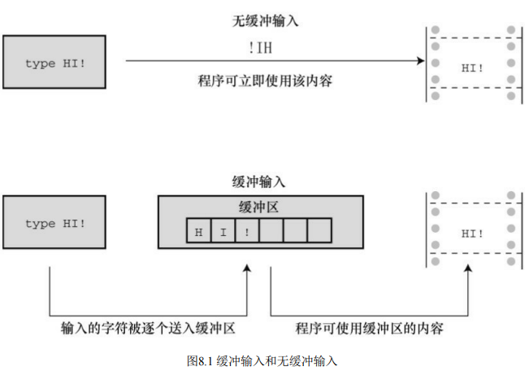

# 字符输入/输出和输入验证

本章介绍以下内容：

- 更详细地介绍输入、输出以及缓冲输入和无缓冲输入的区别
- 如何通过键盘模拟文件结尾条件
- 如何使用重定向把程序和文件相连接
- 创建更友好的用户界面

## 单字符I/O：getchar()和putchar()

```cpp
/* echo.c -- 重复输入 */
#include <stdio.h>
int main(void)
{
	char ch;
	while ((ch = getchar()) != '#')
		putchar(ch + 1);
	return 0;
}
```

## 缓冲区

如果在老式系统运行程序清单8.1，你输入文本时可能显示如下：

`HHeelllloo,, tthheerree..II wwoouulldd[enter]`

`lliikkee aa #`

以上行为是个例外。**像这样回显用户输入的字符后立即重复打印该字符是属于无缓冲（或直接）输入，即正在等待的程序可立即使用输入的字符。**对于该例，大部分系统在用户按下Enter键之前不会重复打印刚输入的字符，这种输入形式属于缓冲输入。用户输入的字符被收集并储存在一个被称为缓冲区（buffer）的临时存储区，按下Enter键后，程序才可使用用户输入的字符。



为什么要有缓冲区？首先，把若干字符作为一个块进行传输比逐个发送这些字符节约时间。其次，如果用户打错字符，可以直接通过键盘修正错误。当最后按下Enter键时，传输的是正确的输入。

缓冲分为两类：完全缓冲I/O和行缓冲I/O。完全缓冲输入指的是当缓冲区被填满时才刷新缓冲区（内容被发送至目的地），通常出现在文件输入中。缓冲区的大小取决于系统，常见的大小是 512 字节和 4096字节。行缓冲I/O指的是在出现换行符时刷新缓冲区。键盘输入通常是行缓冲输入，所以在按下Enter键后才刷新缓冲区。

**ANSI C和后续的C标准都规定输入是缓冲的。**

## 结束键盘输入

stdin流表示键盘输入，stdout流表示屏幕输出，getchar()、putchar()、printf()和scanf()函数都是标准I/O包的成员，处理这两个流。

```cpp
/* echo.c -- 重复输入 */
#include <stdio.h>
int main(void)
{
	int ch;
	while ((ch = getchar()) != EOF)
		putchar(ch + 1);
	return 0;
}
```

## 重定向和文件

在 cmd 执行

读文件：`echo.exe<words.txt`
写文件：`echo.exe>words.txt`
复制文件：`echo.exe < words.txt > words1.txt`

**注释**

打开一个文件并显示该文件：

```cpp
// file_eof.c --打开一个文件并显示该文件
#include <stdio.h>
#include <stdlib.h> // 为了使用exit()
int main()
{
	int ch;
	FILE *fp;
	char fname[50]; // 储存文件名
	printf("打开的文件: ");
	scanf("%s", fname);
	fp = fopen(fname, "r"); // 打开待读取文件
	if (fp == NULL)			// 如果失败
	{
		printf("打开失败\n");
		exit(1); // 退出程序
	}
	// getc(fp)从打开的文件中获取一个字符
	while ((ch = getc(fp)) != EOF)
		putchar(ch);
	fclose(fp); // 关闭文件
	return 0;
}
```

## 创建更友好的用户界面

1. 使用缓冲输入

```cpp
/* guess.c -- 一个拖沓且错误的猜数字程序 */
#include <stdio.h>
int main(void)
{
	int guess = 1;
	printf("选择1到100之间的整数。我会试着猜的。\n");
	printf("如果我的猜测是对的，用y回答，如果是错的，用n回答。\n");
	printf("你的号码是 %d?\n", guess);
	while (getchar() != 'y') /* 获取响应，与 y 做对比 */
		printf("它是%d吗？\n", ++guess);
	printf("猜对了！\n");
	return 0;
}
```

```cpp
// 优化后的代码
/* guess.c -- 一个拖沓且错误的猜数字程序 */
#include <stdio.h>
int main(void)
{
	int guess = 1;
	printf("选择1到100之间的整数。我会试着猜的。\n");
	printf("如果我的猜测是对的，用y回答，如果是错的，用n回答。\n");
	printf("你的号码是 %d?\n", guess);
	while (getchar() != 'y') /* 获取响应，与 y 做对比 */
	{
		printf("它是%d吗？\n", ++guess);
		while (getchar() != '\n')
		{
			continue;
		}
		}
	printf("猜对了！\n");
	return 0;
}
```
2.  混合数值和字符输入

假设程序要求用 getchar()处理字符输入，用 scanf()处理数值输入，这两 个函数都能很好地完成任务，但是不能把它们混用。因为 getchar()读取每个 字符，包括空格、制表符和换行符；而 scanf()在读取数字时则会跳过空格、 制表符和换行符。

该程序读入一个字符和两个数字，然后根据输入的两个数字指定的行数和列数打印该字符：

```cpp
/* showchar1.c -- 有较大 I/O 问题的程序 */
#include <stdio.h>
void display(char cr, int lines, int width);

int main(void)
{
	int ch;			/* 待打印字符 */
	int rows, cols; /* 行数和列数 */
	printf("输入一个字符和两个整数：\n");
	while ((ch = getchar()) != '\n')
	{
        // scanf()函数把这个换行符留在输入队列中
		scanf("%d %d", &rows, &cols);
		display((char)ch, rows, cols);
		printf("输入另一个字符和两个整数；\n");
		printf("输入要退出的换行符。\n");
	}
	printf("Bye.\n");
	return 0;
}

void display(char cr, int lines, int width)
{
	int row, col;
	for (row = 1; row <= lines; row++)
	{
		for (col = 1; col <= width; col++)
			putchar(cr);
		putchar('\n'); /* 结束一行并开始新的一行 */
	}
}
```

优化：

```cpp
#include <stdio.h>
void display(char cr, int lines, int width);

int main(void)
{
	int ch;			/* 待打印字符 */
	int rows, cols; /* 行数和列数 */
	printf("输入一个字符和两个整数：\n");
	while ((ch = getchar()) != '\n')
	{
		// 程序要跳过一轮输入结束与下一轮输入开始之间的所有换行符或空格
		if (scanf("%d %d", &rows, &cols) != 2)
			break;
		display((char)ch, rows, cols);
		while (getchar() != '\n')
			continue;
		printf("输入另一个字符和两个整数；\n");
		printf("输入要退出的换行符。\n");
	}
	printf("Bye.\n");
	return 0;
}

void display(char cr, int lines, int width)
{
	int row, col;
	for (row = 1; row <= lines; row++)
	{
		for (col = 1; col <= width; col++)
			putchar(cr);
		putchar('\n'); /* 结束一行并开始新的一行 */
	}
}
```

## 输入验证

```cpp
/* showchar1.c -- 有较大 I/O 问题的程序 */
#include <stdio.h>
long get_long();

int main(void)
{
	printf("return => %d\n", get_long());
	return 0;
}

long get_long(void)
{
	long input;
	char ch;
	while (scanf("%ld", &input) != 1)
	{
		while ((ch = getchar()) != '\n')
			putchar(ch); // 处理错误的输入
		printf(" is not an integer.\nPlease enter an ");
		printf("integer value, such as 25, -178, or 3: ");
	}
	return input;
}
```

该函数计算特定范围内所有整数的平方和。程序限制了范围的上限是10000000，下限是-10000000。

```cpp
// checking.c -- 输入验证
#include <stdio.h>
#include <stdbool.h>

// 验证输入是一个整数
long get_long(void);

// 验证范围的上下限是否有效
bool bad_limits(long begin, long end, long low, long high);

// 计算a～b之间的整数平方和
double sum_squares(long a, long b);

int main(void)
{
	const long MIN = -10000000L; // 范围的下限
	const long MAX = +10000000L; // 范围的上限
	long start;					 // 用户指定的范围最小值
	long stop;					 // 用户指定的范围最大值
	double answer;
	printf("这个程序计算一个范围内整数的平方和。下限不应小于-10000000,并且上限不应超过+10000000。输入限制(输入0以退出两个限制):\n下限:");
	start = get_long();
	printf("\n上限: ");
	stop = get_long();
	while (start != 0 || stop != 0)
	{
		if (bad_limits(start, stop, MIN, MAX))
			printf("请重试\n");
		else
		{
			answer = sum_squares(start, stop);
			printf("从 %ld 到 %ld 的整数的平方和是是 %g\n", start, stop, answer);
		}
		printf("输入限制 (上下限为0停止):\n");
		printf("下限: ");
		start = get_long();
		printf("上限: ");
		stop = get_long();
	}
	printf("完成.\n");
	return 0;
}
long get_long(void)
{
	long input;
	char ch;
	while (scanf("%ld", &input) != 1)
	{
		while ((ch = getchar()) != '\n')
			putchar(ch); // 处理错误输入
		printf(" 不是数值.\n请输入 25, -178, 或者 3 这样的数：");
	}
	return input;
}

double sum_squares(long a, long b)
{
	double total = 0;
	long i;
	for (i = a; i <= b; i++)
		total += (double)i * (double)i;
	return total;
}

bool bad_limits(long begin, long end, long low, long high)
{
	bool not_good = false;
	if (begin > end)
	{
		printf("%ld 不能小于 %ld.\n", begin, end);
		not_good = true;
	}
	if (begin < low || end < low)
	{
		printf("值必须大于等于 %ld.\n", low);
		not_good = true;
	}
	if (begin > high || end > high)
	{
		printf("值必须小于于等于 %ld.\n", high);
		not_good = true;
	}
	return not_good;
}
```

## 菜单浏览

获取选项，当选项不是'q'时，转至相应的选项并执行，获取下一个选项。

```cpp
/* menuette.c -- 菜单程序 */
#include <stdio.h>
char get_choice(void);
char get_first(void);
int get_int(void);
void count(void);
int main(void)
{
	int choice;
	void count(void);
	while ((choice = get_choice()) != 'q')
	{
		switch (choice)
		{
		case 'a':
			printf("Buy low, sell high.\n");
			break;
		case 'b':
			putchar('\a'); /* ANSI */
			break;
		case 'c':
			count();
			break;
		default:
			printf("Program error!\n");
			break;
		}
	}
	printf("Bye.\n");
	return 0;
}
void count(void)
{
	int n, i;
	printf("Count how far? Enter an integer:\n");
	n = get_int();
	for (i = 1; i <= n; i++)
		printf("%d\n", i);
	while (getchar() != '\n')
		continue;
}
char get_choice(void)
{
	int ch;
	printf("Enter the letter of your choice:\n");
	printf("a. advice b. bell\n");
	printf("c. count q. quit\n");
	ch = get_first();
	while ((ch < 'a' || ch > 'c') && ch != 'q')
	{
		printf("Please respond with a, b, c, or q.\n");
		ch = get_first();
	}
	return ch;
}
char get_first(void)
{
	int ch;
	ch = getchar();
	while (getchar() != '\n')
		continue;
	return ch;
}
int get_int(void)
{
	int input;
	char ch;
	while (scanf("%d", &input) != 1)
	{
		while ((ch = getchar()) != '\n')
			putchar(ch); // 处理错误输出
		printf(" is not an integer.\nPlease enter an ");
		printf("integer value, such as 25, -178, or 3: ");
	}
	return input;
}
```