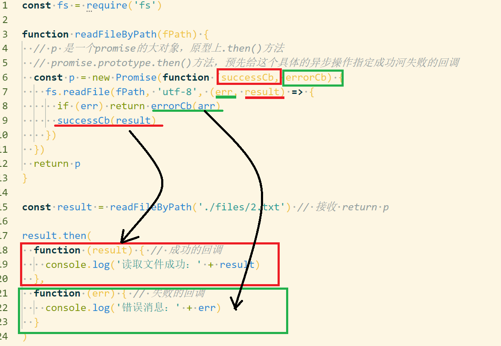

# Promise 对象

## 1. 概述

`promise`是异步编程的一种解决方案，比传统的解决方案—回调函数和事件—更合理更强大。

所谓的`promise`就是一个容器，里面保存着某个未来才会结束的事件（通常是一个异步操作的结果）。

`Promise`是一个对象，从它这里可以获取异步操作的信息，	`Promise`提供统一的API，各种异步操作都可以用同样的方法处理。

`promise`的特点：

1. **对象的状态不受外界影响，`promise`对象代表一个异步操作，有三种状态：`pending(进行中)`、`Fulfilled(已成功)`、`Rejected(已失败)`。只有异步操作的结果才可以决定当前是哪一种操作状态，任何其他操作都无法改变这种状态。**

2. **一旦状态改变就不会再变，任何时候都可以得到这个结果。**`Promise`对象的状态改变只有两种可能：从`pending(进行中)`变为`Fulfilled(已成功)`、或者从`pending(进行中)`变成`Rejected(已失败)`。状态发生改变就凝固了，不会再变，而是一直保持这个结果，这是就称为`Resolved(已定型)`。就算改变已经发生，再对`Promise`对象添加回调函数，也会立即得到这个结果，这个与`event`完全不同，事件的特点是，如果错过了它，再去监听是得不到结果的。

   有了`promise`对象，就可以将异步操作以同步操作表示出来，避免了层层嵌套的回调函数。

   `Promise`的缺点：

   1. 无法取消`Promise`,一旦新建它就会立即执行，无法中途取消。
   2. 如果不设置回调函数，`Promise`内部抛出错误不会反应到外部。
   3. 当处于`Pending`状态时，无法得知目前进展到哪一个阶段了。

   ## 2. 基本用法

Promise 对象是一个构造函数，用来生成 Promise 实例。

创建一个 `Promise` 实例：

```js
const promise = new Promise(function(res, rej) {
    // your code ...
    if(/* 异步操作成功 */) {
     	res(value)  
    } else {
		rej(error)
    }
})
```

`Promise` 构造函数接受一个函数作为参数，该函数的两个参数分别是 res，rej。它们是两个函数，由 JavaScript 引擎提供，不用自己部署。

Promise 实例生成以后，可以用 then 方法分别指定 resolved 状态和 rejected 状态的回调函数。

```js
promise.then(function(value) {
 // success
}, function(error) {
 // failure
});
```

then 方法可以接受两个回调函数作为参数。第一个回调函数是 Promise 对象的状态变为 resolved 时调用，第二个回调函数是 Promise 对象的状态变为 rejected 时调用。其中，第二个函数是可选的，不一定要提供。这两个函数都接受 Promise 对象传出的值作为参数。

下面是一个 Promise 对象的简单例子。

```js
function timeout(ms) {
 return new Promise((resolve, reject) => {
 setTimeout(resolve, ms, 'done');
 });
}
timeout(100).then((value) => {
 console.log(value);
});

```

上面代码中， timeout 方法返回一个 Promise 实例，表示一段时间以后才会发生的结果。过了指定的时间（ ms 参数）以后， Promise 实例的状态变为resolved ，就会触发 then 方法绑定的回调函数。

**Promise 新建后就会立即执行。**

   ```javascript
let promise = new Promise(function(res, rej) {
    // your code...
})

promise.then(function(value) {
    // res
}, function(error) {
    // rej
})
   ```

### 2.1 执行顺序

```javascript
let promise = new Promise(function(resolve, reject) {
  // resolve, reject 才是真正的异步
  console.log('1')
  resolve()
})

promise.then(() => {
  console.log('2')
})

console.log('3')

// 1 3 2

```

### 2.2 异步加载图片

```javascript
// 异步加载图片
function loadImageAsync(url) {
  return new Promise(function(resolve, reject) {
    let image = new Image()

    iamge.onload = function () {
      resolve(image)
    }

    image.onerror = function() {
      reject(new Error('不能加载' + url))
    }

    iamge.src = url
  })
}
```

使用 Promise 包装了一个图片加载的异步操作。如果加载成功，就调用 resolve 方法，否则就调用 reject 方法。

### 2.3 模拟AJAX

```javascript

// promise对象实现AJAX
// getJSON 是对XMLHttpReqest对象的封装，用于发出一个JSON数据的HTTP请求
// 并返回一个Promise对象。需要注意的是，在getJSON内部，resolve函数和reject函数
// 都带有参数

let getJSON = function(url) {
  let promise = new Promise(function(resolve, reject) {
    let client = new XMLHttpRequest()
    client.open('GET', url)
    client.onreadystatechange = handler
    client.responseType = "json"
    client,setRequestHeader('Accept','application/json')
    client.send()

    function handler() {
      if(this.readyState !== 4) {
        return
      }
      if(this.status === 200) {
        resolve(this.response)
      } else {
        reject(new Error(this.statusText))
      }
    }
  })
  return promise
}

getJSON('/posts.json').then(function(json) {
  console.log('Contents:' + json)
},function(error) {
  console.log('error',error)
})

/**
 * 如果resolve 和 reject 函数都带有参数，那么这些参数会被传递到回调函数。
 * reject函数接收Error对象的实例，表示抛出的错误
 * reslove 函数参数除了正确的值，还有可能是一个Promise对象
 */
```

### 2.4 promise中的promise

```javascript

let p1 = new Promise(function(resolve, reject) {
  // ...
})

let p2 = new Promise(function(resolve, reject) {
  // ...
  resolve(p1)
})
/**p1 和 p2 都是Promise的实例，但是p2的resolve方法将p1作为参数
 * 即一个异步操作的结果是返回另一个异步操作。
 * p1的状态传递给p2.p1的状态决定了p2的状态
 * 如果 p1 的状态是 pending ，那么 p2 的回调函数就会等待 p1 的状态改变；
 * 如果 p1 的状态已经是 resolved 或者 rejected ，那么 p2 的回调函数将会立刻执行。
 */
```


```javascript
let p1 = new Promise(function(resolve, reject) {
  setTimeout(() => reject(new Error('fail')), 3000)
})

let p2 = new Promise(function(resolve, reject) {
  setTimeout(() => resolve(p1), 1000)
})

p2.then(result => console.log(result)).catch(error => console.log(error))

// Error: fail

/**
 * p1 是一个 Promise，3 秒之后变为 rejected 。 
 * p2 的状态在 1 秒之后改变， resolve 方法返回的是 p1 。
 * 由于 p2 返回的是另一个Promise，导致 p2 自己的状态无效了，由 p1 的状态决定 p2 的状态。
 * 所以，后面的 then 语句都变成针对后者（ p1 ）。
 * 又过了 2 秒， p1 变为 rejected ，导致触发 catch 方法指定的回调函数。
 */
```


**注意，调用 resolve 或 reject 并不会终结 Promise 的参数函数的执行。**

```js
new Promise((resolve, reject) => {
 resolve(1);
 console.log(2);
}).then(r => {
 console.log(r);
});
// 2 1
// 调用 resolve(1) 以后，后面的 console.log(2) 还是会执行，并且会首先打印出来。

```

**这是因为立即 resolved 的 Promise 是在本轮事件循环的末尾执行，总是晚于本轮循环的同步任务。**


调用 resolve 或 reject 以后，Promise 的使命就完成了，后继操作应该放到 then 方法里面，而不应该直接写在 resolve 或 reject 的后面。所以，最好在它们前面加上 return 语句，这样就不会有意外。

```js
new Promise((resolve, reject) => {
 return resolve(1);
 // 后面的语句不会执行
 console.log(2);
})
```


## 3. Promise.prototype.then()

then 方法是定义在原型对象 Promise.prototype 上的。作用：为了Promise实例添加状态改变时的回调。

then 方法有两个参数，第一个参数是Resolved状态的回调函数，第二个参数（可选）是Rejected状态的回调函数。

```javascript
promise.then(function(value) {
    // res
}, function(error) {
    // rej
})

// then返回的是一个新的Promise实例
```


.then 采用链式编程，前一个回调函数，有可能返回的还是一个 Promise 对象，这时后一个回调函数，就会等待该 Promise 对象的状态发生变化，才会被回调。

```js
getJSON("/post/1.json").then(function(post) {
 return getJSON(post.commentURL);
}).then(function funcA(comments) {
 console.log("resolved: ", comments);
}, function funcB(err){ 
 console.log("rejected: ", err);
});
```

箭头函数写法：

```js
getJSON("/post/1.json").then(
 post => getJSON(post.commentURL)
).then(
 comments => console.log("resolved: ", comments),
 err => console.log("rejected: ", err)
);
```


## 4. Promise.prototype.catch()

`Promise.prototype.catch`方法是`.then(null, rejection)`的别名，用于指定发生错误的回调函数。

另外`then`方法指定的回调函数如果在运行中抛出错误，也会被`catch`捕获。

一般来说，不要在`then`方法中定义 Rejected 状态的回调（即`then`的第二个参数），而应该总是使用`catch`方法。

```javascript
p2.then(result => console.log(result))
.catch(error => console.log(error))
// .catch 处理 p2 和前一个回调函数运行时发生的错误

// ====> 等同于
p2.then(result => console.log(result))
.then(null, err => console.log(err))
```

例子：

```js
const promise = new Promise(function(resolve, reject) {
 throw new Error('test');
});
promise.catch(function(error) {
 console.log(error);
});
// Error: test

/* ******************************** */
// 等价于 1
const promise = new Promise(function(resolve, reject) {
 try {
 	throw new Error('test');
 } catch(e) {
 	reject(e);
 }
});
promise.catch(function(error) {
 console.log(error);
});

// 等价于 2
const promise = new Promise(function(resolve, reject) {
 reject(new Error('test'));
});
promise.catch(function(error) {
 console.log(error);
});
// reject 方法的作用，等同于抛出错误。

```

如果 Promise 状态已经变成 resolved ，再抛出错误是无效的。

```js
const promise = new Promise(function(resolve, reject) {
 resolve('ok');
 throw new Error('test');
});
promise
 .then(function(value) { console.log(value) })
 .catch(function(error) { console.log(error) });
// ok 
// Promise 在 resolve 语句后面，再抛出错误，不会被捕获，等于没有抛出。因为 Promise 的状态一旦改变，就永久保持该状态，不会再变了。

```


Promise 对象的错误具有“冒泡”性质，会一直向后传递，直到被捕获为止。也就是说，错误总是会被下一个 catch 语句捕获。

```js
getJSON('/post/1.json').then(function(post) {
 return getJSON(post.commentURL);
}).then(function(comments) {
 // some code
}).catch(function(error) {
 // 处理前面三个Promise产生的错误
});
/*
 * catch 会捕获前面的错误
 */
```

**一般来说，不要在 then 方法里面定义 Reject 状态的回调函数（即 then 的第二个参数），总是使用 catch 方法。**


**Promise 中的错误不会影响主线程的脚本执行，会吃掉错误，并抛出。**

```js
const someAsyncThing = function() {
 return new Promise(function(resolve, reject) {
 // 下面一行会报错，因为x没有声明
 resolve(x + 2);
 });
};
someAsyncThing().then(function() {
 console.log('everything is great');
});
setTimeout(() => { console.log(123) }, 2000);
// Uncaught (in promise) ReferenceError: x is not defined
// 123

```


## 5. Promise.all()

Promise.all方法用于将多个 Promise 实例，包装成一个新的 Promise 实例。

```javascript
const p = Promise.all([p1, p2, p3]); 
// Promise.all方法接受一个数组作为参数，p1、p2、p3都是 Promise 实例，
// 如果不是，就会先调用Promise.resolve方法， 将参数转为 Promise 实例，再进一步处理。
```

p的状态由p1、p2、p3决定，分成两种情况。
（1）只有p1、p2、p3的状态都变成fulfilled，p的状态才会变成fulfilled，此时p1、p2、p3的返回值组成一个数组，传递给p的回调函数。
（2）只要p1、p2、p3之中有一个被rejected，p的状态就变成rejected，此时第一个被reject的实例的返回值，会传递给p的回调函数。

例子：

```js
// 生成一个Promise对象的数组
const promises = [2, 3, 5, 7, 11, 13].map(function(id) {
    // 前面定义过的方法
    return getJSON('/post/' + id + ".json");
});
Promise.all(promises).then(function(posts) {
    // ...
}).catch(function(reason) {
    // ...
});
```

上面代码中， promises 是包含 6 个 Promise 实例的数组，只有这 6 个实例的状态都变成 fulfilled ，或者其中有一个变为 rejected ，才会调用 Promise.all 方法后面的回调函数。


```javascript
const databasePromise = connectDatabase();

const booksPromise = databasePromise.then(findAllBooks);

const userPromise = databasePromise.then(getCurrentUser);

// booksPromise和userPromise是两个异步操作，只有等到它们的结果都返回了，才会触发pickTopRecommentations这个回调函数。

Promise.all([booksPromise, userPromise]).then(([books, user]) => pickTopRecommentations(books, user));
```


例子：

如果作为参数的 Promise 实例，自己定义了catch方法，那么它一旦被rejected，并不会触发Promise.all()的catch方法。

```js
const p1 = new Promise((resolve, reject) => {
    resolve('hello');
}).then(result => result).catch(e => e);
const p2 = new Promise((resolve, reject) => {
    throw new Error('报错了');
}).then(result => result).catch(e => e);
Promise.all([p1, p2]).then(result => console.log(result)).catch(e => console.log(e));
// ["hello", Error: 报错了]
```

上面代码中， p1 会 resolved ， p2 首先会 rejected ，但是 p2 有自己的 catch 方法，该方法返回的是一个新的 Promise 实例， p2 指向的实际上是这个实例。该实例执行完 catch 方法后，也会变成 resolved ，导致 Promise.all() 方法参数里面的两个实例都会 resolved ，因此会调用 then 方法指定的回调函数，而不会调用 catch 方法指定的回调函数。

**实例中的reject方法在all()方法也是结果，all() 不管实例的结果**

如果 p2 没有自己的 catch 方法，就会调用 Promise.all() 的 catch 方法。

```js
const p1 = new Promise((resolve, reject) => {
    resolve('hello');
}).then(result => result);
const p2 = new Promise((resolve, reject) => {
    throw new Error('报错了');
}).then(result => result);
Promise.all([p1, p2]).then(result => console.log(result)).catch(e => console.log(e));
// Error: 报错了
```


## 6. Promise.race()

Promise.race 方法同样是将多个 Promise 实例，包装成一个新的 Promise 实例。

```js
const p = Promise.race([p1, p2, p3]);
```

上面代码中，只要 p1 、 p2 、 p3 之中有一个实例率先改变状态， p 的状态就跟着改变。那个率先改变的 Promise 实例的返回值，就传递给 p 的回调函数。

Promise.race 方法的参数与 Promise.all 方法一样，如果不是 Promise 实例，就会先调用下面讲到的 Promise.resolve 方法，将参数转为 Promise 实例，再进一步处理。

下面是一个例子，如果指定时间内没有获得结果，就将 Promise 的状态变为 reject ，否则变为 resolve 。

```js
      fetch('/resource-that-may-take-a-while'),
      new Promise(function(resolve, reject) {
        setTimeout(() => reject(new Error('request timeout')), 5000)
      })
    ]);
    p.then(response => console.log(response));
    p.catch(error => console.log(error));
```

如果 5 秒之内 fetch 方法无法返回结果，变量 p 的状态就会变为 rejected ，从而触发 catch 方法指定的回调函数。


## 7. Promise.resolve()

有时需要将现有对象转为 Promise 对象， Promise.resolve 方法就起到这个作用。

```js
const jsPromise = Promise.resolve($.ajax('/whatever.json'));
```

上面代码将 jQuery 生成的 deferred 对象，转为一个新的 Promise 对象。

Promise.resolve 等价于下面的写法。

```js
Promise.resolve('foo')
// 等价于
new Promise(resolve => resolve('foo'))
```

Promise.resolve 方法的参数分成四种情况。

### 7.1 参数是一个 Promise 实例

如果参数是 Promise 实例，那么 Promise.resolve 将不做任何修改、原封不动地返回这个实例。

### 7.2 参数是一个 thenable 对象

thenable 对象指的是具有 then 方法的对象，比如下面这个对象。

```js
let thenable = {
    then: function(resolve, reject) {
        resolve(42);
    }
};
```

Promise.resolve 方法会将这个对象转为 Promise 对象，然后就立即执行 thenable 对象的 then 方法。

```js
let thenable = {
    then: function(resolve, reject) {
        resolve(42);
    }
};
let p1 = Promise.resolve(thenable);
p1.then(function(value) {
    console.log(value); // 42
});

```

上面代码中， thenable 对象的 then 方法执行后，对象 p1 的状态就变为 resolved ，从而立即执行最后那个 then 方法指定的回调函数，输出 42。


### 7.3 参数不是具有 then 方法的对象，或根本就不是对象

如果参数是一个原始值，或者是一个不具有 then 方法的对象，则 Promise.resolve 方法返回一个新的 Promise 对象，状态为 resolved 。

```js
const p = Promise.resolve('Hello');
p.then(function (s){
 console.log(s)
});
// Hello
```

上面代码生成一个新的 Promise 对象的实例 p 。由于字符串 Hello 不属于异步操作（判断方法是字符串对象不具有 then 方法），返回 Promise 实例的状态从一生成就是 resolved ，所以回调函数会立即执行。 Promise.resolve 方法的参数，会同时传给回调函数。

### 7.4 不带有任何参数

Promise.resolve 方法允许调用时不带参数，直接返回一个 resolved 状态的 Promise 对象。

所以，如果希望得到一个 Promise 对象，比较方便的方法就是直接调用 Promise.resolve 方法。

```js
const p = Promise.resolve();
p.then(function () {
 // ...
});
```

上面代码的变量 p 就是一个 Promise 对象。

**需要注意的是，立即 resolve 的 Promise 对象，是在本轮“事件循环”（event loop）的结束时，而不是在下一轮“事件循环”的开始时。**

```js
setTimeout(function () {
 console.log('three');
}, 0);
Promise.resolve().then(function () {
 console.log('two');
});
console.log('one');
// one // two // three

```

setTimeout(fn, 0) 在下一轮“事件循环”开始时执行， Promise.resolve() 在本轮“事件循环”结束时执行， console.log('one') 则是立即执行，因此最先输出。


## 8.Promise.reject()

Promise.reject(reason) 方法也会返回一个新的 Promise 实例，该实例的状态为 rejected 。

```js
const p = Promise.reject('出错了');
// 等同于
const p = new Promise((resolve, reject) => reject('出错了'))
p.then(null, function (s) {
    console.log(s)
});
// 出错了
```

上面代码生成一个 Promise 对象的实例 p ，状态为 rejected ，回调函数会立即执行。

注意， Promise.reject() 方法的参数，会原封不动地作为 reject 的理由，变成后续方法的参数。这一点与 Promise.resolve 方法不一致。

```js
const thenable = {
    then(resolve, reject) {
        reject('出错了');
    }
};
Promise.reject(thenable)
    .catch(e => {
    console.log(e === thenable)
})
// true

```

上面代码中， Promise.reject 方法的参数是一个 thenable 对象，执行以后，后面 catch 方法的参数不是 reject 抛出的“出错了”这个字符串，而是 thenable 对象。


## 9. 两个有用的附加方法

### 9.1 done()

**主线程抛出错误**

Promise 对象的回调链，不管以 then 方法或 catch 方法结尾，要是最后一个方法抛出错误，都有可能无法捕捉到（**因为 Promise 内部的错误不会冒泡到全局**）。因此，我们可以提供一个 done 方法，总是处于回调链的尾端，保证抛出任何可能出现的错误。

```js
asyncFunc().then(f1).catch(r1).then(f2).done();
```

它的实现代码相当简单。

```js
Promise.prototype.done = function (onFulfilled, onRejected) {
    this.then(onFulfilled, onRejected)
        .catch(function (reason) {
        // 抛出一个全局错误
        setTimeout(() => { throw reason }, 0);
    });
};

```

从上面代码可见， done 方法的使用，可以像 then 方法那样用，提供 fulfilled 和 rejected 状态的回调函数，也可以不提供任何参数。但不管怎样，done 都会捕捉到任何可能出现的错误，并向全局抛出。

### 9.2 finally()

finally 方法用于指定不管 Promise 对象最后状态如何，都会执行的操作。它与 done 方法的最大区别，它接受一个普通的回调函数作为参数，该函数不管怎样都必须执行。

服务器使用 Promise 处理请求，然后使用 finally 方法关掉服务器。

```js
server.listen(0).then(function () {
 // run test
}).finally(server.stop);

```

它的实现也很简单。

```js
Promise.prototype.finally = function (callback) {
    let P = this.constructor;
    return this.then(
        value => P.resolve(callback()).then(() => value),
        reason => P.resolve(callback()).then(() => { throw reason })
    );
};

```

上面代码中，不管前面的 Promise 是 fulfilled 还是 rejected ，都会执行回调函数 callback 。


## 10. 应用

### 10.1 加载图片

我们可以将图片的加载写成一个 Promise ，一旦加载完成， Promise 的状态就发生变化。

```js
const preloadImage = function (path) {
    return new Promise(function (resolve, reject) {
        const image = new Image();
        image.onload = resolve;
        image.onerror = reject;
        image.src = path;
    });
};
```


### 10.2 Generator 函数 和 Promise 结合

不懂~~~

使用 Generator 函数管理流程，遇到异步操作的时候，通常返回一个 Promise 对象。

```js
function getFoo () {
    return new Promise(function (resolve, reject){
        resolve('foo');
    });
}
const g = function* () {
    try {
        const foo = yield getFoo();
        console.log(foo);
    } catch (e) {
        console.log(e);
    }
};
function run (generator) {
    const it = generator();
    function go(result) {
        if (result.done) return result.value;
        return result.value.then(function (value) {
            return go(it.next(value));
        }, function (error) {
            return go(it.throw(error));
        });
    }
    go(it.next());
}
run(g);

```

上面代码的 Generator 函数 g 之中，有一个异步操作 getFoo ，它返回的就是一个 Promise 对象。函数 run 用来处理这个 Promise 对象，并调用下一个next 方法。


## 11. Promise.try()

实际开发中，经常遇到一种情况：不知道或者不想区分，函数 f 是同步函数还是异步操作，但是想用 Promise 来处理它。因为这样就可以不管 f 是否包含异步操作，都用 then 方法指定下一步流程，用 catch 方法处理 f 抛出的错误。一般就会采用下面的写法。

```js
Promise.resolve().then(f)
```

上面的写法有一个缺点，就是如果 f 是同步函数，那么它会在本轮事件循环的末尾执行。

```js
const f = () => console.log('now');
Promise.resolve().then(f);
console.log('next');
// next
// now

```

上面代码中，函数 f 是同步的，但是用 Promise 包装了以后，就变成异步执行了。
那么有没有一种方法，让同步函数同步执行，异步函数异步执行，并且让它们具有统一的 API 呢？回答是可以的，并且还有两种写法。第一种写法是用 async 函数来写。

```js
const f = () => console.log('now');
(async () => f())();
console.log('next');
// now
// next
```

上面代码中，第二行是一个立即执行的匿名函数，会立即执行里面的 async 函数，因此如果 f 是同步的，就会得到同步的结果；如果 f 是异步的，就可以用 then 指定下一步，就像下面的写法。

```js
(async () => f())().then(...)
```

需要注意的是， async () => f() 会吃掉 f() 抛出的错误。所以，如果想捕获错误，要使用 promise.catch 方法。

```js
(async () => f())().then(...).catch(...)
```

第二种写法是使用 new Promise() 。

```js
const f = () => console.log('now');
(() => new Promise( resolve => resolve(f()) ))();
console.log('next');
// now
// next

```

事实上， Promise.try 存在已久，Promise 库 Bluebird 、 Q 和 when ，早就提供了这个方法。

由于 Promise.try 为所有操作提供了统一的处理机制，所以如果想用 then 方法管理流程，最好都用 Promise.try 包装一下。这样有许多好处，其中一点就是可以更好地管理异常。

```js
function getUsername(userId) {
    return database.users.get({id: userId})
        .then(function(user) {
        return user.name;
    });
}

```

上面代码中， database.users.get() 返回一个 Promise 对象，如果抛出异步错误，可以用 catch 方法捕获，就像下面这样写。

```js
database.users.get({id: userId}).then(...).catch(...)
```

但是 database.users.get() 可能还会抛出同步错误（比如数据库连接错误，具体要看实现方法），这时你就不得不用 try...catch 去捕获。

```js
try {
    database.users.get({id: userId})
        .then(...)
              .catch(...)
} catch (e) {
    // ...
}

```

上面这样的写法就很笨拙了，这时就可以统一用 promise.catch() 捕获所有同步和异步的错误。

```js
Promise.try(database.users.get({id: userId})).then(...).catch(...)
```

事实上， Promise.try 就是模拟 try 代码块，就像 promise.catch 模拟的是 catch 代码块。


## 12. 读文件的方法

```javascript
const fs = require('fs')

// 总结：只要 new 了一个具体的异步操作，这个异步操作被创建的一瞬间，就会立即执行；
function readFileByPath(fpath) {
  const p = new Promise(function() {
    fs.readFile(fpath, 'utf-8', (err, result) => {
      if (err) return console.log('读文件失败：' + err.message)
      console.log(result)
    })
  })
}

readFileByPath('./files/3.txt') // 文件必须存在
```

使用.then()进一步封装读文件的操作

封装原则：不要在方法内部显示结果，要把结果返回给调用者，不要提调用者做决定！！



使用.catch()进一步封装读文件的操作

```js

const fs = require('fs')

function readFileByPath(fPath) {
  return new Promise(function(resolve,reject){
    fs.readFile(fPath, 'utf-8', (err, result) => {
      if (err) return reject(arr)
      resolve(result)
    })
  })
}

// 一般.then()方法中，失败的回调可以省略，但是省略以后读取文件失败时，无法接收结果
// 这是，我们可以使用.catch() 来指定失败的回调
/* --------------读一个-------------------- */
readFileByPath('./files/1.txt')
  .then(function(result) {
    console.log(result)
  })
  .catch(err => console.log(err.message))

/* ---------------读多个----------------------- */
readFileByPath('./files/1.txt')
  .then(function(result){
    console.log(result)
    return readFileByPath('./files/2.txt')
  })
  .then(function(result){
    console.log(result)
    return readFileByPath('./files/3.txt')
  })
  .catch(err => console.log(err.message))


```

async和await

```js
const fs = require('fs')

function readFileByPath(fPath) {
  return new Promise(function(resolve,reject){
    fs.readFile(fPath, 'utf-8', (err, result) => {
      if (err) return reject(arr)
      resolve(result)
    })
  })
}

// async 用来修饰异步方法
// await 只能用在被 async 修饰的方法中
// 同时，await 是用来修饰 Promise 实例对象的；简化promise对象

async function readAll () {
  const result1 = await readFileByPath('./files/1.txt')
  console.log(result1)
  const result2 = await readFileByPath('./files/2.txt')
  console.log(result2)
}

readAll()
```
