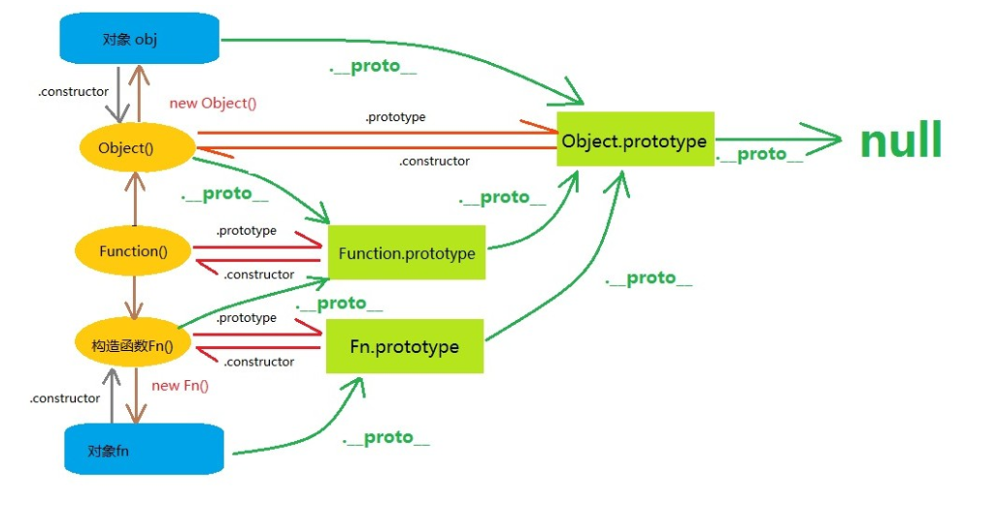

# Class 的继承

## 1. 简介

Class 可以通过 extends 关键字实现继承：(**ES5 的通过修改原型链实现继承**)

```js
class Point {
}
class ColorPoint extends Point {
}
```

上面代码定义了一个 ColorPoint 类，该类通过 extends 关键字，继承了 Point 类的所有属性和方法。

但是由于没有部署任何代码，所以这两个类完全一样，等于复制了一个 Point 类。

们在 ColorPoint 内部加上代码：

```js
// ColorPoint 继承 Point，通过 super 调用父类的 constructor 方法
// 子类 通过 super 继承父类 的 this
class ColorPoint extends Point {
    constructor(x, y, color) {
        super(x, y); // 调用父类的constructor(x, y)
        this.color = color;
    }
    toString() {
        return this.color + ' ' + super.toString(); // 调用父类的toString()
    }
}

```

上面代码中， constructor 方法和 toString 方法之中，都出现了 super 关键字，它在这里表示父类的构造函数，用来新建父类的 this 对象。

子类必须在 constructor 方法中调用 super 方法，否则新建实例时会报错。这是因为子类没有自己的 this 对象，而是继承父类的 this 对象，然后对其进行加工。如果不调用 super 方法，子类就得不到 this 对象。

```js
class Point { /* ... */ }
class ColorPoint extends Point {
    constructor() {
    }
}
let cp = new ColorPoint(); // ReferenceError
```

上面代码中， ColorPoint 继承了父类 Point ，但是它的构造函数没有调用 super 方法，导致新建实例时报错。

==ES5 的继承，实质是先创造子类的实例对象 this ，然后再将父类的方法添加到 this 上面（ Parent.apply(this) ）。==

==ES6 的继承机制完全不同，实质是先创造父类的实例对象 this （所以必须先调用 super 方法），然后再用子类的构造函数修改 this 。==

如果子类没有定义 constructor 方法，这个方法会被默认添加，代码如下。也就是说，不管有没有显式定义，任何一个子类都有 constructor 方法。

```js
class ColorPoint extends Point {
}
// 等同于
class ColorPoint extends Point {
    constructor(...args) {
        super(...args);
    }
}
```

另一个需要注意的地方是，在子类的构造函数中，只有调用 super 之后，才可以使用 this 关键字，否则会报错。这是因为子类实例的构建，是基于对父类实例加工，只有 super 方法才能返回父类实例。

```js
class Point {
    constructor(x, y) {
        this.x = x;
        this.y = y;
    }
}
class ColorPoint extends Point {
    constructor(x, y, color) {
        this.color = color; // ReferenceError
        super(x, y);
        this.color = color; // 正确
    }
}

```

上面代码中，子类的 constructor 方法没有调用 super 之前，就使用 this 关键字，结果报错，而放在 super 方法之后就是正确的。

下面是生成子类实例的代码。

```js
let cp = new ColorPoint(25, 8, 'green');
cp instanceof ColorPoint // true
cp instanceof Point // true
```

上面代码中，实例对象 cp 同时是 ColorPoint 和 Point 两个类的实例，这与 ES5 的行为完全一致。

最后，父类的静态方法，也会被子类继承。

```js
class A {
    static hello() {
        console.log('hello world');
    }
}
class B extends A {
}
B.hello() // hello world
```

上面代码中， hello() 是 A 类的静态方法， B 继承 A ，也继承了 A 的静态方法。


## 2. Object.getPrototypeOf()

Object.getPrototypeOf 方法可以用来从子类上获取父类。

```js
Object.getPrototypeOf(ColorPoint) === Point
// true
```

因此，可以使用这个方法判断，一个类是否继承了另一个类。


## 3. super 关键字

super 这个关键字，既可以当作函数使用，也可以当作对象使用。在这两种情况下，它的用法完全不同。


## 4. 类的 prototype 属性和__proto__属性


ES5 中，每一个实例对象都有`__proto__`属性，指向对应的构造函数的`prototype`属性。Class作为构造函数的语法糖，同时有`prototype`和`__proto__`属性，因此同时存在两条继承链。

```js
class A {
}
class B extends A {
}
B.__proto__ === A // true
B.prototype.__proto__ === A.prototype // true

```

上面代码中，子类 B 的 __proto__ 属性指向父类 A ，子类 B 的 prototype 属性的 __proto__ 属性指向父类 A 的 prototype 属性。

这样的结果是因为，类的继承是按照下面的模式实现的。

```js
class A {
}
class B {
}
// B 的实例继承 A 的实例
Object.setPrototypeOf(B.prototype, A.prototype);
// B 的实例继承 A 的静态属性
Object.setPrototypeOf(B, A);
const b = new B();
```

《对象的扩展》一章给出过 Object.setPrototypeOf 方法的实现。

```js
Object.setPrototypeOf = function (obj, proto) {
 obj.__proto__ = proto;
 return obj;
}
```

因此，就得到了上面的结果。

```js
Object.setPrototypeOf(B.prototype, A.prototype);
// 等同于
B.prototype.__proto__ = A.prototype;
Object.setPrototypeOf(B, A);
// 等同于
B.__proto__ = A;
```

这两条继承链，可以这样理解：作为一个对象，子类（ B ）的原型（ __proto__ 属性）是父类（ A ）；作为一个构造函数，子类（ B ）的原型对象（ prototype 属性）是父类的原型对象（ prototype 属性）的实例。

```js
Object.create(A.prototype);
// 等同于
B.prototype.__proto__ = A.prototype;
```

这两条继承链，可以这样理解：作为一个对象，子类（ B ）的原型（ __proto__ 属性）是父类（ A ）；作为一个构造函数，子类（ B ）的原型对象（ prototype 属性）是父类的原型对象（ prototype 属性）的实例。

```js
Object.create(A.prototype);
// 等同于
B.prototype.__proto__ = A.prototype;
```


### 4.1 extends 的继承目标 

extends 关键字后面可以跟多种类型的值。

```js
class B extends A {
}

```

上面代码的 A ，只要是一个有 prototype 属性的函数，就能被 B 继承。由于函数都有 prototype 属性（除了 Function.prototype 函数），因此 A 可以是任意函数。

下面，讨论三种特殊情况。

第一种特殊情况，子类继承 Object 类。

```js
class A extends Object {
}
A.__proto__ === Object // true
A.prototype.__proto__ === Object.prototype // true
```

这种情况下， A 其实就是构造函数 Object 的复制， A 的实例就是 Object 的实例

第二种特殊情况，不存在任何继承。

```js
class A {
}
A.__proto__ === Function.prototype // true
A.prototype.__proto__ === Object.prototype // true
```

这种情况下， A 作为一个基类（即不存在任何继承），就是一个普通函数，所以直接继承 Function.prototype 。但是， A 调用后返回一个空对象（即Object 实例），所以 `A.prototype.__proto__ `指向构造函数（ Object ）的 prototype 属性。

第三种特殊情况，子类继承 null 。

```js
class A extends null {
}
A.__proto__ === Function.prototype // true
A.prototype.__proto__ === undefined // true
```

这种情况与第二种情况非常像。 A 也是一个普通函数，所以直接继承 Function.prototype 。但是， A 调用后返回的对象不继承任何方法，所以它的`__proto__ `指向 Function.prototype ，即实质上执行了下面的代码。

```js
class C extends null {
 constructor() { return Object.create(null); }
}

```

### 4.2 实例的 __proto__ 属性

子类实例的 `__proto__ `属性的 `__proto__ `属性，指向父类实例的 `__proto__ `属性。也就是说，子类的原型的原型，是父类的原型。

```js
var p1 = new Point(2, 3);
var p2 = new ColorPoint(2, 3, 'red');
p2.__proto__ === p1.__proto__ // false
p2.__proto__.__proto__ === p1.__proto__ // true
```

上面代码中， ColorPoint 继承了 Point ，导致前者原型的原型是后者的原型。

因此，通过子类实例的 `__proto__.__proto__ `属性，可以修改父类实例的行为。

```js
p2.__proto__.__proto__.printName = function () {
 console.log('Ha');
};
p1.printName() // "Ha"

```

上面代码在 ColorPoint 的实例 p2 上向 Point 类添加方法，结果影响到了 Point 的实例 p1 。



## 5. 原生构造函数的继承

原生构造函数是指语言内置的构造函数，通常用来生成数据结构。ECMAScript 的原生构造函数大致有下面这些

```js
Boolean()
Number()
String()
Array()
Date()
Function()
RegExp()
Error()
Object()
```

以前，这些原生构造函数是无法继承的，比如，不能自己定义一个 Array 的子类

```js
function MyArray() {
 Array.apply(this, arguments);
}
MyArray.prototype = Object.create(Array.prototype, {
 constructor: {
 value: MyArray,
 writable: true,
 configurable: true,
 enumerable: true
 }
});

```

上面代码定义了一个继承 Array 的 MyArray 类。但是，这个类的行为与 Array 完全不一致。

```js
var colors = new MyArray();
colors[0] = "red";
colors.length // 0
colors.length = 0;
colors[0] // "red"
```

之所以会发生这种情况，是因为子类无法获得原生构造函数的内部属性，通过 Array.apply() 或者分配给原型对象都不行。原生构造函数会忽略 apply 方法传入的 this ，也就是说，原生构造函数的 this 无法绑定，导致拿不到内部属性。

ES5 是先新建子类的实例对象 this ，再将父类的属性添加到子类上，由于父类的内部属性无法获取，导致无法继承原生的构造函数。比如， Array 构造函数有一个内部属性 [[DefineOwnProperty]] ，用来定义新属性时，更新 length 属性，这个内部属性无法在子类获取，导致子类的 length 属性行为不正
常。

下面的例子中，我们想让一个普通对象继承 Error 对象。

```js
var e = {};
Object.getOwnPropertyNames(Error.call(e))
// [ 'stack' ]
Object.getOwnPropertyNames(e)
// []

```

上面代码中，我们想通过 Error.call(e) 这种写法，让普通对象 e 具有 Error 对象的实例属性。但是， Error.call() 完全忽略传入的第一个参数，而是返回一个新对象， e 本身没有任何变化。这证明了 Error.call(e) 这种写法，无法继承原生构造函数。

ES6 允许继承原生构造函数定义子类，因为 ES6 是先新建父类的实例对象 this ，然后再用子类的构造函数修饰 this ，使得父类的所有行为都可以继
承。下面是一个继承 Array 的例子。

```js
class MyArray extends Array {
    constructor(...args) {
        super(...args);
    }
}
var arr = new MyArray();
arr[0] = 12;
arr.length // 1
arr.length = 0;
arr[0] // undefined
```

上面代码定义了一个 MyArray 类，继承了 Array 构造函数，因此就可以从 MyArray 生成数组的实例。这意味着，ES6 可以自定义原生数据结构（比如Array 、 String 等）的子类，这是 ES5 无法做到的。

上面这个例子也说明， extends 关键字不仅可以用来继承类，还可以用来继承原生的构造函数。因此可以在原生数据结构的基础上，定义自己的数据结构。下面就是定义了一个带版本功能的数组。

```js
class VersionedArray extends Array {
    constructor() {
        super();
        this.history = [[]];
    }
    commit() {
        this.history.push(this.slice());
    }
    revert() {
        this.splice(0, this.length, ...this.history[this.history.length - 1]);
    }
}
var x = new VersionedArray();
x.push(1);
x.push(2);
x // [1, 2]
x.history // [[]]
x.commit();
x.history // [[], [1, 2]]
x.push(3);
x // [1, 2, 3]
x.history // [[], [1, 2]]
x.revert();
x // [1, 2]

```

上面代码中， VersionedArray 会通过 commit 方法，将自己的当前状态生成一个版本快照，存入 history 属性。 revert 方法用来将数组重置为最新一次保存的版本。除此之外， VersionedArray 依然是一个普通数组，所有原生的数组方法都可以在它上面调用。

下面是一个自定义 Error 子类的例子，可以用来定制报错时的行为。

```js
class ExtendableError extends Error {
    constructor(message) {
        super();
        this.message = message;
        this.stack = (new Error()).stack;
        this.name = this.constructor.name;
    }
}
class MyError extends ExtendableError {
    constructor(m) {
        super(m);
    }
}
var myerror = new MyError('ll');
myerror.message // "ll"
myerror instanceof Error // true
myerror.name // "MyError"
myerror.stack
// Error
// at MyError.ExtendableError
// ...

```

注意，继承 Object 的子类，有一个行为差异。

```js
class NewObj extends Object{
 constructor(){
 super(...arguments);
 }
}
var o = new NewObj({attr: true});
o.attr === true // false
```

上面代码中， NewObj 继承了 Object ，但是无法通过 super 方法向父类 Object 传参。这是因为 ES6 改变了 Object 构造函数的行为，一旦发现 Object 方法不是通过 new Object() 这种形式调用，ES6 规定 Object 构造函数会忽略参数。

## 6. Mixin 模式的实现

Mixin 指的是多个对象合成一个新的对象，新对象具有各个组成成员的接口。它的最简单实现如下。

```js
const a = {
 a: 'a'
};
const b = {
 b: 'b'
};
const c = {...a, ...b}; // {a: 'a', b: 'b'}
```

上面代码中， c 对象是 a 对象和 b 对象的合成，具有两者的接口。
下面是一个更完备的实现，将多个类的接口“混入”（mix in）另一个类。

```js
function mix(...mixins) {
    class Mix {}
    for (let mixin of mixins) {
        copyProperties(Mix, mixin); // 拷贝实例属性
        copyProperties(Mix.prototype, mixin.prototype); // 拷贝原型属性
    }
    return Mix;
}
function copyProperties(target, source) {
    for (let key of Reflect.ownKeys(source)) {
        if ( key !== "constructor"
            && key !== "prototype"
            && key !== "name"
           ) {
            let desc = Object.getOwnPropertyDescriptor(source, key);
            Object.defineProperty(target, key, desc);
        }
    }
}

```

上面代码的 mix 函数，可以将多个对象合成为一个类。使用的时候，只要继承这个类即可。

```js
class DistributedEdit extends mix(Loggable, Serializable) {
    // ...
}

```

