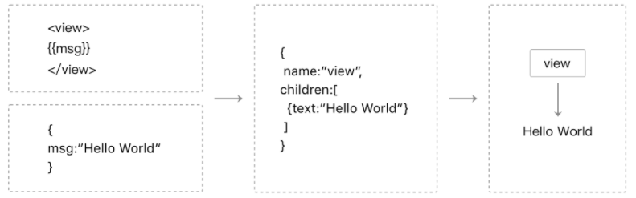

### 小程序

[小程序开发指南](https://developers.weixin.qq.com/ebook?action=get_post_info&docid=0008aeea9a8978ab0086a685851c0a)

1. 小程序的标签有哪些：

> 视图容器(View Container)： view(视图容器)、scroll-view（可滚动视图容器）、swiper（可滑动的视图容器）基础内容(Basic Content)：icon(图标) text(文字) progress(进度条) 表单组件(Form)：button(按钮) form(表单) input(输入框) checkbox(多项选择器) radio(单项选择器) picker(列表选择器) slider(滑动选择器) switch(开关选择器) 操作反馈组件(Interaction)：action-sheet(上拉菜单) modal(模态弹窗) progress(进度条) toast 通知导航(Navigation)：navigator 应用内跳转多媒体(Media)：audio 音频 image 图片 video 视频地图(Map) 画布(Canvas)

2. WXSS 样式 和 CSS 的异同点

WXSS 与 Web 开发中的 CSS 类似。为了更适合小程序开发，WXSS 对 CSS 做了一些补充以及修改。

- 项目公共样式：根目录中的 app.wxss 为项目公共样式，它会被注入到小程序的每个页面。
- 页面样式：与 app.json 注册过的页面同名且位置同级的 WXSS 文件。
- 尺寸单位： rpx
- 引用样式： `@import './test_0.wxss'`
- WXSS 内联样式与 Web 开发一致
- 选择器: . # 元素 伪类
- 官方样式库（WeUI.wxss）

3. 理解小程序的宿主环境（小程序的页面和 js 怎么通信的）

> WXML 和 WXSS 工作在渲染层，js 工作在逻辑层

**通信模型：**

> 小程序的渲染层和逻辑层分别由 2 个线程管理：渲染层的界面使用了 WebView 进行渲染；逻辑层采用 JsCore 线程运行 JS 脚本。一个小程序存在多个界面，所以渲染层存在多个 WebView 线程，这两个线程的通信会经由微信客户端（做中转，逻辑层发送网络请求也经由 Native 转发。

WXML 可以先转成 JS 对象，然后再渲染出真正的 Dom 树：

**双线程下的界面渲染：**

小程序的逻辑层和渲染层是分开的两个线程。==在渲染层，宿主环境会把 WXML 转化成对应的 JS 对象，在逻辑层发生数据变更的时候，我们需要通过宿主环境提供的 setData 方法把数据从逻辑层传递到渲染层，再经过对比前后差异，把差异应用在原来的 Dom 树上，渲染出正确的 UI 界面。==

4. 基本布局方法是什么？

`flex`布局

5. 小程序为什么采用双线程模型（天生的异步）？

得益于客户端系统有 JavaScript 的解释引擎（在 iOS 下是用内置的 JavaScriptCore 框架，在安卓则是用腾讯 x5 内核提供的 JsCore 环境），我们可以创建一个单独的线程去执行 JavaScript，在这个环境下执行的都是有关小程序业务逻辑的代码，也就是我们前面一直提到的逻辑层。而界面渲染相关的任务全都在 WebView 线程里执行，通过逻辑层代码去控制渲染哪些界面，那么这一层当然就是所谓的渲染层。这就是小程序双线程模型的由来。

6. [Exparser 框架是怎么样的？](https://developers.weixin.qq.com/ebook?action=get_post_info&docid=0000aac998c9b09b00863377251c0a)

相当于一个简化版的 Shadow DOM 实现：

- 基于 Shadow DOM 模型：模型上与 WebComponents 的 ShadowDOM 高度相似，但不依赖浏览器的原生支持，也没有其他依赖库；实现时，还针对性地增加了其他 API 以支持小程序组件编程。
- 可在纯 JS 环境中运行：这意味着逻辑层也具有一定的组件树组织能力。
- 高效轻量：性能表现好，在组件实例极多的环境下表现尤其优异，同时代码尺寸也较小。

7. 自定义组件运行原理？

小程序通过`Compontents`构造器，在小程序启动时，构造器为开发者设置了 properties、data、methods 等定义段，然后写入 Exparser 的组件注册表中。当这个组件被引用时，就可以根据注册表信息来创建自定义组件的实例。

初始化页面时，Exparser 会创建出页面跟组件的一个实例，用到的其他组件也会响应创建组价实例，组件创建实例的过程大致有以下几个要点：

- 根据组件注册信息，从组件原型上创建出组件节点的 JS 对象，即组件的 this；
- 将组件注册信息中的 data 复制一份，作为组件数据，即 this.data；
- 将这份数据结合组件 WXML，据此创建出 Shadow Tree，由于 Shadow Tree 中可能引用有其他组件，因而这会递归触发其他组件创建过程；
- 将 ShadowTree 拼接到 Composed Tree 上，并生成一些缓存数据用于优化组件更新性能；
- 触发组件的 created 生命周期函数；
- 如果不是页面根组件，需要根据组件节点上的属性定义，来设置组件的属性值；
- 当组件实例被展示在页面上时，触发组件的 attached 生命周期函数，如果 Shadw Tree 中有其他组件，也逐个触发它们的生命周期函数。

8. 组件间通信？

WXML 属性值传递、事件系统、selectComponent 和 relations 等方式

9. 原生组件的运行机制？

几个步聚：创建 =》 插入到 DOM 树 =》 客户端插入原生区域 =》 相应的调整

- 组件被创建，包括组件属性会依次赋值。
- 组件被插入到 DOM 树里，浏览器内核会立即计算布局，此时我们可以读取出组件相对页面的位置（x, y 坐标）、宽高。
- 组件通知客户端，客户端在相同的位置上，根据宽高插入一块原生区域，之后客户端就在这块区域渲染界面
- 当位置或宽高发生变化时，组件会通知客户端做相应的调整

10. 小程序和客户端通信原理？

视图层与客户端的交互通信。这层通信机制在 iOS 和安卓系统的实现方式并不一样：

- iOS 是利用了 WKWebView 的提供 messageHandlers 特性
- 而在安卓则是往 WebView 的 window 对象注入一个原生方法，最终会封装成 WeiXinJSBridge 这样一个兼容层，主要提供了调用（invoke）和监听（on）这两种方法

逻辑层与客户端原生通信机制与渲染层类似：不同在于，

- iOS 平台可以往 JavaScripCore 框架注入一个全局的原生方法
- 而安卓方面则是跟渲染层一致的。

11. 性能优化

- 分包加载
- [页面层级准备](https://developers.weixin.qq.com/ebook?action=get_post_info&docid=000a64a29c48b0eb0086f161b5940a)
- 不要过于频繁调用 setData
- 数据通信的性能与数据量正相关，因而如果有一些数据字段不在界面中展示且数据结构比较复杂或包含长字符串，则不应使用 setData 来设置这些数据；
- 与界面渲染无关的数据最好不要设置在 data 中，可以考虑设置在 page 对象的其他字段下
- 去掉不必要的事件绑定
- 事件绑定时需要传输 target 和 currentTarget 的 dataset，因而不要在节点的 data 前缀属性中放置过大的数据
- 减少 WXML 中节点的数量可以有效降低初始渲染和重渲染的时间开销，提升渲染性能。
- 重渲染，去掉不必要设置的数据、减少 setData 的数据量也有助于提升这一个步骤的性能。

_在 setData 的数据通信流程中，数据从逻辑层经过 native 层转发，传入视图层的 WebView，再经过一系列渲染步骤之后传入组件。而使用 context 时，数据从逻辑层传到 native 层后，直接传入组件中，这样可以显著降低传输延迟。_
