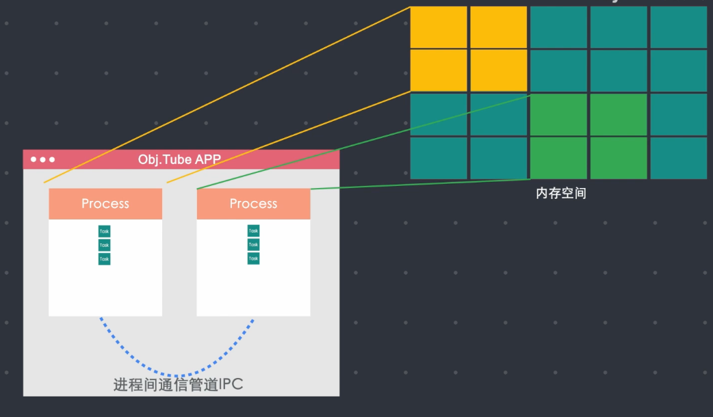
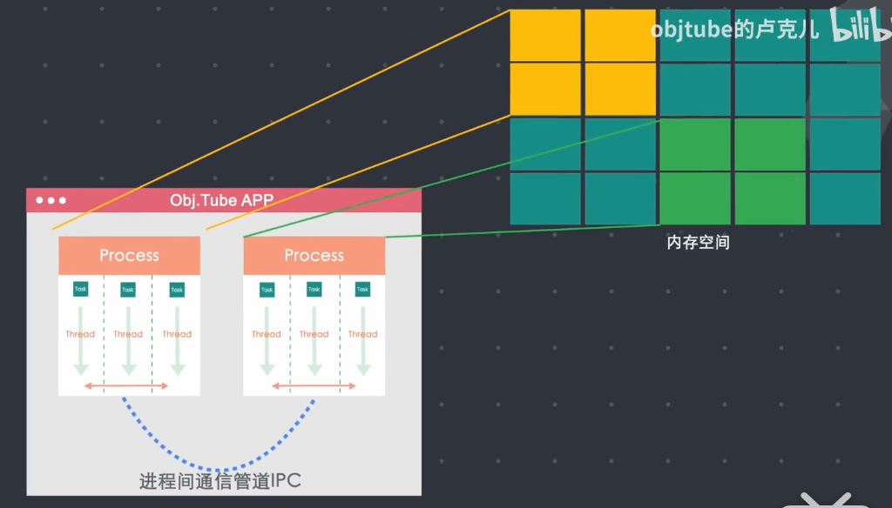
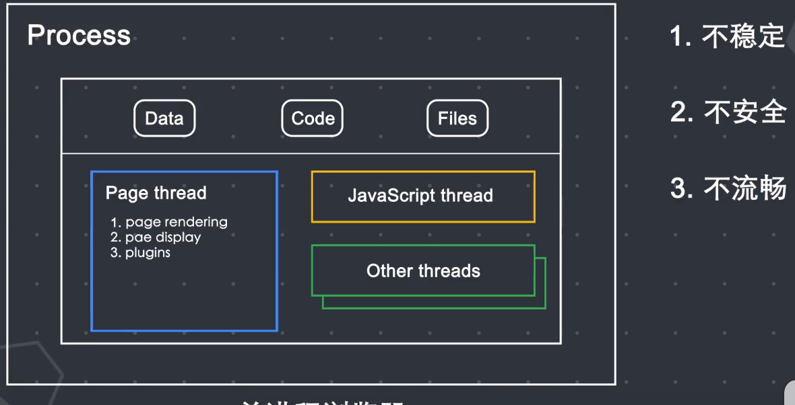
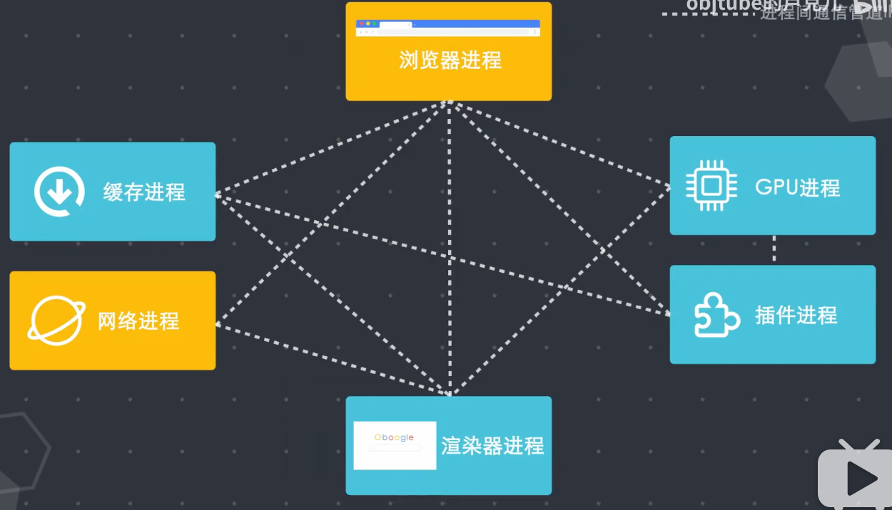
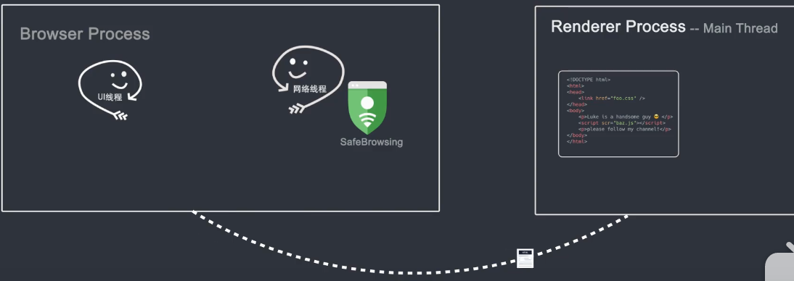
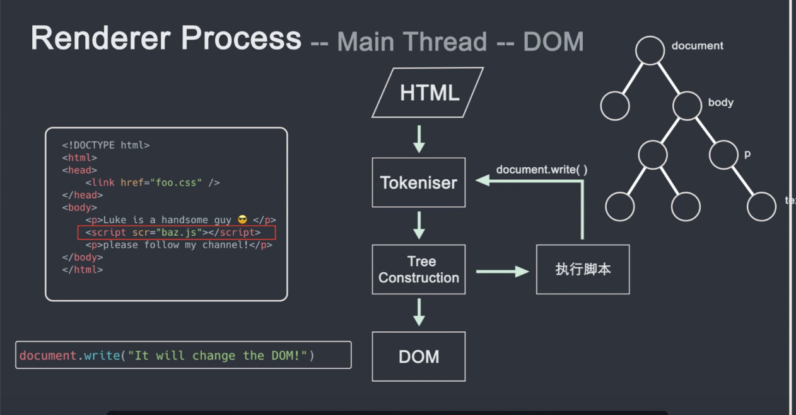
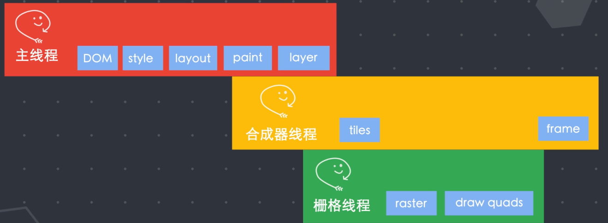

# 浏览器是如何运作的

**完全解读：[浏览器是如何运作的](https://www.bilibili.com/video/BV1x54y1B7RE)**

## 进程和线程

进程：进程是操作系统进行资源分配和调度的基本单元，可以申请和拥有计算器资源，进程是程序的基本执行实体。

线程：线程是操作系统能够进行运算调度的最小单元，一个进程中可以并发多个线程，每条线程并行执行不同的任务。

当我们启动某个程序时，就会创建进程来执行任务代码，同时会为该进程分配任务空间，该应用程序的状态都保存在内存空间里。

当应用关闭时，该内存空间就会被回收，进程可以启动更多的进程来执行任务， 由于每一个进程分配的内存空间是独立的，如果 2 个进程之间需要传递某些数据，则需要进程之间的通信管道 IPC 来传递，很多应用程序都是多进程的结构，这样是为了避免某一个进程卡死，由于进程间的相互独立，这样不用影响到整个应用程序。

举个例子：

你可以把笔记本电脑想象成一个应用程序，外接鼠标是该应用程序的一个进程，如果外接鼠标出了问题，并不会影响到你继续使用笔记本。

进程可以将任务分成更多细小的任务，然后通过创建多个线程并行执行不同的任务，同一进程下的线程之间是可以直接通信数据共享的。

## 浏览器多进程结构

浏览器也是一个多进程结构， 但是早期的浏览器是单进程的：

`chrome`浏览器：

- 浏览器进程：负责控制 chrome 浏览器除标签页外的用户界面，包括地址栏、书签、后退和前进按钮等，以及负责与浏览器的其他进程的协调工作。
- 网络进程：负责发起网络请求。
- GPU 进程：负责整个浏览器界面的渲染。
- 插件进程：主要负责控制网站使用的所有插件，例如 flash，这里的插件不是指 chrome 市场安装的插件。
- 渲染器进程：负责控制显示 Tab 标签内的所用内容，浏览器在默认情况下都会为每一个标签页创建一个进程（这里可能是因为启动 chrome 时选择的进程模型有关）

[在 chromium 官方文档中说明](https://www.chromium.org/developers/design-documents/process-models)，chrome 共有 4 中模型，分别是

1. 默认的 process-per-site-instance

- 默认情况下，Chromium 为用户访问的网站的每个实例创建一个渲染器进程。 这样可以确保来自不同站点的页面是独立呈现的，并且对同一站点的单独访问也可以彼此隔离。（简单来说就是访问不同站点和同一站点的不同页面都会创建新的进程） 因此，一个网站实例中的故障（例如渲染器崩溃）或大量资源使用不会影响浏览器的其余部分。 该模型既基于内容的来源，也基于彼此可能编写脚本的选项卡之间的关系。 结果，两个选项卡可能会显示在同一过程中呈现的页面，而导航到给定选项卡中的跨站点页面可能会切换该选项卡的呈现过程。

2. Process-per-site（同一站点使用同一进程）

- Chromium 还支持一种流程模型，该流程模型将不同的站点彼此隔离，但是将同一站点的所有实例组合到同一流程中。 要使用此模型，用户应在启动 Chromium 时指定--process-per-site 命令行开关。 这将创建更少的渲染器进程，以牺牲一些健壮性来降低内存开销。 此模型基于内容的来源，而不是选项卡之间的关系。

3. Process-per-tab（同一 Tab 使用同一进程）
4. Single process（浏览器引擎和渲染引擎共用一个进程）

Q: 当你在地址栏输入地址时，浏览器内部执行了什么操作？

A: 当你在地址栏输入地址时，浏览器进程的 UI 线程会捕捉你的输入内容，如果访问的是网址，则 UI 线程会启动一个网络线程来请求 DNS 进行域名解析；接着链接服务器获取数据，如果你的输入不是网址，而是一个关键词，浏览器就知道你要搜索，浏览器就会使用默认配置的搜索引擎来查询。

Q: 网络线程获取到数据之后会发生什么样的事情？

当网络线程获取到数据后，会通过 SafeBrowsing 来检查站点是否是恶意站点，如果是则会展示一个警告页面，告诉你这个站点有安全问题，浏览器会阻止你访问， 当然你也可以强行继续访问，SafeBrowsing 是谷歌内部的一个安全系统，通过检测该站点数据来判断是否安全，比如通过查看站点的 IP 是否在谷歌的黑名单之内；当访问数据准备完毕，并且安全校验通过时，网络线程通知 UI 线程我准备好了，

然后 UI 线程就会创建一个渲染器进程（Renderer Thread ）来渲染页面，浏览器进程通过 IPC 管道将数据传递给渲染器进程，正式进入渲染流程，渲染器进程接收到的数据也就是 HTML，渲染器进程的核心任务就是把 html、css、js、image 等资源渲染成用户可以交互的 web 页面。渲染器进程的主进程将 HTML 进行解析，构造 DOM 数据结构，DOM 也就是文档对象模型，是浏览器对页面在其内部的表现形式，是 web 开发程序员可以通过 js 与之间交互的数据结构和 api ，html 首先进过 tokeniser 标记化，通过词法分析将输入的 html 内容，解析成多个标记，根据识别后的标记进行 DOM 树的构造，在 DOM 树构建过程中会创建 document 对象，然后以 document 为根节点的 DOM 树不断进行修改，向其中添加各种元素；html 代码中往往会引入一些额外的资源，比如图片，css 和 js 脚本等，图片和 css 这些资源需要通过网络下载或者从缓存中直接加载，这些资源不会阻塞 html 的解析，因为他们不会影响 DOM 的生成，但当 HTML 解析过程中遇到 script 标签时，就停止 html 解析流程，转而去加载解析并执行 js（你可能就会问了？为什么不直接跳过 js 的加载和执行，等 html 解析后，再加载运行 js 呢？这是因为浏览器并不知道 js 执行是否会改变当前页面的 HTML 结构，如果 js 代码里调用了 document.write 方法来修改 html，之前的 html 解析就没有意义了。这也就是说我们为什么要把 script 标签放在合适的位置，或者使用 async 和 defer 属性来异步加载执行 js。）

在 HTML 解析完成后，我们就会获得一个 DOM Tree，但是我们还不知道 DOM Tree 上的每个节点应该长什么样子，主线程需要解析 CSS 需要确定每个 DOM 节点的计算样式，即使你没有提供自定义的 CSS 样式，浏览器也会有自己默认的样式表（比如 h2 的字体要比 h3 的字体要大）；在知道每个 DOM 结构和每个节点的样式后，接下来我们需要知道每个节点放在页面上的那个位置，也就是说节点的坐标以及该节点需要占用多大的区域，这个阶段被称为 layout 布局，主线程通过遍历 dom 和计算好的样式来生成 layout tree，Layout tree 上的每个节点都记录了 x,y 坐标和边框尺寸，这里需要注意的一点是 DOM tree 和 Layout tree 并不是一一对应的，设置了`display: none;`的节点并不会出现在 Layout tree 上；而在 before 伪类中添加了 content 值的元素，content 里的内容会出现在 Layout tree 上，不会出现在 DOM tree 里，这是因为 DOM 是通过 html 解析获得，并不关心样式，而 layout tree 是根据 DOM 和计算好的样式来生成的，Layout tree 和最后展示在屏幕上的节点是对应的。

 好了，现在我们知道了元素的大小形状和位置，这还不够，我们还需要来做什么呢？对了，我们还需要知道以什么样的顺序来绘制（paint）这个节点；举个例子来说，`z-index`这个属性会影响节点的绘制的层级关系，如果我们按照 dom 的层级结构来绘制页面，则会导致错误的渲染，所以为了保证在屏幕上展示正确的层级，主线程遍历 layout tree 创建一个绘制记录表（paint record），改表记录了绘制的顺序，这个阶段被称为绘制；现在知道了文档的绘制顺序，终于到了该把这些信息转化为像素点展示在屏幕上的时候了，这种行为被称为栅格化（rastering）。Chrome 最早使用了一种很简单的方式，只栅格化用户可视区域（viewport）的内容，当用户滚动页面时，再栅格化更多的内容来填充缺失的部分，这种方式带来的问题显而易见，会导致展示延迟，随着不断的优化升级，现在的 Chrome 使用了一种更为复杂的栅格化流程，叫做合成（Composting），合成是一种将网页各个部分分成多个图层，分别对其进行栅格化，并在合成器线程（Compositor Thread）中单独进行合成页面的技术。简单来说就是页面的所有元素按照某种规则进行分图层，并把图层都栅格化好了，然后只需要把可视区的内容组合成一帧展示给用户即可。主线程遍历 Layout Tree 生成 Layer Tree，当 Layer Tree 生成完毕和绘制顺序确定后，主线程将这些信息传递给合成器线程，合成器线程将每个图层栅格化，由于一层可能像页面的整个长度一样大，因此合成器线程将它们切分成许多图块（tiles），然后将每个图块发送给栅格化线程（Raster Thread），栅格线程栅格化每个图块，并将它们储存在 GPU 内存中，当图块栅格化完成后，合成器线程将收集成为“draw quads”的图块信息，这些信息记录了图块在内存中的位置和在页面的那个位置绘制图块的信息，根据这些信息合成器线程生成了一个合成器帧（Compositor Frame），然后这个合成器帧（Frame）通过 IPC 管道传递给浏览器进程，接着浏览器进程将合成器帧传送到 GPU，然后 GPU 渲染展示到屏幕上，这时候恭喜你，你终于看到了页面上的内容。

当你的页面发生变化，比如你滚动了当前页面，都会生成一个新的合成器帧，新的帧再传递给 GPU，然后再次渲染到屏幕上。

### 小结

1. 浏览器进程中的网络线程获取到 html 数据，
2. 通过 IPC 将数据传给渲染器进程的主线程，
3. 主线程将 html 解析构造成 DOM Tree，然后进行样式计算，
4. 根据 DOM Tree 和生成好的样式生成 Layout Tree，通过便遍历 Layout Tree 生成绘制顺序表，
5. 接着遍历 Layout Tree 生成 Layer Tree，
6. 然后主线程将 Layer Tree 和绘制信息一起传递给合成器线程，
7. 合成器线程按照规则进行分图层，并把图层分为更小的图块（tiles）传给栅格线程进行栅格化，
8. 栅格化完成以后，合成器线程会获得栅格线程传递过来的“draw quals”图块信息，
9. 根据这些信息，合成器线程上合成了一个合成器帧，然后将该合成旗帧通过 IPC 管道传回给浏览器进程，
10. 浏览器进程在传递到 GPU 进行渲染，之后就展示到屏幕上。

当我们改变一个元素的尺寸位置属性时，会重新进行样式计算（Computed Style）、布局（Layout）、绘制（paint）以及后面的所有流程，这种行为我们成为重排。

当我们改变某个元素的颜色属性时，不会重新出发布局，但还是会触发样式计算和绘制，这个就是重绘。

我们可以发现，重排和重绘都会触发主线程，还有另外一个东西运行在主线程上，那就是 js，既然他们都运行在主线程上，就会出现抢占执行时间的问题，如果你写了一个不断导致重排重绘的动画，浏览器需要在每一帧都运行样式，计算布局和绘制的操作。我们知道当页面以每秒 60 帧的刷新率（也就是每秒 16 帧）时，才不会让用户感觉到页面卡顿，如果你在运行动画时有大量的 js 任务需要执行，因为布局、绘制和 js 执行都是在主线程运行的，当在一帧的时间内布局和绘制结束后，如果还有剩余时间，js 就会拿到主线程的使用权，如果 js 的执行时间过长，就会导致在下一帧开始时，js 没有及时归还主线程，导致下一帧没有按时渲染，就会出现页面动画的卡顿，有什么优化的手段呢？

1. 通过 requestAnimationFrame() 这个 api 来解决问题，这个方法会在每一帧调用，通过 api 回调，然后我们可以吧 js 运行任务分成一些更小的任务块（分到每一帧），在每一帧时间用完钱暂停 js 执行，归还主线程，这样的话在下一帧开始时，主线程就可以按时执行布局和绘制。React 最新的渲染引擎 React Fiber 就是用到这 api 来做了很多优化。
2. 通过刚才的流程图我们知道，栅格化的整个流程是不占用主线程的，只在合成器线程和栅格线程中运行，这就意味着它无需和 js 抢夺主线程，我们刚才提到如果反复进行重排和重绘，可能会导致掉帧，这是因为有可能 js 执行阻塞了主线程，而 CSS 中有一个动画属性`trasform`，通过该属性实现的动画不会经过布局和绘制，而是直接运行在合成器线程和栅格线程中，所以不会受到主线程中 js 的执行的影响，更重要的是，通过 trasform 实现的动画由于不经过布局绘制样式计算等操作，所以节省了很多运算时间（方便实现负责的动画）。

我们常常会使用那些手续来实现动画效果呢？

位置变化、宽高变化（旋转、3D）等
