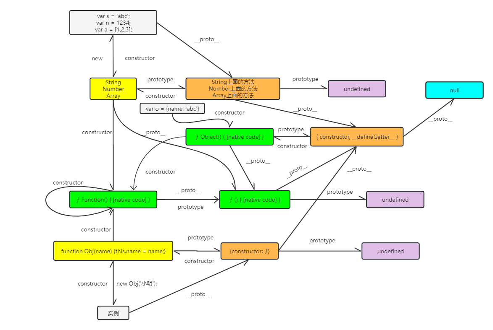

# 原型和继承

## 原型链

JavaScript 的语言设计主要受到了 Self（基于原型的编程语言）和 Scheme（函数式编程语言）的影响。JavaScript 的原型机制决定了 JavaScript 以克隆的方式来创建对象，这是跟类机制面向对象语言最核心的区别。

- `instanceof` ：运算符用于检测构造函数的 `prototype` 属性是否出现在某个实例对象的原型链上。
- `prototype` ：自定义构造函数 和 内置函数都会存在 `prototype` 属性，指向一些内置方法或者自定义方法
- `constructor` ：每一个实例（构造函数生成） 或 对象（字面量生成）都存在 `constructor` 属性，指向它的构造函数或者`Object {}`
- `__proto__` ：每一个实例（构造函数生成） 或 对象（字面量生成）都存在`__proto__` 属性，指向它的构造函数或者`Object {}`的 `prototype` 属性

### 创建对象的三种方式

- 构造函数创建对象

```js
function Obj(name, age) {
  this.name = name;
  this.age = age;
}
Obj.prototype.sayHi = function () {
  alert(this.name);
};
var dx1 = new Obj('Jack', 18);
console.log('Obj.prototype：', Obj.prototype); // 指向构造函数的原型
console.log('dx1.constructor：', dx1.constructor); // 指向实例的构造函数
console.log('dx1.__proto__：', dx1.__proto__); // 指向实例对应构造函数的原型
console.log('Obj.prototype.__proto__：', Obj.prototype.__proto__); // Object {}
console.log('Obj.prototype.__proto__.__proto__：', Obj.prototype.__proto__.__proto__); // null
```

- 字面量创建对象

```js
var dx2 = {
  name: 'Jack',
  age: 17
};
console.log('dx2.constructor：', dx2.constructor); // ƒ Object() { [native code] }
console.log('dx2.__proto__：', dx2.__proto__); // {constructor: ƒ, __defineGetter__: ...
console.log('dx2.__proto__.__proto__：', dx2.__proto__.__proto__); // null
```

- 系统自带的构造函数构造对象

```js
var dx3 = new Object();
dx3.name = 'Jack';
dx3.age = 18;
console.log('dx3.constructor：', dx3.constructor); // ƒ Object() { [native code] }
console.log('dx3.__proto__：', dx3.__proto__); // {constructor: ƒ, __defineGetter__: ...
console.log('dx3.__proto__.__proto__：', dx3.__proto__.__proto__); // null
```

### 原型链图



## 继承

### 原型链继承

这是 JS 继承最基本的继承方式，通过让子类的原型指向父类的实例来实现继承。

```js
// 父类
function Parent() {
  this.name = '父类的名字';
}

// 父类原型的方法
Parent.prototype.getName = function () {
  return this.name;
};

// 子类
function Child(age) {
  this.age = age;
}

// 将子类的原型指向父类的实例
Child.prototype = new Parent();

// 子类原型上的方法
Child.prototype.getAge = function () {
  return this.age;
};

console.log(Child.prototype.constructor === Parent); // true
console.log(Child.prototype.constructor === Child); // false
// 将子类原型的构造器指向自身，否则将会指向构造函数原型指向的【Parent】
Child.prototype.constructor = Child;

var child = new Child(10);
console.log(child.getName()); // 输出: 父类的名字
console.log(child.getAge()); // 输出: 10
```

优点：

1. 简单易懂，代码量少。
2. 可以实现函数复用，父类的方法可以被子类共享。

缺点：

1. 子类实例共享父类实例的属性（比如父类有一个数组，child1 改变了该数组，child2 也会改变），容易造成属性污染。
2. 无法向父类传递参数。
3. 子类无法通过实例向父类传参。

### 构造函数继承

在子类构造函数中调用父类构造函数，通过 apply 或 call 方法实现属性的继承。

```js
// 父类
function Parent(name) {
  this.name = name;
}

// 父类原型的方法
Parent.prototype.getName = function () {
  return this.name;
};

// 子类
function Child(name, age) {
  // !在子类构造函数中调用父类构造函数，获取父类的属性
  Parent.call(this, name);
  this.age = age;
}

// 子类原型上的方法
Child.prototype.getAge = function () {
  return this.age;
};

var child = new Child('John', 10);
console.log(child.getName()); // TypeError: child.getName is not a function
console.log(child.getAge()); // 输出: 10
```

**优点**：

1. 避免了原型链继承中的属性共享和污染问题。
2. 子类可以向父类传递参数。

**缺点**：

1. 只能继承父类的实例属性和方法，无法继承父类原型链上的属性和方法。
2. 无法实现函数的复用，每次创建子类实例都会重新创建父类的实例。

### 组合继承

结合了原型链继承和构造函数继承，通过调用父类构造函数和设置子类原型为父类实例来实现继承。

```js
// 父类
function Parent(name) {
  this.name = name;
}

// 父类原型的方法
Parent.prototype.getName = function () {
  return this.name;
};

// 子类
function Child(name, age) {
  // 构造函数继承
  Parent.call(this, name);
  this.age = age;
}

// 原型继承
Child.prototype = new Parent();
Child.prototype.constructor = Child;

// 子类原型上的方法
Child.prototype.getAge = function () {
  return this.age;
};

var child = new Child('John', 10);
console.log(child.getName()); // 输出: John
console.log(child.getAge()); // 输出: 10
```

**优点**：

1. 结合了原型链继承和构造函数继承的优点，既可以实现属性共享，又可以避免属性共享和污染问题。
2. 子类可以向父类传递参数。
3. 可以实现函数复用。

**缺点**：

1. 调用两次父类构造函数，存在一定的性能开销。

### 原型式继承

使用一个简单的函数来创建一个对象，这个对象的原型指向另一个对象，实现对象间的继承。

```js
function createObject(obj) {
  function F() {}
  F.prototype = obj;
  return new F();
}

var parent = {
  name: 'Parent',
  getName: function () {
    return this.name;
  }
};

var child = createObject(parent);
console.log(child.getName()); // 输出: Parent
```

**优点**：

1. 简单易懂，类似于对象的浅拷贝。

**缺点**：

1. 所有的实例都会共享原型对象的属性和方法，容易造成属性共享和污染。

### 寄生式继承

在原型式继承的基础上，对对象进行扩展或增强，然后返回扩展后的对象。

```js
function createObject(obj) {
  function F() {}
  F.prototype = obj;
  return new F();
}

function createChild(obj) {
  var child = createObject(obj);
  child.getAge = function () {
    return this.age;
  };
  return child;
}

var parent = {
  name: 'Parent'
};

var child = createChild(parent);
child.age = 10;
console.log(child.getAge()); // 输出: 10
```

**优点**：

1. 在原型式继承的基础上，可以对实例进行扩展或增强，实现了部分属性的复用。

**缺点**：

1. 增加了对象间的耦合性，不利于代码维护。

### 寄生组合式继承

使用构造函数来继承属性，同时通过原型链来继承方法，实现高效的继承。

```js
function inheritPrototype(Child, Parent) {
  var prototype = Object.create(Parent.prototype);
  prototype.constructor = Child;
  Child.prototype = prototype;
}

function Parent(name) {
  this.name = name;
}

Parent.prototype.getName = function () {
  return this.name;
};

function Child(name, age) {
  Parent.call(this, name);
  this.age = age;
}

inheritPrototype(Child, Parent);

Child.prototype.getAge = function () {
  return this.age;
};

var child = new Child('John', 10);
console.log(child.getName()); // 输出: John
console.log(child.getAge()); // 输出: 10
```

**优点**：

1. 组合了构造函数继承和原型链继承的优点，避免了两者的缺点，实现了高效的继承。

**缺点**：

1. 需要额外的函数调用来实现继承，增加了代码复杂度。
