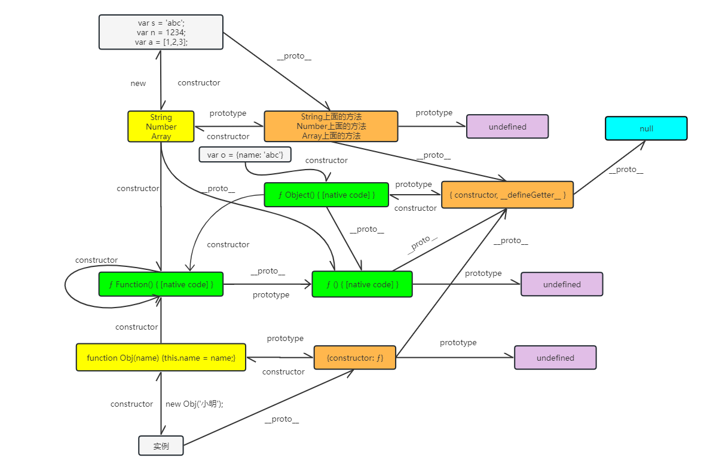

# prototype

JavaScript 的语言设计主要受到了 Self（基于原型的编程语言）和 Scheme（函数式编程语言）的影响
。JavaScript 的原型机制决定了 JavaScript 以克隆的方式来创建对象，这是跟类机制面向对象语言最核心的区
别。

- `instanceof` ：运算符用于检测构造函数的 `prototype` 属性是否出现在某个实例对象的原型链上。
- `prototype` ：自定义构造函数 和 内置函数都会存在 `prototype` 属性，指向一些内置方法或者自定义方法
- `constructor` ：每一个实例（构造函数生成） 或 对象（字面量生成）都存在 `constructor` 属性，指向它
  的构造函数或者`Object {}`
- `__proto__` ：每一个实例（构造函数生成） 或 对象（字面量生成）都存在`__proto__` 属性，指向它的构造
  函数或者`Object {}`的 `prototype` 属性

## 构造函数创建对象

```js
function Obj(name, age) {
  this.name = name;
  this.age = age;
}
Obj.prototype.sayHi = function () {
  alert(this.name);
};
var dx1 = new Obj('Jack', 18);
console.log('Obj.prototype：', Obj.prototype); // 指向构造函数的原型
console.log('dx1.constructor：', dx1.constructor); // 指向实例的构造函数
console.log('dx1.__proto__：', dx1.__proto__); // 指向实例对应构造函数的原型
console.log('Obj.prototype.__proto__：', Obj.prototype.__proto__); // Object {}
console.log('Obj.prototype.__proto__.__proto__：', Obj.prototype.__proto__.__proto__); // null
```

## 字面量创建对象

```js
var dx2 = {
  name: 'Jack',
  age: 17
};
console.log('dx2.constructor：', dx2.constructor); // ƒ Object() { [native code] }
console.log('dx2.__proto__：', dx2.__proto__); // {constructor: ƒ, __defineGetter__: ...
console.log('dx2.__proto__.__proto__：', dx2.__proto__.__proto__); // null
```

## 系统自带的构造函数构造对象

```js
var dx3 = new Object();
dx3.name = 'Jack';
dx3.age = 18;
console.log('dx3.constructor：', dx3.constructor); // ƒ Object() { [native code] }
console.log('dx3.__proto__：', dx3.__proto__); // {constructor: ƒ, __defineGetter__: ...
console.log('dx3.__proto__.__proto__：', dx3.__proto__.__proto__); // null
```

## 原型链图


