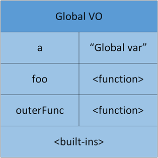
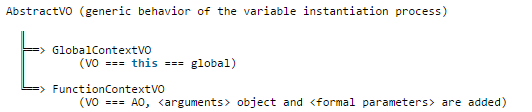
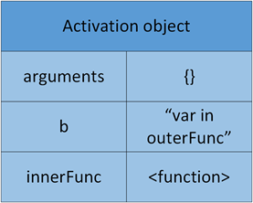
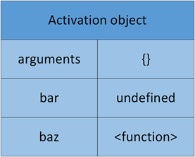

# 执行上下文

- [JavaScript 的执行上下文](https://www.cnblogs.com/wilber2013/p/4909430.html)
- [转：JS 高级学习笔记（8）- JavaScript 执行上下文和执行栈](https://www.cnblogs.com/houfee/p/10756227.html)
- [JavaScript 深入之执行上下文栈](https://mp.weixin.qq.com/s/3fW_OvnyX-uk_9NfbJKcDw)

## 什么是执行上下文（Execution context）

为了表示不同的运行环境，JavaScript 中有一个执行上下文（Execution context，EC）。

简而言之，执行上下文就是当前 JavaScript 代码被解析和执行时所在环境的抽象概念， JavaScript 中运行任何的代码都是在执行上下文中运行。

## 执行上下文的类型

在 JavaScript 中有三种代码运行环境：

- Global Code
  - JavaScript 代码开始运行的默认环境：这是默认的、最基础的执行上下文。不在任何函数中的代码都位于全局执行上下文中。它做了两件事：1. 创建一个全局对象，在浏览器中这个全局对象就是 window 对象。2. 将 this 指针指向这个全局对象。一个程序中只能存在一个全局执行上下文。
- Function Code
  - 代码进入一个 JavaScript 函数：每次调用函数时，都会为该函数创建一个新的执行上下文。每个函数都拥有自己的执行上下文，但是只有在函数被调用的时候才会被创建。一个程序中可以存在任意数量的函数执行上下文。每当一个新的执行上下文被创建，它都会按照特定的顺序执行一系列步骤。
- Eval Code
  - 使用 eval()执行代码：运行在 eval 函数中的代码也获得了自己的执行上下文。

## 执行上下文的生命周期

**创建阶段 → 执行阶段 → 回收阶段**

例如对如下面的 JavaScript 代码：

```js
var a = 'global var';
function foo() {
  console.log(a);
}
function outerFunc() {
  var b = 'var in outerFunc';
  console.log(b);
  function innerFunc() {
    var c = 'var in innerFunc';
    console.log(c);
    foo();
  }
  innerFunc();
}

outerFunc();
```

代码首先进入 Global Execution Context，然后依次进入 outerFunc，innerFunc 和 foo 的执行上下文，执行上下文栈就可以表示为：


对于每个 Execution Context 都有三个重要的属性，**变量对象（Variable object，VO），作用域链（Scope chain）和 this**。

| Execution Context   | content                                       | apply          |
| ------------------- | --------------------------------------------- | -------------- |
| Variable Object(VO) | { vars, function declarations, arguments ...} | 创建变量对象   |
| Scope Chain         | { variable object + all parent scopes }       | 创建作用域链   |
| thisValue           | Context object                                | 确定 this 指向 |

### 1.创建阶段

当函数被调用，但未执行任何其内部代码之前，会做以下三件事：

- 创建变量对象：首先初始化函数的参数 arguments，提升函数声明和变量声明。下文会详细说明。
- 创建作用域链（Scope Chain）：在执行期上下文的创建阶段，作用域链是在变量对象之后创建的。作用域链本身包含变量对象。作用域链用于解析变量。当被要求解析变量时，JavaScript 始终从代码嵌套的最内层开始，如果最内层没有找到变量，就会跳转到上一层父作用域中查找，直到找到该变量。
- 确定 this 指向：包括多种情况，下文会详细说明

在一段 JS 脚本执行之前，要先解析代码（所以说 JS 是解释执行的脚本语言），解析的时候会先创建一个全局执行上下文环境，先把代码中即将执行的变量、函数声明都拿出来。变量先暂时赋值为 undefined，函数则先声明好可使用。这一步做完了，然后再开始正式执行程序。

另外，一个函数在执行之前，也会创建一个函数执行上下文环境，跟全局上下文差不多，**不过函数执行上下文中会多出 this arguments 和函数的参数。**

### 2.执行阶段

执行变量赋值、代码执行

### 3.回收阶段

执行上下文出栈等待虚拟机回收执行上下文

## 变量对象是什么

### 变量对象

**变量对象是与执行上下文相关的数据作用域。**它是一个与上下文相关的特殊对象，其中存储了在上下文中定义的变量和函数声明。也就是说，一般 VO 中会包含以下信息：

- 变量 (var, Variable Declaration);
- 函数声明 (Function Declaration, FD);
- 函数的形参

当 JavaScript 代码运行中，如果试图寻找一个变量的时候，就会首先查找 VO。对于前面例子中的代码，Global Execution Context 中的 VO 就可以表示如下：



**注意，函数表达式和没有用 var 声明的变量不会添加到 Global VO 中**

```js
// function expression, FE
(function bar(){})

// 这种变量是，"全局"的声明方式，只是给Global添加了一个属性，并不在VO中
baz = "property of global object"Ï
```

### 活动对象

**只有全局上下文的变量对象允许通过 VO 的属性名称间接访问**；在函数执行上下文中，VO 是不能直接访问的，此时由活动对象(Activation Object,缩写为 AO)扮演 VO 的角色。**活动对象 是在进入函数上下文时刻被创建的，它通过函数的 arguments 属性初始化。**

**Arguments Objects** 是函数上下文里的活动对象 AO 中的内部对象，它包括下列属性：

1. callee：指向当前函数的引用
2. length： 真正传递的参数的个数
3. properties-indexes：就是函数的参数值(按参数列表从左到右排列)Ï

对于 VO 和 AO 的关系可以理解为，VO 在不同的 Execution Context 中会有不同的表现：当在 Global Execution Context 中，可以直接使用 VO；但是，在函数 Execution Context 中，AO 就会被创建。



当上面的例子开始执行 outerFunc 的时候，就会有一个 outerFunc 的 AO 被创建：



通过上面的介绍，我们现在了解了 VO 和 AO 是什么，以及他们之间的关系了。下面就需要看看 JavaScript 解释器是怎么执行一段代码，以及设置 VO 和 AO 了。

## 细看 Execution Context

当一段 JavaScript 代码执行的时候，JavaScript 解释器会创建 Execution Context，其实这里会有两个阶段：

- 创建阶段（当函数被调用，但是开始执行函数内部代码之前）
  - 创建 Scope chain
  - 创建 VO/AO（variables, functions and arguments）
  - 设置 this 的值
- 激活/代码执行阶段
  - 设置变量的值、函数的引用，然后解释/执行代码

这里想要详细介绍一下"创建 VO/AO"中的一些细节，因为这些内容将直接影响代码运行的行为。

对于"创建 VO/AO"这一步，JavaScript 解释器主要做了下面的事情：

- 根据函数的参数，创建并初始化 arguments object
- 扫描函数内部代码，查找函数声明（Function declaration）
  - 对于所有找到的函数声明，将函数名和函数引用存入 VO/AO 中
  - **如果 VO/AO 中已经有同名的函数，那么就进行覆盖**
- 扫描函数内部代码，查找变量声明（Variable declaration）
  - 对于所有找到的变量声明，将变量名存入 VO/AO 中，并初始化为"undefined"
  - 如果变量名称跟已经声明的形式参数或函数相同，则变量声明不会干扰已经存在的这类属性

看下面的例子：

```js
function foo(i) {
  var a = 'hello';
  var b = function privateB() {};
  function c() {}
}
foo(22);
```

对于上面的代码，在"创建阶段"，可以得到下面的 Execution Context object：

```js
fooExecutionContext = {
    scopeChain: { ... },
    variableObject: {
        arguments: {
            0: 22,
            length: 1
        },
        i: 22,
        c: pointer to function c()
        a: undefined,
        b: undefined
    },
    this: { ... }
}
```

在"激活/代码执行阶段"，Execution Context object 就被更新为：

```js
fooExecutionContext = {
    scopeChain: { ... },
    variableObject: {
        arguments: {
            0: 22,
            length: 1
        },
        i: 22,
        c: pointer to function c()
        a: 'hello',
        b: pointer to function privateB()
    },
    this: { ... }
}
```

### 例子分析

#### Example 1

```js
(function () {
  console.log(bar); // undefined
  console.log(baz); // function
  var bar = 20;
  function baz() {
    console.log('baz');
  }
})();
```

代码解释：匿名函数会首先进入"创建结果"，JavaScript 解释器会创建一个"Function Execution Context"，然后创建 Scope chain，VO/AO 和 this。根据前面的介绍，解释器会扫描函数和变量声明，如下的 AO 会被创建：



#### Example 2

```js
(function () {
  // console.log(bar); // bar is not defined(…)
  console.log(baz); // function ...
  bar = 20;
  console.log(window.bar); // 20
  console.log(bar); // 20
  function baz() {
    console.log('baz');
  }
})();
```

运行这段代码会得到"bar is not defined(…)"错误。当代码执行到"console.log(bar);"的时候，会去 AO 中查找"bar"。但是，根据前面的解释，函数中的"bar"并没有通过 var 关键字声明，所有不会被存放在 AO 中，也就有了这个错误。

#### Example 3

```js
(function () {
  console.log(foo); // undefined
  console.log(bar); // function ...
  console.log(baz); // function ...
  var foo = function () {};
  function bar() {
    console.log('bar');
  }
  var bar = 20;
  console.log(bar); // 20
  function baz() {
    console.log('baz');
  }
})();
```

其实也很好解释，回到前面对"创建 VO/AO"的介绍，在创建 VO/AO 过程中，解释器会先扫描函数声明，然后`foo: <function>`就被保存在了 AO 中；但解释器扫描变量声明的时候，虽然发现"var bar = 20;"，但是因为"foo"在 AO 中已经存在，所以就没有任何操作了。
