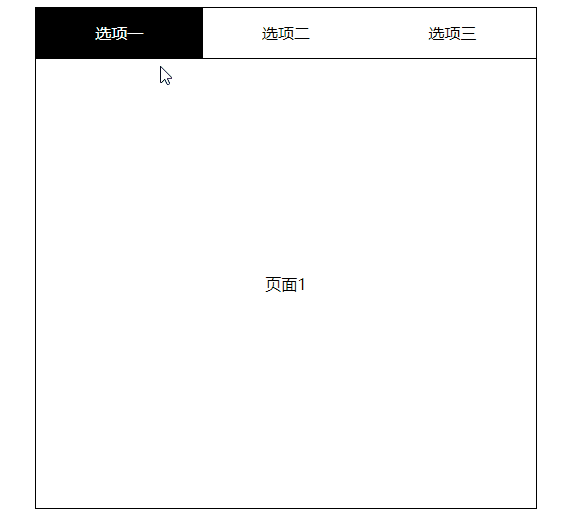

# 立即执行函数

## 介绍

`Immediately Invoked Function Expression`

```js
(function test(a, b, c, d) {
  /**
   * 1. 可以创建一个与外界没有任何关系的作用域，独立作用域
   * 2. 执行完立即销毁
   * ES3 ES5 没有模块的概念，立即执行函数来模拟模块化
   * 向外部抛出一系列属性和方法
   * window上保存的属性和方法
   */
  console.log(test);
  console.log(test.length);
  console.log(arguments.length);
  console.log('hello');
})(1, 2, 3);

// test() // 报错 —— 外部无法得到这个函数
```

## Tab 案例

```html
<!-- index.html -->
<!DOCTYPE html>
<html lang="en">
  <head>
    <meta charset="UTF-8" />
    <meta
      http-equiv="X-UA-Compatible"
      content="IE=edge"
    />
    <meta
      name="viewport"
      content="width=device-width, initial-scale=1.0"
    />
    <title>Document</title>
    <style>
      #my-tab {
        width: 500px;
        height: 500px;
        border: 1px solid #000;
        margin: 50px auto;
      }
      .tab-wrapper {
        height: 50px;
        border-bottom: 1px solid #000;
      }
      .tab-item {
        float: left;
        width: 33.33%;
        height: 50px;
        text-align: center;
        line-height: 50px;
      }
      .tab-item.current {
        background-color: #000;
        color: #fff;
      }
      .page-wrapper {
        position: relative;
        height: 450px;
      }
      .page-item {
        display: none;
        position: absolute;
        top: 0;
        left: 0;
        width: 100%;
        height: 450px;
        text-align: center;
        line-height: 450px;
      }
      .page-item.current {
        display: block;
      }
    </style>
  </head>
  <body>
    <div
      id="my-tab"
      data-type='[
   {
     "tab": "选项一",
     "page": "页面1"
   },
   {
     "tab": "选项二",
     "page": "页面2"
   },
   {
     "tab": "选项三",
     "page": "页面3"
   }
  ]'
    ></div>
    <script src="./utils.js"></script>
    <script src="./tpl.js"></script>
    <script src="./index.js"></script>
    <script>
      new MyTab('#my-tab');
    </script>
  </body>
</html>
```

```js
// utils.js
var tools = (function () {
  function tplReplace(tpl, replaceObj) {
    return tpl.replace(/\{\{(.*?)\}\}/g, function (node, key) {
      return replaceObj[key.trim()];
    });
  }
  return {
    tplReplace: tplReplace
  };
})();
```

```js
// tpl.js
var tpl = (function () {
  function tab(field) {
    switch (field) {
      case 'tab':
        return `<div class="tab-item {{ current }}">{{ tab }}</div>`;
      case 'page':
        return `<div class="page-item {{ current }}">{{ page }}</div>`;
      default:
        break;
    }
  }
  return {
    tab: tab
  };
})();
```

```js
// index.js
(function (doc, tpl, tools) {
  // 定义MyTabl方法
  function MyTab(el) {
    // 获取元素
    this.el = doc.querySelector(el);
    // 获取元素数组
    this.data = JSON.parse(this.el.getAttribute('data-type'));
    // 设置默认展示第一个
    this._index = 0;
    // 初始化方法
    this.init();
  }
  MyTab.prototype.init = function () {
    // 渲染页面
    this._render();
    // 绑定方法
    this._bindEvent();
  };
  // 渲染页面
  MyTab.prototype._render = function () {
    // 创建 tab 元素
    var tabWrapper = doc.createElement('div');
    // 创建 page 元素
    var pageWrapper = doc.createElement('div');
    // 为了避免多次将节点插入document，采用 Fragment
    var oFrag = doc.createDocumentFragment();
    // 定义默认类名
    tabWrapper.className = 'tab-wrapper';
    pageWrapper.className = 'page-wrapper';
    // 遍历标签data
    this.data.forEach(function (item, index) {
      // 将 模板内的元素，替换为 this.data 的数据
      tabWrapper.innerHTML += tools.tplReplace(tpl.tab('tab'), {
        tab: item.tab,
        current: !index ? 'current' : ''
      });
      pageWrapper.innerHTML += tools.tplReplace(tpl.tab('page'), {
        page: item.page,
        current: !index ? 'current' : ''
      });
    });
    // 将 html 代码片段添加到 fragment
    oFrag.appendChild(tabWrapper);
    oFrag.appendChild(pageWrapper);
    // 将 fragment 挂载到页面上
    this.el.appendChild(oFrag);
  };
  // 为每一个 tab 绑定方法
  MyTab.prototype._bindEvent = function () {
    // 获取 tab 和 page 的所有元素
    var doms = {
      oTabItems: doc.querySelectorAll('.tab-item'),
      oPageItems: doc.querySelectorAll('.page-item')
    };
    // 绑定点击事件 注意: 此时bind后的 this 是指向当前的el元素
    this.el.addEventListener('click', this._handlerTabClick.bind(this, doms));
  };
  MyTab.prototype._handlerTabClick = function () {
    // 获取 tab/page 所有元素、点击的元素、以及点击元素的类名
    var _doms = arguments[0],
      tar = arguments[1].target,
      className = tar.className.trim();
    // 判断点击元素，如果没有 current 类名，则更新视图
    if (className === 'tab-item') {
      // 给原来激活的元素重置类名
      _doms.oTabItems[this._index].className = 'tab-item';
      _doms.oPageItems[this._index].className = 'page-item';
      // 获取最新激活的元素索引
      this._index = [].indexOf.call(_doms.oTabItems, tar);
      // 给点击的tab元素添加 current 类
      tar.className += ' current';
      // 给点击的tab对应的 page 添加 current 类
      _doms.oPageItems[this._index].className += ' current';
    }
  };
  window.MyTab = MyTab;
})(document, tpl, tools);
```


