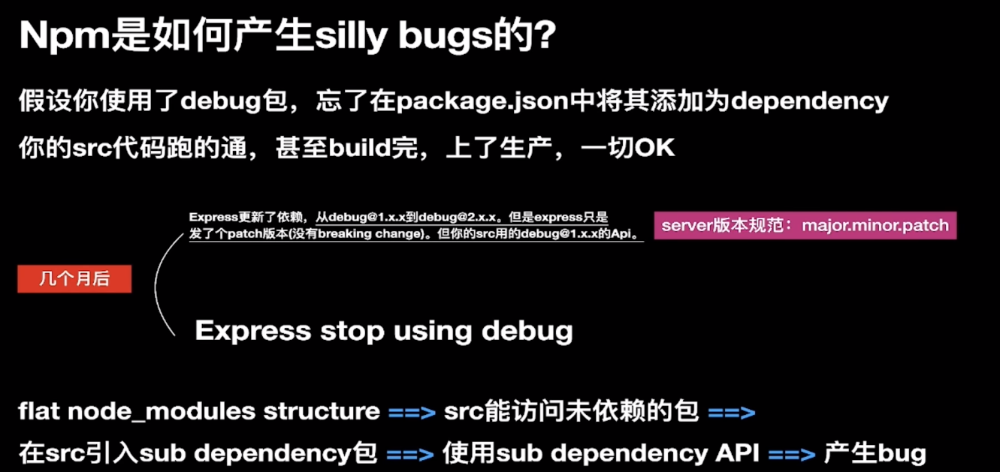
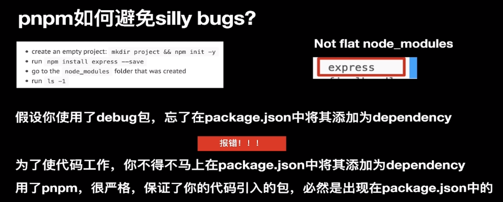
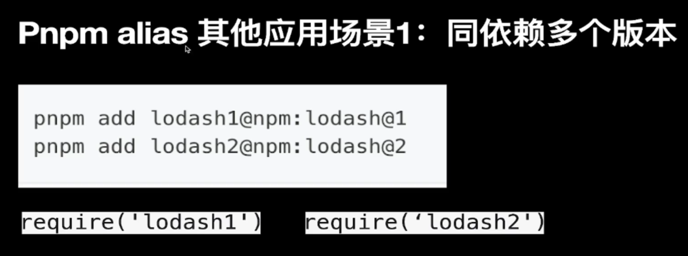
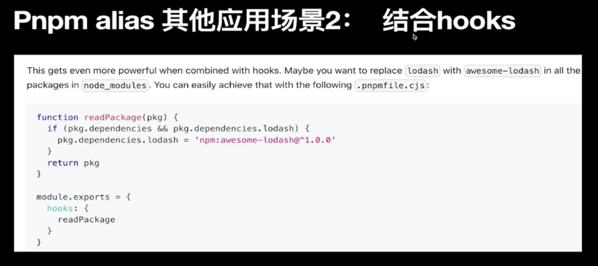

# 为什么要使用 pnpm

## npm@3 之前

```bash
node_modules
└─ foo
   ├─ index.js
   ├─ package.json
   └─ node_modules
      └─ bar
         ├─ index.js
         └─ package.json
```

这种方法有两个严重的问题：

- 软件包经常创建太深的依赖树，这会导致Windows上的长目录路径问题。
- 当需要在不同的依赖关系中复制粘贴时，软件包会被多次复制粘贴

## npm@3 之后和 Yarn

npm@3 采用了扁平依赖关系树来解决这个问题。Yarn 和 npm@3 处理基本上是一致的。

扁平的依赖树带来了一系列问题：

- 模块可以访问它们不依赖的包。
- 压平依赖树的算法非常复杂。
- 一些包必须复制到一个项目的node_modules中文件夹才能生效。

## pnpm 是怎么解决问题的

与 npm@3 不同，pnpm 试图解决 npm@2 所具有的问题，而不是将依赖关系树展平。 在由 pnpm 创建的 node_modules 文件夹中，所有的软件包都有自己的依赖关系，但是目录树永远不会像 npm@2 那么深。 pnpm 保持所有依赖关系平坦，但使用符号链接将它们组合在一起。

```bash
-> - a symlink (or junction on Windows)
 
node_modules
├─ foo -> .registry.npmjs.org/foo/1.0.0/node_modules/foo
└─ .registry.npmjs.org
   ├─ foo/1.0.0/node_modules
   |  ├─ bar -> ../../bar/2.0.0/node_modules/bar
   |  └─ foo
   |     ├─ index.js
   |     └─ package.json
   └─ bar/2.0.0/node_modules
      └─ bar
         ├─ index.js
         └─ package.json
```

## pnpm 避免产生愚蠢的bug

### npm 是如何产生 silly bugs 的？

```bash
mkdir test
cd test
npm init -y
npm install expree -S
# 此时在 node_modules 下会有 debug 文件夹
```





## pnpm alias






## npm create 是怎么执行的

 `npm create vite` 等同于，npm v6 之后，create 是 init 的别名`npm init vite`.

### npm create

抽象地讲`npm create <initializer>`过程:

1. 先去找`create-initializer`包;
2. 执行`npm exec create-initializer`命令;
3. 执行`create-initializer`里的`create-initializer`脚本(由bin指定)。

具体地讲`npm create vite`过程

1. 先去找`create-vite`包;
2. 执行`npm exec create-vite`命令;
3. 执行`create-vite`包里的`create-vite`脚本(由bin指定)