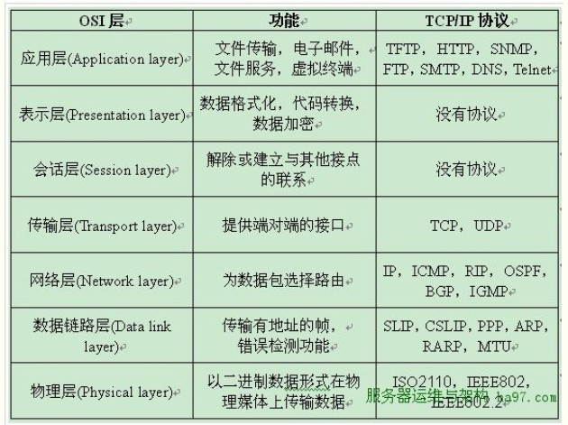
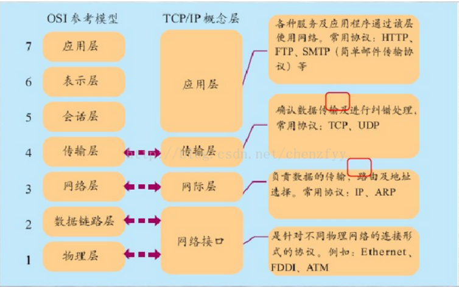

# 计算机网络通信

重要参考：[网络基础之网络协议篇](https://www.cnblogs.com/linhaifeng/articles/5937962.html)

[网络数据传输的原理，理解各站点间数据是如何传输的](https://blog.csdn.net/chenzfyy/article/details/53535341)

## 引子

​ 每一台计算机都是一个独立的单元，你可以在你的计算机上完成一系列操作，比如打字，听音乐，玩纸牌。如果你想要通过计算机和远在西藏的朋友聊天，开视频。这样两台计算机之间通信需要基于一种协议，来实现你们的需求，这就和打电话之间的通信是一样——假设这个通信标准是普通话；那么你和在美国的朋友聊天开视频，也要遵循一个通讯标准——英语。

​ 问题是实现不同地点的通讯，有不同的标准，那么为了统一，所以大家就制定了统一的标准：英语。

​ `Internet`实际上就是统一的标准，称为互联网协议（Internet Protocol Suite）。

​ 互联网协议的功能：定义计算机如何接入`Internet`，以及接入`interne`t 的计算机通信的标准。

互联网协议按照功能不同分为**tcp/ip 四层**或**tcp/ip 五层**或**osi 七层** ：

## [开放系统互连参考模型——七层模型 ](https://baike.baidu.com/item/%E5%BC%80%E6%94%BE%E7%B3%BB%E7%BB%9F%E4%BA%92%E8%BF%9E%E5%8F%82%E8%80%83%E6%A8%A1%E5%9E%8B)

​ **开放系统互连参考模型 (Open System Interconnect 简称 OSI）**是国际标准化组织(ISO)和国际电报电话咨询委员会(CCITT)联合制定的开放系统互连参考模型，为开放式互连信息系统提供了一种功能结构的框架。它从低到高分别是：[物理层](https://baike.baidu.com/item/%E7%89%A9%E7%90%86%E5%B1%82/4329158)、[数据链路层](https://baike.baidu.com/item/%E6%95%B0%E6%8D%AE%E9%93%BE%E8%B7%AF%E5%B1%82/4329290)、[网络层](https://baike.baidu.com/item/%E7%BD%91%E7%BB%9C%E5%B1%82/4329439)、[传输层](https://baike.baidu.com/item/%E4%BC%A0%E8%BE%93%E5%B1%82/4329536)、会话层、[表示层](https://baike.baidu.com/item/%E8%A1%A8%E7%A4%BA%E5%B1%82/4329716)和[应用层](https://baike.baidu.com/item/%E5%BA%94%E7%94%A8%E5%B1%82/4329788)。**（物数网传会表应）**

### [物理层](https://baike.baidu.com/item/%E7%89%A9%E7%90%86%E5%B1%82/4329158)

**物理层**（Physical Layer）是[计算机网络](https://zh.wikipedia.org/wiki/%E8%AE%A1%E7%AE%97%E6%9C%BA%E7%BD%91%E7%BB%9C)[OSI 模型](https://zh.wikipedia.org/wiki/OSI%E6%A8%A1%E5%9E%8B)中最低的一层。物理层规定：为传输数据所需要的物理链路创建、维持、拆除，而提供具有机械的，电子的，功能的和规范的特性。简单的说，物理层确保原始的[数据](https://zh.wikipedia.org/wiki/%E6%95%B0%E6%8D%AE)可在各种物理媒体上传输。

简单理解：硬件基础，包括网卡、光纤等；主要是基于电器特性发送高低电压(电信号)，高电压对应数字 1，低电压对应数字 0 。

### [数据链路层](https://blog.csdn.net/cout_sev/article/details/25166821)

数据链路层由来：单纯的电信号 0 和 1 没有任何意义，必须规定电信号多少位一组，每组什么意思

数据链路层的功能：定义了电信号的分组方式（以太网协议、mac 地址、广播 ）

**数据链路层实现的三大功能分别为：**(1) 封装成帧**、**(2) 透明传输**、**(3) 差错控制

### [网络层](https://zh.wikipedia.org/wiki/%E7%BD%91%E7%BB%9C%E5%B1%82)

作用：提供[路由](https://zh.wikipedia.org/wiki/%E8%B7%AF%E7%94%B1)和寻址的功能，使两终端系统能够互连且决定最佳路径，并具有一定的拥塞控制和流量控制的能力。相当于发送邮件时需要地址一般重要。由于 TCP/IP 协议体系中的网络层功能由 IP 协议规定和实现，故又称 IP 层。

### [传输层](https://zh.wikipedia.org/wiki/%E4%BC%A0%E8%BE%93%E5%B1%82)

传输层的主要功能： 为端到端连接提供可靠的传输服务，为端到端连接提供[流量控制](https://www.baidu.com/s?wd=%E6%B5%81%E9%87%8F%E6%8E%A7%E5%88%B6&tn=SE_PcZhidaonwhc_ngpagmjz&rsv_dl=gh_pc_zhidao),差错控制,服务质量(Quality of Service,QoS)等管理服务，具有传输层功能的协议：TCP 、SPX 、NetBIOS

### [会话层](https://zh.wikipedia.org/wiki/%E4%BC%9A%E8%AF%9D%E5%B1%82)

会话层（Session Layer）负责在数据传输中设置和维护计算机网络中两台计算机之间的通信连接。 主要为两个会话层实体进行[会话](<https://zh.wikipedia.org/wiki/%E4%BC%9A%E8%AF%9D_(%E8%AE%A1%E7%AE%97%E6%9C%BA%E7%A7%91%E5%AD%A6)>)（Session），而进行的对话连接的管理服务。

### [表达层](https://zh.wikipedia.org/wiki/%E8%A1%A8%E7%A4%BA%E5%B1%82)

表达层（Presentation Layer）把数据转换为能与接收者的系统格式兼容并适合传输的格式。 为不同终端的上层用户提供数据和信息正确的语法表示变换方法。如[文本文件](https://zh.wikipedia.org/wiki/%E6%96%87%E6%9C%AC%E6%96%87%E4%BB%B6)的[ASCII](https://zh.wikipedia.org/wiki/ASCII)格式和[EBCDIC](https://zh.wikipedia.org/wiki/EBCDIC)，用于表示数字的 1S 或 2S[补码](https://zh.wikipedia.org/wiki/%E8%A1%A5%E7%A0%81)表示形式。

### [应用层](https://zh.wikipedia.org/wiki/%E5%BA%94%E7%94%A8%E5%B1%82)

应用层（Application Layer）提供为应用软件而设的接口，以设置与另一应用软件之间的通信。例如: HTTP，HTTPS，FTP，TELNET，SSH，SMTP，POP3 等。

可见：上三层的应用层用来控制软件方面。下四层总称数据流层，用来管理硬件。

## [TCP/IP 五层模型](TCP/IP五层模型)

五层模型实际上把 OSI 七层简化：将**应用层、表示层和会话层** 合并为**应用层**。

## [TCP/IP 协议体系四层模型](TCP/IP协议体系结构以及主要协议)

TCP/IP 体系结构的优点：

1. 结构简化，7 层变成 4 层，但是功能没有减少
2. 每一层独立有联系，独立是指那一层出现问题不会影响到其它层的工作，联系是因为上层又使用下层协议提供的服务。

1、数据链路层

功能：实现了网卡接口的网络驱动程序，以处理数据在物理媒介（如以太网、令牌环等）上的传输。

常用协议：

（1）ARP(地址解析协议）：它实现 IP 地址到物理地址（通常是 MAC 地址，通俗的理解就是网卡地址）的转换。

（2）RARP(逆地址解析协议）：顾名思义，它和 ARP 是相反的，它是实现从物理地址到 IP 地址的转换。

那有人就会问它们的用途是什么呢？？？

ARP 用途：网络层使用 IP 地址寻找一台机器，而数据链路层则是使用物理地址寻找一台机器，因此网络层必须先将目标机器的 IP 地址转化成物理地址，才能使用数据链路层提供的服务。

RARP 用途：RARP 协议仅用于网络上的某些无盘工作站，因为缺少储存设备，无盘工作站无法记录自己的 IP 地址，然而通过 RARP 就可以看到从物理地址到 IP 地址的映射。

2、网络层

功能：实现数据包的选路和转发。

常用协议：

（1）IP 协议（英特网协议）据数据包的目的 IP 地址来决定如何将它发送给目标主机。如果数据包不能直接发送给目标主机，那么 IP 协议为它寻找一个合适的下一跳路由器，将数据包交给路由器来转发，多次之后数据包将到达目标主机，或者因发送失败而被丢弃。

（2）ICMP 协议是网络层的另一个重要协议，它是 IP 协议的重要补充，主要用于检测网络连接。

8 位类型：将 ICMP 报文分为两大类：一类是差错报文，比如目标不可达（类型值为 3）和重定向（类型值为 5）；另一类是查询报文，用来查询网络信息。

有的 ICMP 报文还用 8 位代码字段细分不同的条件。比如代码值 0 表示网络重定向，代码值 1 表示主机重定向。

16 位校验和：对整个报文（包括头部和内容部分）进行循环冗余校验（CRC）。

注意：ICMP 协议并非严格意义上的网络层协议，因为它使用了处于同一层的 IP 协议提供的服务，而一般来说，上层协议使用下层协议提供的服务。

3、传输层

功能：为两台主机上的应用程序提供端到端的通信。与网络层使用的逐跳通信方式不同，传输层只关心通信的起始端和目的端，而不在乎数据包的中转过程。

主要协议：

（1）TCP 协议（传输控制协议）：为应用层提供可靠的、面向连接的和流式服务。

（2）UDP 协议（用户数据报协议）：为应用层提供不可靠的、无连接的和数据报服务。(TCP 和 UDP 协议的详解和区别将在下一篇详讲）

（3）SCTP 协议（流控制传输协议）它是为在英特网上传输电话信号而设计的，这里不再细说。

4、应用层

功能：负责处理应用程序的逻辑，比如文件传输，名称查询和网络管理等。

注意：数据链路层、网络层、传输层复制处理网络通信 细节，所以这些部分必须稳定且高效，因此它们都在内核空间实现（如上图二），而应用层在用户空间中实现，因为它负责众多逻辑，在内核中实现的话，则会使内核变得非常庞大。也有少数服务器程序是在内核中实现，这样代码就不用在用户空间和内核空间中来回切换（主要是数据的复制）提高了工作效率。

常用协议：

（1）OSPF（开放最短路径优先）协议：是一种动态路由更新协议，用于路由器之间的通信，以告知对方各自的路由信息。

（2）DNS（域名服务）协议：提供机器域名到 IP 地址的转换。

（3）telnet 协议是一种远程登陆协议，使我们能在本地完成远程任务。

（4）HTTP 协议（超文本传输协议）是一个基于请求与响应模式的、无状态的、应用层的协议，常基于 TCP 的连接方式。

## 数据传输过程

数据封装以后：

一个数据从一台主机应用程序上发出后，传输层根据协议选择传输方式，如选择 TCP 协议，则在数据前面加上自己的头部，到达网络层后，网络层又选择协议，再加上自己的头部信息交给下一层，再到数据链路层后加上以太网头部后成为一个以太网帧，经过路由转发，到达目标主机后有一层层的根据头部信息选择协议，然后去掉各自的头部，一层层的交给上一层，最终到达目标主机的应用程序上。
