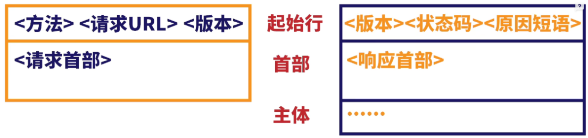
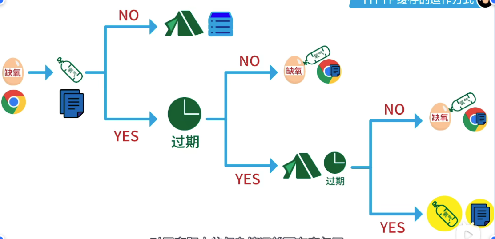
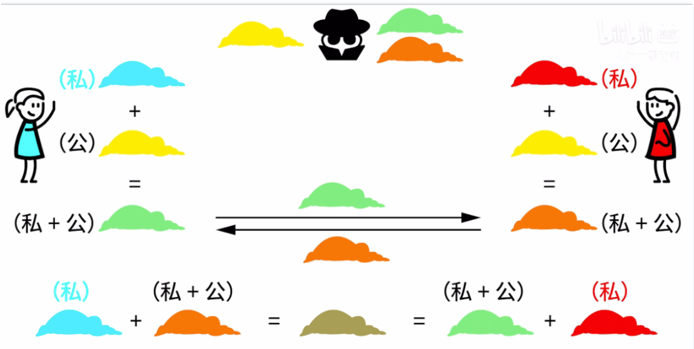
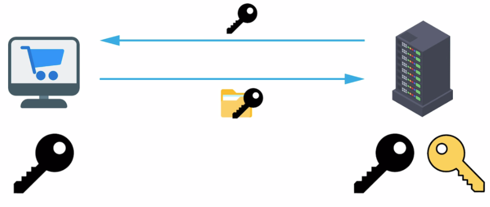
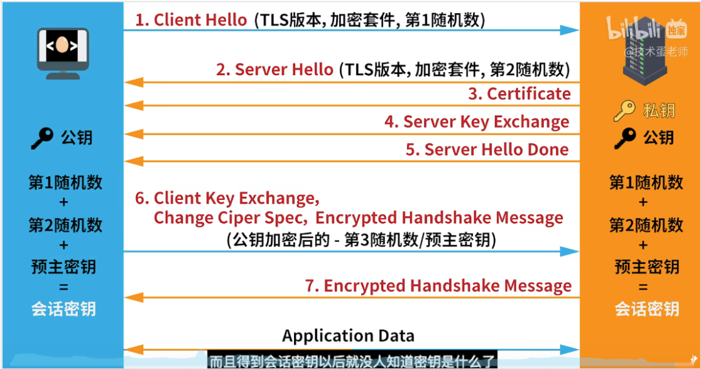
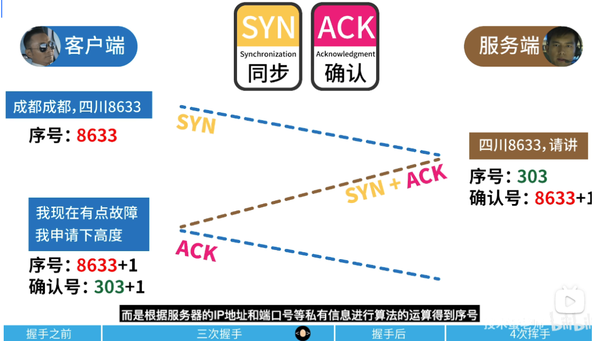
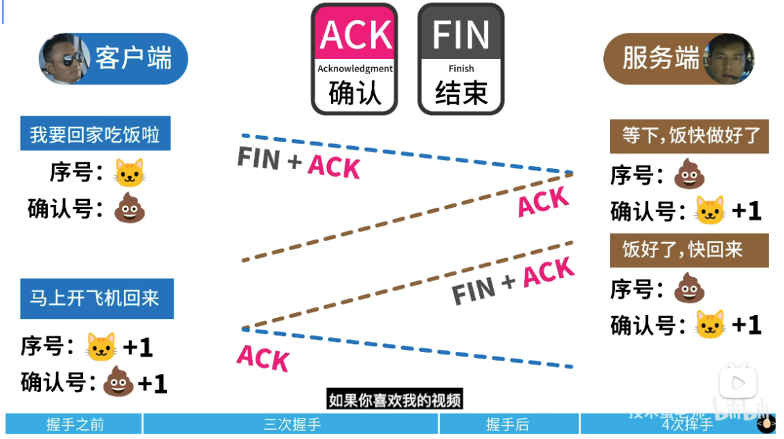
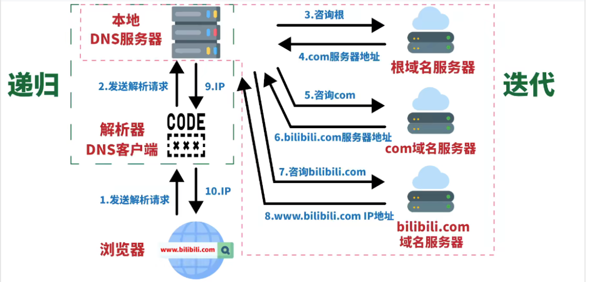

### HTTP 和缓存

缓存：

强制缓存：

- `cache-control`
- `expires` 缓存过期时间

协商缓存：

- `etag`
- `last-modified` 最后修改时间

### HTTPS

对称加密（私钥加密）

非对称（公钥）加密（数据经过公钥加密，只有被私钥解密，数据经过私钥加密只能被公钥解密）

在生成会话密钥之前都是非对称加密，后面的会话对数就进行加密是对称加密

### CDN 内容分发网络

`content delivery network`

`cache-control：no-cache、no-store`

### TCP 的三次握手和四次挥手

因为 B 给的 fin 和 ack 不一定是同时发生的，如果 B 还有数据要给 A 的话；发送 FIN 的意思是终止这一方向的数据传输，而接收到 FIN 的意思是这一方向上已经没有数据可以接收了，但仍可以发送数据。

### DNS 域名解析过程

