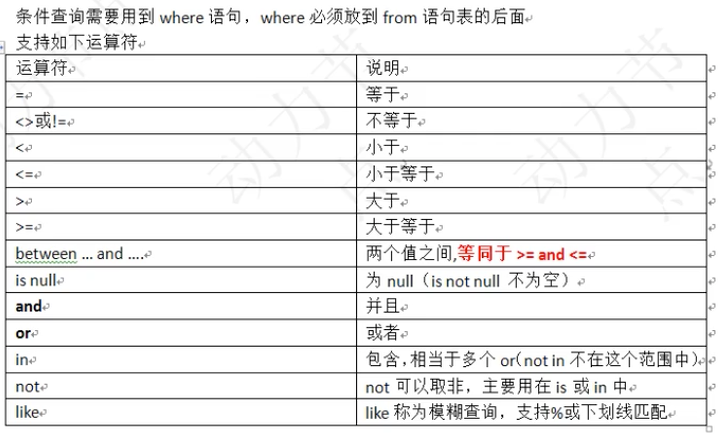

## 启动和登录

```mysql
mysql -u[账户] -p[密码]

// 修改登录密码
// 1. 用 setpassword 命令，首先登录mysql
mysql > set password for 用户名@localhost = password('新密码')

// 2. 用 mysqladmin
mysqladmin -uroot -p旧密码 password 新密码

// mac 登录 我的密码是 root
/usr/local/mysql/bin/mysql -u root -p
```

## SQL 语句分类

- DQL(数据查询语句)：查询语句，凡事 Select 语句都是 DQL；
- DML(数据操作语句)：insert delete update，对表当中的数据进行增删改查；
- DDL(数据定义语句)：create drop alter，对表结构的增删改查；
- TCL(事物控制语句)：commit 提交事物，rollback 回滚事物；
- DCL(数据控制语句)：grant 授权、revoke 撤销权限等

## mysql 的语句（DML）

`show databases;` 查看数据库

`create database 数据库名称;` 创建数据库

`drop database 数据库名称;` 删除数据库

`use 数据库名称;` 进入数据库

`show tables;`查看表格

`source sql脚本路径`执行脚本，导入数据

`desc 表名;`查看表结构

`select * from 表;`查看表中的数据

`select database();`查看当前使用的数据库

`show version();`查看数据库版本

退出 mysql：`\q 或者 QUIT 或者 EXIT`

查看创建表的语句：`show create table 表;`

## sql 语句（DQL）

### 简单查询语句

`select 字段名1,字段名2,字段名3,... from 表名;`

```sql
select empno,ename,sal * 12 from emp;

# 查询并重命名
select empno,ename,sal * 12 as yearsal from emp;
```

### 条件查询



语法：`select 字段 from 表 where 条件;`

```sql
select empno,ename,sal from emp where sal = 5000;

select empno,ename,sal from emp where sal >= 1000 and sal <= 3000;

select empno,ename,comm from emp where comm is null or comm = 0;

select empno,ename,comm from emp where comm is not null or comm = 0;

select empno,ename,job from emp where job = 'salesman' or job = 'manager';

select empno,ename,job from emp where job in ('salesman','manager');

# like 模糊查询 %代表多个字符，_代表1个字符:

select empno,ename from emp where ename like '%O%';

select empno,ename from emp where ename like '%\_%';
```

### 数据排序

- `asc` 升序
- `desc`降序

```sql
# 按照工资升序排：
select empno,ename,sal from emp order by sal asc;

# 工资降序排，工资一样名字升序排：
select empno,ename,sal from emp order by sal desc, ename asc;

select empno,ename,sal from emp where job = 'salesman' order by sal asc, ename desc;
```

### 分组函数（多行处理函数）

count：取得记录数；`select count(*) from emp;`

sum：求和；`select sum(sal) as total from emp;` sum 自动忽略 null

avg：取平均值；`select avg(sal) from emp;`

max/min：取最大/小值`select max(sal) from emp;`

分组函数自动忽略 null；

找出工资高于平均工资的员工：

分组函数不能用在 where 中！

count(\*) 和 count(字段)的区别？

count(\*) 表示所有，count(字段)表示该字段不为空的。

### 单行处理函数

在数学表达式中，有 null 参与，结果都是 null

```sql
select ename,(sal+comm) * 12 as total from emp;

# ifnull(字段，新增)

select ename,ifnull(comm,0),(sal+ifnull(comm,0)) * 12 as total from emp;
```

### group by 和 having

- `group by`：按照某个字段或者某些字段进行分组；
- `having`：是对分组之后的数据进行再次过滤。

案例：找出每个工作岗位的最高薪资？

```sql
select * from emp order by job;
select max(sal) from emp group by job;
select ename,job,max(sal) from emp group by job;
# group by 实在 where 执行结束之后执行
select ename,sal from emp where  sal > (select avg(sal) from emp);

# sql 顺序
select  5
  ..
from  1
  ..
where  2
  ..
group by  3
  ..
having  4
  ..
order by  6
  ..

# 找出每个工作岗位的最高薪资
select job,max(sal) from emp group by job;

select ename,job,max(sal) from emp group by job; # 无意义

# 每一个工作岗位的平均薪资
select job,avg(sal) from emp group by job;

# 多个字段能不能联合起来一块分组
# 找出每个部门不同岗位的最高薪资
select deptno,job,max(sal) from emp group by deptno,job;

# 找出每个部门的最高薪资，要求显示薪资大于2900的数据
select deptno,max(sal) from emp group by dempno;
having max(sal) > 2900;

select deptno,max(sal) from emp group by deptno having max(sal) > 2900;
select deptno,max(sal) from emp where sal > 2900 group by dempno;

# 找出每个部门的平均薪资，要求显示薪资大于2000 的数据
select deptno,avg(sal) from emp group by emptno;
select deptno,avg(sal) from emp group by emptno having avg(sal) > 2000;

# 查询工作岗位并去重
select destinct job from emp;
select destinct deptno,job from emp; # 联合去重
```

**当一条语句中有 group by 的话，select 后面只能跟分组函数和参与分组的字段。**

### 连接查询

内连接：等值连接、非等值连接、自连接

外连接：左外连接、右外连接

```sql
# 找出员工名和所在的部门名
# 1.找出员工名和部门编号 A表的外键
select ename,deptno from emp;
# 2.找出部门编号对应的部门名 B表的主键
select deptno,dname from dept;
# 最终 SQL92语法
select e.ename,e.deptno,d.dname from emp e,dept d where e.deptno = d.deptno;

# 内连接 等值连接：最大特点：条件是等量关系
# 找出员工名和所在的部门名SQL99语法
select e.ename,e.deptno,d.dname from emp e inner join dept d on e.deptno = d.deptno; # inner 可以省略
# select e.ename,e.deptno,d.dname from emp e join dept d on e.deptno = d.deptno where ...;

# 内连接 非等值连接：最大特点：条件是非等量关系
# 找出每个员工的工资等级，要求显示员工名、工资、工资等级。
select e.ename,e.sal,s.grade from emp e inner join salgrade s on e.sal between s.losal and s.hisal;

# 内连接 自连接：最大特点：一张表看成俩张表，自己连接自己。
# 找出每个员工的上级领导，要求显示员工名，员工编号，以及领导名和编号
select a.empno,a.ename,b.ename as '领导',b.empno as '领导编号' from emp a inner join emp b on a.mgr = b.empno; # null 会被 丢失
```

### 外连接

什么是外连接，和内连接有什么区别？

内连接：

- 假设 A 和 B 两张表，使用内连接，凡是 A 表和 B 表能够匹配上的记录都查询出来，这就是内连接
- AB 两张表没有主副之分，两张表是平等的。

外连接

- 假设 A 表和 B 表进行连接，使用外连接的话，AB 两张表中有一张表是主表，一张表是副表，主要查询主表中的数据，捎带着查询副表，**当副表中的数据没雨和主表中的数据匹配上，副表自动模拟出 null 与之匹配。**
- 外连接的特点：**主表中的数据无条件的全部查询出来。**

```sql
# 找出每个员工的上级领导，要求显示员工名，员工编号，以及领导名和编号
select a.ename as '员工',b.ename as '领导' from emp a left join emp b on a.mgr = b.empno;
# null 也会被查出来
select a.ename,a.empno,b.ename,b.empno from emp b right outer join emp a on a.mgr =
b.empno;

# 找出没有员工的部门
# 找出部门和员工所在部门对应的所有数据，部门编号在副表不存在，副表自动模拟出 null 与之匹配（说明该部门没有员工）
# where 筛选 null
select b.* from emp a right join dept b on a.deptno = b.deptno where a.empno is null;
```

### 三张表连接

```sql
# 找出员工的部门名称和工资等级 两次 join...on...
select
  e.ename,e.sal,d.dname,s.grade
from
  emp e
join
  dept d
on
  e.deptno = d.deptno
join
  salgrade s
on
  e.sal
between
  s.losal
and
  s.hisal;

# 找出员工的部门名称和工资等级、上级领导
select
  e.ename '员工',d.dname '部门',s.grade '工资等级',el.ename '领导'
from
  emp e
join
  dept d
on
  e.deptno = d.deptno
join
  salgrade s
on
  e.sal
between
  s.losal
and
  s.hisal
left join
  emp el
on
  e.mgr = el.empno;
```

### 子查询

select 语句当中嵌套 select 语句，被嵌套的 select 就是子查询。

```sql
select
 ...(select)...
from
 ...(select)...
where
 ...(select)...

# 找出高于平均薪资的员工信息 where (select)...
select e.ename,e.sal,avg(sal) from emp e where sal > (select avg(sal) from emp);

# 找出每个部门的平均薪资的薪资等级（按照部门编号分组，求 sal 的平均值） from (select)...
# select deptno,avg(sal) from emp group by deptno;

select t.*,s.grade from (select deptno,avg(sal) as avgsal from emp group by deptno) t join salgrade s on t.avgsal between s.losal and s.hisal;

# 找出每个部门平均的薪水等级。
# 1. 找出每个员工的薪资等级
select e.ename,e.sal,e.deptno,s.grade from emp e join salgrade s on e.sal between s.losal and s.hisal;
# 2. 基于以上结果，继续按照deptno继续分组，求 grade 平均值。
select e.ename,e.sal,e.deptno,s.grade,avg(s.grade) from emp e join salgrade s on e.sal between s.losal and s.hisal group by e.deptno;

# select 后面的子查询
# 找出每个员工所在的部门名称，要求显示员工名和部门名
select e.ename,(select d.dname from dept d where e.deptno = d.deptno) as dname from emp e;
```

### union

可以将查询结果相加

```sql
# 找出工作岗位是 salesman 和 manager 的员工
select e.ename,e.job from emp where job in('salesman','manager');

select e.ename,e.job from emp e where job = 'salesman'
union
select e.ename,e.job from emp e where job = 'manager';
```

### limit

```sql
select ename,sal from emp order by sal desc limit 0,5; # 从0开始，取5条数据
```

## 表的创建

```sql
create table 表名 {
  字段名1 数据类型,
  字段名2 数据类型,
  字段名3 数据类型,
};
```

### 数据类型

```sql
int    整数型（java的long）
bigint    长整型（java的long）
float      浮点型（java的float double）
char    定长字符串（String）
varchar    可变长字符串 255（StringBuffer StringBuilder）
date    日期类型（java的java.sql.Date）
BLOB    二进制大对象（流媒体） Binary Large OBject
CLOB  字符大对象（大文本）  Charcter Large OBject
```

`char`和`varchar`如何选择

```sql
create table t_student (
  no bigint,
  name varchar(255),
  sex char(1),
  classno varchar(255),
  birth char(10),
);
```

### insert

```sql
# 插入一条
insert into t_student(no,name,sex,classno,birth) value (110,'zs','1','2010A','1995-12-12');
# 插入2条数据
insert into t_student(no,name,sex,classno,birth) value (110,'zs','1','2010A','1995-12-12'),(220,'zs1','2','2010B','1992-12-31');
# 根据字段顺序插入
insert into t_student(name,sex,classno,birth,no) value ('zs','1','2010A','1995-12-12',220);
 # 省略表字段，必须按照表的字段来
insert into t_student value (440,'zs','1','2010A','1995-12-12');

# 删除表
drop table if exists t_student;
# 再次创建表
create table t_student (
  no bigint,
  name varchar(255),
  sex char(1) default '1',
  classno varchar(255),
  birth char(10),
);

# 复制一张表
create table emp1 as select emp.ename,emp.edeptno from emp;
```

### update

```sql
update 表名 set 字段1=值1,字段2=值2,字段3=值3,字段4=值4,... where 条件;

update t_student set name='ls' where no = 330;
```

### delete

```sql
delete from 表名 where 条件;
detele from t_student where no = 220;
truncate table 表名;
```

## 修改表结构（DDL）

略

## 约束（constraint）

唯一性约束：unique 列级约束、表级约束（unique(id,name)）。

非空约束：not null

主键约束：primary key

外键约束：foreign key 必须先创建父表，再创建子表

检查约束：check（Oracle）

```sql
drop table if exists t_user;
create table t_user(
  id int primary key auto_increment,
  username varchar(255),
  email varchar(255)
);
insert into t_user(id,username,email) value(1,'zs','zs@123.com');
insert into t_user(username,email) value('zs','zs@123.com');

# 外键约束
drop table if exists t_class;
drop table if exists t_student;
create table t_class(
  cno int,
  cname varchar(255),
  primary key(cno)
);

create table t_student(
  sno int,
  sname varchar(255),
  classno int,
  foreign key(classno) references t_class(cno)
);
```

### 存储引擎

`show create table emp;` 查看建表语句

engine=InnoDB DEFAULT CHARTSET=utf8;

存储引擎：只在 MySQL 存在， Oracle 中没有特殊名字。

查看当前 MySQL 支持的存储引擎：`show engines \G`

`MyISAM`: 不支持事务
`InnoDB`: 支持事务，行级锁，支持外键、安全
`MEMORY`: 不支持事务、数据容易丢失，数据和索引存在内存当中

## 事务

事务的特性：

- 原子性（Atomicity）: 整个事务中的所有操作，必须作为一个单元全部完成（或全部取消）。
- 一致性（Consistency）: 在事务开始之前与结束之后，数据库都保持一致状态。
- 隔离性(Isolation): 一个事务不会影响其他事务的运行。
- 持久性(Durability): 在事务完成以后，该事务对数据库所作的更改将持久地保存在数据库之中，并不会被回滚。

事务的隔离：

第一级别：读未提交（read uncommitted）

- 对方事务还没有提交，我们当前事务可以读取到对方未提交的数据
- 读未提交存在脏读（Dirty Read）现象：表是读到了脏的数据

第二级别：读已提交（read committed）

- 对方事务提交之后的数据我方才可以读取到
- 读已提交存在的问题：不可重复读

第三级别：可重复读（repeatable read）

- 这种隔离级别解决了不可重复读的问题
- 这种隔离存在的问题：读到的数据都是幻象

第四级别：序列化读/串行化读

- 解决了所有的问题
- 效率低，需要事务排队

Oracle 数据库默认的隔离级别是：读已提交。

MySQL 数据库默认的隔离级别是：可重复读。

演示事务

MySQL 的事务是关闭动提交机制：`start transaction`

## 34 个练习题

```sql
# 1. 取得每个部门最高薪水的人员名称
# 获取每个部门的最高薪水
select deptno,max(sal) from emp group by deptno;
# 将以上结果当做临时表 t，t 表和 emp e 表连接： t.deptno = e.deptno and t.maxsal = e.sal

select
  e.ename,t.*
from
  (select deptno,max(sal) as maxsal from emp group by deptno) t
join
  emp e
on
  t.deptno = e.deptno and t.maxsal = e.sal;
```
