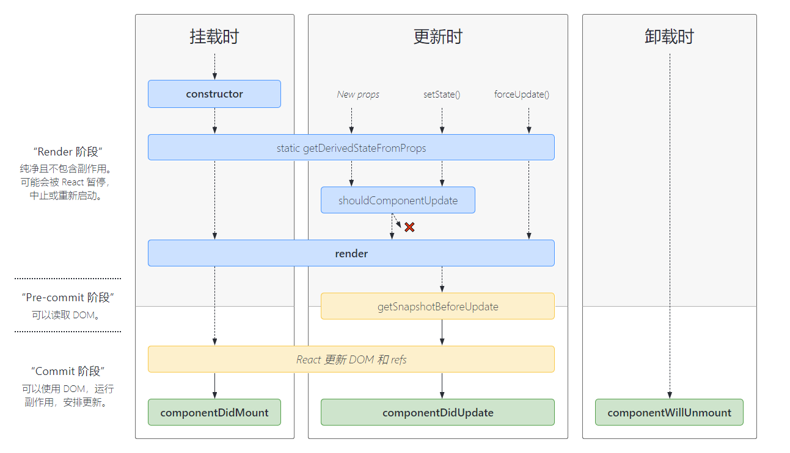
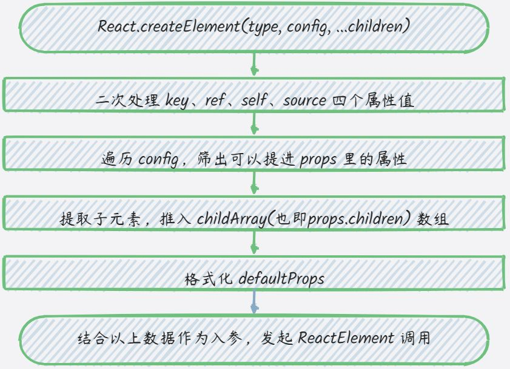

# React 基础问题

## Q：函数组件为什么没有实例？

A：在 React 中，函数组件是没有实例的。这与类组件不同，类组件实例是通过 `new` 关键字创建的，而函数组件只是一个函数。当函数组件被调用时，它会返回一个 React 元素（`virtual DOM`）的描述。React 使用这个描述来构建真实的 DOM，并且在需要时进行更新。

尽管函数组件没有实例，但是你可以使用 `useRef、useEffect、useState` 等 React 钩子来在函数组件中管理状态、引用 DOM 元素等。

## Q：react 为什么要引入 Fiber 架构？解决了什么问题？

A： **JavaScript 线程和渲染线程必须是互斥的**：这两个线程不能够穿插执行，必须串行。

React 引入 Fiber 架构是为了解决**原有的调度算法在处理大型应用时可能导致的性能问题以及在用户交互过程中的响应性问题**。在 React 16 之前，React 使用的是栈调度（`Stack Reconciliation`）算法，**该算法是一个同步的递归过程，在处理大型组件树时可能会导致主线程长时间被占用，造成页面卡顿或者无法及时响应用户输入。**

原有的架构问题包括：

1. **同步渲染导致的阻塞**：React 15 及以前版本的渲染是同步的，意味着当应用进行大规模渲染时，整个渲染过程会阻塞主线程，造成页面卡顿和用户交互不流畅。
2. **难以中断和终止渲染**：在旧的调度算法中，一旦开始渲染过程，就很难中断或者终止渲染，这意味着即使用户进行了新的交互，React 也可能无法立即响应。
3. **无法优先处理高优先级任务**：旧的调度算法难以灵活地处理不同优先级的任务，比如对用户输入的响应需要高优先级，而对于低优先级的任务则可以稍后处理。

Fiber 架构带来的优势包括：

1. **增量渲染**：Fiber 架构使用增量渲染的方式，将渲染过程拆分成小块，通过使用 requestIdleCallback API（或者其 polyfill）等，将任务分解成多个帧，避免了一次性长时间占用主线程。
2. **可中断和恢复**：Fiber 架构允许在渲染过程中中断和恢复，这使得 React 可以更灵活地响应用户的交互操作，提高了页面的响应性。
3. **优先级调度**：Fiber 架构引入了优先级调度的概念，可以根据任务的优先级灵活地调整任务的执行顺序，保证了对用户交互的即时响应，同时也能合理地处理其他任务。

总的来说，Fiber 架构的引入使得 React 在处理大型应用和用户交互时更加高效、灵活和响应。

参看： [如何理解 Fiber 架构的迭代动机与设计思想](https://github.com/heinfy/react-learn/blob/main/03-React%20%E9%AB%98%E7%BA%A7%E8%BF%9B%E9%98%B6%E6%95%99%E7%A8%8B/12%20%20%E5%A6%82%E4%BD%95%E7%90%86%E8%A7%A3%20Fiber%20%E6%9E%B6%E6%9E%84%E7%9A%84%E8%BF%AD%E4%BB%A3%E5%8A%A8%E6%9C%BA%E4%B8%8E%E8%AE%BE%E8%AE%A1%E6%80%9D%E6%83%B3%EF%BC%9F.md) [React 16.7 Fiber 源码解读 （一）](https://blog.csdn.net/napoleonxxx/article/details/86568941) [说说对 Fiber 架构的理解？解决了什么问题？](https://github.com/febobo/web-interview/issues/209)

## Q：说说 React 性能优化的手段有哪些？

A：

1. `PureComponent + Immutable.js`

[PureComponent + Immutable.js](https://github.com/heinfy/react-learn/blob/main/03-React%20%E9%AB%98%E7%BA%A7%E8%BF%9B%E9%98%B6%E6%95%99%E7%A8%8B/22%20%20%E6%80%9D%E8%B7%AF%E6%8B%93%E5%B1%95%EF%BC%9A%E5%A6%82%E4%BD%95%E6%89%93%E9%80%A0%E9%AB%98%E6%80%A7%E8%83%BD%E7%9A%84%20React%20%E5%BA%94%E7%94%A8%EF%BC%9F.md#%E8%BF%9B%E9%98%B6%E7%8E%A9%E6%B3%95purecomponent--immutablejs)

2. `React.memo` 与 `useMemo`

[函数组件的性能优化：React.memo 和 useMemo](https://github.com/heinfy/react-learn/blob/main/03-React%20%E9%AB%98%E7%BA%A7%E8%BF%9B%E9%98%B6%E6%95%99%E7%A8%8B/22%20%20%E6%80%9D%E8%B7%AF%E6%8B%93%E5%B1%95%EF%BC%9A%E5%A6%82%E4%BD%95%E6%89%93%E9%80%A0%E9%AB%98%E6%80%A7%E8%83%BD%E7%9A%84%20React%20%E5%BA%94%E7%94%A8%EF%BC%9F.md#%E5%87%BD%E6%95%B0%E7%BB%84%E4%BB%B6%E7%9A%84%E6%80%A7%E8%83%BD%E4%BC%98%E5%8C%96reactmemo-%E5%92%8C-usememo)

3. **避免使用内联函数**
   1. 使用内联函数，则每次调用 render 函数时都会创建一个新的函数实例

```jsx
<input
  type='button'
  onClick={e => {
    this.setState({ inputValue: e.target.value });
  }}
  value='Click For Inline Function'
/>
```

4. **懒加载组件**
   1. 从工程方面考虑，`webpack`存在代码拆分能力，可以为应用创建多个包，并在运行时动态加载，减少初始包的大小
   2. 而在 react 中使用到了`Suspense` 和 `lazy`组件实现代码拆分功能

```jsx
const johanComponent = React.lazy(() => import(/* webpackChunkName: "johanComponent" */ './component'));

export const johanAsyncComponent = props => (
  <React.Suspense fallback={<Spinner />}>
    <johanComponent {...props} />
  </React.Suspense>
);
```

5. **事件绑定方式**
   1. 在`render`方法中，使用`bind`和`render`方法中使用箭头函数这两种形式在每次组件`render`的时候都会生成新的方法实例
   2. 而`constructor`中`bind`事件与定义阶段使用箭头函数绑定这两种形式只会生成一个方法实例，性能方面会有所改善
6. **服务端渲染**
7. **使用 **`React Fragment`** 避免额外标记：**` <></>`
8. **使用 **`shouldComponentUpdate`** 规避冗余的更新逻辑**

参看： [如何打造高性能的 React 应用](https://github.com/heinfy/react-learn/blob/main/03-React%20%E9%AB%98%E7%BA%A7%E8%BF%9B%E9%98%B6%E6%95%99%E7%A8%8B/22%20%20%E6%80%9D%E8%B7%AF%E6%8B%93%E5%B1%95%EF%BC%9A%E5%A6%82%E4%BD%95%E6%89%93%E9%80%A0%E9%AB%98%E6%80%A7%E8%83%BD%E7%9A%84%20React%20%E5%BA%94%E7%94%A8%EF%BC%9F.md) [面试官：说说 React 性能优化的手段有哪些？ · Issue #211 · febobo/web-interview](https://github.com/febobo/web-interview/issues/211)

## Q：说说 React 生命周期有哪些不同阶段？

- [react 的生命周期（图示）\_react 生命周期图解\_YanAhao 的博客-CSDN 博客](https://blog.csdn.net/YanAhao/article/details/108319723)



## Q：super()和 super(props)有什么区别？

A：super 是为了继承 React.Component 的 this；super(props) 的目的是为了在 constructor 中使用 this.props。 props 可以不传，默认的 props 值是在 component.defaultProps 中定义的。参看： [为什么我们要写 super(props) ？](https://overreacted.io/zh-hans/why-do-we-write-super-props/)

## Q：React 事件绑定的方式有哪些？

A：

- render 方法中使用 bind
- render 方法中使用箭头函数
- constructor 中 bind

## Q：React 为什么要绑定 this？

A：当我们写一个事件时 onClick={ this.fn }，事实上 fn 函数是作为一个回调函数传给了 SyntheticEvent。

[严格模式 - JavaScript | MDN](https://developer.mozilla.org/zh-CN/docs/Web/JavaScript/Reference/Strict_mode#%E4%B8%A5%E6%A0%BC%E6%A8%A1%E5%BC%8F%E4%B8%AD%E7%9A%84%E5%8F%98%E5%8C%96)

> **在严格模式下通过 this 传递给一个函数的值不会被强制转换为一个对象。**对一个普通的函数来说，this 总会是一个对象：不管调用时 this 它本来就是一个对象；还是用布尔值，字符串或者数字调用函数时函数里面被封装成对象的 this；还是使用 undefined 或者 null 调用函数式 this 代表的全局对象（使用 call, apply 或者 bind 方法来指定一个确定的 this）。这种自动转化为对象的过程不仅是一种性能上的损耗，同时在浏览器中暴露出全局对象也会成为安全隐患，因为全局对象提供了访问那些所谓安全的 JavaScript 环境必须限制的功能的途径。**所以对于一个开启严格模式的函数，指定的 this 不再被封装为对象，而且如果没有指定 this 的话它值是 undefined。**

## Q：React 中的 key 有什么作用？

A：元素的 key 作用是用于判断元素是新创建的还是被移动的，从而减少不必要的 Diff。

### 1. **唯一标识**

`key` 属性为每个列表项提供一个唯一标识符。这样，React 能够准确地识别哪些元素被改变、添加或删除，从而能够进行高效的更新。

```jsx
const listItems = items.map(item => <li key={item.id}>{item.text}</li>);
```

在这个例子中，每个 `li` 元素都有一个唯一的 `key`，这是 `item.id`。

### 2. **提高性能**

当 React 处理列表项时，如果列表项没有唯一的 `key`，React 会逐个检查每个列表项，这会导致性能下降。使用唯一的 `key`，React 可以直接找到需要更新的项，从而提高性能。

### 3. **避免重新渲染**

React 使用 `key` 属性来确定哪些元素已经发生变化。如果 `key` 不唯一或不正确，React 可能会错误地重新渲染整个列表，而不是只更新实际改变的元素。

### 4. **帮助识别元素顺序**

当列表的顺序发生变化时，`key` 属性能帮助 React 理解这种变化。例如，在排序或重新排列列表项时，`key` 可以确保元素的状态保持一致。

## Q：说说对 React refs 的理解？应用场景？

A：ref 可以访问 DOM 元素或者某个组件实例。

| ref                                                   | state                                                                                    |
| ----------------------------------------------------- | ---------------------------------------------------------------------------------------- |
| useRef(initialValue) 返回 { current: initialValue }   | useState(initialValue) 返回 state 变量的当前值和一个 state 设置函数 ( [value, setValue]) |
| 更改时不会触发重新渲染                                | 更改时触发重新渲染                                                                       |
| 可变 —— 你可以在渲染过程之外修改和更新 current 的值。 | “不可变” —— 你必须使用 state 设置函数来修改 state 变量，从而排队重新渲染。               |
| 不应在渲染期间读取（或写入） current 值。             | 你可以随时读取 state。但是，每次渲染都有自己不变的 state 快照。                          |

官方文档：

- [示例：制作秒表](https://react.docschina.org/learn/referencing-values-with-refs#example-building-a-stopwatch)
- [尝试一些挑战](https://react.docschina.org/learn/referencing-values-with-refs#challenges)
- [访问另一个组件的 DOM 节点](https://react.docschina.org/learn/manipulating-the-dom-with-refs#accessing-another-components-dom-nodes)
- [尝试一些挑战](https://react.docschina.org/learn/manipulating-the-dom-with-refs#challenges)

## Q：说说对 React 中类组件和函数组件的理解？有什么区别？

A：类组件中的 showMessage 方法：

```jsx
class ProfilePage extends React.Component {
  showMessage = () => {
    alert('Followed ' + this.props.user);  };
```

这个类方法从 this.props.user 中读取数据。在 React 中 Props 是不可变(immutable)的，所以他们永远不会改变。**然而，this 是，而且永远是，可变(mutable)的。** **函数式组件捕获了渲染所使用的值。** 参看：

- [pjqnl16lm7 - CodeSandbox](https://codesandbox.io/s/pjqnl16lm7)
- [函数式组件与类组件有何不同？](https://overreacted.io/zh-hans/how-are-function-components-different-from-classes/)

## Q：React 如何区分 Class 和 Function？

A：使用 new 操作符来调用一个类的：

```jsx
// 如果 Greeting 是一个函数
const result = Greeting(props); // <p>Hello</p>

// 如果 Greeting 是一个类
const instance = new Greeting(props); // Greeting {}
const result = instance.render(); // <p>Hello</p>
```

javascript 在没有类的时候，使用 new 操作符来模拟类。

```jsx
function Person(name) {
  this.name = name;
}

var fred = new Person('Fred'); // ✅ Person {name: 'Fred'}
var george = Person('George'); // 🔴 没用的
```

new 操作符创建一个 `{}` 并把` Person` 中 `this` 指向那个对象，以便通过 `this.xxx` 的形式去设置一些属性，然后把这个对象返回。这就是 new 操作符所做的事。检查一个组件是否是一个 `React` 组件类最符合语言习惯的方式是测试：`Greeting.prototype instanceof React.Component`

```jsx
class A {}
class B extends A {}

console.log(B.prototype instanceof A); // true
```

在 `React`内部：

```jsx
// React 内部
class Component {}
Component.prototype.isReactComponent = {};

// 我们可以像这样检查它
class Greeting extends Component {}
console.log(Greeting.prototype.isReactComponent); // ✅ 是的
```

测试代码：

```jsx
import { Component } from 'react';

function App() {
  return (
    <>
      <Demo1></Demo1>
      <Demo2></Demo2>
    </>
  );
}

class Demo1 extends Component {
  render() {
    return <h3>DEMO1</h3>;
  }
}
function Demo2() {
  return <h3>DEMO2</h3>;
}

// console.log('Component.prototype', Component.prototype);
// console.log('Demo1.prototype', Demo1.prototype);
// console.log('Demo2.prototype', Demo2.prototype);
// console.log('Demo1.prototype', Demo1.prototype instanceof Component);
// console.log('Demo2.prototype', Demo2.prototype instanceof Component);
console.log('Demo1.prototype', Demo1.prototype.isReactComponent); // {}
console.log('Demo2.prototype', Demo2.prototype.isReactComponent); // undefined

export default App;
```

参看：

- [React 如何区分 Class 和 Function？](https://overreacted.io/zh-hans/how-does-react-tell-a-class-from-a-function/)

## Q：说说对高阶组件的理解？应用场景?

A：高阶组件的主要功能是封装并分离组件的通用逻辑，让通用逻辑在组件间更好地被复用，提高代码的复用性和灵活性。

在实际应用中，常常用于与核心业务无关但又在多个模块使用的功能，如**权限控制、日志记录、数据校验、异常处理、统计上报**等。

## Q：说说对 React Hooks 的理解？解决了什么问题？

A：Hooks 的本质：一套能够使函数组件更强大、更灵活的“钩子”。

- 难以重用和共享组件中的与状态相关的逻辑
- 逻辑复杂的组件难以开发与维护，每个生命周期函数中可能会包含着各种互不相关的逻辑在里面
- 类组件中的 this 增加学习成本，类组件在基于现有工具的优化上存在些许问题
- 函数组件补齐（相对于类组件来说）缺失的能力

## Q：在 react 中组件间过渡动画如何实现？

A：在 react 中实现过渡动画效果会有很多种选择，如 `react-transition-group`，`react-motion`，`Animated`，以及原生的 CSS 都能完成切换动画。参看： [面试官：在 react 中组件间过渡动画如何实现](https://github.com/febobo/web-interview/issues/197)

## Q：说说你对 React Router 的理解？常用的 Router 组件有哪些？

A：

```jsx
import { BrowserRouter as Router, Route, Link } from 'react-router-dom';
```

- 路由器，比如 BrowserRouter 和 HashRouter
- 路由，比如 Route 和 Switch
- 导航，比如 Link、NavLink、Redirect
- useHistory 可以让组件内部直接访问 history，无须通过 props 获取
- useParams => props.match.params.name
- useLocation 会返回当前 URL 的 location 对象

## Q：说说 React Router 有几种模式？实现原理？

A：`hash` 模式：hash 值改变，触发全局 window 对象上的 hashchange 事件。所以 hash 模式路由就是利用 hashchange 事件监听 URL 的变化，从而进行 DOM 操作来模拟页面跳转 `history` 模式：通过`window.addEventListener('popstate',callback)`监听 history 值的变化，并传递给其嵌套的组件。

```javascript
history.pushState(data[,title][,url]); // 向浏览历史中追加一条记录
history.replaceState(data[,title][,url]); // 修改（替换）当前页在浏览历史中的信息
```

参看： [说说 React Router 有几种模式？实现原理？](https://github.com/febobo/web-interview/issues/203) [从 React-Router 切入，系统学习前端路由解决方案](https://github.com/heinfy/react-learn/blob/main/03-React%20%E9%AB%98%E7%BA%A7%E8%BF%9B%E9%98%B6%E6%95%99%E7%A8%8B/21%20%20%E4%BB%8E%20React-Router%20%E5%88%87%E5%85%A5%EF%BC%8C%E7%B3%BB%E7%BB%9F%E5%AD%A6%E4%B9%A0%E5%89%8D%E7%AB%AF%E8%B7%AF%E7%94%B1%E8%A7%A3%E5%86%B3%E6%96%B9%E6%A1%88.md)

## Q：说说你对 immutable 的理解？如何应用在 react 项目中？

A：参看： [说说你对 immutable 的理解？如何应用在 react 项目中？](https://github.com/febobo/web-interview/issues/204)

## Q：说说 React diff 的原理是什么？

A：React 将 Virtual DOM 树转换成 actual DOM 树的最少操作的过程称为调和（reconciliation）。diff 算法便是调和的具体实现。 React 通过制定大胆的策略，将 O(n^3) 复杂度的问题转换成 O(n) 复杂度的问题：

1. Diff 算法性能突破的关键点在于“**分层对比**”；
2. 类型一致的节点才有继续 Diff 的必要性；
3. key 属性的设置，可以帮我们尽可能重用同一层级内的节点。

参看： [diff 算法](https://github.com/heinfy/react-learn/blob/main/04-%E6%B7%B1%E5%85%A5%20REACT%20%E6%8A%80%E6%9C%AF%E6%A0%88/03%E7%AB%A0-5.diff%E7%AE%97%E6%B3%95.md) [https://github.com/febobo/web-interview/issues/208](https://github.com/febobo/web-interview/issues/208)

未优化的树比较算法为何会达到 O(n3)O(n^3)O(n3) 的时间复杂度。

### 未优化算法复杂度

在最坏情况下，每个节点的比较都可能导致全树遍历。考虑以下几点：

1. **全树遍历**：假设有两棵树 T1 和 T2，每棵树都有 n 个节点。我们需要比较 T1 和 T2 的每个节点。
2. **子树对比**：对于每对节点的比较，还需要递归比较其所有子节点。这意味着每个节点的比较操作会递归到其所有子节点。

具体步骤如下：

#### 步骤 1：比较根节点

- 比较 T1 和 T2 的根节点，时间复杂度为 O(1)。

#### 步骤 2：比较根节点的子节点

- 假设根节点有 k 个子节点。需要比较这 k 个子节点的所有可能组合（笛卡尔积），时间复杂度为 O(k^2)。

#### 步骤 3：递归比较每个子节点

- 对于每对子节点，需要递归地比较其子节点。假设每个子节点的子树有大约 n/k 个节点，那么这部分的时间复杂度为 O((n/k)^2)。
- 由于有 kkk 对这样的子节点组合，总时间复杂度为 O(k^2⋅(n/k)^2)=O(n^2)。

#### 总复杂度

- 当我们将这种递归过程应用到整个树时，每一层的节点对比都会产生 O(n2)O(n^2)O(n2) 的复杂度。
- 整棵树有 O(n) 层，因此总体时间复杂度为 O(n^2⋅n)=O(n^3)。

#### 示例说明

考虑一个最简单的例子，有两棵完全二叉树，每棵树有 n 个节点：

1. 比较根节点 O(1)。
2. 比较根节点的子节点，假设每个根节点有 2 个子节点，需要比较 2^2 = 4 次。
3. 继续递归比较每对子节点的子节点，时间复杂度会指数增长。
4. 因为每层的比较次数都是对上一层的平方，并且树的高度约为 log(n)，每层的比较时间复杂度为 O(n^2)。

最终，这些层的总比较次数的和会达到 OO(n^3)。

### 总结

在未优化的树比较算法中，每个节点的比较需要递归地遍历和比较整个子树，这导致每层的比较次数呈指数增长，最终导致总时间复杂度为 O(n^3)。通过优化，如 React 中的 diff 算法，这种复杂度被大大降低到 O(n)。

## Q：说说你在 React 项目是如何捕获错误的？

A：为了解决出现的错误导致整个应用崩溃的问题，React 16 引用了**错误边界**的概念。当抛出错误后，使用 `static getDerivedStateFromError()` 渲染备用 UI ，使用 `componentDidCatch()` 打印错误信息。参看： [错误边界 – React](https://zh-hans.legacy.reactjs.org/docs/error-boundaries.html#gatsby-focus-wrapper) [面试官：说说你在 React 项目是如何捕获错误的？ · Issue #216 · febobo/web-interview](https://github.com/febobo/web-interview/issues/216)

## Q：说说 React Jsx 转换成真实 DOM 过程？

A：JSX 的本质是`React.createElement`这个`JavaScript`调用的语法糖：



`React.createElement` 函数就是将开发者代码转化为 `ReactElement` 函数所需的参数，相当于一个中转函数。 `ReactElement` 的源码：

```javascript
const ReactElement = function (type, key, ref, self, source, owner, props) {
  const element = {
    // REACT_ELEMENT_TYPE是一个常量，用来标识该对象是一个ReactElement
    $$typeof: REACT_ELEMENT_TYPE,
    // 内置属性赋值
    type: type,
    key: key,
    ref: ref,
    props: props,
    // 记录创造该元素的组件
    _owner: owner
  };
  //
  if (__DEV__) {
    // 这里是一些针对 __DEV__ 环境下的处理，
    // 对于大家理解主要逻辑意义不大，此处我直接省略掉，以免混淆视听
  }
  return element;
};
```

这个 `ReactElement` 函数返回的对象实例，本质上是以 `JavaScript` 对象形式存在的对 DOM 的描述，即虚拟 dom。将该实例传入`React.render()`函数，即可获得真实 DOM。

## Q：说说 React 服务端渲染怎么做？原理是什么？

A：React 服务端渲染（Server-Side Rendering，SSR）是一种在服务器上预渲染 React 组件并将生成的 HTML 发送到客户端的技术。客户端接收到 HTML 后，可以在其上继续执行 React 的客户端渲染。SSR 的主要目的是提高首屏加载速度和搜索引擎优化（SEO）。以下是 React 服务端渲染的实现方式及其原理。

> 如果需要在服务端发起请求的话，需要使用全局的 store。当请求路由的时候，在服务器端执行 store 的方法，然后将数据注入的组件中；组件也可以通过 props 获取 store 的 reducer 在客户端执行。

原理：

1. **服务端渲染**：
   - 当客户端发送请求时，服务器会使用 `ReactDOMServer.renderToString` 方法将 React 组件渲染为字符串形式的 HTML。
   - 生成的 HTML 被插入到一个完整的 HTML 模板中，并发送回客户端。
2. **客户端复用**：
   - 客户端接收到完整的 HTML 后，会使用 React 的 `hydrate` 方法在已有的 HTML 上绑定事件处理器等，使页面变得可交互。
   - `hydrate` 方法与 `render` 方法类似，但它会复用服务端生成的 HTML，而不是重新渲染整个页面。

优点：

- **提高首屏加载速度**：由于页面 HTML 在服务器上生成，客户端可以更快地显示页面内容。
- **改善 SEO**：搜索引擎可以更好地索引预渲染的 HTML 内容。
- **提升用户体验**：用户可以更快地看到页面内容，提高用户体验。

注意事项：

- **服务器负载**：SSR 会增加服务器的负载，因为每个请求都需要在服务器上渲染页面。
- **复杂性增加**：需要在服务器和客户端之间共享代码，并处理两者之间的差异。
- **数据获取**：需要考虑在服务端获取数据并传递给客户端，以确保客户端和服务器渲染一致。

参看： [说说 React 服务端渲染怎么做？原理是什么？](https://github.com/febobo/web-interview/issues/217) [掘金小册](https://juejin.cn/book/7137945369635192836/section/7141179707340357673)

## Q：React render 方法在什么时候会被触发？原理？

A：在 render 过程中，React 将新调用的 render 函数返回的树与旧版本的树进行比较，这一步是决定如何更新 DOM 的必要步骤，然后进行 diff 比较，更新 DOM 树。拆解`ReactDOM.render`调用栈：

- 初始化阶段

主要内容是：完成 Fiber Tree 中基本实体的创建： 

### React 16 中，为什么 ReactDOM.render 触发的首次渲染是个同步过程呢？

React 都有以下 3 种启动方式：

- legacy 模式： `ReactDOM.render(<App />, rootNode)`。这是当前 React App 使用的方式，当前没有计划删除本模式，但是这个模式可能不支持这些新功能。
- blocking 模式： `ReactDOM.createBlockingRoot(rootNode).render(<App />)`。目前正在实验中，作为迁移到 concurrent 模式的第一个步骤。
- concurrent 模式： `ReactDOM.createRoot(rootNode).render(<App />)`。目前在实验中，未来这个模式开启了所有的新功能。

ReactDOM.createRoot 开启的渲染链路与 ReactDOM.render 有何不同呢？

参看： [ReactDOM.render 是如何串联渲染链路的？（上）](https://github.com/heinfy/react-learn/blob/main/03-React%20%E9%AB%98%E7%BA%A7%E8%BF%9B%E9%98%B6%E6%95%99%E7%A8%8B/13%20%20ReactDOM.render%20%E6%98%AF%E5%A6%82%E4%BD%95%E4%B8%B2%E8%81%94%E6%B8%B2%E6%9F%93%E9%93%BE%E8%B7%AF%E7%9A%84%EF%BC%9F%EF%BC%88%E4%B8%8A%EF%BC%89.md#13-reactdomrender-%E6%98%AF%E5%A6%82%E4%BD%95%E4%B8%B2%E8%81%94%E6%B8%B2%E6%9F%93%E9%93%BE%E8%B7%AF%E7%9A%84%E4%B8%8A) [ReactDOM.render 是如何串联渲染链路的？（中）](https://github.com/heinfy/react-learn/blob/main/03-React%20%E9%AB%98%E7%BA%A7%E8%BF%9B%E9%98%B6%E6%95%99%E7%A8%8B/14%20%20ReactDOM.render%20%E6%98%AF%E5%A6%82%E4%BD%95%E4%B8%B2%E8%81%94%E6%B8%B2%E6%9F%93%E9%93%BE%E8%B7%AF%E7%9A%84%EF%BC%9F%EF%BC%88%E4%B8%AD%EF%BC%89.md#14-reactdomrender-%E6%98%AF%E5%A6%82%E4%BD%95%E4%B8%B2%E8%81%94%E6%B8%B2%E6%9F%93%E9%93%BE%E8%B7%AF%E7%9A%84%E4%B8%AD) [ReactDOM.render 是如何串联渲染链路的？（下）](https://github.com/heinfy/react-learn/blob/main/03-React%20%E9%AB%98%E7%BA%A7%E8%BF%9B%E9%98%B6%E6%95%99%E7%A8%8B/15%20%20ReactDOM.render%20%E6%98%AF%E5%A6%82%E4%BD%95%E4%B8%B2%E8%81%94%E6%B8%B2%E6%9F%93%E9%93%BE%E8%B7%AF%E7%9A%84%EF%BC%9F%EF%BC%88%E4%B8%8B%EF%BC%89.md)

## Q：剖析 Fiber 架构下 Concurrent 模式的实现原理

React Fiber 架构引入了一个新的调度引擎，使 React 能够更高效地管理更新，并实现了 Concurrent 模式（并发模式）。Concurrent 模式允许 React 将渲染工作拆分成更小的任务，并优先处理用户交互等高优先级任务，从而提高应用的响应速度和流畅性。

### Fiber 架构概述

React Fiber 是一种基于链表的数据结构，每个 Fiber 节点表示一个 React 元素。这种结构允许 React 更灵活地管理和调度渲染工作。与之前的递归调用栈不同，Fiber 架构使得渲染过程可以被中断和恢复。

### Concurrent 模式实现原理

Concurrent 模式的核心在于让渲染过程可中断和可恢复，这主要通过以下几个步骤实现：

1. **任务拆分**：
   - 将渲染工作拆分成多个小任务（单元工作单元，Unit of Work），这些任务可以独立完成。
   - 每个任务在执行一定时间后可以被中断，允许 React 检查是否有更高优先级的任务需要处理。
2. **时间切片**：
   - 使用浏览器提供的 `requestIdleCallback` 和 `requestAnimationFrame` 等 API，将渲染工作分配到浏览器的空闲时间段。
   - React 会在每个时间切片中执行一部分渲染工作，并在必要时中断和恢复这些工作。
   - React 会根据浏览器的帧率，计算出时间切片的大小，并结合当前时间计算出每一个切片的到期时间。在 workLoopConcurrent 中，while 循环每次执行前，会调用 shouldYield 函数来询问当前时间切片是否到期，若已到期，则结束循环、出让主线程的控制权。
3. **优先级调度**：
   - React 根据任务的优先级进行调度，高优先级任务（如用户输入和动画）会优先处理。
   - 低优先级任务（如不重要的渲染更新）会在空闲时间段进行处理。
4. **任务中断与恢复**：
   - 使用 Fiber 节点链表结构，使得渲染过程可以被中断和恢复。
   - React 在每次渲染过程中保存当前的 Fiber 节点，当任务被中断时，可以从该节点继续渲染。
5. **可恢复渲染**：
   - 当一个任务被中断时，React 会保存当前的渲染状态，并在下一个空闲时间段继续执行未完成的任务。
   - 通过这种方式，React 能够高效地处理长时间运行的渲染任务，而不会阻塞主线程。

### 具体实现步骤

1. **初始化和调度**：
   - React 在初始化时创建根 Fiber 节点，并开始调度渲染任务。
   - 调度器根据优先级决定哪些任务需要优先执行。
2. **任务执行**：
   - React 在每个时间切片中执行一部分渲染工作，通过遍历 Fiber 节点链表来进行递归更新。
3. **任务中断**：
   - 当时间切片结束或有更高优先级的任务时，React 会中断当前任务并保存状态。
   - 使用浏览器的调度 API（如 `requestIdleCallback`）来确定下一次可执行任务的时间。
4. **任务恢复**：
   - 在下一个空闲时间段，React 恢复中断的任务，从上次中断的 Fiber 节点继续执行。
   - 通过这种方式，React 可以在不阻塞主线程的情况下完成复杂的渲染任务。

参看： [Scheduler——“时间切片”与“优先级”的幕后推手](https://github.com/heinfy/react-learn/blob/main/03-React%20%E9%AB%98%E7%BA%A7%E8%BF%9B%E9%98%B6%E6%95%99%E7%A8%8B/16%20%20%E5%89%96%E6%9E%90%20Fiber%20%E6%9E%B6%E6%9E%84%E4%B8%8B%20Concurrent%20%E6%A8%A1%E5%BC%8F%E7%9A%84%E5%AE%9E%E7%8E%B0%E5%8E%9F%E7%90%86.md) [剖析 Fiber 架构下 Concurrent 模式的实现原理](https://www.bilibili.com/video/BV12r4y1r7vL?p=18)

## Q：ReactDOM.createPortal 怎么用？

A：`ReactDOM.createPortal：`将子组件渲染到存在于父组件 DOM 层次结构之外的 DOM 节点中。

```jsx
// 可渲染的 React child，例如元素、字符串或片段
// DOM 元素
ReactDOM.createPortal(child, container);
```

demo:

```jsx
import React, { Component } from 'react';
import ReactDOM from 'react-dom';
import './index.css';

const modalRootEl = document.getElementById('modal-root');

class Modal extends Component {
  constructor(props) {
    super(props);
    this.el = document.createElement('div');
  }
  componentDidMount() {
    modalRootEl.appendChild(this.el);
  }
  componentWillUnmount() {
    modalRootEl.removeChild(this.el);
  }
  render() {
    return ReactDOM.createPortal(this.props.children, this.el);
  }
}
class Example extends Component {
  constructor(props) {
    super(props);
    this.state = { showModal: false };
    this.handleShow = this.handleShow.bind(this);
    this.handleHide = this.handleHide.bind(this);
  }
  handleShow() {
    this.setState({ showModal: true });
  }
  handleHide() {
    this.setState({ showModal: false });
  }
  render() {
    return (
      <div className='app'>
        这个div有溢出隐藏
        <button onClick={this.handleShow}>展示</button>
        {this.state.showModal ? (
          <Modal>
            <div className='modal'>
              <div>弹窗</div>
              <button onClick={this.handleHide}>隐藏</button>
            </div>
          </Modal>
        ) : null}
      </div>
    );
  }
}

export default Example;
```

css：

```css
#modal-root {
  position: relative;
  z-index: 999;
}

.modal {
  background-color: rgba(0, 0, 0, 0.5);
  position: fixed;
  height: 100%;
  width: 100%;
  top: 0;
  left: 0;
  display: flex;
  align-items: center;
  justify-content: center;
}
```

参看： [Portals – React](https://legacy.reactjs.org/docs/portals.html)

## Q：React.Lazy 原理

`React.lazy(() => import('./OtherComponent'))`

`React.lazy` 的实现依赖于 JavaScript 的动态 `import()` 语法和 `Promise`。其基本原理如下：

1. **动态导入**：
   - `React.lazy` 接受一个返回 `Promise` 的函数，这个函数使用 `import()` 语法动态导入组件。动态导入的组件不会在应用初始加载时包含在主包中，而是在实际需要时才被加载。
2. **Promise 处理**：
   - `React.lazy` 将动态导入的组件包装在一个 `Promise` 中。当组件被渲染时，如果该组件尚未加载完成，React 会等待 `Promise` 解析。
3. **Suspense 组件**：
   - `Suspense` 组件用于捕获 `React.lazy` 的加载状态。在 `Promise` 解析之前，`Suspense` 会显示 `fallback` 属性指定的回退 UI（如加载指示器）。
   - 一旦 `Promise` 解析成功，`Suspense` 会渲染懒加载的组件。
4. **错误边界**：
   - 如果 `Promise` 解析失败，例如网络错误导致组件无法加载，错误会被抛出，可以使用错误边界组件来捕获并处理这些错误。

参看： [React.Lazy 懒加载解析](https://zhuanlan.zhihu.com/p/513556000)

## Q：useRef 和 createRef 的区别？

A： createRef 并没有 Hooks 的效果，其值会随着 FunctionComponent 重复执行而不断被初始化 createRef 每次渲染都会返回一个新的引用，而 useRef 每次都会返回相同的引用。

```jsx
import React from 'react';

const RefDemo = () => {
  const [count, setCount] = React.useState(0);
  const valueCreateRef = React.createRef();
  const valueUseRef = React.useRef(null);
  const clcik0 = () => {
    setCount(count => count + 1);
  };
  const clcik1 = () => {
    console.log('valueCreateRef', valueCreateRef);
  };
  const clcik2 = () => {
    console.log('valueUseRef', valueUseRef);
  };
  /* 每次组件更新，CreateRef 都会重新赋值，UseRef 不会重新赋值 */
  React.useEffect(() => {
    console.log('useEffect - UseRef', valueUseRef);
  }, [valueUseRef]);
  React.useEffect(() => {
    console.log('useEffect - CreateRef', valueCreateRef);
  }, [valueCreateRef]);
  return (
    <div>
      <p>count:{count}</p>
      <p ref={valueCreateRef}> React.createRef</p>
      <p ref={valueUseRef}> React.useRef</p>
      <button onClick={clcik0}>点击 count + 1</button>
      <button onClick={clcik1}>点击 createRef</button>
      <button onClick={clcik2}>点击 useRef</button>
    </div>
  );
};

export default RefDemo;
```

参看： [React Ref 的使用 - 掘金](https://juejin.cn/post/7091664102233227294) [精读《useRef 与 createRef 的区别》](https://zhuanlan.zhihu.com/p/110247813) [React 如何区分 Class 和 Function？](https://overreacted.io/zh-hans/how-does-react-tell-a-class-from-a-function/)
