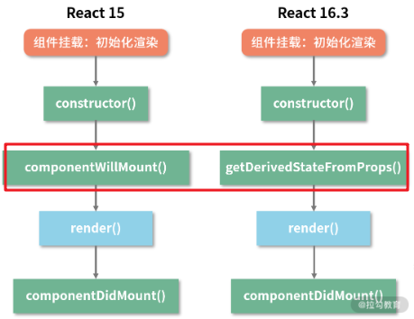
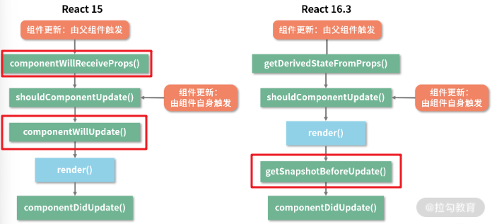
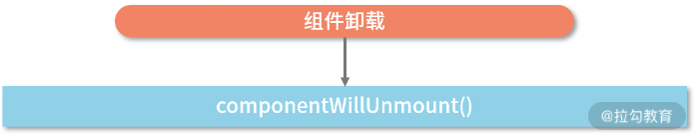

# React 问题

## Q：JSX 的本质是什么，它和 JS 之间到底是什么关系？

A：JSX 是 JavaScript 的一种语法扩展，它和模板语言很接近，但是它充分具备 JavaScript 的能力。

## Q：为什么要用 JSX？不用会有什么后果？

A：JSX 语法糖允许前端开发者使用我们最为熟悉的类 HTML 标签语法来创建虚拟 DOM，在降低学习成本的同时，也提升了研发效率与研发体验**。**

## Q：JSX 背后的功能模块是什么，这个功能模块都做了哪些事情？

A：JSX 实际上是在调用 `React.createElement`方法。`React.createElement`接受三个参数：`type、props、children`。主要完成了以下几个任务：

1. 创建一个虚拟 DOM 元素，代表 UI 中的一个组件或元素。
2. 将 JSX 中的属性转换为 props 对象。
3. 处理嵌套的子元素，将它们转换为相应的虚拟 DOM 结构。
4. 返回表示整个 JSX 结构的虚拟 DOM 元素。

这些虚拟 DOM 元素最终会被 React 的调解器（`reconciler`）处理，用于更新实际的 DOM 并保持 UI 的同步。

## Q：为什么 React 16 要更改组件的生命周期？

A：现象： Mounting 阶段：组件的初始化渲染（挂载）



```javascript
/* 1. 静态方法 */
/* 2. 2个参数分别代表当前组件接收到的来自父组件的 props 和当前组件自身的 state */
/* 3. 一个对象格式的返回值或者 null */
static getDerivedStateFromProps(nextProps, prevState) {
  return null
}
```

`componentWillMount` 可能导致的一些主要错误和问题：

1. **异步数据加载问题**：
   - `componentWillMount` 方法在服务端渲染和客户端渲染中都会被调用。由于它在组件首次渲染之前调用，任何在此方法中触发的异步数据加载操作可能会导致不一致的数据状态，特别是在服务端渲染时。
2. **Side Effects（副作用）问题**：
   - 由于 `componentWillMount` 在渲染之前被调用，任何在此方法中进行的副作用操作（如 AJAX 请求、订阅等）可能会导致意外的行为。例如，如果在渲染过程中出现错误，组件可能会被卸载，这会导致在 `componentWillMount` 中启动的副作用操作无法正确地清理。
3. **重复调用问题**：
   - 在某些情况下，React 可能会多次调用 `componentWillMount`，这会导致重复的副作用操作。这在一些情况下会导致性能问题或意外行为。
4. **与异步渲染不兼容**：
   - React 正在向异步渲染模式（Concurrent Mode）发展，而 `componentWillMount` 的设计并不适合这种模式。异步渲染允许 React 中断和恢复渲染工作，而在 `componentWillMount` 中进行的任何操作在这种情况下可能会被多次调用或中断，导致不可预测的结果。
5. **提前调用导致不一致状态**：
   - `componentWillMount` 在组件挂载之前调用，这意味着在此方法中进行的状态更新可能在组件的初始渲染时还未反映出来。这会导致组件在首次渲染时处于不一致的状态。

Updating 阶段：组件的更新



```javascript
getSnapshotBeforeUpdate(prevProps, prevState) {
  // ...
}
componentDidUpdate(prevProps, prevState, snapshot) {
  // ...
}
```

**getSnapshotBeforeUpdate 的返回值会作为第三个参数给到 componentDidUpdate。它的执行时机是在 render 方法之后，真实 DOM 更新之前**。在这个阶段里，我们可以**同时获取到更新前的真实 DOM 和更新前后的 state&props 信息。**

Unmounting 阶段：组件的卸载



卸载阶段的生命周期与 React 15 完全一致。

总结： **React 16 的变更主要涉及引入 Fiber 架构以及对 React 内核的重大重构。这些更改带来了一系列的好处，包括性能的改进、异步渲染的支持以及更精细的控制。**以下是一些主要的原因：

1. **Fiber 架构**： React 16 引入了 Fiber 架构，这是一种基于链表的新的调度算法。Fiber 架构使得 React 能够更好地处理大型和复杂的应用程序，支持异步渲染，使得在渲染过程中能够中断、终止和恢复操作。这有助于提高应用的性能和响应性。
2. **异步渲染的支持**： 为了支持异步渲染，React 16 引入了新的生命周期方法，如 getDerivedStateFromProps 和 getSnapshotBeforeUpdate。这些方法提供更细粒度的控制点，使得开发者能够更灵活地管理组件状态和副作用。
3. **性能优化**： Fiber 架构以及与之相关的生命周期的更改，使 React 能够更有效地利用浏览器的空闲时间，优化渲染过程，减少不必要的计算和布局操作，提高整体性能。
4. **更好的错误处理**： React 16 引入了新的错误边界机制，使得在组件树的任何位置发生错误时，可以更清晰地捕获和处理这些错误，而不至于导致整个应用崩溃。
5. **一致的生命周期命名**： React 16 引入了一些新的生命周期方法，使整个生命周期流程更加一致和直观。这些变化旨在提供更好的开发者体验，使得理解和使用生命周期更加容易。

总体来说，React 16 中更改组件生命周期的**目标是提高性能、支持异步渲染、提供更好的错误处理和一致的开发者体验。这些变化使得 React 更加灵活、强大，并且更适应大型和复杂的应用程序。**

## Q：数据是如何在 React 组件之间流动的？

- 基于 props 的单向数据流
- 利用“发布-订阅”模式驱动数据流

```javascript
class myEventEmitter {
  constructor() {
    // eventMap 用来存储事件和监听函数之间的关系
    this.eventMap = {};
  }
  // type 这里就代表事件的名称
  on(type, handler) {
    // hanlder 必须是一个函数，如果不是直接报错
    if (!(handler instanceof Function)) {
      throw new Error('哥 你错了 请传一个函数');
    }
    // 判断 type 事件对应的队列是否存在
    if (!this.eventMap[type]) {
      // 若不存在，新建该队列
      this.eventMap[type] = [];
    }
    // 若存在，直接往队列里推入 handler
    this.eventMap[type].push(handler);
  }
  // 别忘了我们前面说过触发时是可以携带数据的，params 就是数据的载体
  emit(type, params) {
    // 假设该事件是有订阅的（对应的事件队列存在）
    if (this.eventMap[type]) {
      // 将事件队列里的 handler 依次执行出队
      this.eventMap[type].forEach((handler, index) => {
        // 注意别忘了读取 params
        handler(params);
      });
    }
  }
  off(type, handler) {
    if (this.eventMap[type]) {
      this.eventMap[type].splice(this.eventMap[type].indexOf(handler) >>> 0, 1);
    }
  }
}
```

- 使用 Context API 维护全局状态
- redux

## Q：React Hook 设计动机与工作模式是什么？

A：设计动机： React Hooks 是 React 16.8 引入的一项新特性。

它的设计动机主要是为了解决在组件之间复用状态逻辑的问题，以及在函数式组件中引入更多的特性，如状态和副作用。

React Hooks 的实现机制基于 Fiber 架构，通过 hooks 链表和闭包来追踪和保存组件的状态。这种机制允许函数组件拥有状态，副作用等特性，同时保持了 React 的性能和渲染的一致性。

## Q：react 的时间切片是如何理解？

React 的时间切片（Time Slicing）是 Fiber 架构的一项特性，用于实现异步渲染和可中断性。时间切片允许 React 在多个渲染步骤之间进行暂停和恢复，以便更好地响应用户交互和提高性能。下面是关于时间切片的一些重要概念：

1. 异步渲染：时间切片使得 React 能够将渲染工作分解成多个步骤，并允许在多个步骤之间中断和恢复。这使得 React 可以更好地利用浏览器的空闲时间，实现异步渲染。而不是像传统的同步渲染那样，在开始渲染就必须执行完整个渲染过程。
2. 任务分片（增量渲染）：React 将工作任务划分为小的任务块，称为 "任务分片"。每个任务分片都代表了一小部分工作，React 可以在执行任务分片时中断，并在浏览器空闲时继续执行下一个任务分片。这种方式使得渲染过程不再是一次性地完整执行，而是可以被中断、分批执行。
3. requestIdleCallback：requestIdleCallback 允许开发者在浏览器空闲时执行任务。React 使用这个 API 来调度任务分片的执行。当浏览器空闲时，React 会执行尽可能多的任务分片，然后在下一次空闲时继续执行未完成的任务分片。
4. 中断和恢复：由于任务分片的特性，React 在执行任务时可以中断，而不必等待整个任务执行完成
5. 优先级调度：React 通过任务分片实现了渲染优先级调度。每个任务分片都被赋予一个优先级，React 可以根据任务分片的优先级动态调整任务的执行顺序，确保高优先级的任务能够更早地执行，提高应用的响应速度。
6. Suspense 和 Lazy：Suspense 允许组件在渲染过程中等待异步数据加载完成，而 Lazy 允许延迟加载组件，提高应用的初始加载性能。

## Q：说说 React 的事件机制？

A：React 的事件机制沿袭了事件委托的思想，绝大部分的事件都不会绑定到具体的元素上，而是统一被绑定在页面的 document 上，当事件在具体的 DOM 节点上触发后，最终都会冒泡到 document 上，document 上所绑定的统一时间处理程序会将事件分发到具体的组件实例。在分发事件之前，React 会对事件进行包装，把原生 DOM 事件包装成合成事件。合成事件的优点：

1. 在底层抹平了不同浏览器的差异，在上层面向开发者暴露统一的、稳定的、与 DOM 原生事件相同的事件接口。
2. 自研事件系统使 React 牢牢把握住了事件处理的主动权。

**事件的绑定：** 事件的绑定是在组建的挂载过程中完成的，具体来说是在 completeWork 中完成的。

> completeWork 内部有三个关键动作：
>
> 1. **创建** DOM 节点（createInstance）
> 2. 将 DOM 节点**插入**到 DOM 树中（appendAllChildren）
> 3. 为 DOM 节点**设置属性**（finalizeInitialChildren）

在第 3 步的时候，会遍历 FiberNode 的 props key。当遍历到事件相关的 props 时，就会触发事件的注册链路。 **事件的触发（核心工作流程）：**

1. 事件触发，冒泡到 document；
2. 执行 dispatchEvent
3. 创建事件对应的合成事件对象（SyntheticEvent）
4. 收集事件在**捕获阶段**所波及的回调函数和对应的节点实例
5. 收集事件在**冒泡阶段**所波及的回调函数和对应的节点实例
6. 将前两步收集来的回调按顺序执行，执行时 SyntheticEvent 会作为入参被传入每个回调

## Q：说说你对 Redux 的理解和特点？

A：Redux 是 JavaScript 状态容器，提供可预测化的状态管理。 Redux 的三大原则：

- 单一数据源：整个应用的 state 被储存在一棵 object tree 中，并且这个 object tree 只存在于唯一一个 store 中。
- state 只读：唯一改变 state 的方法就是触发 action，action 是一个用于描述已发生事件的普通对象。
- 使用纯函数来执行修改：为了描述 action 如何改变 state tree ，你需要编写 reducers。

## Q：说说 Redux 的工作原理？

A：Redux 是 Flux 的一种实现形式：  在 redux 中，强制使用 action 来描述变化，为了把 action 和 state 串起来，开发了 reducer 方法。所以，reducer 只是一个接受 state 和 action，并返回新的 state 的函数。如图： 

## Q：说说对 Redux 中间件的理解？常用的中间件有哪些？实现原理？

A：中间件作为 createStore 函数的一个 function 类型的入参被传入。applyMiddlerware 返回的是一个接收 createStore 为入参的函数；

```jsx
function createStore(reducer, preloadedState, enhancer) {
    // 这里处理的是没有设定初始状态的情况，也就是第一个参数和第二个参数都传 function 的情况
    if (typeof preloadedState === 'function' && typeof enhancer === 'undefined') {
        // 此时第二个参数会被认为是 enhancer（中间件）
        enhancer = preloadedState;
        preloadedState = undefined;
    }
    // 当 enhancer 不为空时，便会将原来的 createStore 作为参数传入到 enhancer 中
    if (typeof enhancer !== 'undefined') {
        return enhancer(createStore)(reducer, preloadedState);
    }
    ......
}
```

`action -> middleware1 -> middleware2 -> ··· -> dispatch -> reducer -> nextState` 多个 middleware 通过 compose 逐个调用，最终组合出来的函数，传入 dispatch 作为入参。

## 如何理解 HOC？

> 高阶组件（Higher Order Components）是 React 中用于复用组件逻辑的一种高级技巧。HOC 自身不是 React API 的一部分，它是一种基于 React 的组合特性而形成的设计模式。

高阶组件指的就是**参数为组件，返回值为新组件的函数**。没错，高阶组件本质上是一个函数。

```javascript
const withProps = WrappedComponent => {
  // ... 你的逻辑 ...
  const targetComponent = props => (
    <div className='wrapper-container'>
      <WrappedComponent {...props} />
    </div>
  );
  return targetComponent;
};

const EnhancedAComponent = withProps(Acomponent);
```

## 如何理解 render Props？

> 术语[“render prop”](https://cdb.reacttraining.com/use-a-render-prop-50de598f11ce)是指一种在 React 组件之间使用一个值为函数的 prop 共享代码的简单技术。——React 官方

```javascript
// 假设 checkUserAccess 已经在 utils 文件中被封装为了一段独立的逻辑
import checkUserAccess from './utils
// 定义 render props 组件
const CheckAccess = (props) => {
    // 这部分是通用的逻辑：判断用户身份是否合法
    const isAccessible = checkUserAccess()
    // 将 isAccessible（是否合法） 这个信息传递给目标组件
    return <React.Fragment>
        {props.children({ ...props, isAccessible })}
      </React.Fragment>
};

// 调用
<CheckAccess>
  {props => {
    const { isAccessible } = props;
    return <ChildComponent {...props} isAccessible={isAccessible} />;
  }}
</CheckAccess>
```

```javascript
// 假设 checkUserAccess 已经在 utils 文件中被封装为了一段独立的逻辑
import checkUserAccess from './utils
// 定义 render props 组件
const CheckAccess = (props) => {
    // 这部分是通用的逻辑：判断用户身份是否合法
    const isAccessible = checkUserAccess()
    // 将 isAccessible（是否合法） 这个信息传递给目标组件
    return <React.Fragment>
        {props.checkTaget({ ...props, isAccessible })}
      </React.Fragment>
};

// 调用
<CheckAccess
  checkTaget={props => {
    const { isAccessible } = props;
    return <ChildComponent {...props} isAccessible={isAccessible} />;
  }}
/>
```
