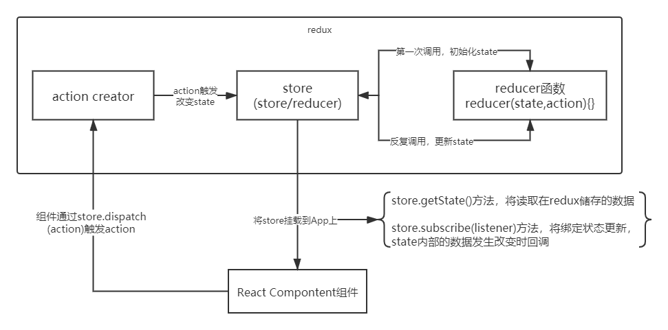

# redux

作用：集中式管理 react 应用中多个组件共享的状态。

## 1.核心 api

### 1.1.createStore()

作用：创建包含指定 reducer 的 store 对象

```jsx
import { createStore } from 'redux';
import reducer from './reducer';
const store = createStore(reducer);
```

### 1.2.store

作用：redux 库最核心的管理对象

它内部维护着：state 和 reducer

核心方法：`getState()`、`dispatch(action)`、`subscribe(listener)`

编码：

```js
store.getState();
store.dispatch({ type: 'INCREMENT', number });
store.subscribe(render);
```

### 1.3.applyMiddleware()

作用：应用上基于 redux 的中间件(插件库)

编码：

```js
import { createStore, applyMiddleware } from 'redux';
import thunk from 'redux-thunk'; // redux 异步中间件
const store = createStore(
  counter,
  applyMiddleware(thunk) // 应用上异步中间件
);
```

### 1.4.combineReducers()

作用：合并多个 reducer 函数

编码：

```js
export default combineReducers({
  user,
  chatUser,
  chat
});
```

## 2.redux 的三个核心概念

### 2.1.action

作用：标识要执行行为的对象

包含 2 个方面的属性

- type：标识属性, 值为字符串, 唯一, 必要属性
- XXX：数据属性，值类型任意，可选属性

例子：

```js
const action = {
  type: 'INCREMENT',
  data: 2
};
```

Action Creator(创建 Action 的工厂函数)

```js
const increment = number => ({ type: 'INCREMENT', data: number });
```

### 2.2.reducer

作用：根据老的 state 和 action, 产生新的 state 的纯函数

样例：

```js
export default function counter(state = 0, action) {
  switch (action.type) {
    case 'INCREMENT':
      return state + action.data;
    case 'DECREMENT':
      return state - action.data;
    default:
      return state;
  }
}
```

注意：返回一个新的状态，不要修改原来的状态

### 2.3.store

将 state,action 与 reducer 联系在一起的对象

```js
import { createStore } from 'redux';
import reducer from './reducer';
const store = createStore(reducer);
```

此对象的功能：

- getState(): 得到 state
- dispatch(action): 分发 action, 触发 reducer 调用, 产生新的 state
- subscribe(listener): 注册监听, 当产生了新的 state 时, 自动调用

## 3.count 计数案例

### 3.1.react 实现计数

```jsx
import React, { Component } from 'react';
export default class App extends Component {
  state = {
    count: 0 // 定义变量
  };

  constructor(props) {
    super(props);
    // 创建ref，将其赋值给一个变量，通过ref挂载在dom节点或组件上，该ref的current属性将能拿到dom节点或组件的实例
    this.numberRef = React.createRef();
  }

  increment = () => {
    // 同步加
    const number = this.numberRef.current.value * 1;
    this.setState(state => ({ count: state.count + number }));
  };

  decrement = () => {
    // 同步减
    const number = this.numberRef.current.value * 1;
    this.setState(state => ({ count: state.count - number }));
  };

  incrementIfOdd = () => {
    // 奇数加
    const number = this.numberRef.current.value * 1;
    if (this.state.count % 2 === 1) {
      this.setState(state => ({ count: state.count + number }));
    }
  };

  incrementAsync = () => {
    // 异步加
    const number = this.numberRef.current.value * 1;
    setTimeout(() => {
      this.setState(state => ({ count: state.count + number }));
    }, 1000);
  };

  render() {
    const count = this.state.count;
    return (
      <div>
        <p>click {count} times</p>
        <div>
          <select ref={this.numberRef}>
            <option value='1'>1</option>
            <option value='2'>2</option>
            <option value='3'>3</option>
          </select>{' '}
          &nbsp;&nbsp;
          <button onClick={this.increment}>+</button>&nbsp;&nbsp;
          <button onClick={this.decrement}>-</button>&nbsp;&nbsp;
          <button onClick={this.incrementIfOdd}>increment if odd</button>
          &nbsp;&nbsp;
          <button onClick={this.incrementAsync}>increment async</button>
        </div>
      </div>
    );
  }
}
```

## 3.2.react_redux 版本


实现思路：



```js
// index.js
import React from 'react';
import ReactDOM from 'react-dom';

import App from './App';
import store from './redux/store';

ReactDOM.render(<App store={store} />, document.getElementById('root'));

// 给store绑定状态更新的监听
store.subscribe(() => {
  // store内部的状态数据发生改变时回调
  // 重新渲染App组件标签
  ReactDOM.render(<App store={store} />, document.getElementById('root'));
});
```

```js
// redux/store.js
// redux最核心的管理对象: store
import { createStore } from 'redux';
import reducer from './reducer';

export default createStore(reducer); // 创建store对象内部会第一次调用reducer()得到初始状态值
```

```js
// redux/reducer.js
// reducer函数模块: 根据当前state和指定action返回一个新的state

import { INCREMENT, DECREMENT } from './action-types';

// 管理count状态数据的reducer
export default function count(state = 1, action) {
  console.log('count()', state, action);
  switch (action.type) {
    case INCREMENT:
      return state + action.data;
    case DECREMENT:
      return state - action.data;
    default:
      return state;
  }
}
```

```js
// redux/action-types.js
// 包含n个action type常量名称的模块

export const INCREMENT = 'increment';
export const DECREMENT = 'decrement';
```

```js
// redux/action.js
// 包含n个用来创建action的工厂函数(action creator)

import { INCREMENT, DECREMENT } from './action-types';

/*
增加的action
 */
export const increment = number => ({ type: INCREMENT, data: number });
/*
减少的action
 */
export const decrement = number => ({ type: DECREMENT, data: number });
```

```jsx
// App.jsx
import React, { Component } from 'react';
import PropTypes from 'prop-types';
// 引入 actions，在store.dispatch()触发更新
import { increment, decrement } from './redux/actions';

export default class App extends Component {
  static propTypes = {
    store: PropTypes.object.isRequired
  };

  constructor(props) {
    super(props);

    this.numberRef = React.createRef();
  }

  increment = () => {
    const number = this.numberRef.current.value * 1;
    this.props.store.dispatch(increment(number));
  };

  decrement = () => {
    const number = this.numberRef.current.value * 1;
    this.props.store.dispatch(decrement(number));
  };

  incrementIfOdd = () => {
    const number = this.numberRef.current.value * 1;
    if (this.props.store.getState() % 2 === 1) {
      this.props.store.dispatch(increment(number));
    }
  };

  incrementAsync = () => {
    const number = this.numberRef.current.value * 1;
    setTimeout(() => {
      this.props.store.dispatch(increment(number));
    }, 1000);
  };

  render() {
    const count = this.props.store.getState();

    return (
      <div>
        <p>click {count} times</p>

        <div>
          <select ref={this.numberRef}>
            <option value='1'>1</option>
            <option value='2'>2</option>
            <option value='3'>3</option>
          </select>{' '}
          &nbsp;&nbsp;
          <button onClick={this.increment}>+</button>&nbsp;&nbsp;
          <button onClick={this.decrement}>-</button>&nbsp;&nbsp;
          <button onClick={this.incrementIfOdd}>increment if odd</button>&nbsp;&nbsp;
          <button onClick={this.incrementAsync}>increment async</button>
        </div>
      </div>
    );
  }
}
```

缺点：

1. redux 与 react 组件的代码耦合度太高

2. 编码不够简洁

## 4.react-redux 库

一个 react 插件库，专门用来简化 react 应用中使用 redux。

React-Redux 将所有组件分成两大类：

- UI 组件
  a. 只负责 UI 的呈现，不带有任何业务逻辑
  b. 通过 props 接收数据(一般数据和函数)
  c. 不使用任何 Redux 的 API
  d. 一般保存在 components 文件夹下
- 容器组件
  a. 负责管理数据和业务逻辑，不负责 UI 的呈现
  b. 使用 Redux 的 API
  c. 一般保存在 containers 文件夹下


### 4.1.相关 api

**Provider**：

```jsx
// 让所有组件都可以得到 state 数据
<Provider store={store}>
  <App />
</Provider>
```

**connect()**：

```js
// 用于包装 UI 组件生成容器组件
connect(mapStateToprops, mapDispatchToProps)(Counter);
```

**mapStateToprops()**

```js
// 函数: 将 state 数据转换为 UI 组件的标签属性
function mapStateToProps(state) {
  return {
    count: state
  };
}
```

**mapDispatchToProps**：

```js
// 函数: 将分发 action 的函数转换为 UI 组件的标签属性
function mapDispatchToProps(dispatch) {
  return {
    increment: number => dispatch(increment(number)),
    decrement: number => dispatch(decrement(number))
  };
}
// 对象: 简洁语法, 可以直接指定包含多个 action 方法
const mapDispatchToProps = {
  increment,
  decrement
};
```

### 4.2.react-redux 版本

```hash
npm install --save react-redux

redux/action-types.js 不变
redux/actions.js 不变
redux/reducers.js 不变
redux/store.js 不变
```

```JS
// containers/App.js
import {connect} from 'react-redux'
import Counter from '../components/Counter'
import {increment, decrement} from '../redux/actions'

/*
// 指定向Counter传入哪些一般属性(属性值的来源就是store中的state)
const mapStateToProps = (state) => ({count: state})
// 指定向Counter传入哪些函数属性
// 如果是函数, 会自动调用得到对象, 将对象中的方法作为函数属性传入UI组件
const mapDispatchToProps = (dispatch) => ({
  increment: (number) => dispatch(increment(number)),
  decrement: (number) => dispatch(decrement(number)),
})
// 如果是对象, 将对象中的方法包装成一个新函数, 并传入UI组件
// const mapDispatchToProps = {increment, decrement}

export default connect(
  mapStateToProps,
  mapDispatchToProps
)(Counter)*/

export default connect(
  state => ({count: state}),
  {increment, decrement},
)(Counter)
```

```jsx
// components/Counter.jsx
import React, { Component } from 'react';
import PropTypes from 'prop-types';

/*
UI组件
  主要做显示与与用户交互
  代码中没有任何redux相关的代码
 */
export default class Counter extends Component {
  static propTypes = {
    count: PropTypes.number.isRequired,
    increment: PropTypes.func.isRequired,
    decrement: PropTypes.func.isRequired
  };

  constructor(props) {
    super(props);
    this.numberRef = React.createRef();
  }

  increment = () => {
    const number = this.numberRef.current.value * 1;
    this.props.increment(number);
  };

  decrement = () => {
    const number = this.numberRef.current.value * 1;
    this.props.decrement(number);
  };

  incrementIfOdd = () => {
    const number = this.numberRef.current.value * 1;
    if (this.props.count % 2 === 1) {
      this.props.increment(number);
    }
  };

  incrementAsync = () => {
    const number = this.numberRef.current.value * 1;
    setTimeout(() => {
      this.props.increment(number);
    }, 1000);
  };

  render() {
    const count = this.props.count;
    return (
      <div>
        <p>click {count} times</p>
        <div>
          <select ref={this.numberRef}>
            <option value='1'>1</option>
            <option value='2'>2</option>
            <option value='3'>3</option>
          </select>{' '}
          &nbsp;&nbsp;
          <button onClick={this.increment}>+</button>&nbsp;&nbsp;
          <button onClick={this.decrement}>-</button>&nbsp;&nbsp;
          <button onClick={this.incrementIfOdd}>increment if odd</button>&nbsp;&nbsp;
          <button onClick={this.incrementAsync}>increment async</button>
        </div>
      </div>
    );
  }
}
```

```js
// 入口js
import React from 'react';
import ReactDOM from 'react-dom';
import { Provider } from 'react-redux';
import App from './containers/App';
import store from './redux/store';

ReactDOM.render(
  <Provider store={store}>
    <App />
  </Provider>,
  document.getElementById('root')
);
```

## 5.redux-thunk 异步中间件

`npm install --save redux-thunk`

```js
// redux/store.js
import { createStore, applyMiddleware } from 'redux';
import thunk from 'redux-thunk'; // 引入依赖
import reducer from './reducer';

export default createStore(reducer, applyMiddleware(thunk));
```

```js
// redux/actions.js
/*
  异步增加的异步 action
 */
export const incrementAsync = function (number) {
  // 返回一个带 dispatch 参数的函数
  return dispatch => {
    // 执行异步操作
    setTimeout(() => {
      // 有了结果后, 通过同步的increment分发 action
      dispatch(increment(number));
    }, 1000);
  };
};
```

```js
// components/Counter.jsx
import React, { Component } from 'react';
import PropTypes from 'prop-types';

/*
UI组件
  主要做显示与与用户交互
  代码中没有任何redux相关的代码
 */
export default class Counter extends Component {
  static propTypes = {
    count: PropTypes.number.isRequired,
    increment: PropTypes.func.isRequired,
    decrement: PropTypes.func.isRequired,
    incrementAsync: PropTypes.func.isRequired // 引入异步方法
  };

  constructor(props) {
    super(props);
    this.numberRef = React.createRef();
  }

  increment = () => {
    const number = this.numberRef.current.value * 1;
    this.props.increment(number);
  };

  decrement = () => {
    const number = this.numberRef.current.value * 1;
    this.props.decrement(number);
  };

  incrementIfOdd = () => {
    const number = this.numberRef.current.value * 1;
    if (this.props.count % 2 === 1) {
      this.props.increment(number);
    }
  };

  incrementAsync = () => {
    const number = this.numberRef.current.value * 1;
    // 使用 thunk 异步增加
    this.props.incrementAsync(number);
  };

  render() {
    const count = this.props.count;
    return (
      <div>
        <p>click {count} times</p>
        <div>
          <select ref={this.numberRef}>
            <option value='1'>1</option>
            <option value='2'>2</option>
            <option value='3'>3</option>
          </select>{' '}
          &nbsp;&nbsp;
          <button onClick={this.increment}>+</button>&nbsp;&nbsp;
          <button onClick={this.decrement}>-</button>&nbsp;&nbsp;
          <button onClick={this.incrementIfOdd}>increment if odd</button>&nbsp;&nbsp;
          <button onClick={this.incrementAsync}>increment async</button>
        </div>
      </div>
    );
  }
}
```

```js
// containers/App.jsx
import { connect } from 'react-redux';
import Counter from '../components/Counter';
// 将 incrementAsync 挂载到 Counter
import { increment, decrement, incrementAsync } from '../redux/actions';

export default connect(state => ({ count: state }), { increment, decrement, incrementAsync })(Counter);
```

## 6.redux 调试工具

在`chrome`安装`redux-devtool`插件

项目中下载依赖：`npm install --save-dev redux-devtools-extension`

```js
// // redux/store.js
import { createStore, applyMiddleware } from 'redux';
// 引入这个工具
import { composeWithDevTools } from 'redux-devtools-extension';
import thunk from 'redux-thunk';
import reducer from './reducer';

export default createStore(reducer, composeWithDevTools(applyMiddleware(thunk)));
```
