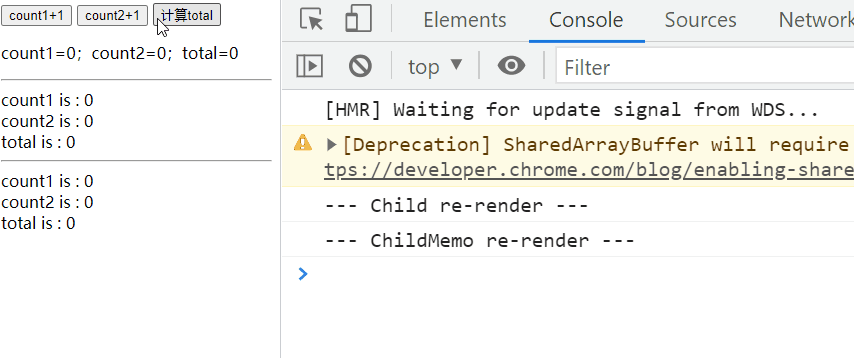

# React.memo

## 用法

`React.memo` 的作用：如果你的组件在相同 props 的情况下渲染相同的结果，那么你可以通过将其包装在
`React.memo` 中调用，以此通过记忆组件渲染结果的方式来提高组件的性能表现。这意味着在这种情况下，React
将跳过渲染组件的操作并直接复用最近一次渲染的结果。

对于`Function Component`，react 提供了 `React.memo` 这个 HOC，与 `class component` 的
`PureComponent` 相似。

`React.memo()` 的用法

```js
const App = React.memo(
  props => {
    /* 使用 props 渲染 */
  },
  (prevProps, nextProps) => {
    /*
    如果把 nextProps 传入 render 方法的返回结果与
    将 prevProps 传入 render 方法的返回结果一致则返回 true，
    否则返回 false
  */
  }
);
```

注意： React.memo 仅检查 props 变更。如果函数组件被 React.memo 包裹，且其实现中拥有
useState，useReducer 或 useContext 的 Hook，当 context 发生变化时，它仍会重新渲染。

测试案例：

1. 父组件存在 count1 和 count2，以及他们的和 total，然后点击按钮 +1，以及计算 total
2. 存在俩个子组件：Child 和 ChildMemo
3. Child 组件为普通组件，并获取父组件的 count1 count2 total 并展示
4. ChildMemo 组件使用 memo 包裹，获取 total 并展示

```jsx
import React, { useState, memo } from 'react';

export default (props = {}) => {
  const [count1, setCount1] = useState(0),
    [count2, setCount2] = useState(0),
    [total, setTotal] = useState(0);

  return (
    <div>
      <button onClick={() => setCount1(count1 + 1)}>count1+1</button>{' '}
      <button onClick={() => setCount2(count2 + 1)}>count2+1</button>{' '}
      <button onClick={() => setTotal(count2 + count1)}>计算total</button>
      <p>
        count1={count1}；count2={count2}；total={total}
      </p>
      <hr />
      <Child
        count1={count1}
        count2={count2}
        total={total}
      />
      <hr />
      <ChildMemo
        count1={count1}
        count2={count2}
        total={total}
      />
    </div>
  );
};

const Child = props => {
  console.log(`--- Child re-render ---`);
  return (
    <div>
      <div>count1 is : {props.count1}</div>
      <div>count2 is : {props.count2}</div>
      <div>total is : {props.total}</div>
    </div>
  );
};

// 如果 props 相等，areEqual 会返回 true；如果 props 不相等，则返回 false
const isEqual = (prevProps, nextProps) => {
  if (prevProps.total !== nextProps.total) {
    // 更新
    return false;
  }
  return true;
};

const ChildMemo = memo(props => {
  console.log(`--- ChildMemo re-render ---`);
  return (
    <div>
      <div>count1 is : {props.count1}</div>
      <div>count2 is : {props.count2}</div>
      <div>total is : {props.total}</div>
    </div>
  );
}, isEqual);
```

点击 count1 和 count2 加一，Child 组件跟着渲染，点击 计算 total 按钮，Child ChildMemo 都会渲染。结果
如图：



`React.memo` 就是对 `ShouldUpdateCompontent` 的 props 的优化。

## 链接

- [React.memo](https://zh-hans.reactjs.org/docs/react-api.html#reactmemo)
- [React.memo 与 useMemo](https://zhuanlan.zhihu.com/p/105940433)
