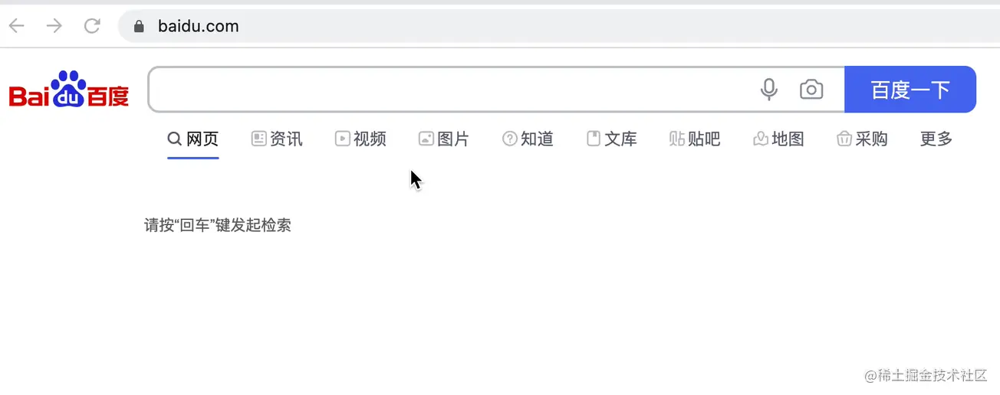
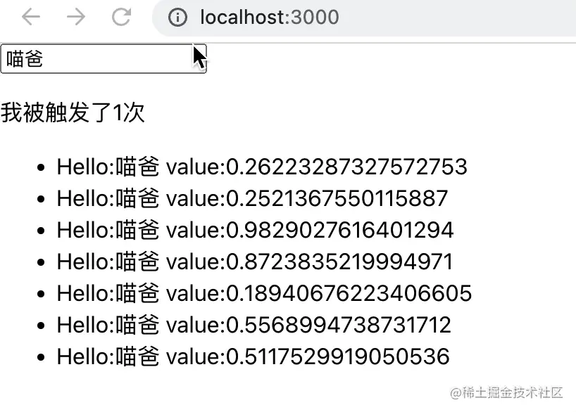

# React.useDeferredValue

> lets you defer updating the less important parts of the screen.
>
> 允许用户推迟屏幕更新优先级不高部分。通俗来讲，如果说某些渲染比较消耗性能，比如存在实时计算和反馈，我们可以使用这个`Hook`降低其计算的优先级，使得避免整个应用变得卡顿。

较多的场景可能就在于用户反馈输入上。比如百度的输入框，用户可能输入的很快，相信大家还有个体会，就是我们使用输入法的时候，中间还在选打哪个字呢，拼音或者输入片段就已经被搜索了。



这里就存在问题了，用户连续输入的时候，不停地在进行计算或者调用后端服务，其实中间态的很多输入片段的信息是无用的，既浪费了服务资源，也因为`React`应用实时更新和 JS 的单线程特性导致其他渲染任务卡顿。那我们使用`useDeferredValue`来使用下，如何避免这个问题。

## 代码案例

```jsx
import React, { useState, useEffect } from 'react';

const List = props => {
  const [list, setList] = useState([]);
  const [count, setCount] = useState(0);

  useEffect(() => {
    setCount(count => count + 1);
    setTimeout(() => {
      setList([
        { name: props.text, value: Math.random() },
        { name: props.text, value: Math.random() },
        { name: props.text, value: Math.random() },
        { name: props.text, value: Math.random() },
        { name: props.text, value: Math.random() },
        { name: props.text, value: Math.random() },
        { name: props.text, value: Math.random() }
      ]);
    }, 500);
  }, [props.text]);
  return [
    <p>{'我被触发了' + count + '次'}</p>,
    <ul>
      {list.map(item => (
        <li>
          Hello:{item.name} value:{item.value}
        </li>
      ))}
    </ul>
  ];
};

export default function App() {
  const [text, setText] = useState('喵爸');

  const handleChange = e => {
    setText(e.target.value);
  };
  return (
    <div className='App'>
      <input
        value={text}
        onChange={handleChange}
      />
      <List text={text} />
    </div>
  );
}
```

一般我们的代码是这样写的。输入框的值变化的时候，我们使用`setTimeout`来模拟下向后端请求数据，或者大量计算的耗时操作。这个时候只要输入框的内容发生变化就会触发`useEffect`，我们用`count`来进行计数。

接下来改造一下：

```jsx
export default function App() {
  const [text, setText] = useState('喵爸');
  // 添加代码
  const deferredText = useDeferredValue(text, { timeoutMs: 300 });
  const handleChange = e => {
    setText(e.target.value);
  };
  return (
    <div className='App'>
      <input
        value={text}
        onChange={handleChange}
      />
      {/* 添加代码 */}
      <List text={deferredText} />
    </div>
  );
}
```

们仅需要修改外部组件，使得传入`List`的`Text`变量是一个延迟更新的值。



细心的同学可以发现了，咦？！好像没什么区别呀。其实原因在于，首先`timeoutMs`这个参数的含义是延迟的值允许延迟多久，事实上网络和设备允许的情况下，`React`会尝试使用更低的延迟。这一点是不是非常 nice 呀。
