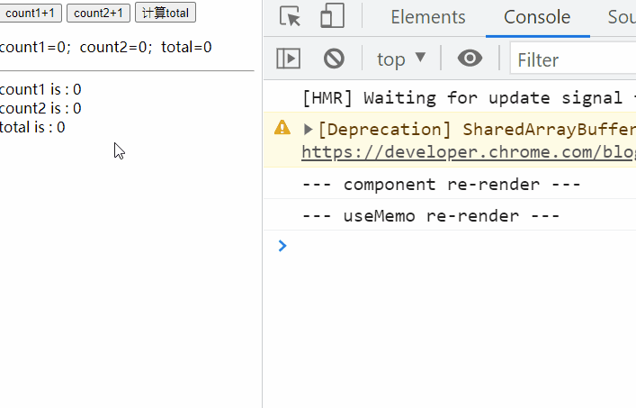

# React.useMemo

- `React.memo` 不足： 在使用 `React.memo` 进行性能优化时，只能进行组件间的 props 优化，但是对一个庞
  大的组件来说，除了 props，还有存在组件内部的 state，这时需要进行组件内部的属性进行优化，React.memo
  就显的不足。
- `React.useMemo` 主要用来解决使用 `React hooks` 产生的无用渲染的性能问题。

## 基本用法

useMemo() 基本用法如下：

```jsx
const memoizedValue = useMemo(() => computeExpensiveValue(a, b), [a, b]);
```

如果没有提供依赖项数组，useMemo 在每次渲染时都会计算新的值。

## 测试案例

1. 父组件给子组件传递值 count1 count2 total
2. 子组件分别使用 useMemo 返回一个复杂组件 和 一个对象
3. 当点击 count1+1 按钮时， 子组件渲染了，但是 useMemo 函数没有渲染

```jsx
import React, { useState, useMemo } from 'react';

export default () => {
  const [count1, setCount1] = useState(0),
    [count2, setCount2] = useState(0),
    [total, setTotal] = useState(0);

  return (
    <div>
      <button onClick={() => setCount1(count1 + 1)}>count1+1</button>{' '}
      <button onClick={() => setCount2(count2 + 1)}>count2+1</button>{' '}
      <button onClick={() => setTotal(count2 + count1)}>计算total</button>
      <p>
        count1={count1}；count2={count2}；total={total}
      </p>
      <hr />
      <ChildUseMemo
        count1={count1}
        count2={count2}
        total={total}
      />
    </div>
  );
};

const ChildUseMemo = (props = {}) => {
  console.log(`--- component re-render ---`);
  const countMome = useMemo(() => {
    console.log(`--- useMemo re-render ---`);
    return <div>count2 is : {props.count2}</div>;
  }, [props.count2]);
  const totalMome = useMemo(() => ({ total: props.total }), [props.total]);
  return (
    <div>
      <div>count1 is : {props.count1}</div>
      {countMome}
      <div>total is : {totalMome.total}</div>
    </div>
  );
};
```

结果：


