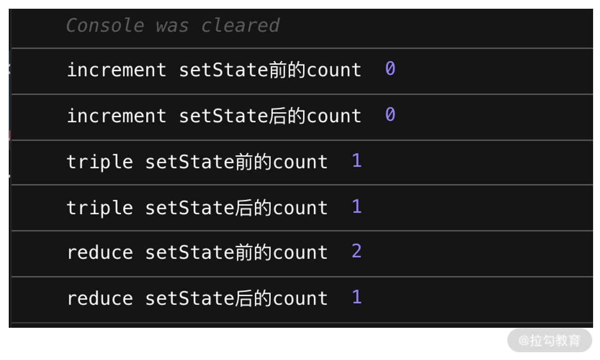
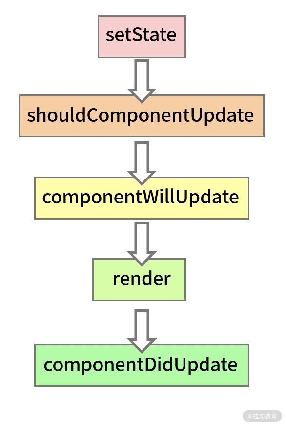
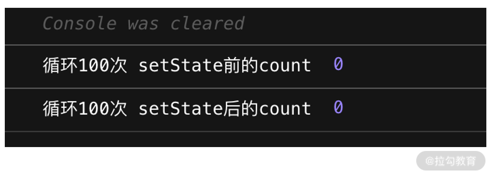

# 11 etState 到底是同步的，还是异步的？

setState 对于许多的 React 开发者来说，像是一个“最熟悉的陌生人”：

- 当你入门 React 的时候，接触的第一波 API 里一定有 setState——数据驱动视图，没它就没法创造变化；
- 当你项目的数据流乱作一团的时候，层层排查到最后，始作俑者也往往是 setState——工作机制太复杂，文档又不说清楚，只能先“摸着石头过河”。

久而久之，setState 的工作机制渐渐与 React 调和算法并驾齐驱，成了 React 核心原理中区分度最高的知识模块之一。本讲我们就紧贴 React 源码和时下最高频的面试题目，帮你从根儿上理解 setState 工作流。

### 从一道面试题说起

这是一道变体繁多的面试题，在 BAT 等一线大厂的面试中考察频率非常高。首先题目会给出一个这样的 App 组件，在它的内部会有如下代码所示的几个不同的 setState 操作：

```jsx
import React from 'react';
import './styles.css';
export default class App extends React.Component {
  state = {
    count: 0
  };
  increment = () => {
    console.log('increment setState前的count', this.state.count);
    this.setState({
      count: this.state.count + 1
    });
    console.log('increment setState后的count', this.state.count);
  };
  triple = () => {
    console.log('triple setState前的count', this.state.count);
    this.setState({
      count: this.state.count + 1
    });
    this.setState({
      count: this.state.count + 1
    });
    this.setState({
      count: this.state.count + 1
    });
    console.log('triple setState后的count', this.state.count);
  };
  reduce = () => {
    setTimeout(() => {
      console.log('reduce setState前的count', this.state.count);
      this.setState({
        count: this.state.count - 1
      });
      console.log('reduce setState后的count', this.state.count);
    }, 0);
  };
  render() {
    return (
      <div>
        <button onClick={this.increment}>点我增加</button>
        <button onClick={this.triple}>点我增加三倍</button>
        <button onClick={this.reduce}>点我减少</button>
      </div>
    );
  }
}
```

接着我把组件挂载到 DOM 上：

```jsx
import React from 'react';
import ReactDOM from 'react-dom';
import App from './App';
const rootElement = document.getElementById('root');
ReactDOM.render(
  <React.StrictMode>
    <App />
  </React.StrictMode>,
  rootElement
);
```

此时浏览器里渲染出来的是如下图所示的三个按钮：


此时有个问题，若从左到右依次点击每个按钮，控制台的输出会是什么样的？读到这里，建议你先暂停 1 分钟在脑子里跑一下代码，看看和下图实际运行出来的结果是否有出入。



如果你是一个熟手 React 开发，那么 increment 这个方法的输出结果想必难不倒你——正如许许多多的 React 入门教学所声称的那样，“setState 是一个异步的方法”，这意味着当我们执行完 setState 后，state 本身并不会立刻发生改变。 因此紧跟在 setState 后面输出的 state 值，仍然会维持在它的初始状态（0）。在同步代码执行完毕后的某个“神奇时刻”，state 才会“恰恰好”地增加到 1。

但这个“神奇时刻”到底何时发生，所谓的“恰恰好”又如何界定呢？如果你对这个问题搞不太清楚，那么 triple 方法的输出对你来说就会有一定的迷惑性——setState 一次不好使， setState 三次也没用，state 到底是在哪个环节发生了变化呢？

带着这样的困惑，你决定先抛开一切去看看 reduce 方法里是什么光景，结果更令人大跌眼镜，reduce 方法里的 setState 竟然是同步更新的！这......到底是我们初学 React 时拿到了错误的基础教程，还是电脑坏了？

要想理解眼前发生的这魔幻的一切，我们还得从 setState 的工作机制里去找线索。

### 异步的动机和原理——批量更新的艺术

我们首先要认知的一个问题：在 setState 调用之后，都发生了哪些事情？基于截止到现在的专栏知识储备，你可能会更倾向于站在生命周期的角度去思考这个问题，得出一个如下图所示的结论：



从图上我们可以看出，一个完整的更新流程，涉及了包括 re-render（重渲染） 在内的多个步骤。re-render 本身涉及对 DOM 的操作，它会带来较大的性能开销。假如说“一次 setState 就触发一个完整的更新流程”这个结论成立，那么每一次 setState 的调用都会触发一次 re-render，我们的视图很可能没刷新几次就卡死了。这个过程如我们下面代码中的箭头流程图所示：

```jsx
this.setState({
  count: this.state.count + 1    ===>    shouldComponentUpdate->componentWillUpdate->render->componentDidUpdate
});
this.setState({
  count: this.state.count + 1    ===>    shouldComponentUpdate->componentWillUpdate->render->componentDidUpdate
});
this.setState({
  count: this.state.count + 1    ===>    shouldComponentUpdate->componentWillUpdate->render->componentDidUpdate
});
```

事实上，这正是 setState 异步的一个重要的动机——**避免频繁的 re-render**。

在实际的 React 运行时中，setState 异步的实现方式有点类似于 Vue 的 $nextTick 和浏览器里的 Event-Loop：**每来一个 setState，就把它塞进一个队列里“攒起来”。等时机成熟，再把“攒起来”的 state 结果做合并，最后只针对最新的 state 值走一次更新流程。这个过程，叫作“批量更新”**，批量更新的过程正如下面代码中的箭头流程图所示：

```jsx
this.setState({
  count: this.state.count + 1    ===>    入队，[count+1的任务]
});
this.setState({
  count: this.state.count + 1    ===>    入队，[count+1的任务，count+1的任务]
});
this.setState({
  count: this.state.count + 1    ===>    入队, [count+1的任务，count+1的任务, count+1的任务]
});
                                          ↓
                                         合并 state，[count+1的任务]
                                          ↓
                                         执行 count+1的任务
```

值得注意的是，只要我们的同步代码还在执行，“攒起来”这个动作就不会停止。（注：这里之所以多次 +1 最终只有一次生效，是因为在同一个方法中多次 setState 的合并动作不是单纯地将更新累加。比如这里对于相同属性的设置，React 只会为其保留最后一次的更新）。因此就算我们在 React 中写了这样一个 100 次的 setState 循环：

```jsx
test = () => {
  console.log('循环100次 setState前的count', this.state.count);
  for (let i = 0; i < 100; i++) {
    this.setState({
      count: this.state.count + 1
    });
  }
  console.log('循环100次 setState后的count', this.state.count);
};
```

也只是会增加 state 任务入队的次数，并不会带来频繁的 re-render。当 100 次调用结束后，仅仅是 state 的任务队列内容发生了变化， state 本身并不会立刻改变：



### “同步现象”背后的故事：从源码角度看 setState 工作流

读到这里，相信你对异步这回事多少有些眉目了。接下来我们就要重点理解刚刚代码里最诡异的一部分——setState 的同步现象：

```jsx
reduce = () => {
  setTimeout(() => {
    console.log('reduce setState前的count', this.state.count);
    this.setState({
      count: this.state.count - 1
    });
    console.log('reduce setState后的count', this.state.count);
  }, 0);
};
```

从题目上看，setState 似乎是在 setTimeout 函数的“保护”之下，才有了同步这一“特异功能”。事实也的确如此，假如我们把 setTimeout 摘掉，setState 前后的 console 表现将会与 increment 方法中无异：

```jsx
reduce = () => {
  // setTimeout(() => {
  console.log('reduce setState前的count', this.state.count);
  this.setState({
    count: this.state.count - 1
  });
  console.log('reduce setState后的count', this.state.count);
  // },0);
};
```

点击后的输出结果如下图所示：


现在问题就变得清晰多了：为什么 setTimeout 可以将 setState 的执行顺序从异步变为同步？

这里我先给出一个结论：**并不是 setTimeout 改变了 setState，而是 setTimeout 帮助 setState “逃脱”了 React 对它的管控。只要是在 React 管控下的 setState，一定是异步的**。

接下来我们就从 React 源码里，去寻求佐证这个结论的线索。

> tips：时下虽然市场里的 React 16、React 17 十分火热，但就 setState 这块知识来说，React 15 仍然是最佳的学习素材。因此下文所有涉及源码的分析，都会围绕 React 15 展开。关于 React 16 之后 Fiber 机制给 setState 带来的改变，我们会有专门一讲来分析，不在本讲的讨论范围内。

#### 解读 setState 工作流

我们阅读任何框架的源码，都应该带着问题、带着目的去读。React 中对于功能的拆分是比较细致的，setState 这部分涉及了多个方法。为了方便你理解，我这里先把主流程提取为一张大图：


接下来我们就沿着这个流程，逐个在源码中对号入座。首先是 setState 入口函数：

```jsx
ReactComponent.prototype.setState = function (partialState, callback) {
  this.updater.enqueueSetState(this, partialState);
  if (callback) {
    this.updater.enqueueCallback(this, callback, 'setState');
  }
};
```

入口函数在这里就是充当一个分发器的角色，根据入参的不同，将其分发到不同的功能函数中去。这里我们以对象形式的入参为例，可以看到它直接调用了 this.updater.enqueueSetState 这个方法：

```jsx
enqueueSetState: function (publicInstance, partialState) {
  // 根据 this 拿到对应的组件实例
  var internalInstance = getInternalInstanceReadyForUpdate(publicInstance, 'setState');
  // 这个 queue 对应的就是一个组件实例的 state 数组
  var queue = internalInstance._pendingStateQueue || (internalInstance._pendingStateQueue = []);
  queue.push(partialState);
  //  enqueueUpdate 用来处理当前的组件实例
  enqueueUpdate(internalInstance);
}
```

这里我总结一下，enqueueSetState 做了两件事：

- 将新的 state 放进组件的状态队列里；
- 用 enqueueUpdate 来处理将要更新的实例对象。

继续往下走，看看 enqueueUpdate 做了什么：

```jsx
function enqueueUpdate(component) {
  ensureInjected();
  // 注意这一句是问题的关键，isBatchingUpdates标识着当前是否处于批量创建/更新组件的阶段
  if (!batchingStrategy.isBatchingUpdates) {
    // 若当前没有处于批量创建/更新组件的阶段，则立即更新组件
    batchingStrategy.batchedUpdates(enqueueUpdate, component);
    return;
  }
  // 否则，先把组件塞入 dirtyComponents 队列里，让它“再等等”
  dirtyComponents.push(component);
  if (component._updateBatchNumber == null) {
    component._updateBatchNumber = updateBatchNumber + 1;
  }
}
```

这个 enqueueUpdate 非常有嚼头，它引出了一个关键的对象——batchingStrategy，该对象所具备的 isBatchingUpdates 属性直接决定了当下是要走更新流程，还是应该排队等待；其中的 batchedUpdates 方法更是能够直接发起更新流程。由此我们可以大胆推测，**batchingStrategy 或许正是 React 内部专门用于管控批量更新的对象**。
接下来，我们就一起来研究研究这个 batchingStrategy。

```
/**
 * batchingStrategy源码
 **/
var ReactDefaultBatchingStrategy = {
  // 全局唯一的锁标识
  isBatchingUpdates: false,

  // 发起更新动作的方法
  batchedUpdates: function (callback, a, b, c, d, e) {
    // 缓存锁变量
    var alreadyBatchingStrategy = ReactDefaultBatchingStrategy.isBatchingUpdates;
    // 把锁“锁上”
    ReactDefaultBatchingStrategy.isBatchingUpdates = true;
    if (alreadyBatchingStrategy) {
      callback(a, b, c, d, e);
    } else {
      // 启动事务，将 callback 放进事务里执行
      transaction.perform(callback, null, a, b, c, d, e);
    }
  }
};
```

batchingStrategy 对象并不复杂，你可以理解为它是一个“锁管理器”。

这里的“锁”，是指 React 全局唯一的 isBatchingUpdates 变量，isBatchingUpdates 的初始值是 false，意味着“当前并未进行任何批量更新操作”。每当 React 调用 batchedUpdate 去执行更新动作时，会先把这个锁给“锁上”（置为 true），表明“现在正处于批量更新过程中”。当锁被“锁上”的时候，任何需要更新的组件都只能暂时进入 dirtyComponents 里排队等候下一次的批量更新，而不能随意“插队”。此处体现的“任务锁”的思想，是 React 面对大量状态仍然能够实现有序分批处理的基石。

理解了批量更新整体的管理机制，还需要注意 batchedUpdates 中，有一个引人注目的调用：

```jsx
transaction.perform(callback, null, a, b, c, d, e);
```

这行代码为我们引出了一个更为硬核的概念——React 中的 Transaction（事务）机制。

#### 理解 React 中的 Transaction（事务） 机制

Transaction 在 React 源码中的分布可以说非常广泛。如果你在 Debug React 项目的过程中，发现函数调用栈中出现了 initialize、perform、close、closeAll 或者 notifyAll 这样的方法名，那么很可能你当前就处于一个 Trasaction 中。

Transaction 在 React 源码中表现为一个核心类，React 官方曾经这样描述它：**Transaction 是创建一个黑盒**，该黑盒能够封装任何的方法。因此，那些需要在函数运行前、后运行的方法可以通过此方法封装（即使函数运行中有异常抛出，这些固定的方法仍可运行），实例化 Transaction 时只需提供相关的方法即可。

这段话初读有点拗口，这里我推荐你结合 React 源码中的一段针对 Transaction 的注释来理解它：

```jsx
* <pre>
 *                       wrappers (injected at creation time)
 *                                      +        +
 *                                      |        |
 *                    +-----------------|--------|--------------+
 *                    |                 v        |              |
 *                    |      +---------------+   |              |
 *                    |   +--|    wrapper1   |---|----+         |
 *                    |   |  +---------------+   v    |         |
 *                    |   |          +-------------+  |         |
 *                    |   |     +----|   wrapper2  |--------+   |
 *                    |   |     |    +-------------+  |     |   |
 *                    |   |     |                     |     |   |
 *                    |   v     v                     v     v   | wrapper
 *                    | +---+ +---+   +---------+   +---+ +---+ | invariants
 * perform(anyMethod) | |   | |   |   |         |   |   | |   | | maintained
 * +----------------->|-|---|-|---|-->|anyMethod|---|---|-|---|-|-------->
 *                    | |   | |   |   |         |   |   | |   | |
 *                    | |   | |   |   |         |   |   | |   | |
 *                    | |   | |   |   |         |   |   | |   | |
 *                    | +---+ +---+   +---------+   +---+ +---+ |
 *                    |  initialize                    close    |
 *                    +-----------------------------------------+
 * </pre>
```

说白了，Transaction 就像是一个“壳子”，它首先会将目标函数用 wrapper（一组 initialize 及 close 方法称为一个 wrapper） 封装起来，同时需要使用 Transaction 类暴露的 perform 方法去执行它。如上面的注释所示，在 anyMethod 执行之前，perform 会先执行所有 wrapper 的 initialize 方法，执行完后，再执行所有 wrapper 的 close 方法。这就是 React 中的事务机制。

#### “同步现象”的本质

下面结合对事务机制的理解，我们继续来看在 ReactDefaultBatchingStrategy 这个对象。ReactDefaultBatchingStrategy 其实就是一个批量更新策略事务，它的 wrapper 有两个：FLUSH_BATCHED_UPDATES 和 RESET_BATCHED_UPDATES。

```jsx
var RESET_BATCHED_UPDATES = {
  initialize: emptyFunction,
  close: function () {
    ReactDefaultBatchingStrategy.isBatchingUpdates = false;
  }
};
var FLUSH_BATCHED_UPDATES = {
  initialize: emptyFunction,
  close: ReactUpdates.flushBatchedUpdates.bind(ReactUpdates)
};
var TRANSACTION_WRAPPERS = [FLUSH_BATCHED_UPDATES, RESET_BATCHED_UPDATES];
```

我们把这两个 wrapper 套进 Transaction 的执行机制里，不难得出一个这样的流程：


到这里，相信你对 isBatchingUpdates 管控下的批量更新机制已经了然于胸。但是 setState 为何会表现同步这个问题，似乎还是没有从当前展示出来的源码里得到根本上的回答。这是因为 batchingUpdates 这个方法，不仅仅会在 setState 之后才被调用。若我们在 React 源码中全局搜索 batchingUpdates，会发现调用它的地方很多，但与更新流有关的只有这两个地方：

```jsx
// ReactMount.js
_renderNewRootComponent: function( nextElement, container, shouldReuseMarkup, context ) {
  // 实例化组件
  var componentInstance = instantiateReactComponent(nextElement);
  // 初始渲染直接调用 batchedUpdates 进行同步渲染
  ReactUpdates.batchedUpdates(
    batchedMountComponentIntoNode,
    componentInstance,
    container,
    shouldReuseMarkup,
    context
  );
  ...
}
```

这段代码是在首次渲染组件时会执行的一个方法，我们看到它内部调用了一次 batchedUpdates，这是因为在组件的渲染过程中，会按照顺序调用各个生命周期函数。开发者很有可能在声明周期函数中调用 setState。因此，我们需要通过开启 batch 来确保所有的更新都能够进入 dirtyComponents 里去，进而确保初始渲染流程中所有的 setState 都是生效的。

下面代码是 React 事件系统的一部分。当我们在组件上绑定了事件之后，事件中也有可能会触发 setState。为了确保每一次 setState 都有效，React 同样会在此处手动开启批量更新。

```jsx
// ReactEventListener.js
dispatchEvent: function (topLevelType, nativeEvent) {
  ...
  try {
    // 处理事件
    ReactUpdates.batchedUpdates(handleTopLevelImpl, bookKeeping);
  } finally {
    TopLevelCallbackBookKeeping.release(bookKeeping);
  }
}
```

话说到这里，一切都变得明朗了起来：isBatchingUpdates 这个变量，在 React 的生命周期函数以及合成事件执行前，已经被 React 悄悄修改为了 true，这时我们所做的 setState 操作自然不会立即生效。当函数执行完毕后，事务的 close 方法会再把 isBatchingUpdates 改为 false。

以开头示例中的 increment 方法为例，整个过程像是这样：

```jsx
increment = () => {
  // 进来先锁上
  isBatchingUpdates = true;
  console.log('increment setState前的count', this.state.count);
  this.setState({
    count: this.state.count + 1
  });
  console.log('increment setState后的count', this.state.count);
  // 执行完函数再放开
  isBatchingUpdates = false;
};
```

很明显，在 isBatchingUpdates 的约束下，setState 只能是异步的。而当 setTimeout 从中作祟时，事情就会发生一点点变化：

```jsx
reduce = () => {
  // 进来先锁上
  isBatchingUpdates = true;
  setTimeout(() => {
    console.log('reduce setState前的count', this.state.count);
    this.setState({
      count: this.state.count - 1
    });
    console.log('reduce setState后的count', this.state.count);
  }, 0);
  // 执行完函数再放开
  isBatchingUpdates = false;
};
```

会发现，咱们开头锁上的那个 isBatchingUpdates，对 setTimeout 内部的执行逻辑完全没有约束力。因为 isBatchingUpdates 是在同步代码中变化的，而 setTimeout 的逻辑是异步执行的。当 this.setState 调用真正发生的时候，isBatchingUpdates 早已经被重置为了 false，这就使得当前场景下的 setState 具备了立刻发起同步更新的能力。所以咱们前面说的没错——**setState 并不是具备同步这种特性，只是在特定的情境下，它会从 React 的异步管控中“逃脱”掉**。

### 总结

道理很简单，原理却很复杂。最后，我们再一次面对面回答一下标题提出的问题，对整个 setState 工作流做一个总结。

setState 并不是单纯同步/异步的，它的表现会因调用场景的不同而不同：在 React 钩子函数及合成事件中，它表现为异步；而在 setTimeout、setInterval 等函数中，包括在 DOM 原生事件中，它都表现为同步。这种差异，本质上是由 React 事务机制和批量更新机制的工作方式来决定的。

行文至此，相信你已经对 setState 有了知根知底的理解。我们整篇文章的讨论，目前都建立在 React 15 的基础上。React 16 以来，整个 React 核心算法被重写，setState 也不可避免地被“Fiber 化”。那么到底什么是“Fiber”，它到底怎样改变着包括 setState 在内的 React 的各个核心技术模块，这就是我们下面两讲要重点讨论的问题了。
