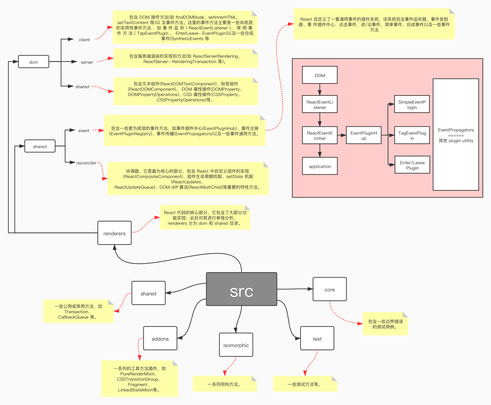

# React 源码

复杂频繁的 DOM 操作通常是产生性能瓶颈的原因之一。React 引入了 Virtual DOM 机制。毫不夸张地说，Virtual DOM 是 React 的核心与精髓所在，而 reconciler 就是实现 Virtual DOM 的主要源码。

Virtual DOM 实际上是在浏览器端用 JavaScript 实现的一套 DOM API，它之于 React 就好似一个虚拟空间，包括一整套 Virtual DOM 模型、生命周期的维护和管理、性能高效的 diff 算法和 将 Virtual DOM 展示为原生 DOM 的 Patch 方法等。

基于 React 进行开发时，所有的 DOM 树都是通过 Virtual DOM 构造的。React 在 Virtual DOM 上实现了 DOM diff 算法，当数据更新时，会通过 diff 寻找到需要变更的 DOM 节点，并只对变化的部分进行实际的浏览器的 DOM 更新，而不是重新渲染整个 DOM 树。

React 也能够实现 Virtual DOM 的批处理更新，当操作 Virtual DOM 时, 不会马上生成真实的 DOM，而是会将一个事件循环(event loop)内的两次数据更新进行合并，这样就使得 React 能够在事件循环的结束之前完全不用操作真实的 DOM。例如，多次进行节点内容 A→B，B→A 的变化，React 会将多次数据更新合并为 A→B→A，即 A→A，认为数据并没有更新，因此 UI 也不会发生任何变化。如果通过手动控制，这种逻辑通常是极其复杂的。

尽管每一次都需要构造完整的 Virtual DOM 树，但由于 Virtual DOM 是 JavaScript 对象，性能极高，而对原生 DOM 进行操作的仅仅是 diff 部分，因而能达到提高性能的目的。这样，在保证性能的同时，开发者将不再需要关注某个数据的变化如何更新到具体的 DOM 元素，而只需要关心在任意数据状态下，整个界面是如何渲染的。
