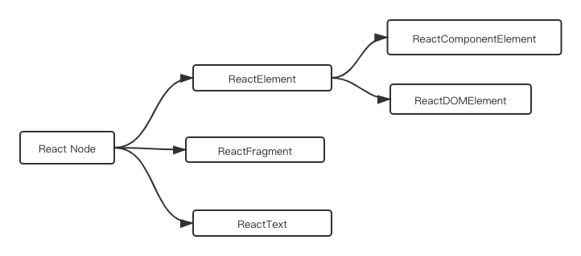
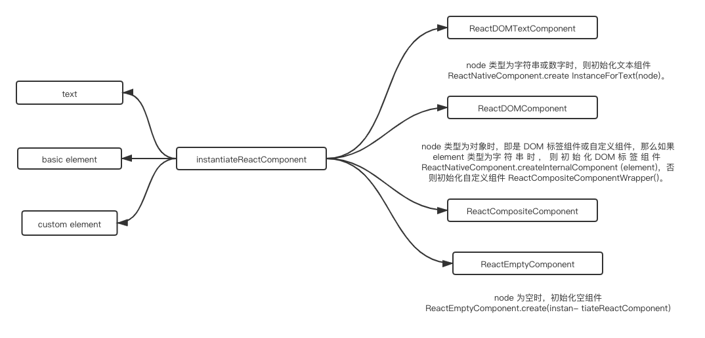
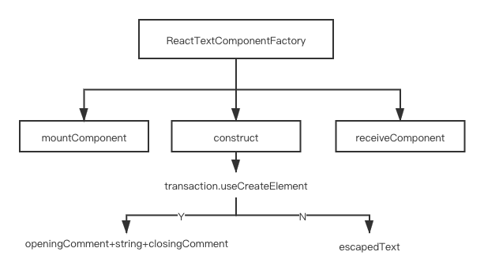
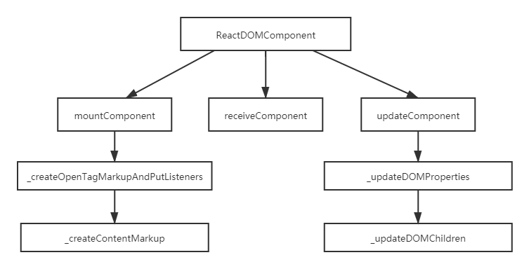

# Virtual DOM 模型



ReactNode 中不同类型节点所需要的基础元素:

```ts
type ReactNode = ReactElement | ReactFragment | ReactText;
type ReactElement = ReactComponentElement | ReactDOMElement;

type ReactDOMElement = {
  type: string,
  props: {
    children: ReactNodeList,
    className: string,
    // etc...
  },
  key: string | boolean | number | null,
  ref: string | null
};
type ReactComponentElement<TProps> = {
  type: ReactClass<TProps>,
  props: TProps,
  key: string | boolean | number | null,
  ref: string | null
};

type ReactFragment = Array<ReactNode | ReactEmpty>;
type ReactNodeList = ReactNode | ReactEmpty;
type ReactText = string | number;
type ReactEmpty = null | undefined | boolean;
```

## 创建React元素

```jsx
const app = <Nav color="blue"><Profile>click</Profile></Nav>;

// 输出（JavaScript）：
const app = React.createElement(
  Nav,
  {color:"blue"},
  React.createElement(Profile, null, "click")
 );
```

通过 JSX 创建的虚拟元素最终会被编译成调用 React 的 createElement 方法。那么 createElement 方法到底做了什么？

```jsx
// createElement 只是做了简单的参数修正，返回一个 ReactElement 实例对象，
// 也就是虚拟元素的实例
ReactElement.createElement = function (type, config, children) {
  // 初始化参数
  var propName;
  var props = {};
  var key = null;
  var ref = null;
  var self = null;
  var source = null;
  // 如果存在 config，则提取里面的内容
  if (config != null) {
    ref = config.ref === undefined ? null : config.ref;
    key = config.key === undefined ? null : '' + config.key;
    self = config.__self === undefined ? null : config.__self;
    source = config.__source === undefined ? null : config.__source;
    // 复制 config 里的内容到 props（如 id 和 className 等）
    for (propName in config) {
      if (config.hasOwnProperty(propName) &&
        !RESERVED_PROPS.hasOwnProperty(propName)) {
        props[propName] = config[propName];
      }
    }
  }
  // 处理 children，全部挂载到 props 的 children 属性上。如果只有一个参数，直接赋值给 children，
  // 否则做合并处理
  var childrenLength = arguments.length - 2;
  if (childrenLength === 1) {
    props.children = children;
  } else if (childrenLength > 1) {
    var childArray = Array(childrenLength);
    for (var i = 0; i < childrenLength; i++) {
      childArray[i] = arguments[i + 2];
    }
    props.children = childArray;
  }
  // 如果某个 prop 为空且存在默认的 prop，则将默认 prop 赋给当前的 prop
  if (type && type.defaultProps) {
    var defaultProps = type.defaultProps;
    for (propName in defaultProps) {
      if (typeof props[propName] === 'undefined') {
        props[propName] = defaultProps[propName];
      }
    }
  }
  // 返回一个 ReactElement 实例对象
  return ReactElement(type, key, ref, self, source, ReactCurrentOwner.current, props);
};
```

## 初始化组件入口



当使用 React 创建组件时，首先会调用 instantiateReactComponent，这是初始化组件的入口函数，它通过判断 node 类型来区分不同组件的入口。

```js
// 初始化组件入口 var instance;
function instantiateReactComponent (node, parentCompositeType) {
  // 空组件(ReactEmptyComponent)
  if (node === null || node === false) {
    instance = ReactEmptyComponent.create(instantiateReactComponent);
  }
  if (typeof node === 'object') {
    var element = node;
    if (typeof element.type === 'string') {
      // DOM标签(ReactDOMComponent)
      instance = ReactNativeComponent.createInternalComponent(element);
    } else if (isInternalComponentType(element.type)) {
      // 不是字符串表示的自定义组件暂无法使用，此处将不做组件初始化操作
      instance = new element.type(element);
    } else {
      // 自定义组件(ReactCompositeComponent)
      instance = new ReactCompositeComponentWrapper();
    }
  } else if (typeof node === 'string' || typeof node === 'number') { // 字符串或数字(ReactTextComponent)
    instance = ReactNativeComponent.createInstanceForText(node);
  } else {
    // 不做处理
  }
  // 设置实例 instance.construct(node);
  // 初始化参数 instance._mountIndex = 0; instance._mountImage = null;
  return instance;
}
```

## 文本组件

当 node 类型为文本节点时是不算 Virtual DOM 元素的，但 React 为了保持渲染的一致性，将其封装为文本组件 ReactDOMTextComponent。

在执行 `mountComponent` `方法时，ReactDOMTextComponent` 通过 `transaction.useCreateElement` 判断该文本是否是通过 `createElement` 方法创建的节点，如果是，则为该节点创建相应的标签和标识 domID，这样每个文本节点也能与其他 `React` 节点一样拥有自己的唯一标识，同时也拥有了 Virtual DOM diff 的权利。但如果不是通过 `createElement` 创建的文本，React 将不再为其创建 `<span>`（React 15.0 不再为裸露的文本内容包裹 `<span>` 标签） 和 domID 标识，而是直接返回文本内容。

在执行 `receiveComponent` 方法时，可以通过 `DOMChildrenOperations.replaceDelimitedText(commentNodes[0], commentNodes[1], nextStringText)` 来更新文本内容。



## DOM 标签组件

React 的 `<div>` 并不是原生 `<div>` 标签，它其实是 React 生成的 Virtual DOM 对象。Virtual DOM 就如同一个隔离的沙盒，因此 React 的处理并不是直接操作和污染原生 DOM， 这样不仅保持了性能上的高效和稳定，而且降低了直接操作原生 DOM 而导致错误的风险。

ReactDOMComponent 针对 Virtual DOM 标签的处理主要分为以下两个部分:

- 属性的更新，包括更新样式、更新属性、处理事件等;
- 子节点的更新，包括更新内容、更新子节点，此部分涉及 diff 算法。

1. 属性更新

当执行 `mountComponent` `方法时，ReactDOMComponent` 首先会生成标记和标签，通过 `this.createOpenTagMarkupAndPutListeners(transaction)` 来处理 DOM 节点的属性和事件。

 如果存在事件，则针对当前的节点添加事件代理，即调用 `enqueuePutListener(this, propKey, propValue, transaction)`。

 如果存在样式，首先会对样式进行合并操作 `Object.assign({}, props.style)`，然后通过 `CSSPropertyOperations.createMarkupForStyles(propValue, this)` 创建样式。

 通过 `DOMPropertyOperations.createMarkupForProperty(propKey, propValue)` 创建属性。

 通过 `DOMPropertyOperations.createMarkupForID(this._domID)` 创建唯一标识。

当执行 receiveComponent 方法时， ReactDOMComponent 会通过 this.updateComponent
(transaction, prevElement, nextElement, context) 来更新 DOM 节点属性。

**先是删除不需要的旧属性**。如果不需要旧样式，则遍历旧样式集合，并对每个样式进行置空
删除；如果不需要事件，则将其事件监听的属性去掉，即针对当前的节点取消事件代理
deleteListener(this, propKey)；如果旧属性不在新属性集合里时，则需要删除旧属性
DOMPropertyOperations.deleteValueForProperty(getNode(this), propKey)。

**再是更新新属性**。

- 如果存在新样式，则将新样式进行合并 Object.assign({}, nextProp)；
- 如果在旧样式中但不在新样式中，则清除该样式；
- 如果既在旧样式中也在新样式中，且不相同，则更新该样式 `styleUpdates[styleName] = nextProp[styleName]`；
- 如果在新样式中，但不在旧样式中，则直接更新为新样式 styleUpdates = nextProp；
- 如果存在事件更新，则添加事件监听的属性 `enqueuePutListener(this, propKey, nextProp, transaction)`；
- 如果存在新属性，则添加新属性，或者更新旧的同名属性 `DOMPropertyOperations.setValueForAttribute(node, propKey, nextProp)。`

至此，ReactDOMComponent 完成了 DOM 节点属性更新的操作。

2. 更新子节点



当执行 mountComponent 方法时，ReactDOMComponent 会通过 `this._createContentMarkup(transaction, props, context)` 来处理 DOM 节点的内容。

首先，获取节点内容 props.dangerouslySetInnerHTML。如果存在子节点，则通过 `this.mountChildren(childrenToUse, transaction, context)` 对子节点进行初始化渲染：

当执行 receiveComponent 方法时，ReactDOMComponent 会通过 this._updateDOMChildren(lastProps, nextProps, transaction, context) 来更新 DOM 内容和子节点。

先是删除不需要的子节点和内容。如果旧节点存在，而新节点不存在，说明当前节点在更新后被删除，此时执行方法 this.updateChildren(null, transaction, context)；如果旧的内容存在，而新的内容不存在，说明当前内容在更新后被删除，此时执行方法 this.updateTextContent('')。

再是更新子节点和内容。如果新子节点存在，则更新其子节点，此时执行方法 this.updateChildren(nextChildren, transaction, context)；如果新的内容存在，则更新内容，此时执行方法 this.updateTextContent('' + nextContent)。

至此，ReactDOMComponent 完成了 DOM 子节点和内容的更新操作。

当卸载组件时，ReactDOMComponent 会进行一系列的操作，如卸载子节点、清除事件监听、清空标识等。

## 自定义组件

ReactCompositeComponent 自定义组件实现了一整套 React 生命周期和 setState 机制，因此自
定义组件是在生命周期的环境中进行更新属性、内容和子节点的操作。这些更新操作与
ReactDOMComponent 的操作类似。
