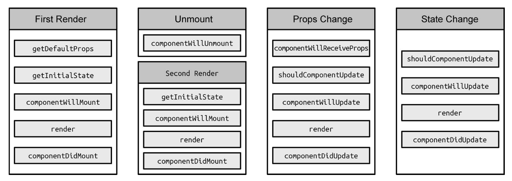

# 生命周期的管理艺术

React 生命周期的执行顺序

## 详解React生命周期

自定义组件(ReactCompositeComponent)的生命周期主要通过 3 个阶段进行管理—— MOUNTING、RECEIVE_PROPS 和 UNMOUNTING。

1. 阶段一:MOUNTING

mountComponent 负责管理生命周期中的 getInitialState、componentWillMount、render 和 componentDidMount。

由于 getDefaultProps 是通过构造函数进行管理的，所以也是整个生命周期中最先开始执行的。而 mountComponent 只能望洋兴叹，无法调用到 getDefaultProps。这就解释了为何 getDefaultProps只执行一次。

利用 getInitialState 获取初始化 state、初始化更新队列和更新状态。

若存在 componentWillMount，则执行。如果此时在 componentWillMount 中调用 setState 方法，不会触发 re-render的，而是会进行 state 合并。

其实，mountComponent 本质上是通过递归渲染内容的，由于递归的特性，父组件的 componentWillMount 在其子组件的 componentWillMount 之前调用，而父组件的 componentDidMount 在其子组件的 componentDidMount 之后调用。

2. 阶段二:RECEIVE_PROPS

updateComponent 负责管理生命周期中的 componentWillReceiveProps、shouldComponentUpdate、componentWillUpdate、render 和 componentDidUpdate。

updateComponent 本质上也是通过递归渲染内容的，由于递归的特性，父组件的 component- WillUpdate 是在其子组件的 componentWillUpdate 之前调用的，而父组件的 componentDidUpdate 也是在其子组件的 componentDidUpdate 之后调用的。

禁止在 shouldComponentUpdate 和 componentWillUpdate 中调用 setState，这会造成循环 调用，直至耗光浏览器内存后崩溃。

3. 阶段三:UNMOUNTING

unmountComponent 负责管理生命周期中的 componentWillUnmount。

如果存在 componentWillUnmount，则执行并重置所有相关参数、更新队列以及更新状态，如果此时在 componentWillUnmount 中调用 setState，是不会触发 re-render 的，这是因为所有更新队列和更新状态都被重置为 null，并清除了公共类，完成了组件卸载操作。
