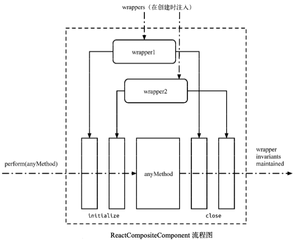
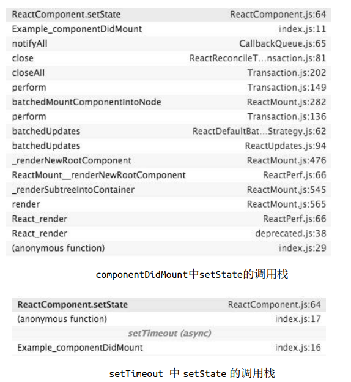

# setState机制

## setState 异步更新

setState 通过一个队列机制实现 state 更新。当执行 setState 时，会将需要更新的 state 合并后放入状态队列，而不会立刻更新 this.state，队列机制可以高效地批量更新 state。

## setState 循环调用风险

当调用 setState 时，实际上会执行 enqueueSetState 方法，并对 partialState 以及_pendingStateQueue 更新队列进行合并操作，最终通过 enqueueUpdate 执行 state 更新。

而 performUpdateIfNecessary 方法会获取 _pendingElement、_pendingStateQueue、_pendingForceUpdate，并调用 receiveComponent 和 updateComponent 方法进行组件更新。

如果在 shouldComponentUpdate 或 componentWillUpdate 方法中调用 setState ，此时
**this._pendingStateQueue != null**，则 performUpdateIfNecessary 方法就会调用 updateComponent
方法进行组件更新，但 updateComponent 方法又会调用 shouldComponentUpdate 和 componentWillUpdate 方法，因此造成循环调用，使得浏览器内存占满后崩溃。

## setState 调用栈

- [面试题：react中放到定时器中的多个setState为什么不会合并再执行？](https://segmentfault.com/q/1010000015805834/a-1020000015815378)

```js
import React, { Component } from 'react'

class Example extends Component {
  constructor() {
    super()
    this.state = {
      val: 0
    }
  }
  componentDidMount() {
    this.setState({ val: this.state.val + 1 })
    console.log(this.state.val) // 第 1 次输出
    this.setState({ val: this.state.val + 1 })
    console.log(this.state.val) // 第 2 次输出
    setTimeout(() => {
      this.setState({ val: this.state.val + 1 })
      console.log(this.state.val) // 第 3 次输出
      this.setState({ val: this.state.val + 1 })
      console.log(this.state.val) // 第 4 次输出
    }, 0)
  }
  render() {
    return null
  }
}

export default Example
```

> 1. setState 只在合成事件和钩子函数中是“异步”的，在原生事件和 setTimeout 中都是同步的。
>
> 2. setState的“异步”并不是说内部由异步代码实现，其实本身执行的过程和代码都是同步的，只是合成事件和钩子函数的调用顺序在更新之前，导致在合成事件和钩子函数中没法立马拿到更新后的值，形式了所谓的“异步”，当然可以通过第二个参数 setState(partialState, callback) 中的callback拿到更新后的结果。
>
> 3. setState 的批量更新优化也是建立在“异步”（合成事件、钩子函数）之上的，在原生事件和setTimeout 中不会批量更新，在“异步”中如果对同一个值进行多次 setState ， setState 的批量更新策略会对其进行覆盖，取最后一次的执行，如果是同时 setState 多个不同的值，在更新时会对其进行合并批量更新。

## 初识事务



事务就是将需要执行的方法使用 wrapper 封装起来，再通过事务提供的 perform 方法执行。 而在 perform 之前，先执行所有 wrapper 中的 initialize 方法，执行完 perform 之后(即执行 method 方法后)再执行所有的 close 方法。一组 initialize 及 close 方法称为一个 wrapper。

到实现上，事务提供了一个 mixin 方法供其他模块实现自己需要的事务。而要使用事务的模块，除了需要把 mixin 混入自己的事务实现中外，还要额外实现一个抽象的 getTransactionWrappers 接口。这个接口用来获取所有需要封装的前置方法(initialize)和收尾方法(close)， 因此它需要返回一个数组的对象，每个对象分别有 key 为 initialize 和 close 的方法。

## 解密setState

4次 setState 简单归类，前两次属于一类，因为它们在同一次调用栈中执行，setTimeout 中的两次 setState 属于另一类，原因同上。

很明显，在 componentDidMount 中直接调用的两次 setState，其调用栈更加复杂；而 setTimeout 中调用的两次 setState，其调用栈则简单很多。下面重点看看第一类 setState 的调用栈，有没有发现什么？没错，就是 batchedUpdates 方法，原来早在 setState 调用前，已经处于 batchedUpdates 执行的事务中了。

那这次 batchedUpdate 方法，又是谁调用的呢？让我们往前再追溯一层，原来是 ReactMount.js
中的 _renderNewRootComponent 方法。也就是说，整个将 React 组件渲染到 DOM 中的过程就处于
一个大的事务中。

接下来的解释就顺理成章了，因为在 componentDidMount 中调用 setState 时，batchingStrategy
的 isBatchingUpdates 已经被设为 true，所以两次 setState 的结果并没有立即生效，而是被放进了 dirtyComponents 中。这也解释了两次打印 this.state.val 都是 0 的原因，因为新的 state 还没有被应用到组件中。

再反观 setTimeout 中的两次 setState ，因为没有前置的 batchedUpdate 调用，所以 batchingStrategy 的 isBatchingUpdates 标志位是 false，也就导致了新的 state 马上生效，没有走到 dirtyComponents 分支。也就是说，setTimeout 中第一次执行 setState 时，this.state.val 为 1，而 setState 完成后打印时 this.state.val 变成了 2。第二次的 setState 同理。


