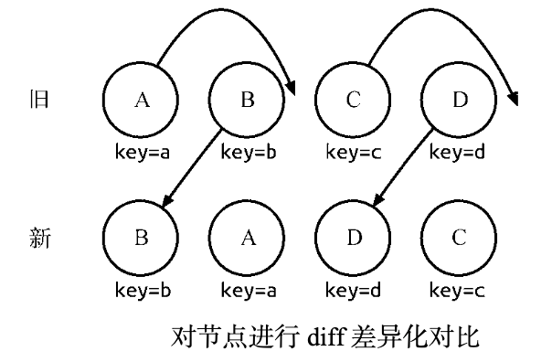
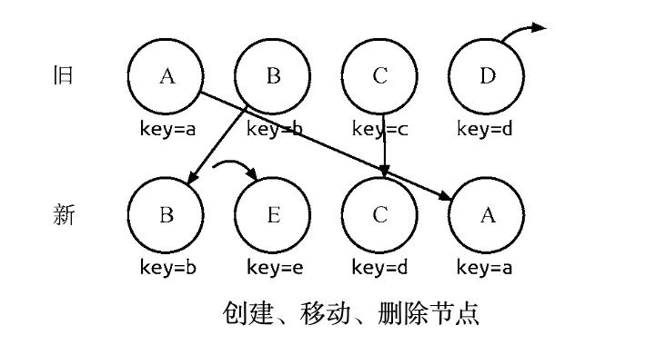

# diff 算法

计算一棵树形结构转换成另一棵树形结构的最少操作，是一个复杂且值得研究的问题。传统 diff 算法通过循环递归对节点进行依次对比，效率低下，算法复杂度达到 O(n^3)，其中 n 是树中节点的总数。

## 详解 diff

React 将 Virtual DOM 树转换成 actual DOM 树的最少操作的过程称为调和（reconciliation）。diff 算法便是调和的具体实现。

React 通过制定大胆的策略，将 O(n^3) 复杂度的问题转换成 O(n) 复杂度的问题。

### diff 策略

1. 策略一： Web UI 中 DOM 节点跨层级的移动操作特别少，可以忽略不计。

2. 策略二：拥有相同类的两个组件将会生成相似的树形结构，拥有不同类的两个组件将会生成不同的树形结构。

3. 策略三：对于同一层级的一组子节点，它们可以通过唯一 id 进行区分。

基于以上策略，React 分别对 tree diff、component diff 以及 element diff 进行算法优化。

### tree diff

基于策略一，React 对树的算法进行了简洁明了的优化，即对树进行分层比较，两棵树只会对同一层次的节点进行比较。

既然 DOM 节点跨层级的移动操作少到可以忽略不计，针对这一现象，React 通过 updateDepth 对 Virtual DOM 树进行层级控制，只会对相同层级的 DOM 节点进行比较，即同一个父节点下的所有子节点。当发现节点已经不存在时，则该节点及其子节点会被完全删除掉，不会用于进一步的比较。这样只需要对树进行一次遍历，便能完成整个 DOM 树的比较。

当出现节点跨层级移动时，并不会出现想象中的移动操作，而是以跨层级移动为根节点的整个树被重新创建。这是一种影响 React 性能的操作，**因此官方建议不要进行 DOM 节点跨层级的操作。**

### component diff

React 是基于组件构建应用的，对于组件间的比较所采取的策略也是非常简洁、高效的。

- 如果是同一类型的组件，按照原策略继续比较 Virtual DOM 树即可。
- 如果不是，则将该组件判断为 dirty component，从而替换整个组件下的所有子节点。
- 对于同一类型的组件，有可能其 Virtual DOM 没有任何变化，如果能够确切知道这点，那么就可以节省大量的 diff 运算时间。因此，React 允许用户通过 shouldComponentUpdate() 来判断该组件是否需要进行 diff 算法分析。

### element diff

当节点处于同一层级时，diff 提供了 3 种节点操作，分别为 INSERT_MARKUP（插入）、MOVE_EXISTING（移动）和 REMOVE_NODE（删除）。

- INSERT_MARKUP：新的组件类型不在旧集合里，即全新的节点，需要对新节点执行插入操作。
- MOVE_EXISTING：旧集合中有新组件类型，且 element 是可更新的类型，generateComponentChildren 已调用 receiveComponent，这种情况下 prevChild=nextChild，就需要做移动操作，可以复用以前的 DOM 节点。
- REMOVE_NODE：旧组件类型，在新集合里也有，但对应的 element 不同则不能直接复用和更新，需要执行删除操作，或者旧组件不在新集合里的，也需要执行删除操作。

React 提出优化策略:允许开发者对同一层级的同组子节点，添加唯一 key 进行区分，虽然只是小小的改动，性能上却发生了翻天覆地的变化!

新旧集合所包含的节点如图所示，进行 diff 差异化对比后，通过 key 发现新旧集合中的节点都是相同的节点，因此无需进行节点删除和创建，只需要将旧集合中节点的位置进行移动， 更新为新集合中节点的位置，此时 React 给出的 diff 结果为:B、D 不做任何操作，A、C 进行移 动操作即可。

那么，如此高效的 diff 到底是如何运作的呢?

首先，对新集合中的节点进行循环遍历 for (name in nextChildren)，通过唯一的 key 判断新旧集合中是否存在相同的节点 if (prevChild === nextChild)，如果存在相同节点，则进行移动操作，但在移动前需要将当前节点在旧集合中的位置与 lastIndex 进行比较 if (child._mountIndex < lastIndex)，否则不执行该操作。这是一种顺序优化手段，lastIndex 一直在更新，表示访问过的节点在旧集合中最右的位置(即最大的位置)。如果新集合中当前访问的节点比 lastIndex 大，说明当前访问节点在旧集合中就比上一个节点位置靠后，则该节点不会影响其他节点的位置，因此不用添加到差异队列中，即不执行移动操作。只有当访问的节点比 lastIndex 小时，才需要进行移动操作。

以图为例，下面更为清晰直观地描述 diff 的差异化对比过程。

1. 从新集合中取得 B，然后判断旧集合中是否存在相同节点 B，此时发现存在节点 B，接着通过对比节点位置判断是否进行移动操作。B 在旧集合中的位置 `B._mountIndex = 1`，此时 lastIndex = 0，不满足 child._mountIndex < lastIndex 的条件，因此不对 B 进行移动操作。更新 `lastIndex = Math.max(prevChild._mountIndex, lastIndex)`，其中 `prevChild._mountIndex` 表示B在旧集合中的位置，则lastIndex = 1，并将B的位置更新为新集合中的位置 prevChild._mountIndex = nextIndex，此时新集合中 B._mountIndex = 0，nextIndex++ 进入下一个节点的判断。

2. 从新集合中取得 A，然后判断旧集合中是否存在相同节点 A，此时发现存在节点 A，接着通过对比节点位置判断是否进行移动操作。A 在旧集合中的位置 A._mountIndex = 0，此时 lastIndex = 1，满足 child._mountIndex < lastIndex 的条件，因此对 A 进行移动操作 `enqueueMove(this, child._mountIndex, toIndex)`，其中 toIndex 其实就是 nextIndex，表示 A 需要移动到的位置。更新 `lastIndex = Math.max(prevChild._mountIndex, lastIndex)`， 则lastIndex = 1，并将 A 的位置更新为新集合中的位置 prevChild._mountIndex = nextIndex，此时新集合中 A._mountIndex = 1，nextIndex++ 进入下一个节点的判断。

3. 从新集合中取得 D，然后判断旧集合中是否存在相同节点 D，此时发现存在节点 D，接着通过对比节点位置判断是否进行移动操作。D 在旧集合中的位置 D._mountIndex = 3，此
时 lastIndex = 1，不满足 child._mountIndex < lastIndex 的条件，因此不对 D 进行移动操作。更新 lastIndex = Math.max(prevChild._mountIndex, lastIndex)，则 lastIndex = 3，并将 D 的位置更新为新集合中的位置 prevChild._mountIndex = nextIndex，此时新集合中 D._mountIndex = 2，nextIndex++ 进入下一个节点的判断。

4. 从新集合中取得 C，然后判断旧集合中是否存在相同节点 C，此时发现存在节点 C，接着 通过对比节点位置判断是否进行移动操作。C 在旧集合中的位置 C._mountIndex = 2，此
时 lastIndex = 3，满足 child._mountIndex < lastIndex的条件，因此对 C 进行移动操作 enqueueMove(this, child._mountIndex, toIndex)。更新lastIndex = Math.max(prevChild. 7 _mountIndex, lastIndex)，则 lastIndex = 3，并将 C 的位置更新为新集合中的位置 prevChild._mountIndex = nextIndex，此时新集合中 A._mountIndex = 3，nextIndex++ 进 入下一个节点的判断。由于 C 已经是最后一个节点，因此 diff 操作到此完成。

上面主要分析新旧集合中存在相同节点但位置不同时，对节点进行位置移动的情况。如果新集合中有新加入的节点且旧集合存在需要删除的节点，那么 diff 又是如何对比运作的呢?

1. 从新集合中取得B，然后判断旧集合中存在是否相同节点 B，可以发现存在节点 B。由于 B 在旧集合中的位置 B._mountIndex = 1，此时 lastIndex = 0，因此不对 B 进行移动操作。 更新lastIndex = 1，并将 B 的位置更新为新集合中的位置 B._mountIndex = 0，nextIndex++ 进入下一个节点的判断。

2. 从新集合中取得 E，然后判断旧集合中是否存在相同节点 E，可以发现不存在，此时可以创建新节点 E。更新 lastIndex = 1，并将 E 的位置更新为新集合中的位置，nextIndex++ 进入下一个节点的判断。

3. 从新集合中取得 C，然后判断旧集合中是否存在相同节点 C，此时可以发现存在节点 C。 由于 C 在旧集合中的位置 C._mountIndex = 2，lastIndex = 1，此时 C._mountIndex > lastIndex，因此不对 C 进行移动操作。更新 lastIndex = 2，并将 C 的位置更新为新集合中的位置，nextIndex++ 进入下一个节点的判断。

4. 从新集合中取得 A，然后判断旧集合中是否存在相同节点 A，此时发现存在节点 A。由于 A 在旧集合中的位置 A._mountIndex = 0，lastIndex = 2，此时 A._mountIndex < lastIndex， 因此对 A 进行移动操作。更新 lastIndex = 2，并将 A 的位置更新为新集合中的位置， nextIndex++ 进入下一个节点的判断。

5. 当完成新集合中所有节点的差异化对比后，还需要对旧集合进行循环遍历，判断是否存 在新集合中没有但旧集合中仍存在的节点，此时发现存在这样的节点 D，因此删除节点 D， 到此 diff 操作全部完成。
