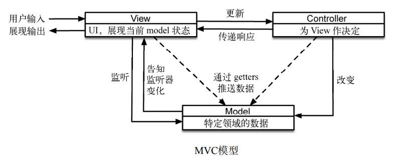
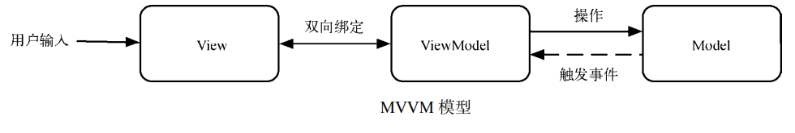
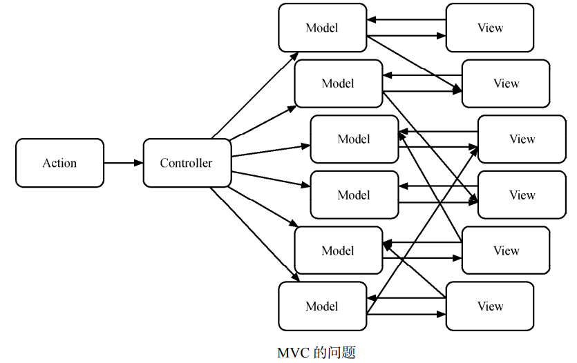
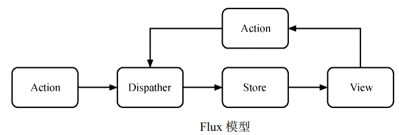
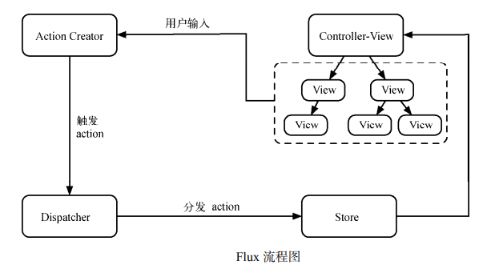

# Flux 架构

## React 独立架构

```jsx
// 含有抽象数据而没有业务逻辑的组件，称之为容器型组件（container component）；
// 而没有数据请求逻辑只有业务逻辑的组件，称之为展示型组件（presentational component）。

import React, { Component, PropTypes } from 'react'

// 评论容器组件
class CommentListContainer extends Component {
  render() {
    return <CommentList data={data} />
  }
}

// 评论列表 - 无状态组件
function CommentList({ comments }) {
  return (
    <ul className='comment-box'>
      {comments.map((entry, i) => (
        <li key={`reponse-${i}`} className='comment-item'>
          <p className='comment-item-name'>{entry.name}</p>
          <p className='comment-item-content'>{entry.content}</p>
        </li>
      ))}
    </ul>
  )
}

// 通过把组件传递给 Promised，就可以实现一个具有请求功能的组件
const Promised = (promiseProp, Wrapped) =>
  class extends Component {
    constructor(props) {
      super(props)
      this.state = {
        loading: true,
        error: null,
        value: null
      }
    }

    componentDidMount() {
      this.props[promiseProp]
        .then(response => response.json())
        .then(value => this.setState({ loading: false, value }))
        .catch(error => this.setState({ loading: false, error }))
    }

    render() {
      if (this.state.loading) {
        return <span>Loading...</span>
      } else if (this.state.error !== null) {
        return <span>Error: {this.state.error.message}</span>
      } else {
        const propsWithoutThePromise = dissoc(this.props, promiseProp)
        return <Wrapped {...propsWithoutThePromise} {...this.state.value} />
      }
    }
  }

function dissoc(obj, prop) {
  let result = {}
  for (let p in obj) {
    if (p !== prop) {
      result[p] = obj[p]
    }
  }
  return result
}

const Wrapper = Promised('comments', CommentListContainer)

ReactDOM.render(<Wrapper comments={fetch('/api/response.json')} />, document.getElementById('root'))
```

## MV* 与 Flux

### MVC/MVVM

1. MVC 模式中的 3 种角色



2.  MVVM 的演变



3. MVC 的问题

在项目越来越大、逻辑越来越复杂的时候就非常明显，那就是混乱的数据流动方式：



4. 解决方案

如果渲染函数只有一个，统一放在 Controller 中，每次更新重渲染页面，这样的话，任何数据的更新都只用调用重渲染就行，并且数据和当前页面的状态是唯一确定的。这样又要保证数据的流动清晰，不能出现交叉分路的情况。

然而重渲染会带来严重的性能与用户体验问题。重渲染和局部渲染各有好坏，对 MVC 来说 这是一个两难的选择，无法做到鱼和熊掌兼得。

### Flux 的解决方案

Flux 的 提出主要是针对现有前端 MVC 框架的局限总结出来的一套基于 dispatcher 的前端应用架构模 式。如果用 MVC 的命名习惯，它应该叫 ADSV（Action Dispatcher Store View）。

Flux 的核心思想就是数据和逻辑永远单向流动。



在 Flux 应用中，数据从 action 到 dispatcher，再到 store，最终到 view 的路线是单向不可逆的，各个角色之间不会像前端 MVC 模式中那样存在交错的连线。

然而想要做到单向数据流，并不是一件容易的事情。好在 Flux 的 dispatcher 定义了严格的规则来限定我们对数据的修改操作。同时，store 中不能暴露 setter 的设定也强化了数据修改的纯洁
性，保证了 store 的数据确定应用唯一的状态。

再使用 React 作为 Flux 的 view，虽然每次 view 的渲染都是重渲染，但并不会影响页面的性能，因为重渲染的是 Virtual DOM，并由 PureRender 保障从重渲染到局部渲染的转换。意味着完全不用关心渲染上的性能问题，增、删、改的渲染都和初始化渲染一样快。

## Flux 基本概念

一个 Flux 应用由 3 大部分组成——dispatcher、store 和 view，其中 dispatcher 负责分发事件； store 负责保存数据，同时响应事件并更新数据；view 负责订阅 store 中的数据，并使用这些数据渲染相应的页面。

尽管它看起来和 MVC 架构有些像，但其中并没有一个职责明确的 controller。事实上，Flux 中存在一个 controller-view 的角色，但它的职责是将 view 与 store 进行绑定，并没有传统 MVC 中 controller 需要承担的复杂逻辑。



1. dispatcher 与 action

与 Backbone 的发布/订阅模式不同，Flux 中的事件会由若干个中央处理器来进行分发，这就是 dispatcher。

dispatcher 是 Flux 中最核心的概念，也是 flux 这个 npm 包中的核心方法。

事实上，dispatcher 的实现非常简单，我们只需要关心 .register(callback) 和 .dispatch(action) 这两个 API 即可。

register 方法用来注册一个监听器，而 dispatch 方法用来分发一个 action。

action 是一个普通的 JavaScript 对象，一般包含 type、payload 等字段，用于描述一个事件以及需要改变的相关数据。比如点击了页面上的某个按钮，可能会触发如下 action：

```js
{
 "type": "CLICK_BUTTON"
}
```

这是 action 最简单的一种形式。在实际应用中，一个 action 还可能包含更多的信息，比如某个操作对应的用户 ID、当前操作是否出现错误的标志位等。

2. store

在 Flux 中，store 负责保存数据，并定义修改数据的逻辑，同时调用 dispatcher 的 register 方法将自己注册为一个监听器。这样每当我们使用 dispatcher 的 dispatch 方法分发一个 action 时，store 注册的监听器就会被调用，同时得到这个 action 作为参数。

store 一般会根据 action 的 type 字段来确定是否响应这个 action。若需要响应，则会根据 action 中的信息修改 store 中的数据，并触发一个更新事件。
需要特别说明的是，在 Flux 中，store 对外只暴露 getter（读取器）而不暴露 setter（设置器），这意味着在 store 之外你只能读取 store 中的数据而不能进行任何修改。

3. controller-view

虽然说 Flux 的 3 大部分是 dispatcher、store 和 view，但是在这三者之间存在着一个简单却不可或缺的角色——controller-view。顾名思义，它既像 controller，又像 view，那么 controller-view 究竟在 Flux 中发挥什么样的作用呢？

一般来说，controller-view 是整个应用最顶层的 view，这里不会涉及具体的业务逻辑，主要进行 store 与 React 组件（即 view 层）之间的绑定，定义数据更新及传递的方式。

controller-view 会调用 store 暴露的 getter 获取存储其中的数据并设置为自己的 state，在 render 时以 props 的形式传给自己的子组件（this.props.children）。

当 store 响应某个 action 并更新数据后，会触发一个更新事件,这个更新事件就是在 controller-view 中进行监听的。当 store 更新时，controller-view 会重新获取 store 中的数据，然后调用 setState 方法触发界面重绘。这

4. view

在绝大多数的例子里，view 的角色都由 React 组件来扮演，但是 Flux 并没有限定 view 具体的实现方式。因此，其他的视图实现依然可以发挥 Flux 的强大能力，例如结合 Angular、Vue 等。

在 Flux 中，view 除了显示界面，还有一条特殊的约定：如果界面操作需要修改数据，则必须使用 dispatcher 分发一个 action。事实上，除了这么做，没有其他方法可以在 Flux 中修改数据。

这条限制对刚接触 Flux 的开发者来说难以理解。因为在 React 中需要修改数据的时候，直接调用 this.setState 方法即可。如果需要分发 action，那么 action 是什么样的，分发到哪里，由谁来处理，View 层如何更新？这些疑问我们会在 4.4 节中一一讲解。目前只需要知道 Flux 中的 view 层不能直接修改数据就可以了。

5. actionCreator

与 controller-view 一样，actionCreator 并不是 Flux 的核心概念，顾名思义，就是用来创造 action 的。

考虑一个点赞的操作，如果用户给某条微博点了赞，可能会分发一个这样的 action：

```js
{
  type: 'CLICK_UPVOTE',
  payload: {
    weiboId: 123,
  },
}
```

而包含完整分发逻辑的代码更加复杂：

```js
import appDispatcher from '../dispatcher/appDispatcher';
// 响应点赞的 onClick 方法
...
handleClickUpdateVote(weiboId) {
  appDispatcher.dispatch({
    type: 'CLICK_UPVOTE',
    payload: {
      weiboId: weiboId,
    },
  });
}
...
```

事实上，在分发 action 的 6 行代码中，只有 1 行是变化的，其余 5 行都固定不变，这时我们可以创建一个 actionCreator 来帮减少冗余的代码，同时方便重用逻辑：

```js
// actions/AppAction.js
import appDispatcher from '../dispatcher/appDispatcher';
function upvote(weiboId) {
  appDispatcher.dispatch({
    type: 'CLICK_UPVOTE',
    payload: {
      weiboId: weiboId,
    },
 });
}
// components/Weibo.js
import { upvote } from '../actions/AppAction';
...
handleClickUpdateVote(weiboId) {
  upvote(weiboId);
}
...
```

可以看到，在 view 中，分发 action 变得异常简洁。同时当我们需要修改 upvote 的逻辑时，只需要在 actionCreator 中进行修改即可，所有调用 upvote 的 view 都无需变动。

## Flux 应用实例

此处省略
