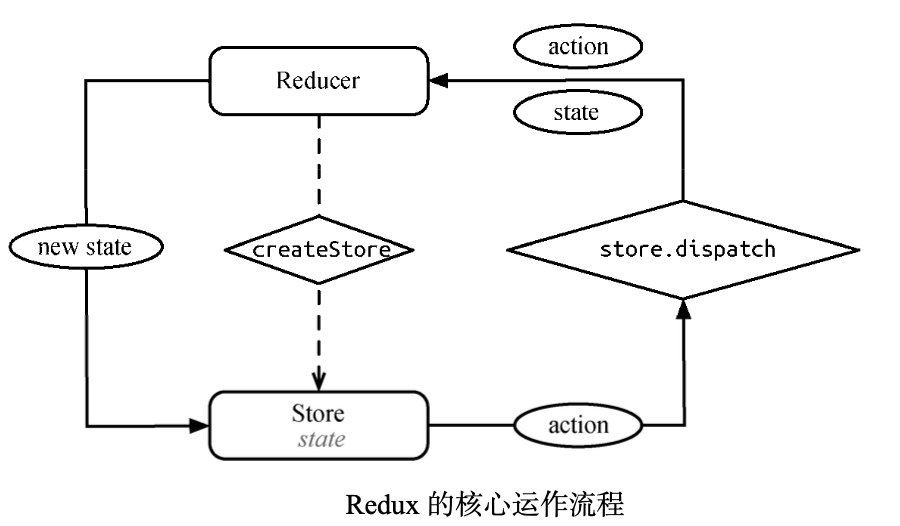

# Redux 简介

## Redux 是什么

Flux 本身既不是库，也不是框架，而是一种应用的架构思想。而 Redux 呢，它的核心代码可以理解成一个库，但同时也强调与 Flux 类似的架构思想。

从设计上看，Redux 参考了 Flux 的设计，但是对 Flux 许多冗余的部分(如 dispatcher)做了 简化，同时将 Elm 语言中函数式编程的思想融合其中。

Redux 本身非常简单，它的设计思想与 React 有异曲同工之妙，均是希望用最少的 API 实现 最核心的功能。

下图是 Redux 的核心运作流程，看起来比 Flux 要简单不少。因为 Redux 本身只把自己定位成一个“可预测的状态容器”，所以下图只能算是这个容器的运行过程。而一个完整的 Redux 应用的运作流程，远比下图复杂得多。



## Redux 三大原则

1. 单一数据源

因为在 Redux 的思想里，一个应用永远只有唯一的数据源。我们的第一反应可能是:如果有一个复杂应用，强制要求唯一的数据源岂不是会产生一个特别庞大的 JavaScript 对象。

实际上，使用单一数据源的好处在于整个应用状态都保存在一个对象中，这样我们随时可以提取出整个应用的状态进行持久化(比如实现一个针对整个应用的即时保存功能)。此外，这样 的设计也为服务端渲染提供了可能。

至于我们担心的数据源对象过于庞大的问题，Redux 提供的工具函数 combineReducers 化解该问题。

2. 状态是只读的

在 Redux 中，我们并不会自己用代码来定义一个 store。取而代之的是，我们定义一个 reducer， 它的功能是根据当前触发的 action 对当前应用的状态(state)进行迭代，这里我们并没有直接修改应用的状态，而是返回了一份全新的状态。

Redux 提供的 createStore 方法会根据 reducer 生成 store。最后，我们可以利用 store. dispatch 方法来达到修改状态的目的。

3. 状态修改均由纯函数完成

这是 Redux与Flux 在表现上的最大不同。在 Flux 中，我们在 actionCreator 里调用 AppDispatcher.dispatch 方法来触发 action，这样不仅有冗余的代码，而且因为直接修改了 store 中的数据，将导致无法保存每次数据变化前后的状态。

在 Redux 里，我们通过定义 reducer 来确定状态的修改，而每一个 reducer 都是纯函数，这意味着它没有副作用，即接受一定的输入，必定会得到一定的输出。

这样设计的好处不仅在于 reducer 里对状态的修改变得简单、纯粹、可测试，更有意思的是， Redux 利用每次新返回的状态生成酷炫的时间旅行(time travel)调试方式，让跟踪每一次因为触发 action 而改变状态的结果成为了可能。

## Redux 核心 API

Redux 的核心是一个 store，这个 store 由 Redux 提供的 createStore(reducers[, initialState]) 方法生成。从函数签名看出，要想生成 store，必须要传入 reducers，同时也可以传入第二个可选 参数初始化状态(initialState)。

先认识一下 reducers。在上一章介绍 Flux 时我们说到， Flux 的核心思想之一就是不直接修改数据，而是分发一个 action 来描述发生的改变。那么，在 Redux 里由谁来修改数据呢?

在 Redux 里，负责响应 action 并修改数据的角色就是 reducer。reducer 本质上是一个函数， 其函数签名为 reducer(previousState, action) => newState。可以看出，reducer 在处理 action 的同时，还需要接受一个 previousState 参数。所以，reducer 的职责就是根据 previousState 和 action 计算出新的 newState。

实际应用中，reducer 在处理 previousState 时，还需要有一个特殊的非空判断。很显然， reducer 第一次执行的时候，并没有任何的 previousState，而 reducer 的最终职责是返回新的 state， 因此需要在这种特殊情况下返回一个定义好的 initialState:

```js
// MyReducer.js
// MyReducer.js
const initialState = {
  todos: []
}
// 我们定义的 todos 这个 reducer 在第一次执行的时候，会返回 { todos: [] } 作为初始化状态
function todos(previousState = initialState, action) {
  switch (action.type) {
    case 'XXX': {
      // 具体的业务逻辑
    }
    default:
      return previousState
  }
}
```

Redux 这个名字就是来源于 Reduce+Flux，可见 reducer 在整个 Redux 架构中拥有举足轻重的作用。

下面就是 Redux 中最核心的 API——createStore:

```js
import { createStore } from 'redux';
const store = createStore(reducers);
```

通过 createStore 方法创建的 store 是一个对象，它本身又包含 4 个方法。

- getState():获取 store 中当前的状态。
- dispatch(action):分发一个 action，并返回这个 action，这是唯一能改变 store 中数据的方式。
- subscribe(listener):注册一个监听者，它在 store 发生变化时被调用。
- replaceReducer(nextReducer):更新当前 store 里的 reducer，一般只会在开发模式中调用该方法。

在实际使用中，我们最常用的是 getState() 和 dispatch() 这两个方法。至于 subscribe() 和 replaceReducer()方法，一般会在 Redux 与某个系统(如 React)做桥接的时候使用。

## 与React绑定

Redux 的核心只有一个 createStore() 方法，但是仅仅使用这个方法还不足以让 Redux 在我们的 React 应用中发挥作用。我们还需要 react-redux 库——Redux 官方提供的 React 绑定。

react-redux 提供了一个组件和一个 API 帮助 Redux 和 React 进行绑定，一个是 React 组件 `<Provider/> `，一个是 connect()。

关于它们，只需要知道的是， <Provider/> 接受一个 store 作为 props，它是整个 Redux 应用的顶层组件，而 connect() 提供了在整个 React 应用的任意组件中获取 store 中数据的功能。

## 增强Flux的功能

在 Redux 中，异步 action 的需求可以通过 Redux 原生的 middleware 设计来实现。

正如 Redux 官方代码库的介绍中所说，Redux 是一个可预测的状态容器(predictable state container)。简单地说，在摒弃了传统 MVC 的发布/订阅模式并通过 Redux 三大原则强化对状态的修改后，使用 Redux 可以让你的应用状态管理变得可预测、可追溯。

