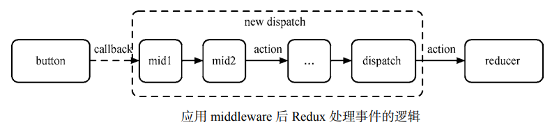
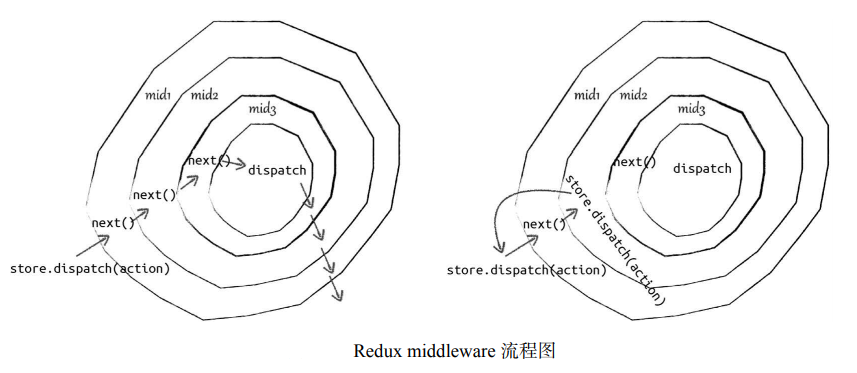

# Redux middleware

Redux middleware 提供了一个分类处理 action 的机会。在 middleware 中，你可以检阅每一个流过的 action，挑选出特定类型的 action 进行相应操作，给你一次改变 action 的机会。

## middleware 的由来

面对多样的业务场景，单纯地修改 dispatch 或 reducer 的代码显然不具有普适性，我们需要的是可以组合的、自由插拔的插件机制，这一点 Redux 借鉴了 Koa 里 middleware 的思想。另外，Redux 中 reducer 更关心的是数据的转化逻辑，所以 middleware 就是为了增强 dispatch 而出现的。

下图展示了应用 middleware 后 Redux 处理事件的逻辑，每一个 middleware 处理一个相对独立的业务需求，通过串联不同的 middleware 实现变化多样的功能。那么，后续我们就来讨论 middleware 是怎么写的，以及 Redux 是如何让 middleware 串联起来的。



## 理解 middleware 机制

Redux 提供了 applyMiddleware 方法来加载 middleware，该方法的源码如下：

```js
import compose from './compose'
// middlewares 数组
export default function applyMiddleware(...middlewares) {
  return next => (reducer, initialState) => {
    // 初始化 store
    let store = next(reducer, initialState)
    let dispatch = store.dispatch
    let chain = []
    // 获取 middlewareAPI
    var middlewareAPI = {
      getState: store.getState,
      dispatch: action => dispatch(action)
    }
    // 为每一个中间件添加 middlewareAPI 并返回 middlewares 数组
    chain = middlewares.map(middleware => middleware(middlewareAPI))
    // 将 middlewares 数组重写到 dispatch， 
    dispatch = compose(...chain)(store.dispatch)
    return {
      ...store,
      dispatch
    }
  }
}
```

然后再来看 logger middleware 的实现：

```js
export default store => next => action => {
  console.log('dispatch:', action)
  // next 为执行下一个中间件 或返回
  next(action)
  console.log('finish:', action)
}
```

### 深入解析 middleware 的运行原理

1. 函数式编程思想设计

middleware 的设计有点特殊，是一个层层包裹的匿名函数，这其实是函数式编程中的currying，它是一种使用匿名单参数函数来实现多参数函数的方法。applyMiddleware 会对 logger 这个 middleware 进行层层调用，动态地将 store 和 next 参数赋值。

currying 的 middleware 结构的好处主要有以下两点。

易串联：currying 函数具有延迟执行的特性，通过不断 currying 形成的 middleware 可以累积参数，再配合组合（compose）的方式，很容易形成 pipeline 来处理数据流。 共享 store：在 applyMiddleware 执行的过程中，store 还是旧的，但是因为闭包的存在，applyMiddleware 完成后，所有的 middleware 内部拿到的 store 是最新且相同的。

另外，我们会发现 applyMiddleware 的结构也是一个多层 currying 的函数。借助 compose，applyMiddleware 可以用来和其他插件加强 createStore 函数：

```js
import { createStore, applyMiddleware, compose } from 'Redux';
import rootReducer from '../reducers';
import DevTools from '../containers/DevTools'; 

const finalCreateStore = compose(
// 在开发环境中使用的 middleware
 applyMiddleware(d1, d2, d3),
// 它会启动 Redux DevTools
 DevTools.instrument()
)(createStore);
```

2. 给 middleware 分发 store

通过如下方式创建一个普通的 store ：

```js
let newStore = applyMiddleware(mid1, mid2, mid3, ...)(createStore)(reducer, null);
```

上述代码执行完后，applyMiddleware 方法陆续获得了3个参数，第一个是 middlewares 数组 [mid1, mid2, mid3, ...]，第二个是 Redux 原生的 createStore ，最后一个是 reducer。然后，我们可以看到 applyMiddleware 利用 createStore 和 reducer 创建了一个 store。而 store 的 getState 方法和 dispatch 方法又分别被直接和间接地赋值给 middlewareAPI 变量 store：

```js
const middlewareAPI = {
  getState: store.getState,
  dispatch: (action) => dispatch(action),
};
chain = middlewares.map(middleware => middleware(middlewareAPI));
```

然后，让每个 middleware 带着 middlewareAPI 这个参数分别执行一遍。执行完后，获得 chain 数组 [f1, f2, ... , fx, ..., fn]，它保存的对象是第二个箭头函数返回的匿名函数。因为是闭包，每个匿名函数都可以访问相同的 store，即 middlewareAPI。


_说明 middlewareAPI 中的 dispatch 为什么要用匿名函数包裹呢？_

我们用 applyMiddleware 是为了改造 dispatch，所以 applyMiddleware 执行完后，dispatch 是变化了的，而 middlewareAPI 是 applyMiddleware 执行中分发到各个 middleware 的，所以必须用匿名函数包裹 dispatch，这样只要 dispatch 更新了，middlewareAPI 中的 dispatch 应用也会发生变化。

3. 组合串联 middleware

这一层只有一行代码，却是 applyMiddleware 精华之所在：

```js
dispatch = compose(...chain)(store.dispatch);
```

其中 compose 是函数式编程中的组合，它将 chain 中的所有匿名函数 [f1, f2, ... , fx, ..., fn] 组装成一个新的函数，即新的 dispatch。当新 dispatch 执行时，[f1, f2, ... , fx, ..., fn]，从右到左依次执行。Redux 中 compose 的实现是下面这样的，当然实现方式并不唯一：

```js
function compose(...funcs) {
 return arg => funcs.reduceRight((composed, f) => f(composed), arg);
} 
```

compose(...funcs) 返回的是一个匿名函数，其中 funcs 就是 chain 数组。当调用 reduceRight 时，依次从 funcs 数组的右端取一个函数 fx 拿来执行，fx 的参数 composed 就是前一次 fx+1 执行的结果，而第一次执行的 fn（n 代表 chain 的长度）的参数 arg 就是 store.dispatch。所以，当 compose 执行完后，我们得到的 dispatch 是这样的，假设 n = 3：

```js
dispatch = f1(f2(f3(store.dispatch))));
```

这时调用新 dispatch，每一个 middleware 就依次执行了。

4. 在 middleware 中调用 dispatch 会发生什么

经过 compose 后，所有的 middleware 算是串联起来了。可是还有一个问题，在分发 store 时，我们提到过每个 middleware 都可以访问 store，即 middlewareAPI 这个变量，也可以拿到 store 的dispatch 属性。那么，在 middleware 中调用 store.dispatch() 会发生什么，和调用 next() 有区别吗？现在我们来说明两者的不同：

```js
const logger = store => next => action => {
  console.log('dispatch:', action)
  next(action)
  console.log('finish:', action)
}
const logger = store => next => action => {
  console.log('dispatch:', action)
  store.dispatch(action)
  console.log('finish:', action)
}
```

在分发 store 时我们解释过，middleware 中 store 的 dispatch 通过匿名函数的方式和最终compose 结束后的新 dispatch 保持一致，所以，在 middleware 中调用 store.dispatch() 和在其他任何地方调用的效果一样。而在 middleware 中调用 next()，效果是进入下一个 middleware：



正常情况下，如图所示，当我们分发一个 action 时，middleware 通过 next(action)一层层处理和传递 action 直到 Redux 原生的 dispatch。如果某个 middleware 使用store.dispatch(action) 来分发 action，就发生了如右图所示的情况，这相当于重新来一遍。假如这个middleware 一直简单粗暴地调用 store.dispatch(action)，就会形成无限循环了。那么 store.dispatch(action) 的用武之地在哪里呢？

假如我们需要发送一个异步请求到服务端获取数据，成功后弹出一个自定义的 message。这里我们用到了 Redux Thunk：

```js
const thunk = store => next => action =>
  typeof action === 'function' ? action(store.dispatch, store.getState) : next(action)
```

Redux Thunk 会判断 action 是否是函数。如果是，则执行 action，否则继续传递 action 到下一个 middleware。针对于此，我们设计了以下 action：

```js
const getThenShow = (dispatch, getState) => {
  const url = 'http://xxx.json'
  fetch(url)
    .then(response => {
      dispatch({
        type: 'SHOW_MESSAGE_FOR_ME',
        message: response.json()
      })
    })
    .catch(() => {
      dispatch({
        type: 'FETCH_DATA_FAIL',
        message: 'error'
      })
    })
}
```

这时候只要在应用中调用 store.dispatch(getThenShow)，Redux Thunk 就会执行 getThenShow方法。getThenShow 会先请求数据，如果成功，分发一个显示 message 的 action；否则，分发一个请求失败的 action。而这里的 dispatch 就是通过 Redux Thunk middleware 传递进来的。

在 middleware 中使用 dispatch 的场景一般是接受到一个定向 action，这个 action 并不希望到达原生的分发 action，往往用在异步请求的需求里。
