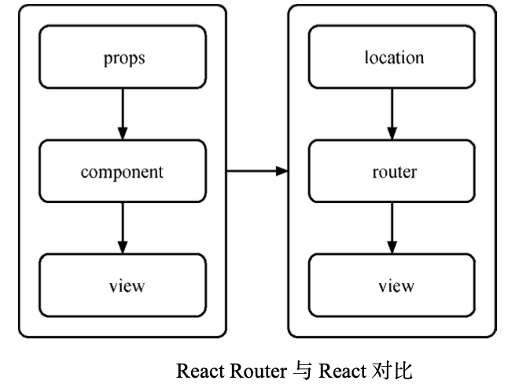

# Redux 与路由

在 Redux 应用中，我们遇到了一些新的问题。其中最迫切的问题是，应用程序的所有状态都应该保存在一个单一的 store 中，而当前的路由状态很明显也属于应用状态的一部分。如果直接使用 React Router，就意味着所有路由相关的信息脱离了 Redux store 的控制，这样就违背了Redux 的设计思想，也给我们的应用带来了更多的不确定性。

所以，我们需要一个这样的路由系统，它既能利用 React Router 的声明式特性，又能将路由信息整合进 Redux store 中。

## React Router

1. 路由的基本原理：路由的基本原理即是保证 View 和 URL 同步
2. React Router 的特性
在 React 中，组件就是一个方法。 props 作为方法的参数，当它们发生变化时会触发方法执行，进而帮助我们重新绘制 View。在 React Router 中，我们同样可以把 Router 组件看成一个方法，location 作为参数，返回的结果同样是 View。



- 声明式的路由

```jsx
import { Router, Route, browserHistory } from 'react-router'
const routes = (
  <Router history={browserHistory}>
    <Route path='/' component={App} />{' '}
  </Router>
)
```

- 嵌套路由及路径匹配

```jsx
import { Router, Route, IndexRoute, browserHistory } from 'react-router'
const routes = (
  <Router history={browserHistory}>
    <Route path='/' component={App}>
      <IndexRoute component={MailList} />
      <Route path='/mail/:mailId' component={Mail} />
    </Route>{' '}
  </Router>
)
```

- 支持多种路由切换方式：`hashChange 或是 history.pushState`

## React Router Redux

`React Router Redux`：它的职责主要是将应用的路 由信息与 Redux 中的 store 绑定在一起。

1. 将 React Router 与 Redux store 绑定

React Router Redux 提供了简单直白的 API——syncHistoryWithStore 来完成与 Redux store 的绑定工作。我们只需要传入 React Router 中的 history(前面提到的 browserHistory 或 hashHistory，甚至是自己创建的 history)，以及 Redux 中的 store，就可以获得一个增强后的 history 对象。

将这个 history 对象传给 React Router 中的 `<Router>` 组件作为 props，就给 React Router Redux 提供了观察路由变化并改变 store 的能力(反之亦然):

```jsx
import { browserHistory } from 'react-router'
import { syncHistoryWithStore } from 'react-router-redux'
import reducers from '<project-path>/reducers'

const store = createStore(reducers)
const history = syncHistoryWithStore(browserHistory, store)
```

2. 用 Redux 的方式改变路由

Redux，想要改变数据，必须要分发一个 action。前面又讲到了，路由状态 作为应用状态数据的必要性。那么，在 Redux 应用中需要改变路由时，是不是也要分发一个 action 呢?答案是肯定的。

但是在这之前，我们需要对 Redux 的 store 进行一些增强，以便分发的 action 能被正确识别:

```jsx
import { browserHistory } from 'react-router';
import { routerMiddleware } from 'react-router-redux';
const middleware = routerMiddleware(browserHistory);
const store = createStore(reducers, applyMiddleware(middleware) );
```

首先，我们引入了 React Router Redux 提供的 routerMiddleware，它实际上是一个 middleware 工厂，传入 history 对象，返回一个真正的 Redux middleware。最终，在创建 Redux store 时，我 们将这个 middleware 启用并作为第二个参数传入 createStore 方法，获得被 React Router Redux 加 工过的新 store。

最后，就可以用 store.dispatch 来分发一个路由变动的 action 了：

```jsx
import { push } from 'react-router-redux';
// 切换路由到 /home
store.dispatch(push('/home'));
```


