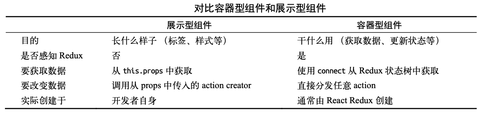

# Redux 与组件

## 容器型组件

容器型组件，意为组件是怎么工作的，更具体一些就是数据是怎么更新的。它不会包含任何 Virtual DOM 的修改或组合，也不会包含组件的样式。

如果映射到 Flux 上，那么容器型组件就是与 store 作绑定的组件。如果映射到 Redux 上，那 么容器型组件就是使用 connect 的组件。因此，我们都在这些组件里作了数据更新的定义。

## 展示型组件

展示型组件，意为组件是怎么渲染的。它包含了 Virtual DOM 的修改或组合，也可能包含组 件的样式。同时，它不依赖任何形式的 store。一般可以写成无状态函数，但实际上展示型组件 并不一定都是无状态的组件，因为很多展示型组件里依然存在生命周期方法。

这样做区分的目的是为了可以使用相同的展示型组件来配合不同的数据源作渲染，可以做到 更好的可复用性。另外，展示型组件可以让设计师不用关心应用的逻辑，去随时尝试不同的组合。

## Redux 中的组件



从布局的角度来看，在Redux中，强调了 3 种不同类型的布局组件:Layouts、Views和 Components。

1. Layouts - 页面布局组件，描述了页面的基本结构，目的是将主框架与页面主体内容分离。它常常是无状态函数，传入主体内容的 children 属性。
2. Views 指的是子路由入口组件，描述了子路由入口的基本结构，包含此路由下所有的展示型 组件。为了保持子组件的纯净，我们在这一层组件中定义了数据和 action 的入口，从这里开始将 它们分发到子组件中去。因此，Views 就是 Redux 中的容器型组件。一般 Views 的写法如下:

```js
@connect(state => {
  //...
})
class HomeView extends Component {
  render() {
    const { sth, changeType } = this.props
    const cardProps = { sth, changeType }
    return (
      <div className='page page-home'>
        <Card {...cardProps} />{' '}
      </div>
    )
  }
}
```

3. Components——Components 就是末级渲染组件，描述了从路由以下的子组件。它们包含具体的 业务逻辑和交互，但所有的数据和 action 都是由 Views 传下来的，这也意味着它们是可以完全脱离数据层而存在的展示型组件。

