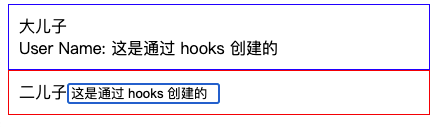
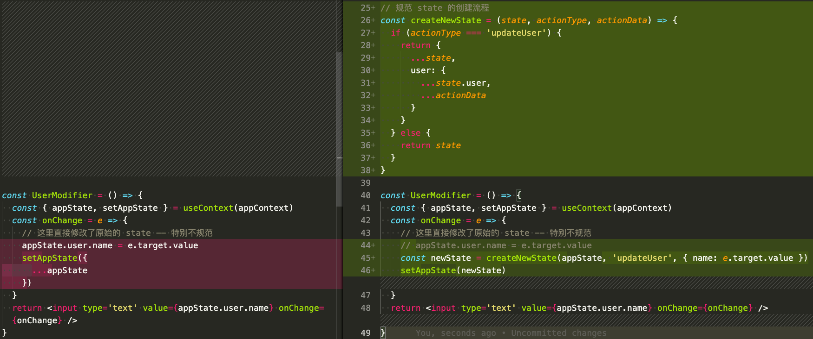
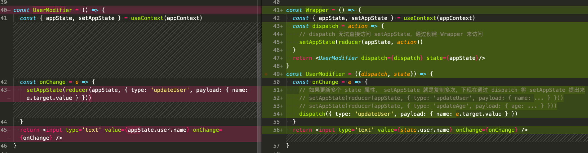
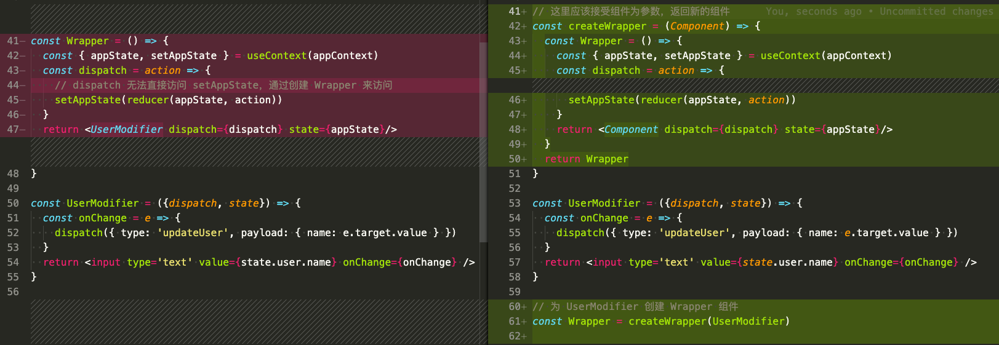
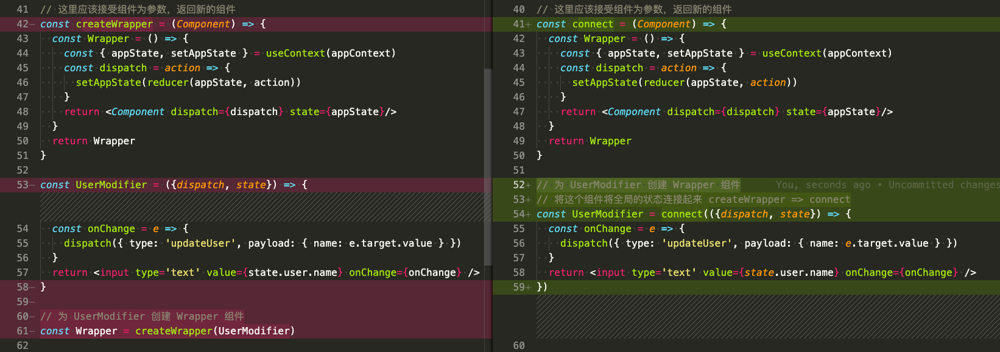
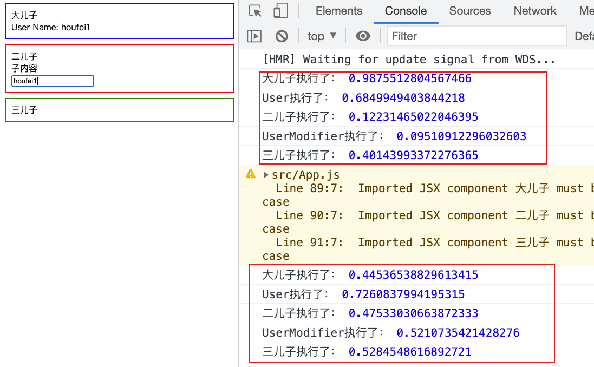
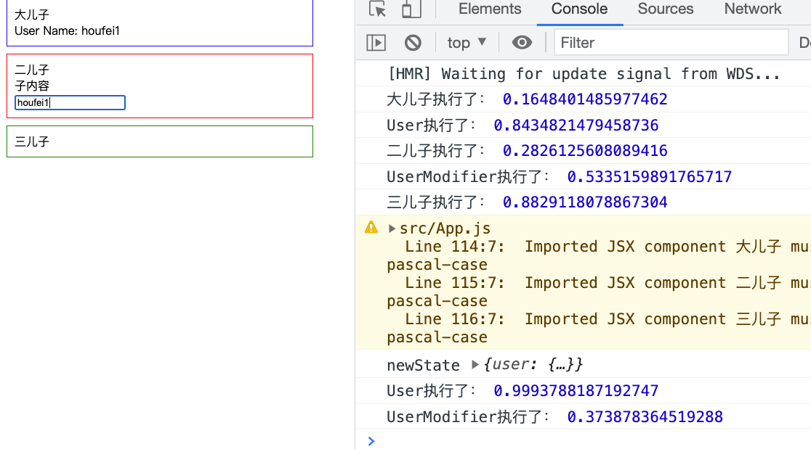
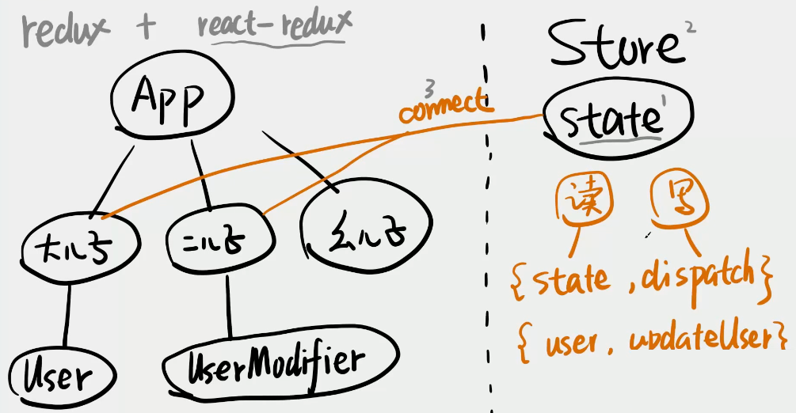

# Redux 源码专精

视频地址：[Redux 源码专精](https://www.bilibili.com/video/BV1254y1L7UP)

## 第一节 全局 state 的读写

通过 hooks 的 useContext 创建一个简单的双向绑定应用：



```jsx
import React, { useState, useContext } from 'react'
import './app.css'

const appContext = React.createContext(null)

const 大儿子 = () => (
  <div className="big-son son">
    大儿子
    <User />
  </div>
)

const 二儿子 = () => (
  <div className="little-son son">
    二儿子
    <UserModifier />
  </div>
)

const User = () => {
  const { appState } = useContext(appContext)
  return <div>User Name: {appState.user.name}</div>
}

const UserModifier = () => {
  const { appState, setAppState } = useContext(appContext)
  const onChange = e => {
    // 这里直接修改了原始的 state -- 特别不规范
    appState.user.name = e.target.value
    setAppState({
      ...appState
    })
  }
  return <input type='text' value={appState.user.name} onChange={onChange} />
}

const App = () => {
  const [appState, setAppState] = useState({
    user: { name: 'houfei', age: 18 }
  })
  const contextValue = { appState, setAppState }
  return (
    <appContext.Provider value={contextValue}>
      <大儿子 />
      <二儿子 />
    </appContext.Provider>
  )
}

export default App
```

## 第二节  Reducer 的来历

提供一个函数，帮助 UserModifier 组件创建 state

```jsx
// 规范 state 的创建流程
const createNewState = (state, actionType, actionData) => {
  if (actionType === 'updateUser') {
    return {
      ...state,
      user: {
        ...state.user,
        ...actionData
      }
    }
  } else {
    return state
  }
}
```



```jsx
// ...
// 规范 state 的创建流程
const createNewState = (state, actionType, actionData) => {
  if (actionType === 'updateUser') {
    return {
      ...state,
      user: {
        ...state.user,
        ...actionData
      }
    }
  } else {
    return state
  }
}

const UserModifier = () => {
  const { appState, setAppState } = useContext(appContext)
  const onChange = e => {
    // 基于旧的 state 创建新的 state
    // 是不是和 redux 的 reducer 很像？
    setAppState(createNewState(appState, 'updateUser', { name: e.target.value }))
  }
  return <input type='text' value={appState.user.name} onChange={onChange} />
}
// ...
```

接下来改一下名字：

```jsx
import React, { useState, useContext } from 'react'
import './app.css'

const appContext = React.createContext(null)

const 大儿子 = () => (
  <div className='big-son son'>
    大儿子
    <User />
  </div>
)

const 二儿子 = () => (
  <div className='little-son son'>
    二儿子
    <UserModifier />
  </div>
)

const User = () => {
  const { appState } = useContext(appContext)
  return <div>User Name: {appState.user.name}</div>
}

// 规范 state 的创建流程
const reducer = (state, { type, payload }) => {
  if (type === 'updateUser') {
    return {
      ...state,
      user: {
        ...state.user,
        ...payload
      }
    }
  } else {
    return state
  }
}

const UserModifier = () => {
  const { appState, setAppState } = useContext(appContext)
  const onChange = e => {
    // 使用 reducer
    setAppState(reducer(appState, { type: 'updateUser', payload: { name: e.target.value } }))
  }
  return <input type='text' value={appState.user.name} onChange={onChange} />
}

const App = () => {
  const [appState, setAppState] = useState({
    user: { name: 'houfei', age: 18 }
  })
  const contextValue = { appState, setAppState }
  return (
    <appContext.Provider value={contextValue}>
      <大儿子 />
      <二儿子 />
    </appContext.Provider>
  )
}

export default App

```

 总结：**reducer 就是规范 state 创建流程的一个函数。**

## 第三节 Dispatch 的来历

在以上代码中，如果更新多个 state 属性， setAppState 就是复制多次，下现在通过 dispatch 将 setAppState 提出来：



完整代码：

```jsx
import React, { useState, useContext } from 'react'
import './app.css'

const appContext = React.createContext(null)

const 大儿子 = () => (
  <div className='big-son son'>
    大儿子
    <User />
  </div>
)

const 二儿子 = () => (
  <div className='little-son son'>
    二儿子
    {/* 此时 UserModifier => Wrapper */}
    <Wrapper />
  </div>
)

const User = () => {
  const { appState } = useContext(appContext)
  return <div>User Name: {appState.user.name}</div>
}

// 规范 state 的创建流程
const reducer = (state, { type, payload }) => {
  if (type === 'updateUser') {
    return {
      ...state,
      user: {
        ...state.user,
        ...payload
      }
    }
  } else {
    return state
  }
}

const Wrapper = () => {
  const { appState, setAppState } = useContext(appContext)
  const dispatch = action => {
    // dispatch 无法直接访问 setAppState，通过创建 Wrapper 来访问
    setAppState(reducer(appState, action))
  }
  return <UserModifier dispatch={dispatch} state={appState}/>
}
const UserModifier = ({dispatch, state}) => {
  const onChange = e => {
    dispatch({ type: 'updateUser', payload: { name: e.target.value } })
  }
  return <input type='text' value={state.user.name} onChange={onChange} />
}

const App = () => {
  const [appState, setAppState] = useState({
    user: { name: 'houfei', age: 18 }
  })
  const contextValue = { appState, setAppState }
  return (
    <appContext.Provider value={contextValue}>
      <大儿子 />
      <二儿子 />
    </appContext.Provider>
  )
}

export default App

```

以上 Wrapper 这个通过包裹组件访问 setState 是 `react-redux` 实现的，这样就可以将 react 和 redux 拆分开来，以减少 react 和 redux 的耦合 —— **dispatch 规范 setState 的流程**。

## 第四节 Connect 的来历

来自 `react-redux` 的高阶组件 connect

在以上章节中，我们通过 Wrapper 来包装 UserModifier 组件，使的在 dispatch 中能够获取 setAppState 方法，现在想让更多的组件和 UserModifier 一样，能够读写 state，那么就要将组件都包装在 Wrapper 中，接下来就通过 connect 方法，为多个组件添加 Wrapper，达到在组件内访问 dispatch 的目的。



然后再进行一些命名上的优化：



```jsx
import React, { useState, useContext } from 'react'
import './app.css'

const appContext = React.createContext(null)

const 大儿子 = () => (
  <div className='big-son son'>
    大儿子
    <User />
  </div>
)

const 二儿子 = () => (
  <div className='little-son son'>
    二儿子
    {/* 如果包涵了其他属性 */}
    <UserModifier x={'x'} y={'y'}>
      <div>子内容</div>
    </UserModifier>
  </div>
)

const User = () => {
  const { appState } = useContext(appContext)
  return <div>User Name: {appState.user.name}</div>
}

// 规范 state 的创建流程
const reducer = (state, { type, payload }) => {
  if (type === 'updateUser') {
    return {
      ...state,
      user: {
        ...state.user,
        ...payload
      }
    }
  } else {
    return state
  }
}

// 这里应该接受组件为参数，返回新的组件
const connect = (Component) => {
  // props 获取原组件上的属性，并传递给 connect 包装后的组件
  return (props) => {
    const { appState, setAppState } = useContext(appContext)
    const dispatch = action => {
      setAppState(reducer(appState, action))
    }
    return <Component {...props} dispatch={dispatch} state={appState}/>
  }
}

// 将这个组件将全局的状态连接起来 createWrapper => connect
const UserModifier = connect(({dispatch, state, x, y, children}) => {
  console.log('传递的x、y属性：', x, y, children);
  const onChange = e => {
    dispatch({ type: 'updateUser', payload: { name: e.target.value } })
  }
  return <div>
    {children}
    <input type='text' value={state.user.name} onChange={onChange} />
  </div>
})

const App = () => {
  const [appState, setAppState] = useState({
    user: { name: 'houfei', age: 18 }
  })
  const contextValue = { appState, setAppState }
  return (
    <appContext.Provider value={contextValue}>
      <大儿子 />
      <二儿子 />
    </appContext.Provider>
  )
}
export default App
```

**connect 的作用： 将组件和全局的状态连接起来。**

高阶组件：一个组件接受一个组件为参数，返回一个新的组件。

## 第五节 利用 connect 减少 render

现在在每一个组件中都打印一些东西：

```jsx
import React, { useState, useContext } from 'react'
import './app.css'

const appContext = React.createContext(null)

const 大儿子 = () => {
  console.log('大儿子执行了：', Math.random())
  return (
    <div className='big-son son'>
      大儿子
      <User />
    </div>
  )
}

const 二儿子 = () => {
  console.log('二儿子执行了：', Math.random())
  return (
    <div className='little-son son'>
      二儿子
      {/* 如果包涵了其他属性 */}
      <UserModifier x={'x'} y={'y'}>
        <div>子内容</div>
      </UserModifier>
    </div>
  )
}

const 三儿子 = () => {
  console.log('三儿子执行了：', Math.random())
  return <div className='small-son son'>三儿子</div>
}

const User = () => {
  console.log('User执行了：', Math.random())
  const { appState } = useContext(appContext)
  return <div>User Name: {appState.user.name}</div>
}

// 规范 state 的创建流程
const reducer = (state, { type, payload }) => {
  if (type === 'updateUser') {
    return {
      ...state,
      user: {
        ...state.user,
        ...payload
      }
    }
  } else {
    return state
  }
}

// 这里应该接受组件为参数，返回新的组件
const connect = Component => {
  // props 获取原组件上的属性，并传递给 connect 包装后的组件
  return props => {
    const { appState, setAppState } = useContext(appContext)
    const dispatch = action => {
      setAppState(reducer(appState, action))
    }
    return <Component {...props} dispatch={dispatch} state={appState} />
  }
}

// 将这个组件将全局的状态连接起来 createWrapper => connect
const UserModifier = connect(({ dispatch, state, x, y, children }) => {
  console.log('UserModifier执行了：', Math.random())
  // console.log('传递的x、y属性：', x, y, children)
  const onChange = e => {
    dispatch({ type: 'updateUser', payload: { name: e.target.value } })
  }
  return (
    <div>
      {children}
      <input type='text' value={state.user.name} onChange={onChange} />
    </div>
  )
})

const App = () => {
  const [appState, setAppState] = useState({
    user: { name: 'houfei', age: 18 }
  })
  const contextValue = { appState, setAppState }
  return (
    <appContext.Provider value={contextValue}>
      <大儿子 />
      <二儿子 />
      <三儿子 />
    </appContext.Provider>
  )
}

export default App
```

如图所示：初始化组件全部执行，在二儿子组件输入`1`时，没有发生改变的组件依旧执行了：



但是我们只是改变了部分组件，但是导致整个应用重新执行了一遍。现在我们要实现：当`user`变换时，只有用到`user`这个属性的组件重新执行，没有用到`user`的组件就不需要执行。

注意，在以上代码中，setAppState 总是会触发组件的重新渲染；那么我们就可以把 setAppState 提到 App 组件的外面，然后将 store 传入 *appContext.Provider*

```jsx
const store = {
  state: {
    user: {name: 'houfei', age: 18}
  },
  setState(newState) {
    store.state = newState
  }
}

const App = () => {
  return (
    <appContext.Provider value={store}>
      <大儿子 />
      <二儿子 />
      <三儿子 />
    </appContext.Provider>
  )
}
```

然后在输入时重新渲染组件：

```jsx
const connect = Component => {
  // props 获取原组件上的属性，并传递给 connect 包装后的组件
  return props => {
    const { state, setState } = useContext(appContext)
    // 以下这种方式只能实现一个组件的渲染
    const [, update] = useState({})
    const dispatch = action => {
      setState(reducer(state, action))
      update({}) // 只能重新渲染二儿子组件，没法渲染大儿子组件
    }
    return <Component {...props} dispatch={dispatch} state={state} />
  }
}
```

那么我们需要使用订阅来更新组件：

```jsx
import React, { useState, useEffect, useContext } from 'react'
import './app.css'

const appContext = React.createContext(null)

// 这里应该接受组件为参数，返回新的组件
const connect = Component => {
  // props 获取原组件上的属性，并传递给 connect 包装后的组件
  return props => {
    const { state, setState } = useContext(appContext)
    const [, update] = useState({})
    // 只在第一次的时候进行订阅
    useEffect(() => {
      store.subscribe(() => {
        update({})
      })
    }, [])
    const dispatch = action => {
      setState(reducer(state, action))
    }
    return <Component {...props} dispatch={dispatch} state={state} />
  }
}

// 规范 state 的创建流程
const reducer = (state, { type, payload }) => {
  if (type === 'updateUser') {
    return {
      ...state,
      user: {
        ...state.user,
        ...payload
      }
    }
  } else {
    return state
  }
}

const store = {
  state: {
    user: { name: 'houfei', age: 18 }
  },
  setState(newState) {
    console.log('newState', newState)
    // 这里没有调用 setState，指的是没有调用 App 的 setState，而不是指 store.setState
    store.state = newState
    // 执行订阅
    store.listeners.map(fn => fn(store.state))
  },
  listeners: [],
  // 订阅
  subscribe(fn) {
    store.listeners.push(fn)
    // 取消订阅
    return () => {
      const index = store.listeners.indexOf(fn)
      store.listeners.splice(index, 1)
    }
  }
}

const 大儿子 = () => {
  console.log('大儿子执行了：', Math.random())
  return (
    <div className='big-son son'>
      大儿子
      <User />
    </div>
  )
}

const 二儿子 = () => {
  console.log('二儿子执行了：', Math.random())
  return (
    <div className='little-son son'>
      二儿子
      {/* 如果包涵了其他属性 */}
      <UserModifier x={'x'} y={'y'}>
        <div>子内容</div>
      </UserModifier>
    </div>
  )
}

const 三儿子 = () => {
  console.log('三儿子执行了：', Math.random())
  return <div className='small-son son'>三儿子</div>
}

const User = connect(({ state, dispatch }) => {
  console.log('User执行了：', Math.random())
  return <div>User Name: {state.user.name}</div>
})

// 将这个组件将全局的状态连接起来 createWrapper => connect
const UserModifier = connect(({ dispatch, state, x, y, children }) => {
  console.log('UserModifier执行了：', Math.random())
  // console.log('传递的x、y属性：', x, y, children)
  const onChange = e => {
    dispatch({ type: 'updateUser', payload: { name: e.target.value } })
  }
  return (
    <div>
      {children}
      <input type='text' value={state.user.name} onChange={onChange} />
    </div>
  )
})

const App = () => {
  return (
    <appContext.Provider value={store}>
      <大儿子 />
      <二儿子 />
      <三儿子 />
    </appContext.Provider>
  )
}

export default App
```

此时，在输入框中输入，只有对应的组件触发更新：



## 第六节 Redux 乍现

以上章节实现了 redux 的大部分功能，现在需要把与 redux 有关的拆分到单独的文件中去：

```jsx
// redux.js
import React, { useState, useEffect, useContext } from 'react'

export const store = {
  state: {
    user: { name: 'houfei', age: 18 }
  },
  setState(newState) {
    console.log('newState', newState)
    // 这里没有调用 setState，指的是没有调用 App 的 setState，而不是指 store.setState
    store.state = newState
    // 执行订阅
    store.listeners.map(fn => fn(store.state))
  },
  listeners: [],
  // 订阅
  subscribe(fn) {
    store.listeners.push(fn)
    // 取消订阅
    return () => {
      const index = store.listeners.indexOf(fn)
      store.listeners.splice(index, 1)
    }
  }
}

// 规范 state 的创建流程
export const reducer = (state, { type, payload }) => {
  if (type === 'updateUser') {
    return {
      ...state,
      user: {
        ...state.user,
        ...payload
      }
    }
  } else {
    return state
  }
}

// 这里应该接受组件为参数，返回新的组件
export const connect = Component => {
  // props 获取原组件上的属性，并传递给 connect 包装后的组件
  return props => {
    const { state, setState } = useContext(appContext)
    const [, update] = useState({})
    // 只在第一次的时候进行订阅
    useEffect(() => {
      store.subscribe(() => {
        update({})
      })
    }, [])
    const dispatch = action => {
      setState(reducer(state, action))
    }
    return <Component {...props} dispatch={dispatch} />
  }
}

export const appContext = React.createContext(null)
```

原 app.jsx 变成了：

```jsx
import React from 'react'
import { appContext, store, connect } from './redux'
import './app.css'

const 大儿子 = () => {
  console.log('大儿子执行了：', Math.random())
  return (
    <div className='big-son son'>
      大儿子
      <User />
    </div>
  )
}

const 二儿子 = () => {
  console.log('二儿子执行了：', Math.random())
  return (
    <div className='little-son son'>
      二儿子
      {/* 如果包涵了其他属性 */}
      <UserModifier x={'x'} y={'y'}>
        <div>子内容</div>
      </UserModifier>
    </div>
  )
}

const 三儿子 = () => {
  console.log('三儿子执行了：', Math.random())
  return <div className='small-son son'>三儿子</div>
}

const User = connect(({ state, dispatch }) => {
  console.log('User执行了：', Math.random())
  return <div>User Name: {state.user.name}</div>
})

// 将这个组件将全局的状态连接起来 createWrapper => connect
const UserModifier = connect(({ dispatch, state, x, y, children }) => {
  console.log('UserModifier执行了：', Math.random())
  // console.log('传递的x、y属性：', x, y, children)
  const onChange = e => {
    dispatch({ type: 'updateUser', payload: { name: e.target.value } })
  }
  return (
    <div>
      {children}
      <input type='text' value={state.user.name} onChange={onChange} />
    </div>
  )
})

const App = () => {
  return (
    <appContext.Provider value={store}>
      <大儿子 />
      <二儿子 />
      <三儿子 />
    </appContext.Provider>
  )
}

export default App
```

## 第七节 让 connect 支持 selector

`react-redux`提供了`selector`，让组件快速获取局部的 state，修改 redux.js文件：

```js
// code ...

// 增加一个新的参数， selector 让组件快速获取局部的 state
export const connect = selector => Component => {
  // props 获取原组件上的属性，并传递给 connect 包装后的组件
  return props => {
    const { state, setState } = useContext(appContext)
    const [, update] = useState({})
    const data = selector ? selector(state) : {state}
    // 只在第一次的时候进行订阅
    useEffect(() => {
      store.subscribe(() => {
        update({})
      })
    }, [])
    const dispatch = action => {
      setState(reducer(state, action))
    }
    //  此时data 就包涵了以上的 state 
    return <Component {...props} {...data} dispatch={dispatch} />
  }
}

// code ...
```

```jsx
// App.js
// code ...
const User = connect(state => {
  return { user: state.user }
})(({ user }) => {
  console.log('User执行了：', Math.random())
  return <div>User Name: {user.name}</div>
})

// 将这个组件将全局的状态连接起来 createWrapper => connect
const UserModifier = connect()(({ dispatch, state, x, y, children }) => {
  console.log('UserModifier执行了：', Math.random())
  // console.log('传递的x、y属性：', x, y, children)
  const onChange = e => {
    dispatch({ type: 'updateUser', payload: { name: e.target.value } })
  }
  return (
    <div>
      {children}
      <input type='text' value={state.user.name} onChange={onChange} />
    </div>
  )
})
// code ...
```

## 第八节 精准渲染

精准渲染：组件只在自己的数据变换时 render。

在`store`加入新的属性`group: { name: '前端组' }`并把该属性放在三儿子中。


```js
// App.jsx 的变化
const 三儿子 = connect(state => {
  return { group: state.group }
})(({group}) => {
  console.log('三儿子执行了：', Math.random())
  return <div className='small-son son'>
    三儿子
    <p>Group：{group.name}</p>
  </div>
})
```

此时更新 user，发现 三儿子 组件也跟着更新了。

```js
// 完整版 redux.js
import React, { useState, useEffect, useContext } from 'react'

export const store = {
  state: {
    user: { name: 'houfei', age: 18 },
    group: { name: '前端组' }
  },
  setState(newState) {
    console.log('newState', newState)
    // 这里没有调用 setState，指的是没有调用 App 的 setState，而不是指 store.setState
    store.state = newState
    // 执行订阅
    store.listeners.map(fn => fn(store.state))
  },
  listeners: [],
  // 订阅
  subscribe(fn) {
    store.listeners.push(fn)
    // 取消订阅
    return () => {
      const index = store.listeners.indexOf(fn)
      store.listeners.splice(index, 1)
    }
  }
}

// 规范 state 的创建流程
export const reducer = (state, { type, payload }) => {
  if (type === 'updateUser') {
    return {
      ...state,
      user: {
        ...state.user,
        ...payload
      }
    }
  } else {
    return state
  }
}

// 做一下新旧数据的对比
const changed = (oldState, newState) => {
  let changed = false
  for(let key in oldState) {
    if(oldState[key] !== newState[key]) {
      changed = true
    }
  }
  return changed
}

// 这里应该接受组件为参数，返回新的组件
// 增加一个新的参数， selector 让组件快速获取局部的 state
export const connect = selector => Component => {
  // props 获取原组件上的属性，并传递给 connect 包装后的组件
  return props => {
    const { state, setState } = useContext(appContext)
    const [, update] = useState({})
    const data = selector ? selector(state) : {state}
    // 只在第一次的时候进行订阅
    useEffect(() => {
      const unsubscribe =store.subscribe(() => {
        const newData = selector ? selector(store.state) : {state: store.state}
        if(changed(data, newData)) {
          console.log('update');
          update({})
        }
      })
      // 注意这里最好取消订阅，否则在 selector 变化时会出现重复订阅
      // 这里可以优化一下代码，现在不做优化，否则看不懂代码了
      // 如果 selector 更新了，取消之前的订阅，订阅新的订阅
      return unsubscribe
    }, [selector])
    const dispatch = action => {
      setState(reducer(state, action))
    }
    return <Component {...props} {...data} dispatch={dispatch} />
  }
}

export const appContext = React.createContext(null)
```

## 第九节 mapDispatchToProps

`mapDispatchToProps` 是 connect 的第二个参数`connect(selector, mapDispatchToProps)(Compontent)`

修改 UserModifier 组件，在 connect 传入 mapDispatchToProps 参数

```jsx
// 将这个组件将全局的状态连接起来 createWrapper => connect
const UserModifier = connect(null, (dispatch) => {
  return {
    updateUser: attrs => dispatch({type: 'updateUser', payload: attrs})
  }
})(({ updateUser, state, x, y, children }) => {
  console.log('UserModifier执行了：', Math.random())
  const onChange = e => {
    updateUser({ name: e.target.value })
  }
  return (
    <div>
      {children}
      <input type='text' value={state.user.name} onChange={onChange} />
    </div>
  )
})
```

在 redux.js 文件中实现 mapDispatchToProps：

```js
export const connect = (selector, dispatchSelector ) => Component => {
  // props 获取原组件上的属性，并传递给 connect 包装后的组件
  return props => {
    const { state, setState } = useContext(appContext)
    const dispatch = action => {
      setState(reducer(state, action))
    }
    const [, update] = useState({})
    const data = selector ? selector(state) : {state}
    // 实现 mapDispatchToProps 
    const dispatchers = dispatchSelector ? dispatchSelector(dispatch): {dispatch}
    // 只在第一次的时候进行订阅
    useEffect(() => {
      const unsubscribe = store.subscribe(() => {
        const newData = selector ? selector(store.state) : {state: store.state}
        if(changed(data, newData)) {
          console.log('update');
          update({})
        }
      })
      return unsubscribe
    }, [selector])
    // 并在组件中返回 dispatchers
    return <Component {...props} {...data} {...dispatchers} />
  }
}
```

## 第十节 connect 的意义

`connect(MapStateToProps, MapDispatchToProps)(Component)` 是为了组件和全局的 state 进行结合。

在 App 中抽取公共的 selector

```jsx
import React from 'react'
import { appContext, store, connect } from './redux'
import './app.css'

const 大儿子 = () => {
  console.log('大儿子执行了：', Math.random())
  return (
    <div className='big-son son'>
      大儿子
      <User />
    </div>
  )
}

const 二儿子 = () => {
  console.log('二儿子执行了：', Math.random())
  return (
    <div className='little-son son'>
      二儿子
      {/* 如果包涵了其他属性 */}
      <UserModifier x={'x'} y={'y'}>
        <div>子内容</div>
      </UserModifier>
    </div>
  )
}

const 三儿子 = connect(state => {
  return { group: state.group }
})(({group}) => {
  console.log('三儿子执行了：', Math.random())
  return <div className='small-son son'>
    三儿子
    <p>Group：{group.name}</p>
  </div>
})

const userSelector = state => {
  return { user: state.user }
}

const userDispatcher = (dispatch) => {
  return {
    updateUser: attrs => dispatch({type: 'updateUser', payload: attrs})
  }
}

const connectToUser = connect(userSelector, userDispatcher)

const User = connectToUser(({ user }) => {
  console.log('User执行了：', Math.random())
  return <div>User Name: {user.name}</div>
})

// 将这个组件将全局的状态连接起来 createWrapper => connect
const UserModifier = connectToUser(({ updateUser, user, x, y, children }) => {
  console.log('UserModifier执行了：', Math.random())
  const onChange = e => {
    updateUser({ name: e.target.value })
  }
  return (
    <div>
      {children}
      <input type='text' value={user.name} onChange={onChange} />
    </div>
  )
})

const App = () => {
  return (
    <appContext.Provider value={store}>
      <大儿子 />
      <二儿子 />
      <三儿子 />
    </appContext.Provider>
  )
}

export default App
```

那么现在可以抽取 connect 到一个公共的文件：

```js
import { connect } from '../redux'

const userSelector = state => {
  return { user: state.user }
}

const userDispatcher = (dispatch) => {
  return {
    updateUser: attrs => dispatch({type: 'updateUser', payload: attrs})
  }
}

export const connectToUser = connect(userSelector, userDispatcher)
```

原来的 App.js 变得更加简洁：

```jsx
import React from 'react'
import { appContext, store, connect } from './redux'
import { connectToUser } from './connecters/connectToUser'
import './app.css'

const 大儿子 = () => {
  console.log('大儿子执行了：', Math.random())
  return (
    <div className='big-son son'>
      大儿子
      <User />
    </div>
  )
}

const 二儿子 = () => {
  console.log('二儿子执行了：', Math.random())
  return (
    <div className='little-son son'>
      二儿子
      {/* 如果包涵了其他属性 */}
      <UserModifier x={'x'} y={'y'}>
        <div>子内容</div>
      </UserModifier>
    </div>
  )
}

const 三儿子 = connect(state => {
  return { group: state.group }
})(({group}) => {
  console.log('三儿子执行了：', Math.random())
  return <div className='small-son son'>
    三儿子
    <p>Group：{group.name}</p>
  </div>
})

const User = connectToUser(({ user }) => {
  console.log('User执行了：', Math.random())
  return <div>User Name: {user.name}</div>
})

// 将这个组件将全局的状态连接起来 createWrapper => connect
const UserModifier = connectToUser(({ updateUser, user, x, y, children }) => {
  console.log('UserModifier执行了：', Math.random())
  const onChange = e => {
    updateUser({ name: e.target.value })
  }
  return (
    <div>
      {children}
      <input type='text' value={user.name} onChange={onChange} />
    </div>
  )
})

const App = () => {
  return (
    <appContext.Provider value={store}>
      <大儿子 />
      <二儿子 />
      <三儿子 />
    </appContext.Provider>
  )
}

export default App
```

总结：

`connect(MapStateToProps, MapDispatchToProps)(Component)`：

- MapStateToProps 用来封装写
- MapDispatchToProps 用来封装读

## 第十一节 封装 Provider 和 createStore

`createStore(reducer, initState)` 创建 store

现在在 redux 中， store 和 reducer 都是写死的，但是在真正的组件中，都是从外部读进来的，现在通过 createStore 读取外部的 state：

```js
import React, { useState, useEffect, useContext } from 'react'

const store = {
  state: undefined,
  reducer: undefined,
  setState(newState) {
    console.log('newState', newState)
    // 这里没有调用 setState，指的是没有调用 App 的 setState，而不是指 store.setState
    store.state = newState
    // 执行订阅
    store.listeners.map(fn => fn(store.state))
  },
  listeners: [],
  // 订阅
  subscribe(fn) {
    store.listeners.push(fn)
    // 取消订阅
    return () => {
      const index = store.listeners.indexOf(fn)
      store.listeners.splice(index, 1)
    }
  }
}

export const createStore = (reducer, initState) => {
  store.state = initState
  store.reducer = reducer
  return store
}
// 做一下新旧数据的对比
const changed = (oldState, newState) => {
  let changed = false
  for(let key in oldState) {
    if(oldState[key] !== newState[key]) {
      changed = true
    }
  }
  return changed
}

// 这里应该接受组件为参数，返回新的组件
// 增加一个新的参数， selector 让组件快速获取局部的 state
export const connect = (selector, dispatchSelector ) => Component => {
  // props 获取原组件上的属性，并传递给 connect 包装后的组件
  return props => {
    const { state, setState } = useContext(appContext)
    const dispatch = action => {
      setState(store.reducer(state, action))
    }
    const [, update] = useState({})
    const data = selector ? selector(state) : {state}
    const dispatchers = dispatchSelector ? dispatchSelector(dispatch): {dispatch}
    // 只在第一次的时候进行订阅
    useEffect(() => {
      const unsubscribe =store.subscribe(() => {
        const newData = selector ? selector(store.state) : {state: store.state}
        if(changed(data, newData)) {
          console.log('update');
          update({})
        }
      })
      // 注意这里最好取消订阅，否则在 selector 变化时会出现重复订阅
      // 这里可以优化一下代码，现在不做优化，否则看不懂代码了
      // 如果 selector 更新了，取消之前的订阅，订阅新的订阅
      return unsubscribe
    }, [selector])
    return <Component {...props} {...data} {...dispatchers} />
  }
}

const appContext = React.createContext(null)

export const Provider = ({store, children}) => {
  return (
    <appContext.Provider value={store}>
      {children}
  </appContext.Provider>
  )
}
```

App:

```jsx
import React from 'react'
import { Provider, createStore, connect } from './redux'
import { connectToUser } from './connecters/connectToUser'
import './app.css'

const reducer = (state, { type, payload }) => {
  if (type === 'updateUser') {
    return {
      ...state,
      user: {
        ...state.user,
        ...payload
      }
    }
  } else {
    return state
  }
}
// 初始化状态，然后传到组件中
const store = createStore(reducer, {
  user: { name: 'houfei', age: 18 },
  group: { name: '前端组' }
})

// code ...

const App = () => {
  return (
    <Provider store={store}>
      <大儿子 />
      <二儿子 />
      <三儿子 />
    </Provider>
  )
}

export default App

```

现在基本和 redux 一致了

## 第十二节 Redux ReactRedux 各个概念的总结

Redux 解决的问题就是组件 和 state 的连接以及提供两个读写的 API。



connect 主要是对组建进行了封装，返回一个 Wrapper，它主要做了三件事情：

1. 从上下文中拿到读写的API
2. 对具体的数据和 dispatch 进行了封装
3. 订阅发布，在恰当的时候进行更新

## 第十三节 API 的封装技巧

模拟 redux 的 api：

1. getState()
2. dispatch(action)
3. subscribe(listener)

现在要做的就是隐藏 store 的属性，构造 getState()：

```js
import React, { useState, useEffect, useContext } from 'react'

let state = undefined ,reducer = undefined ,listeners = []

const setState = newState => {
  state = newState
  listeners.map(fn => fn(state))
}

const store = {
  getState() {
    return state
  },
  dispatch:  action => {
    setState(reducer(state, action))
  },
  // 订阅
  subscribe(fn) {
    listeners.push(fn)
    // 取消订阅
    return () => {
      const index = listeners.indexOf(fn)
      listeners.splice(index, 1)
    }
  }
}

const dispatch = store.dispatch

export const createStore = (_reducer, initState) => {
  state = initState
  reducer = _reducer
  return store
}
// 做一下新旧数据的对比
const changed = (oldState, newState) => {
  let changed = false
  for(let key in oldState) {
    if(oldState[key] !== newState[key]) {
      changed = true
    }
  }
  return changed
}

// 这里应该接受组件为参数，返回新的组件
// 增加一个新的参数， selector 让组件快速获取局部的 state
export const connect = (selector, dispatchSelector ) => Component => {
  // props 获取原组件上的属性，并传递给 connect 包装后的组件
  return props => {
    const [, update] = useState({})
    const data = selector ? selector(state) : {state}
    const dispatchers = dispatchSelector ? dispatchSelector(dispatch): {dispatch}
    // 只在第一次的时候进行订阅
    useEffect(() => {
      const unsubscribe =store.subscribe(() => {
        const newData = selector ? selector(state) : {state}
        if(changed(data, newData)) {
          console.log('update');
          update({})
        }
      })
      // 注意这里最好取消订阅，否则在 selector 变化时会出现重复订阅
      // 这里可以优化一下代码，现在不做优化，否则看不懂代码了
      // 如果 selector 更新了，取消之前的订阅，订阅新的订阅
      return unsubscribe
    }, [selector])
    return <Component {...props} {...data} {...dispatchers} />
  }
}

const appContext = React.createContext(null)

export const Provider = ({store, children}) => {
  return (
    <appContext.Provider value={store}>
      {children}
  </appContext.Provider>
  )
}
```

## 第十四节 让 Redux 支持函数 action

Redux不支持异步 action，修改 UserModifier ：

```jsx
const fetchUser = dispatch => {
  setTimeout(() => {
    dispatch({
      type: 'updateUser',
      payload: '3秒后的 houfei'
    })
  }, 3000);
}

const UserModifier = connect(null, null)(({ state, dispatch }) => {
  console.log('UserModifier执行了：', Math.random())
  const onclick = () => {
    dispatch(fetchUser)
  }
  return (
    <div>
      <div>User: {state.user.name}</div>
      <button onClick={onclick}>异步获取 user</button>
    </div>
  )
})
```
redux的改写：

```js
let dispatch = store.dispatch

const prevDispatch = dispatch

dispatch = action => {
  if(action instanceof Function) {
    action(dispatch)
  } else {
    prevDispatch(action)
  }
}
```

**现在我实现的视图没有更新**

## 让 redux 支持 Promise Action

```jsx
const UserModifier = connect(null, null)(({ state, dispatch }) => {
  console.log('UserModifier执行了：', Math.random())
  const onclick = () => {
    dispatch({
      type: 'updateUser',
      payload: () => {
        return setTimeout(() => {
          return '3秒后的 houfei'
        }, 3000);
      }
    })
  }
  return (
    <div>
      <div>User: {state.user.name}</div>
      <button onClick={onclick}>异步获取 user</button>
    </div>
  )
})
```

```js
const prevDispatch2 = dispatch

dispatch = action => {
  if(action.payload instanceof Promise) {
    action.payload.then(data => {
      dispatch({...action, payload: data})
    })
  } else {
    prevDispatch2(action)
  }
}
```
