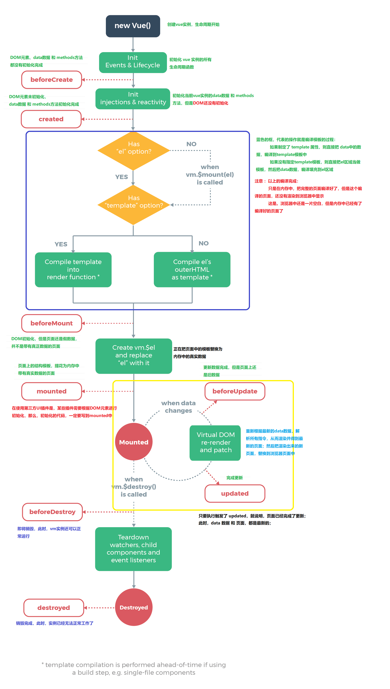

# 面试题合集一

## 1.vue2 和 vue3 双向绑定的原理是什么?

Vue 2 使用了基于**Object.defineProperty**的双向绑定原理：

```html
<!DOCTYPE html>
<html>
  <head>
    <title>基于 Object.defineProperty 的双向绑定示例</title>
  </head>
  <body>
    <div id="app">
      <input
        id="inputField"
        type="text"
      />
      <p id="outputText"></p>
    </div>

    <script>
      const data = {
        message: ''
      };
      const inputField = document.getElementById('inputField');
      const outputText = document.getElementById('outputText');
      Object.defineProperty(data, 'message', {
        get() {
          return this._message;
        },
        set(value) {
          this._message = value;
          inputField.value = value; // 更新输入框的值
          outputText.textContent = value; // 更新文本显示
        }
      });
      inputField.addEventListener('input', function () {
        data.message = inputField.value;
      });
    </script>
  </body>
</html>
```

Vue 3 引入了基于**Proxy**的双向绑定原理：

```html
<!DOCTYPE html>
<html>
  <head>
    <title>基于 Proxy 的双向绑定示例</title>
  </head>
  <body>
    <div id="app">
      <input
        id="inputField"
        type="text"
      />
      <p id="outputText"></p>
    </div>

    <script>
      const data = {
        message: ''
      };
      const inputField = document.getElementById('inputField');
      const outputText = document.getElementById('outputText');
      const dataProxy = new Proxy(data, {
        get(target, property) {
          return target[property];
        },
        set(target, property, value) {
          target[property] = value;
          inputField.value = value; // 更新输入框的值
          outputText.textContent = value; // 更新文本显示
          return true;
        }
      });
      inputField.addEventListener('input', function () {
        dataProxy.message = inputField.value;
      });
    </script>
  </body>
</html>
```

## 2.vue 的 render 函数是什么? render 函数和 template 模板有什么关系？

- Vue 中的 `render` 函数是用于创建虚拟 DOM（Virtual DOM）的 JavaScript 函数。与 `template` 模板不同，`render` 函数是更底层、更灵活的方式来定义 Vue 组件的渲染逻辑。

总之，`template` 是一种声明性的模板语法，适合大多数情况，而 `render` 函数提供了更高级和灵活的方式来定义组件的渲染逻辑，可以用于处理一些复杂的场景。在大多数情况下，你可以使用 `template` 来构建组件，但如果需要更多控制权，可以使用 `render` 函数。

## 3.vue 如何解析指令? 模板变量? html 标签

Vue 解析指令、模板变量和 HTML 标签的过程是在模板编译阶段完成的，该阶段将模板字符串转换为可执行的渲染函数。

- Vue 使用正则表达式和解析器来识别和解析指令
- 解析模板变量：Vue 在编译过程中会识别这些插值表达式，并将它们替换为生成虚拟 DOM 的代码。
  - 例如，对于 {{ message }}，Vue 会生成一个虚拟 DOM 节点，该节点的值将由 message 变量的当前值填充。
- Vue 在编译模板时也会解析 HTML 标签，包括普通的 HTML 元素标签和自定义组件标签。当 Vue 遇到自定义组件标签时，它会查找并解析对应的组件定义，并将其转换为渲染函数。

## 4.vue 是怎么解析 template 的? template 会变成什么?

- 解析模板：Vue 会解析传入的 template 字符串，其中包含了 HTML 标记、指令（如 v-if、v-for 等）、插值表达式（如{{ message }}）等。
- 生成抽象语法树（AST）：Vue 会将解析后的模板转换成一个抽象语法树（AST），这个树结构表示了模板中的各种元素、指令和数据绑定。
- 生成渲染函数：基于 AST，Vue 会生成一个渲染函数，这个函数会接收应用的状态（即 data 属性）作为参数，并返回一个虚拟 DOM。
- 渲染虚拟 DOM：当应用的状态发生变化时，Vue 会调用渲染函数，生成新的虚拟 DOM。然后，Vue 会使用新的虚拟 DOM 与之前的虚拟 DOM 进行比较，找出变化的部分。
- 更新实际的 DOM：最后，Vue 会根据虚拟 DOM 的变化，批量更新实际的 DOM，以反映应用状态的变化。

[vue 源码学习总结 深入解析 template 编译成 render 函数过程](https://blog.csdn.net/lyt_angularjs/article/details/105250391)

## 5.vue 的 keep-alive 的作用是什么？怎么实现的？如何刷新的?

**主要作用：**

1. **缓存组件实例**
2. **避免重复渲染**
3. **保存组件状态**
4. **条件缓存**

**实现原理：**

1. **缓存组件实例**：当 `<keep-alive>` 包裹的组件首次渲染时，Vue.js 会将该组件的实例保存在内部的缓存列表中。
2. **组件切换**：当需要重新渲染包裹在 `<keep-alive>` 中的组件时（例如，通过路由切换或条件显示/隐藏），Vue.js 会首先检查缓存中是否已经有了这个组件的实例。
3. **复用缓存**：如果缓存中存在该组件的实例，Vue.js 会选择性地将缓存中的实例重新挂载到 DOM 上，而不是重新创建一个新的实例。这样可以避免不必要的渲染和数据初始化过程。
4. **生命周期钩子**：当组件从缓存中取出并重新挂载时，Vue.js 会调用组件的一系列生命周期钩子，如`activated`和`deactivated`，以便让开发者可以在组件复用和销毁时执行特定的逻辑。
5. **缓存策略**：Vue.js 还提供了一些缓存策略选项，允许你控制缓存的行为，例如设置缓存的最大数量，或定义哪些组件需要被缓存。

总之，`<keep-alive>` 的实现原理是基于 Vue.js 的组件生命周期和虚拟 DOM 渲染流程，通过缓存和复用组件实例，以提高性能和用户体验。

**刷新缓存：**

1. 使用 `include` 和 `exclude` 属性。
2. 调用 `$forceUpdate()` 方法。
3. 动态改变组件的 `key` 属性。

## 6.Vue2.0 v-for 中 :key 到底有什么用？

需要使用 key 来给每个节点做一个唯一标识，Diff 算法就可以正确的识别此节点，找到正确的位置区插入新的节点。所以一句话，**key 的作用主要是为了高效的更新虚拟 DOM**。

## 7.`v-for` 和 `v-if` 使用问题

v-for 的优先级比 v-if 的优先级高，在遍历每一条 item 后，会执行 v-if，会造成不必要的计算，影响性能。

解决方法：通过使用 computed 属性，来筛选出符合条件项，然后再使用 v-for 遍历

## 8.实例属性 data 为什么是一个 function

组件是一个可复用的实例，当你引用一个组件的时候，组件里的 data 是一个普通的对象，所有用到这个组件的都引用的同一个 data，就会造成数据污染。

将 data 封装成函数后，在实例化组件的时候，我们只是调用了 data 函数生成的数据副本，避免了数据污染。

## 9.hash 和 history 模式的区别

hash 模式：在浏览器 url 中提现为#，#以及之后的内容用`window.location.hash`读取。特点：hash 虽然在 URL 中，但不被包括在 HTTP 请求中；用来指导浏览器动作，对服务端安全无用，hash 不会重加载页面。

hash 模式下，仅 hash 符号之前的内容会被包含在请求中，如 [http://www.xxx.com](http://www.xxx.com/)，因此对于后端来说，即使没有做到对路由的全覆盖，也不会返回 404 错误。

history 模式：history 采用 HTML5 的新特性；且提供了两个新方法：pushState（），replaceState（）可以对浏览器历史记录栈进行修改，以及 popState 事件的监听到状态变更。 history 模式下，前端的 URL 必须和实际向后端发起请求的 URL 一致，如 `http://www.xxx.com/items/id`。后端如果缺少对 /items/id 的路由处理，将返回 404 错误。

## 10.计算属性怎么理解

在模板中放入太多的逻辑会让模板过重且难以维护，在需要对数据进行复杂处理，且可能多次使用的情况下，尽量采取计算属性的方式。

好处：

- 使得数据处理结构清晰；
- 依赖于数据，数据更新，处理结果自动更新；
- 计算属性内部 this 指向 vm 实例；
- 在 template 调用时，直接写计算属性名即可；
- 常用的是 getter 方法，获取数据，也可以使用 set 方法改变数据；
- 相较于 methods，不管依赖的数据变不变，methods 都会重新计算，但是依赖数据不变的时候 computed 从缓存中获取，不会重新计算。

## 11.vue2 和 vue3 生命周期




## 12.在vue中监听页面滚动

```vue
<template>
  <div class="main-container">
    <p v-for="(t, i) in page" :key="i">
      {{ t }}
    </p>
  </div>
</template>

<script>
export default {
  name: 'Test',
  data() {
    return {
      page: new Array(20).fill().map(i => Math.random().toString(36).substring(2))
    };
  },
  mounted() {
    document.addEventListener('scroll', this.scroll);
  },
  beforeDestroy() {
    document.removeEventListener('scroll', this.scroll);
  },
  methods: {
    scroll() {
      const scrollHeight = document.body.scrollHeight; // 页面高度
      const screenHeight = window.screen.height; // 屏幕高度
      const scrollTop = document.documentElement.scrollTop || document.body.scrollTop; // 页面滚动卷去高度
      console.log(
        '页面高度：',
        scrollHeight,
        '\r\n屏幕高度：',
        screenHeight,
        '\r\n页面滚动卷去高度：',
        scrollTop
      );
    }
  }
};
</script>

<style lang="less" scoped>
p {
  display: block;
  background-color: #e9a4a4;
  min-width: 200px;
  height: 44px;
  line-height: 44px;
  margin: 20px auto 0;
  border: 1px solid #a5c5b5;
  border-radius: 2px;
}
</style>
```
