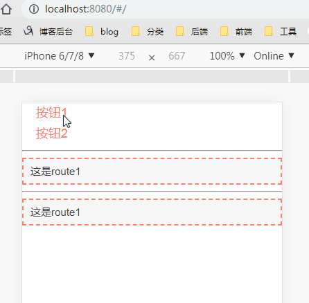

```html
<template>
  <div id="app">
    <ul class="list">
      <router-link
        tag="li"
        to="/"
      >
        按钮1
      </router-link>
      <router-link
        tag="li"
        to="/transition"
      >
        按钮2
      </router-link>
    </ul>
    <hr />
    <!-- 右滑进入 -->
    <transition :name="'rightin'">
      <router-view class="child-view" />
    </transition>
    <hr />
    <!-- 左滑进入 -->
    <transition :name="'leftin'">
      <router-view class="child-view" />
    </transition>
  </div>
</template>

<style scope>
  /* 只能用标签名，不能用类名id！元素在标准流中的样式，就是 入场动画的终点状态；同时，也是离场动画的起始状态 */
  .child-view {
    transition: all 1s cubic-bezier(1, 0.5, 0.8, 1);
  }
  .rightin-enter,
  .leftin-leave-active {
    opacity: 0;
    transform: translate3d(50% 0, 0);
    -webkit-transform: translate3d(50%, 0, 0);
    -moz-transform: translate3d(50%, 0, 0);
  }
  .leftin-enter,
  .rightin-leave-active {
    opacity: 0;
    transform: translate3d(-50% 0, 0);
    -webkit-transform: translate3d(-50%, 0, 0);
    -moz-transform: translate3d(-50%, 0, 0);
  }
</style>
```


