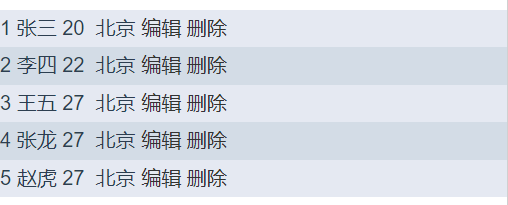

插槽就是在子组件中定义一个“占位符”，父组件中将指定模板插入到该“占位符”中；作用域插槽更多的功能就是在子组件中可以通过 `scope` 属性将子组件中的属性反馈到父组件。

**在一个组件的定义中，只允许出现一次匿名插槽。**

[如何理解 Vue 的作用域插槽](https://segmentfault.com/a/1190000010747756)

[关于作用域插槽的理解](https://segmentfault.com/a/1190000015672758)

- 匿名插槽：

```vue
<!-- 组件 -->
<template>
  <div>
    <h1>my-template 组件</h1>
    <slot></slot>
    <slot name="slotname"></slot>
  </div>
</template>
```

```html
<my-template>
  <p>这是匿名插槽的内容</p>
</my-template>
```

- 具名插槽

```html
<my-template>
  <p solt="slotname">这是具名插槽的内容</p>
</my-template>
```

- 作用域插槽

> 1. 定义作用域插槽：在子组件中，使用 `slot` 定义插槽的时候，可以通过 **属性传值** 的形式，为插槽传递数据，例子：`<slot text="hello world"></slot>`
> 2. 使用作用域插槽：**在父作用域中，通过定义 slot-scope="scope" 属性，接收并使用 插槽数据；**
> 3. 注意：**同一组件中不同插槽的作用域，是独立的！**

```vue
<template>
  <div>
    <com :items="users">
      <!-- scope 对象接收来自子组件slot的$i 和 address -->
      <template
        slot="cont"
        scope="scope"
      >
        <span>{{ users[scope.$i].id }}&nbsp;</span>
        <span>{{ users[scope.$i].name }}&nbsp;</span>
        <span>{{ users[scope.$i].age }}&nbsp;</span>
        {{ scope.address }}
        <a :href="'#edit/id/' + users[scope.$i].id">编辑&nbsp;</a>
        <a :href="'#del/id/' + users[scope.$i].id">删除</a>
      </template>
    </com>
  </div>
</template>

<script>
import com from './com';
export default {
  components: {
    com
  },
  data() {
    return {
      users: [
        { id: 1, name: '张三', age: 20 },
        { id: 2, name: '李四', age: 22 },
        { id: 3, name: '王五', age: 27 },
        { id: 4, name: '张龙', age: 27 },
        { id: 5, name: '赵虎', age: 27 }
      ]
    };
  }
};
</script>
```

```vue
<!-- com.vue -->
<template>
  <ul>
    <li
      v-for="(item, index) in items"
      class="item"
      :key="index"
    >
      <slot
        name="cont"
        :$i="index"
        :address="address"
      ></slot>
    </li>
  </ul>
</template>

<script>
export default {
  props: {
    items: Array
  },
  data() {
    return {
      address: '北京' // 将 address 传递到父组件
    };
  }
};
</script>

<style lang="less" scoped>
.item {
  height: 30px;
  line-height: 30px;
  &:nth-child(even) {
    background-color: #d3dce6;
  }
  &:nth-child(odd) {
    background-color: #e5e9f2;
  }
}
</style>
```

显示结果：


