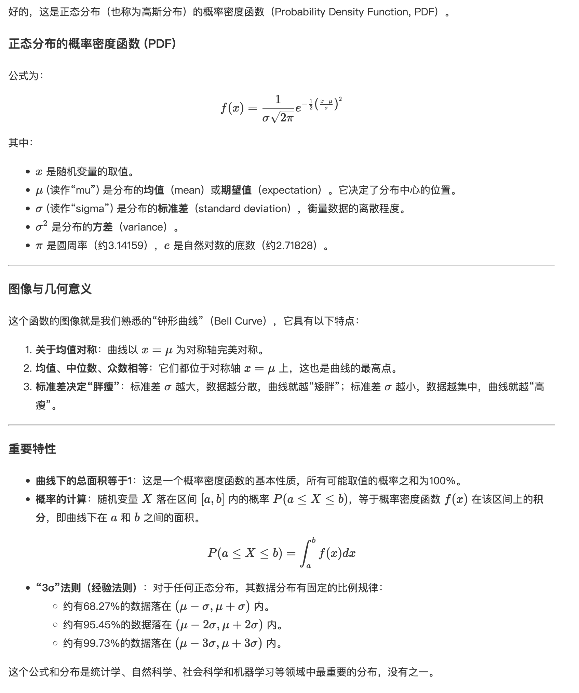

> 前提：使用 `vite` 创建的 `vue3`项目，使用 `ts`

## 实现方式一

> 使用 `markdown-it-texmath` 解析数学公式

### 安装依赖

```bash
npm install --save markdown-it markdown-it-anchor markdown-it-texmath highlight.js katex
```

### 实现代码

```ts
// src/components/markdown.ts
import hljs from 'highlight.js';
import 'highlight.js/styles/github.css';
import 'katex/dist/katex.min.css';
import MarkdownIt, { type Options } from 'markdown-it';
import markdownItAnchor from 'markdown-it-anchor';
import texmath from 'markdown-it-texmath';

// 定义 highlight 函数的类型
type HighlightFunction = (str: string, lang?: string) => string;

// 配置 MarkdownIt 实例的选项类型
const mdOptions: Options = {
  html: true, // 禁用原始 HTML 标签（安全）
  xhtmlOut: true, // 使用 / 关闭自闭合标签
  langPrefix: 'ds-', // 代码块 class 前缀
  linkify: true, // 自动将 URL 转为链接
  typographer: true, // 智能引号、破折号等
  highlight: ((str: string, lang?: string): string => {
    if (lang && hljs.getLanguage(lang)) {
      try {
        return `<pre class="hljs"><code>${hljs.highlight(str, { language: lang }).value}</code></pre>`;
      } catch (error) {
        console.error('Highlight.js error:', error);
      }
    }
    return `<pre class="hljs"><code>${md.utils.escapeHtml(str)}</code></pre>`;
  }) satisfies HighlightFunction
};

// 创建并配置 MarkdownIt 实例
const md: MarkdownIt = new MarkdownIt(mdOptions);

md.use(texmath, {
  delimiters: 'dollars', // ['brackets', 'dollars'], 数学公式类型 string array
  katexOptions: { macros: { '\\RR': '\\mathbb{R}' } }
});

md.use(markdownItAnchor, {
  permalink: false // 是否显示标题锚点
});

export default md;
```

```vue
<!-- src/components/MarkdownContent.vue -->
<script setup lang="ts">
import { computed } from 'vue';
import markdownIt from './markdown';

const props = defineProps({
  content: {
    type: String,
    default: ''
  }
});

// 将 Markdown 转为 HTML
const renderedHTML = computed(() => {
  if (!props.content) return { __html: '' };
  return { __html: markdownIt.render(props.content) };
});
</script>

<template>
  <div
    class="markdown-content"
    v-html="renderedHTML.__html"
  />
</template>

<style scoped>
.markdown-content {
  line-height: 1.8;
  font-size: 15px;
  color: #333;
  word-wrap: break-word;
}

.markdown-content :deep(p) {
  margin: 0.8em 0;
}

.markdown-content :deep(pre) {
  margin: 1em 0;
  padding: 12px;
  border-radius: 8px;
  overflow-x: auto;
}

.markdown-content :deep(code) {
  font-family: 'Courier New', monospace;
  background: #f3f4f6;
  padding: 2px 4px;
  border-radius: 4px;
  font-size: 0.95em;
}

.markdown-content :deep(blockquote) {
  border-left: 4px solid #0078d4;
  margin: 1em 0;
  padding: 0.5em 1em;
  background: #f9f9f9;
}

.markdown-content :deep(table) {
  border-collapse: collapse;
  width: 100%;
  margin: 1em 0;
}

.markdown-content :deep(th),
.markdown-content :deep(td) {
  border: 1px solid #ddd;
  padding: 8px;
  text-align: left;
}

.markdown-content :deep(img) {
  max-width: 100%;
  height: auto;
  border-radius: 6px;
}

.markdown-content :deep(a) {
  color: #0078d4;
  text-decoration: none;
}

.markdown-content :deep(a:hover) {
  text-decoration: underline;
}
</style>
```

#### 使用

```vue
<template>
  <div class="content">
    <MarkdownContent :content="mdStr" />
  </div>
</template>

<script lang="ts" setup>
import MarkdownContent from '@/components/MarkdownContent.vue';
import { ref } from 'vue';

const mdStr = ref<string>(
  '好的，这是正态分布（也称为高斯分布）的概率密度函数（Probability Density Function, PDF）。\n\n### 正态分布的概率密度函数 (PDF)\n\n公式为：\n\n$$f(x) = \\frac{1}{\\sigma\\sqrt{2\\pi}}  e^{ -\\frac{1}{2} \\left(\\frac{x - \\mu}{\\sigma}\\right)^2 }$$\n\n其中：\n-   $x$ 是随机变量的取值。\n-   $\\mu$ (读作“mu”) 是分布的**均值**（mean）或**期望值**（expectation）。它决定了分布中心的位置。\n-   $\\sigma$ (读作“sigma”) 是分布的**标准差**（standard deviation），衡量数据的离散程度。\n-   $\\sigma^2$ 是分布的**方差**（variance）。\n-   $\\pi$ 是圆周率（约3.14159），$e$ 是自然对数的底数（约2.71828）。\n\n---\n\n### 图像与几何意义\n\n这个函数的图像就是我们熟悉的“钟形曲线”（Bell Curve），它具有以下特点：\n\n1.  **关于均值对称**：曲线以 $x = \\mu$ 为对称轴完美对称。\n2.  **均值、中位数、众数相等**：它们都位于对称轴 $x = \\mu$ 上，这也是曲线的最高点。\n3.  **标准差决定“胖瘦”**：标准差 $\\sigma$ 越大，数据越分散，曲线就越“矮胖”；标准差 $\\sigma$ 越小，数据越集中，曲线就越“高瘦”。\n\n\n\n---\n\n### 重要特性\n\n-   **曲线下的总面积等于1**：这是一个概率密度函数的基本性质，所有可能取值的概率之和为100%。\n-   **概率的计算**：随机变量 $X$ 落在区间 $[a, b]$ 内的概率 $P(a \\leq X \\leq b)$，等于概率密度函数 $f(x)$ 在该区间上的**积分**，即曲线下在 $a$ 和 $b$ 之间的面积。\n\n$$P(a \\leq X \\leq b) = \\int_a^b f(x)  dx$$\n\n-   **“3σ”法则（经验法则）**：对于任何正态分布，其数据分布有固定的比例规律：\n    -   约有68.27%的数据落在 $(\\mu - \\sigma, \\mu + \\sigma)$ 内。\n    -   约有95.45%的数据落在 $(\\mu - 2\\sigma, \\mu + 2\\sigma)$ 内。\n    -   约有99.73%的数据落在 $(\\mu - 3\\sigma, \\mu + 3\\sigma)$ 内。\n\n这个公式和分布是统计学、自然科学、社会科学和机器学习等领域中最重要的分布，没有之一。'
);
</script>

<style>
.content {
  margin: 20px auto;
  max-width: 800px;
  min-height: 100vh;
}
</style>
```

## 实现方式二

### 安装依赖

```bash
npm install --save markdown-it markdown-it-anchor @vscode/markdown-it-katex highlight.js katex
```

### 实现代码

```ts
// src/components/markdown.ts
import mk from '@vscode/markdown-it-katex';
import hljs from 'highlight.js';
import 'highlight.js/styles/github.css';
import katex from 'katex';
import 'katex/dist/katex.min.css';
import MarkdownIt, { type Options } from 'markdown-it';
import markdownItAnchor from 'markdown-it-anchor';

// Load some katex extensions
import 'katex/contrib/copy-tex';
import 'katex/contrib/mhchem';

type HighlightFunction = (str: string, lang?: string) => string;

const mdOptions: Options = {
  html: true, // 禁用原始 HTML 标签（安全）
  xhtmlOut: true, // 使用 / 关闭自闭合标签
  langPrefix: 'ds-', // 代码块 class 前缀
  linkify: true, // 自动将 URL 转为链接
  typographer: true, // 智能引号、破折号等
  highlight: ((str: string, lang?: string): string => {
    if (lang && hljs.getLanguage(lang)) {
      try {
        return `<pre class="hljs"><code>${hljs.highlight(str, { language: lang }).value}</code></pre>`;
      } catch (error) {
        console.error('Highlight.js error:', error);
      }
    }
    return `<pre class="hljs"><code>${md.utils.escapeHtml(str)}</code></pre>`;
  }) satisfies HighlightFunction
};

// 创建并配置 MarkdownIt 实例
const md: MarkdownIt = new MarkdownIt(mdOptions);

md.use(mk, { katex });

md.use(markdownItAnchor, {
  permalink: false // 是否显示标题锚点
});

export default md;
```

```vue
<!-- src/components/MarkdownContent.vue 同实现一-->
```

#### 使用

```vue
<!-- 同实现一-->
```

## 效果图

