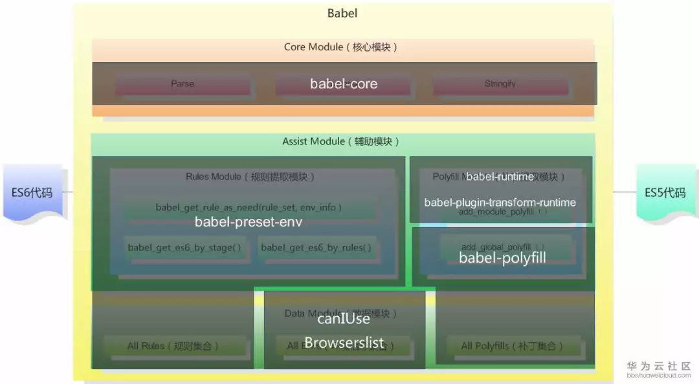

# Babel入门

[Babel中文网](https://www.babeljs.cn/)

[关于 Babel 你必须知道的](https://mp.weixin.qq.com/s?__biz=MzAxODE2MjM1MA==&mid=2651556802&idx=1&sn=e1662ecf90a83b1af70f414a129c419e&chksm=80255c03b752d515cd295494b7dd7f9934dda965993ceb504dd81883986b2459ba6bbc8036c1&scene=21#wechat_redirect)

[如何写好.babelrc？Babel的presets和plugins配置解析](https://mp.weixin.qq.com/s?__biz=MzAxODE2MjM1MA==&mid=2651554316&idx=2&sn=0eed97d38b8e52bd32e3a983e4a36259&chksm=802555cdb752dcdbfb0d7943f4b16013478f3876323d3c0b249f7e840dfc32ff7f8d42de900f&scene=21#wechat_redirect)

[不容错过的 Babel 7 知识汇总](https://mp.weixin.qq.com/s?__biz=MzAxODE2MjM1MA==&mid=2651557504&idx=1&sn=d107ac3ffcf0b1e7703f67841e6878e3&chksm=80255941b752d057bdee60ab26fbb881f59c64e7748d23b00a55498009c82462e267701f1884&mpshare=1&scene=1&srcid=&sharer_sharetime=1575690524256&sharer_shareid=38ae308f973ffdefaa3c22ddb4d38578&key=636b949d6534501af93901af2df27754f02c01fd0f6d1dff0c825d8b867aa2769c6cf15ca179ae9223091e6e5ee474da1b15dd0dc957ace5d853f8d0c8420acaad099c6ac4c728adaf5a77a274936c9a&ascene=1&uin=Mjg1MDc1OTkwNQ%3D%3D&devicetype=Windows+7&version=62070158&lang=zh_CN&exportkey=A5kS66nATzTigVUVtTZ4aMs%3D&pass_ticket=ng4r6Ujr5n0DdvPEeoEsrvf9%2FfCrg4c8eOArZ6jPtCc9NL9NVrvBFQDlGlgHNG87)

[一口（很长的）气了解 babel](https://zhuanlan.zhihu.com/p/43249121)

[core-js@3带来的惊喜](https://www.cnblogs.com/sefaultment/p/11631314.html)

[babel 7 的使用的个人理解](https://www.jianshu.com/p/cbd48919a0cc)

## 介绍

**Babel is a JavaScript compiler.**——顾名思义，`Babel` 就是将最新的 `ES6+` 语法，向后兼容，编译转化为支持各个浏览器可以运行的 `javascript` 代码。

### `Babel`

`babel`编译经历三个阶段：解析(`parse)`，转换(`transform`)，生成(`generate`)。


注意：在升级 `Babel 6.X` 版本以后，所有的插件都是可插拔的（**意味着`transform` 流程全部交给了插件去做。**）。这就意味着安装`babel`之后，是不能工作的，需要配置对应的 `.babelrc` 文件才能发挥完整的作用。

如果想要通过`Babel`完成你的代码转换，那么需要配置一些你需要的插件。

### 插件——`plugin`

`plugin` 就是将高级的语法转化为兼容多种浏览器的载体：

`Babel` 构建在插件之上，使用现有的或者自己编写的插件可以组成一个转换通道，`Babel` 的插件分为两种: 语法插件和转换插件。

#### 语法插件

这些插件只允许 `Babel` **解析（parse）** 特定类型的语法（不是转换）

#### 转换插件

将不识别的新内置函数进行转换：转换插件会启用相应的语法插件(因此不需要同时指定这两种插件)。

#### 将箭头函数转化为普通函数

在`.babelrc` 设置：

```javascript
{
  "presets": ["@babel/plugin-transform-arrow-functions"]
}
```

转换 => 生成：

```javascript
// 转换前
const name = 'houfee'
let hello = `hello ${name}`

let func = () => {
  console.log('转化箭头函数')
}

// 转换后
const name = 'houfee';
let hello = `hello ${name}`;

let func = function () {
  console.log('转化箭头函数');
};
```

**可见，以上转换只转换了箭头函数，而`const` 和 `let` 却没有转化。**

### 预设——`preset`

`babel` 将 `ES6+` 新语法向后兼容时，将新语法封装为多个插件转化，而不是唯一一个插件。这是你想要体验 `ES6` 所有的新特性（**注意：语法转换只是将高版本的语法转换成低版本的，但是新的内置函数、实例方法无法转换。**）时，那么你只需在`.babelrc` 设置：

```json
{
  "presets": ["@babel/preset-env"]
}
```

转换 => 生成：

```javascript
// 转换前
const name = 'houfee'

let hello = `hello ${name}`

let func = () => {
  console.log('转化箭头函数')
}

class Point {
  constructor(x, y) {
      this.x = x;
      this.y = y;
  }
}

let promise = new Promise((res, rej) => console.log(res, rej))


// 转换后
"use strict";

function _classCallCheck(instance, Constructor) { if (!(instance instanceof Constructor)) { throw new TypeError("Cannot call a class as a function"); } }

var name = 'houfee';
var hello = "hello ".concat(name);

var func = function func() {
  console.log('转化箭头函数');
};

var Point = function Point(x, y) {
  _classCallCheck(this, Point);

  this.x = x;
  this.y = y;
};

var promise = new Promise(function (res, rej) {
  return console.log(res, rej);
});
```

**可见： `@babel/preset-env` 插件只是转换了已存在的语法，对于新增的内置函数依然是无法转换的。**

### `plugin` 和 `preset` 关系

`plugin`  插件功能单一，只能完成特定语法转换；——特点是：颗粒度小，效率高，但是需要逐个引入（`babel`的插件有20+）。

`preset`  将一系列的 `plugin` 功能集合在一起；——特点是：一次引入多个语法功能的插件，优化配置。

### `plugin` 和 `preset` 的执行顺序

多个`Plugin`和`Preset`时执行顺序非常重要：

​       1，先执行完所有`Plugin`，再执行`Preset`。

​       2，多个`Plugin`，按照声明次序顺序执行。

​       3，多个`Preset`，按照声明次序逆序执行。

## `Babel` 相关模块简要说明

`Babel` 的模块那么多，那么要怎么学习呢？



目前 `Babel` 版本为 `Babel 7.4.0`，此图只是示意（网图~）。

### 核心库 ` @babel/core`

`babel` 的核心 `api` 都在这个模块中。也就是这个模块会把我们写的 `js` 代码抽象成 `AST` (`abstract syntax tree`)树；然后再将 `plugins` 转译好的内容解析为 `js` 代码。

### 命令行工具 `@babel/cli`

`babel` 提供的命令行工具，主要是提供 `babel` 这个命令，适合安装在项目里。

`@babel/node` 提供了 `babel-node` 命令，但是 `@babel/node` 更适合全局安装，不适合安装在项目里。

```bash
npm install --save-dev @babel/core @babel/cli
```

### `@babel/preset-env`

将新增的`ES6`语法转换为浏览器支持的语法，但是不会转换新增的内置函数。

### `@babel/polyfill`

`babel` 对一些新的 API 是无法转换，比如 `Generator、Set、Proxy、Promise` 等全局对象，以及新增的一些方法：`includes、Array.form` 等。所以这个时候就需要一些工具来为浏览器做这个兼容。

*官网的定义：`babel-polyfill` 是为了模拟一个完整的 `ES6+` 环境，旨在用于应用程序而不是库/工具。*

**`@babel/polyfill` 主要有两个缺点：**

1. 使用 `@babel/polyfill` 会导致打出来的包非常大，很多其实没有用到，对资源来说是一种浪费。
2. `@babel/polyfill` 可能会污染全局变量，给很多类的原型链上都作了修改，这就有不可控的因素存在。

因为上面两个问题，在 `Babel7` 通过设置 `"useBuiltIns":"usage"`这个参数值就可以实现按需加载。

### `@babel/plugin-transform-runtime`

配合其他插件使用，避免编译后的代码中出现重复的帮助程序，有效减少包体积。

### 其他预设

`@babel/preset-flow`

`@babel/preset-react`

`@babel/preset-typescript`
