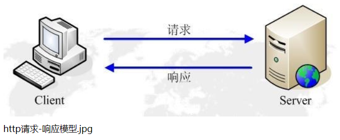
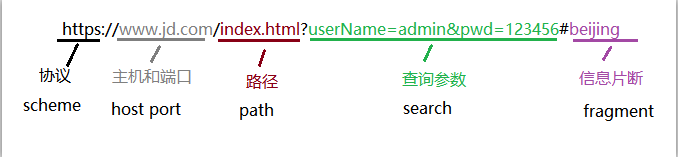
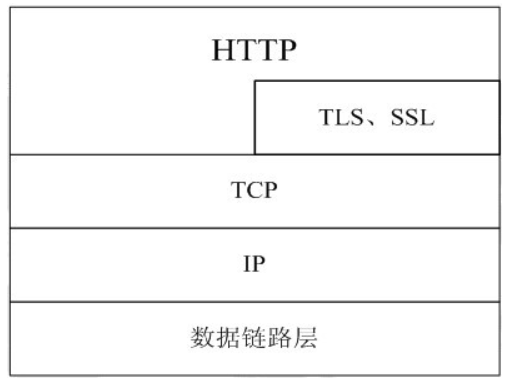
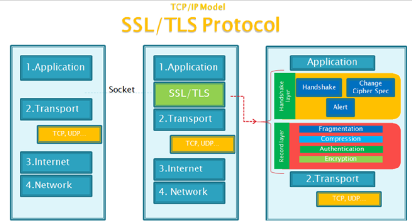
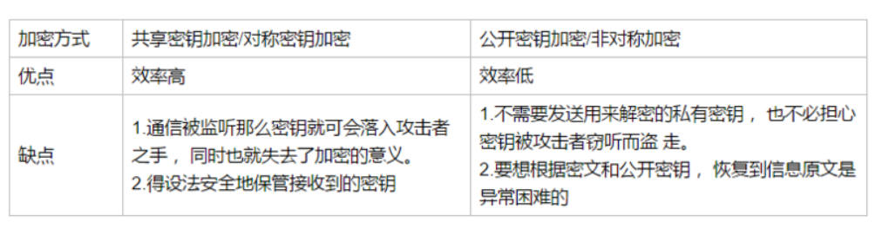
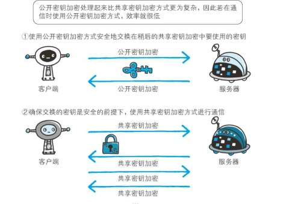
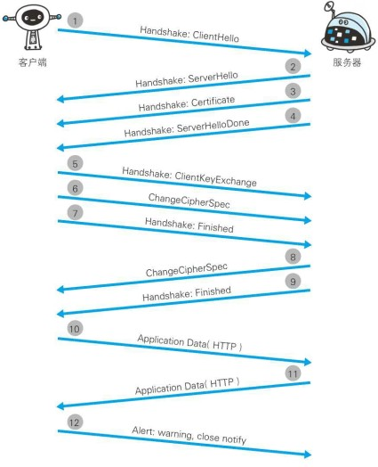
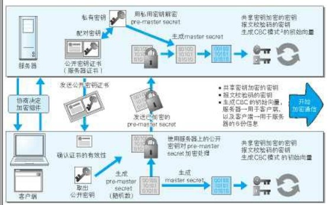

# 应用层上的协议 Http

## HTTP

http://www.runoob.com/http/http-tutorial.html

https://www.cnblogs.com/houfee/articles/9161847.html

https://blog.csdn.net/u013219814/article/details/56290792

浏览器作为`HTTP客户端`通过`URL`向`HTTP服务端`即 WEB 服务器发送所有请求。



### HTTP 之 URL

HTTP 使用统一资源标识符（Uniform Resource Identifiers, URI）来传输数据和建立连接。

URL 是一种特殊类型的 URI，包含了用于查找某个资源的足够的信息。

URL,全称是 UniformResourceLocator, 中文叫统一资源定位符,是互联网上用来标识某一处资源的地址。



### 请求与响应

#### 请求报文

一个 HTTP 请求报文由四个部分组成：**请求行、请求头部、空行和请求数据**

- **请求行(request line)**由请求方法字段、URL 字段和 HTTP 协议版本字段 3 个字段组成，之间用空格分隔。例如：

`GET /api/usercenter/login?msg=1&_=1551407186371 HTTP/1.1`

- **请求头部** 由关键字/值对组成，每行一对，关键字和值用英文冒号“:”分隔。请求头部通知服务器有关客户端请求的信息，典型的请求头有：

```
Host: baike.baidu.com
Accept: application/json, text/javascript, */*; q=0.01
User-Agent: Mozilla/5.0 (Windows NT 10.0; Win64; x64) AppleWebKit/537.36 (KHTML, like Gecko) Chrome/71.0.3578.98 Safari/537.36
```

- **空行 **：最后一个请求头之后是一个空行，发送回车符和换行符，通知服务器以下不再有请求头。

- **请求数据**：请求数据不在 GET 方法中使用，而是在 POST 方法中使用。POST 方法适用于需要客户填写表单的场合。与请求数据相关的最常使用的请求头是 Content-Type 和 Content-Length。

#### 响应报文

HTTP 响应也由四个部分组成：状态行、消息报头、空行和响应正文。

```
HTTP/1.1 200 OK
Date: Mon, 27 Jul 2009 12:28:53 GMT
Server: Apache
Last-Modified: Wed, 22 Jul 2009 19:15:56 GMT
ETag: "34aa387-d-1568eb00"
Accept-Ranges: bytes
Content-Length: 51
Vary: Accept-Encoding
Content-Type: text/plain
```

### [HTTP 请求方法](http://www.runoob.com/http/http-methods.html)

### [HTTP 响应头信息](http://www.runoob.com/http/http-header-fields.html)

### [HTTP 状态码](http://www.runoob.com/http/http-status-codes.html)

## HTTPS（身披 SSL 协议的 HTTP）

参考链接：

[HTTP 与 HTTPS 的区别](http://www.runoob.com/w3cnote/http-vs-https.html)

[HTTPS 科普扫盲帖](https://www.cnblogs.com/chyingp/p/https-introduction.html)

[HTTPS 小结](https://segmentfault.com/a/1190000009020635)

### HTTP 和 HTTPS 区别

- HTTP 是明文传输未加密，安全性差，HTTPS（HTTP + SSL）数据传输是加密的，安全性较好
- HTTPS 协议需要到 CS 申请——收费
- HTTP 页面响应速度比 HTTPS 快，主要是因为 HTTP 使用 TCP 三次握手建立连接，客户端和服务器需要交换 3 个包，而 HTTPS 除了 TCP 的三个包，还要加上 ssl 握手需要的 9 个包，所以一共是 12 个包。
- 默认端口不同
- HTTPS 其实就是建构在 SSL/TLS 之上的 HTTP 协议，所以，要比较 HTTPS 比 HTTP 要更耗费服务器资源。

### HTTPS 基础

HTTPS = HTTP + **加密** + **认证** + **完整性保护**

HTTPS 经由 HTTP 进行通信，但是利用 SSL/TLS 来进行加密数据包。

SSL 提供 **加密处理** 和 **认证** 以及 **摘要功能**

HTTPS 开发的主要目的，是提供对网站服务器的身份认证，保护交换数据的隐私与完整性。

一般，HTTP 是与 TCP 直接通信，现在使用 SSL，HTTP 先与 SSL 通信，SSL 和 TCP 通信。



### SSL 和 TLS

​ 通俗的讲，TLS、SSL 其实是类似的东西，SSL 是个加密套件，负责对 HTTP 的数据进行加密。TLS 是 SSL 的升级版。现在提到 HTTPS，加密套件基本指的是 TLS。

​ SSL 是独立于 HTTP 的协议， 所以不光是 HTTP 协议， 其他运行在应用层的 SMTP 和 Telnet 等协议均可配合 SSL 协议使用。

​ **传输流程**：原先是应用层将数据直接给到 TCP 进行传输，现在改成应用层将数据给到 TLS/SSL，将数据加密后，再给到 TCP 进行传输。如图：



### HTTPS 的工作原理

HTTPS 默认工作在 TCP 协议 443 端口，它的工作流程一般如以下方式：


1. **客户端发起 HTTPS 请求** ——TCP 三次握手之后（[传输层上的 TCP 和 UDP](https://www.cnblogs.com/houfee/p/9815053.html)（三次握手））

2. **服务端的配置** ，客户端验证服务器数字证书（这套证书其实就是一对公钥和私钥 ）

3. **传送证书**，这个证书就是**公钥**，其中包含了证书的颁布机构，过期时间等

4. **客户端解析证书**，这个部分的工作是客户端的 TLS 来完成的，首先会验证公钥是否有效，比如颁发机构，过期时间等，如果发现异常，则会弹出一个警告框，提示证书存在问题。

   如果证书没有问题，那么就生成一个随机值，然后用证书对改随机值进行加密

5. **传送加密信息**，此时传送的是用**证书加密后的随机值**，目的就是让服务器得到这个随机值，以后客户端和服务器端的通信就可以通过这个随机值来进行加密解密了。

6. **服务器端解密信息**，服务器端用私钥解密后，得到客户端传过来的随机值（私钥），然后把内容通过该值进行对称加密，所谓对称加密就是，将信息和私钥通过某种算法混合在一起，这要除非知道私钥，不然无法获取内容，而客户端和服务器端都知道这个私钥，所以只要加密算法够彪悍，私钥够复杂，数据就足够安全。

7. **传输加密后的信息**，这部分信息是服务器端用私钥加密后的信息，可以在客户端还原。

8. **客户端解密信息**，客户端用之前生成的私钥解密服务端传过来的信息，于是获取了解密后的内容，整个过程第三方即使监听到了数据，也束手无策。

### HTTPS 如何加密数据（看不懂）

加密分为：对称加密和非对称加密

#### 对称加密

流程：客户端和服务器端进行一次私密对话：

1.每次对话时，服务器端都要给客户端一个秘钥

2.客户端把数据加密以后，发送给服务器端

3.服务器端使用秘钥解密接收到的数据

优点：效率高

缺点：不够安全，万一黑客把秘钥和密文截取了，他就可以解密这段数据了

#### 非对称加密

流程：客户端和服务器端进行一次私密对话：

1.服务器端要给客户端一个公钥（全世界都知道），服务器端保留这个服务器对应的的私钥

2.客户端用公钥把数据加密以后，发送给服务器端

3.服务器端使用对应的的私钥解密接收到的数据

优点：效率低

缺点：不够安全，万一黑客把密文截取了（公钥早就知道了），他就可以解密这段数据了



HTTPS 采用共享密钥加密和公开密钥加密两者并用的混合加密机制。 若密钥能够实现安全交换， 那么有可能会考虑仅使用公开密钥加密来通信。 但是公开密钥加密与共享密钥加密相比， 其处理速度要慢。
所以应充分利用两者各自的优势， 将多种方法组合起来用于通信。 在交换密钥环节使用公开密钥加密方式， 之后的建立通信交换报文阶段则使用共享密钥加密方式。



### HTTPS 的安全通信机制/SSL 过程（看不懂）



步骤 1： 客户端通过发送 `Client Hello` 报文开始 SSL 通信。 报文中包含客户端支持的 SSL 的指定版本、 加密组件（ Cipher Suite） 列表（ 所使用的加密算法及密钥长度等） 。
步骤 2： 服务器可进行 SSL 通信时， 会以 `Server Hello` 报文作为应答。 和客户端一样， 在报文中包含 SSL 版本以及加密组件。 服务器的加密组件内容是从接收到的客户端加密组件内筛选出来的。
步骤 3： 之后服务器发送 `Certificate` 报文。 报文中包含公开密钥证书。
步骤 4： 最后服务器发送 `Server Hello Done` 报文通知客户端， 最初阶段的 SSL 握手协商部分结束。
步骤 5： SSL 第一次握手结束之后， 客户端以 `Client KeyExchange` 报文作为回应。报文中包含通信加密中使用的一种被称为 `Pre-master secret` 的随机密码串。 该报文已用步骤 3 中的公开密钥进行加密。
步骤 6： 接着客户端继续发送 `Change Cipher Spec` 报文。 该报文会提示服务器， 在此报文之后的通信会采用 `Pre-master secret` 密钥加密。
步骤 7： 客户端发送 `Finished` 报文。 该报文包含连接至今全部报文的整体校验值。这次握手协商是否能够成功， 要以服务器是否能够正确解密该报文作为判定标准。
步骤 8： 服务器同样发送 `Change Cipher Spec` 报文。
步骤 9： 服务器同样发送 `Finished` 报文。
步骤 10： 服务器和客户端的 `Finished` 报文交换完毕之后， SSL 连接就算建立完成。当然， 通信会受到 SSL 的保护。 从此处开始进行应用层协议的通信， 即发送 `HTTP`请求。
步骤 11： 应用层协议通信， 即发送 `HTTP` 响应。
步骤 12： 最后由客户端断开连接。 断开连接时， 发送 `close_notify`。这步之后再发送 TCP FIN 报文来关闭与 TCP 的通信

在以上流程中， 应用层发送数据时会附加一种叫做 `MAC`（ Message Authentication Code） 的报文摘要。 MAC 能够查知报文是否遭到篡改， 从而保护报文的完整性。


