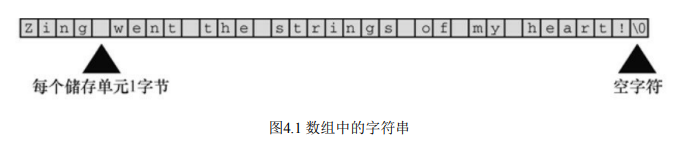
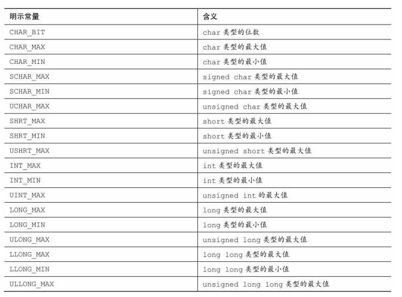
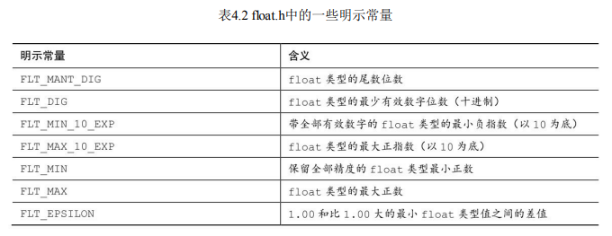
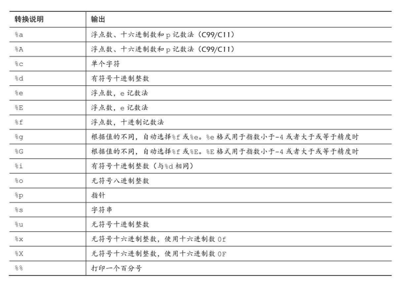
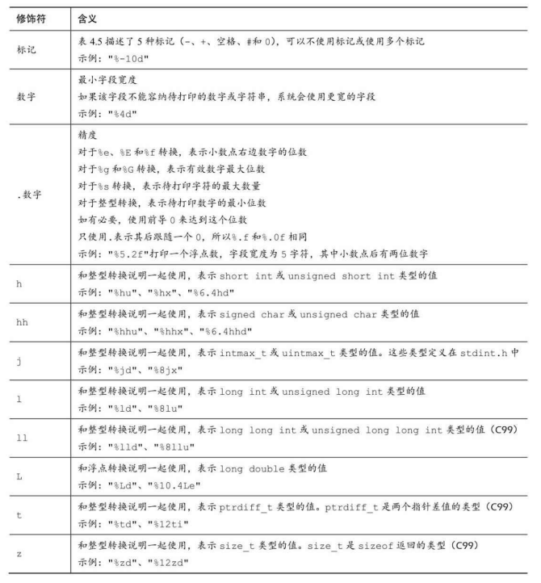
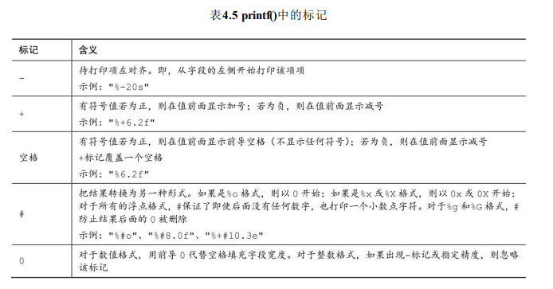
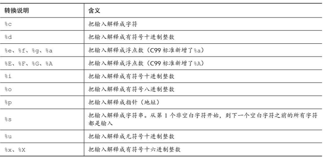
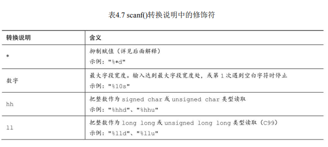

# 第4章 字符串和格式化输入/输出

```cpp
// talkback.c -- 演示与用户交互
#include <stdio.h>
#include <string.h>	 // 提供strlen()函数的原型
#define DENSITY 62.4 // 人体密度（单位：磅/立方英尺）
int main()
{
	float weight, volume;
	int size, letters;
	char name[40]; // name是一个可容纳40个字符的数组
	printf("输入你的名字：\n");
	scanf("%s", name);
	printf("%s, 输入你的体重（磅）：\n", name);
	scanf("%f", &weight);
	size = sizeof name;
	letters = strlen(name);
	volume = weight / DENSITY;
	printf("%s, 你的人体密度是 %2.2f 磅/立方英尺 \n", name, volume);
	printf("你的名字有几个字符 %d \n", letters);
	printf("用 %d 个字节来存储它\n", size);
	return 0;
}
```

1. 用数组（array）储存字符串（character string），在该程序中，用户输入的名被储存在数组中，该数组占用内存中40个连续的字节，每个字节储存一个字符值。
2. 使用%s转换说明来处理字符串的输入和输出。注意，在scanf()中，name没有&前缀，而weight有（稍后解释，&weight和name都是地址）。
3. 用C预处理器把字符常量DENSITY定义为62.4
4. 用C函数strlen()获取字符串的长度。

## 字符串简介

字符串（character string）是一个或多个字符的序列。

### char类型数组和null字符

C语言没有专门用于储存字符串的变量类型，字符串都被储存在char类型的数组中。数组由连续的存储单元组成，字符串中的字符被储存在相邻的存储单元中，每个单元储存一个字符（见图4.1）。



C中的字符串一定以空字符结束，这意味着数组的容量必须至少比待存储字符串中的字符数多1。

那么，什么是数组？可以把数组看作是一行连续的多个存储单元。用更正式的说法是，数组是同类型数据元素的有序序列。

```cpp
#include <stdio.h>
#include <string.h>
int main()
{
	// name后面的方括号表明这是一个数组，方括号中的40表明该数组中的元素数量。char表明每个元素的类型
	char name[40];
	return 0;
}
```

一般而言，根据%s转换说明，scanf()只会读取字符串中的一个单词，而不是一整句。
C语言还有其他的输入函数（如，fgets()），用于读取一般字符串。

```cpp
/* praise1.c -- 使用不同类型的字符串 */
#include <stdio.h>
#define PRAISE "哈哈哈"
int main(void)
{
	char name[40];
	printf("你的名字？");
	scanf("%s", name);
	printf("Hello, %s, %s\n", name, PRAISE);
	return 0;
}
/* 
不用亲自把空字符放入字符串末尾
当输入“sad ZXC”时，只会读取空格前面的 sad
在遇到第1个空白（空格、制表符或换行符）时就不再读取输入
 */
```

1. 字符串和字符

字符串常量"x"和字符常量'x'不同。区别之一在于'x'是基本类型（char），而"x"是派生类型（char数组）；区别之二是"x"实际上由两个字符组成：'x'和空字符\0。

2. strlen()

```cpp
// 如果编译器不识别%zd，尝试换成%u或%lu。
#include <stdio.h>
#include <string.h> /* 提供strlen()函数的原型 */
#define PRAISE "hahaha~ heihei"
int main(void)
{
	char name[40];
	printf("你的名字：");
	scanf("%s", name);
	printf("Hello, %s %s\n", name, PRAISE);
	printf("你的名字有 %zd 字母，占据了 %zd 记忆单元\n", strlen(name), sizeof name);
	printf("赞美词有 %zd 字母", strlen(PRAISE));
	printf("占据了 %zd 记忆单元\n", sizeof PRAISE);
	return 0;
}
```

对于 PRAISE，用 strlen()得出的也是字符串中的字符数（包括空格和标点符号）。
然而，sizeof运算符给出的数更大，因为它把字符串末尾不可见的空字符也计算在内。

### 常量和C预处理器

第2章中介绍了预处理器如何使用#include包含其他文件的信息。预处理器也可用来定义常量。只需在程序顶部添加下面一行(编译时替换（compile-time substitution）)：

`#define TAXRATE 0.015`

1. const限定符

C90标准新增了const关键字，用于限定一个变量为只读。

`const int MONTHS = 12;` MONTHS在程序中不可更改，值为12

2. 明示常量

C头文件limits.h和float.h分别提供了与整数类型和浮点类型大小限制相关的详细信息。每个头文件都定义了一系列供实现使用的明示常量。limits.h头文件包含以下类似的代码：

`#define INT_MAX +32767`

`#define INT_MIN -32768`

如果在程序中包含limits.h头文件，就可编写下面的代码：

`printf("Maximum int value on this system = %d\n", INT_MAX);`

如果系统使用4字节的int，limits.h头文件会提供符合4字节int的INT_MAX和INT_MIN。





### printf()函数

转换说明及其打印的输出结果：



#### printf()的转换说明修饰符



**注意 类型可移植性**

sizeof 运算符以字节为单位返回类型或值的大小。这应该是某种形式的整数，但是标准只规定了该值是无符号整数。在不同的实现中，它可以是unsigned int、unsigned long甚至是unsigned long long。因此，如果要用printf()函数显示sizeof表达式，根据不同系统，可能使用%u、%lu或%llu。这意味着要查找你当前系统的用法，如果把程序移植到不同的系统还要进行修改。鉴于此， C提供了可移植性更好的类型。首先，stddef.h头文件（在包含stdio.h头文件时已包含其中）把size_t定义成系统使用sizeof返回的类型，这被称为底层类型（underlying type）。其次，printf()使用z修饰符表示打印相应的类型。同样，C还定义了ptrdiff_t类型和t修饰符来表示系统使用的两个地址差值的底层有符号整数类型。

**注意 float参数的转换**

对于浮点类型，有用于double和long double类型的转换说明，却没有float类型的。这是因为在K&R C中，表达式或参数中的float类型值会被自动转换成double类型。一般而言，ANSI C不会把float自动转换成double。然而，为保护大量假设float类型的参数被自动转换成double的现有程序，printf()函数中所有float类型的参数（对未使用显式原型的所有C函数都有效）仍自动转换成double类型。因此，无论是K&R C还是ANSI C，都没有显示float类型值专用的转换说明。



```cpp
/* width.c -- 字段宽度 */
#include <stdio.h>
#define PAGES 959
int main(void)
{
	printf("*%d*\n", PAGES); // 不带任何修饰符
	printf("*%2d*\n", PAGES); // 字段宽度自动扩大以符合整数的长度。
	printf("*%10d*\n", PAGES); // 其对应的输出结果有10个空格宽度
	printf("*%-10d*\n", PAGES); // -标记说明打印的数字位于字段的左侧
	printf("*%+10d*\n", PAGES); // 展示+号
	return 0;
}
```

```cpp
// floats.c -- 一些浮点型修饰符的组合
#include <stdio.h>
int main(void)
{
	const double RENT = 3852.99; // const变量
	printf("*%f*\n", RENT); // *3852.990000* 系统默认设置,和小数点后打印6位数字
	printf("*%e*\n", RENT); // *3.852990e+003* 小数点的左侧打印1个数字，在小数点的右侧打印6个数字。
	printf("*%4.2f*\n", RENT); // *3852.99*
	printf("*%3.1f*\n", RENT); // *3853.0*
	printf("*%10.3f*\n", RENT); // *  3852.990* 前面的为字宽
	printf("*%10.3E*\n", RENT); // *3.853E+003*
	printf("*%+4.2f*\n", RENT); // *+3852.99*
	printf("*%010.2f*\n", RENT); // *0003852.99*  
	return 0;
}
```

```cpp
/* flags.c -- 演示一些格式标记 */
#include <stdio.h>
int main(void)
{
	printf("%x %X %#x\n", 31, 31, 31); // 1f 1F 0x1f
	printf("**%d**% d**% d**\n", 42, 42, -42); // **42** 42**-42**
	printf("**%5d**%5.3d**%05d**%05.3d**\n", 6, 6, 6, 6); // **    6**  006**00006**  006**
	return 0;
}
```

**字符串格式的示例**

```cpp
/* stringf.c -- 字符串格式 */
#include <stdio.h>
#include <string.h>	 // 提供strlen()函数的原型
#define BLURB "Authentic imitation!"
int main(void)
{
	printf("%d\n", strlen(BLURB)); // 20
	printf("[%2s]\n", BLURB); // [Authentic imitation!]
	printf("[%24s]\n", BLURB); // [    Authentic imitation!]
	printf("[%24.5s]\n", BLURB); // [                   Authe] .5告诉printf()只打印5个字符
	printf("[%-24.5s]\n", BLURB); // [Authe                   ]
	return 0;
}
```

### scanf()函数

scanf()把输入的字符串转换成整数、浮点数、字符或字符串，而 printf()正好与它相反，把整数、浮点数、字符和字符串转换成显示在屏幕上 的文本。

scanf()和 printf()类似，也使用格式字符串和参数列表。scanf()中的格式 字符串表明字符输入流的目标数据类型。两个函数主要的区别在参数列表 中。printf()函数使用变量、常量和表达式，而scanf()函数使用指向变量的指针。这里，读者不必了解如何使用指针，只需记住以下两条简单的规则：

**用scanf()读取基本变量类型的值，在变量名前加上一个&**

**用scanf()把字符串读入字符数组中，不要使用&**

```cpp
// input.c -- 何时使用&
#include <stdio.h>
int main(void)
{
	int age;  // 变量
	float assets; // 变量
	char pet[30]; // 字符数组，用于储存字符串
	printf("Enter your age, assets, and favorite pet.\n");
	scanf("%d %f", &age, &assets); // 这里要使用&
	scanf("%s", pet);			   // 字符数组不使用&
	printf("%d $%.2f %s\n", age, assets, pet);
	return 0;
}
```

scanf()函数所用的转换说明与printf()函数几乎相同。主要的区别是，对 于float类型和double类型，printf()都使用%f、%e、%E、%g和%G转换说 明。而scanf()只把它们用于float类型，对于double类型时要使用l修饰符。表 4.6列出了C99标准中常用的转换说明。





2. 格式字符串中的普通字符

scanf()函数允许把普通字符放在格式字符串中。除空格字符外的普通字 符必须与输入字符串严格匹配。例如，假设在两个转换说明中添加一个逗号： `scanf("%d,%d", &n, &m);`


