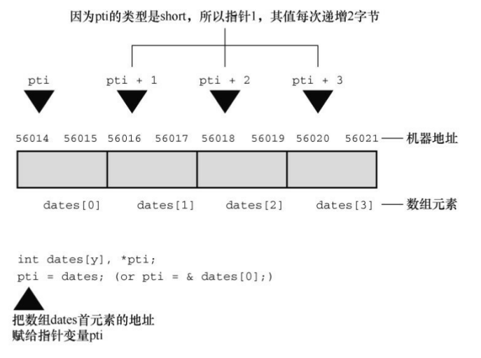

# 数组和指针

本章介绍以下内容：

- 关键字：static
- 运算符：&、*（一元）
- 如何创建并初始化数组
- 指针（在已学过的基础上）、指针和数组的关系
- 编写处理数组的函数
- 二维数组

## 数组

```c
/* 一些数组声明*/
int main(void)
{
    float candy[365]; /* 内含365个float类型元素的数组 */
    char code[12]; /*内含12个char类型元素的数组*/
    int states[50]; /*内含50个int类型元素的数组 */
}
```

```c
// 只储存单个值的变量有时也称为标量变量（scalar variable）
int fix = 1;
float flax = PI * 2;

// C使用新的语法来初始化数组
int powers[8] = {1,2,4,6,8,16,32,64}; /* 从ANSI C开始支持这种初始化 */
```

```c
/* day_mon1.c -- 打印每个月的天数 */
#include <stdio.h>
#define MONTHS 12
int main(void)
{
 int days[MONTHS] = {31, 28, 31, 30, 31, 30, 31, 31, 30, 31, 30, 31};
 int index;
 for (index = 0; index < MONTHS; index++)
  printf("%2d 月有 %2d 天\n", index + 1, days[index]);
 return 0;
}
```

使用const声明数组

`const int days[MONTHS] = {31,28,31,30,31,30,31,31,30,31,30,31};`

这样修改后，程序在运行过程中就不能修改该数组中的内容。

如果初始化数组失败怎么办？

```c
/* no_data.c -- 为初始化数组 */
#include <stdio.h>
#define SIZE 4
int main(void)
{
 int no_data[SIZE]; /* 未初始化数组 */
 int i;
 printf("%2s%14s\n", "i", "no_data[i]");
 for (i = 0; i < SIZE; i++)
  printf("%2d%14d\n", i, no_data[i]);
 return 0;
}
```

使用数组前必须先初始化它。与普通变量类似，在使用数组元素之前， 必须先给它们赋初值。

数组和其他变量类似，可以把数组创建成不同的存储类别（storage class）。

在这里提到存储类别的原因是，不同的存储类别有不同的属性，所以不 能把本章的内容推广到其他存储类别。对于一些其他存储类别的变量和数 组，如果在声明时未初始化，编译器会自动把它们的值设置为0。

让编译器计算元素个数:

```c
/* day_mon2.c -- 让编译器计算元素个数 */
#include <stdio.h>
int main(void)
{
 const int days[] = {31, 28, 31, 30, 31, 30, 31, 31, 30, 31};
 int index;
 printf("%d --\n", sizeof days); // 数组的总字节数
 printf("%d --\n", sizeof days[0]); // 一项的字节数
 for (index = 0; index < sizeof days / sizeof days[0]; index++)
  printf("Month %2d has %d days.\n", index + 1, days[index]);
 return 0;
}
```

指定初始化器（C99）

C99 增加了一个新特性：

`int arr[6] = {0,0,0,0,0,212}; // 传统的语法`

=>

`int arr[6] = {[5] = 212}; // 把arr[5]初始化为212`

给数组元素赋值: 下标

数组边界：

```c
// bounds.c -- 数组下标越界
#include <stdio.h>
#define SIZE 4
int main(void)
{
 int value1 = 44;
 int arr[SIZE];
 int value2 = 88;
 int i;
 printf("value1 = %d, value2 = %d\n", value1, value2);
 for (i = -1; i <= SIZE; i++)
  arr[i] = 2 * i + 1;
 for (i = -1; i < 7; i++)
  printf("%2d %d\n", i, arr[i]);
 printf("value1 = %d, value2 = %d\n", value1, value2);
 printf("address of arr[-1]: %p\n", &arr[-1]);
 printf("address of arr[4]: %p\n", &arr[4]);
 printf("address of value1: %p\n", &value1);
 printf("address of value2: %p\n", &value2);
 return 0;
}
/*
value1 = 44, value2 = 88
-1 -1
 0 1
 1 3
 2 5
 3 7
 4 9
 5 5
 6 6422284
value1 = 9, value2 = -1
address of arr[-1]: 0061FF04
address of arr[4]: 0061FF18
address of value1: 0061FF18
address of value2: 0061FF04
*/
```

arr[-1]与value2对应的内存地址相同， arr[4]和value1对应的内存地址相同。

C 语言为何会允许这种麻烦事发生？这要归功于 C 信任程序员的原 则。不检查边界，C 程序可以运行更快。编译器没必要捕获所有的下标错 误，因为在程序运行之前，数组的下标值可能尚未确定。

指定数组的大小:

```c
int n = 5;
int m = 8;
float a1[5]; // 可以
float a2[5*2 + 1]; //可以
float a3[sizeof(int) + 1]; //可以
float a4[-4]; // 不可以，数组大小必须大于0
float a5[0]; // 不可以，数组大小必须大于0
float a6[2.5]; // 不可以，数组大小必须是整数
float a7[(int)2.5]; // 可以，已被强制转换为整型常量
float a8[n]; // C99之前不允许
float a9[m]; // C99之前不允许
```

## 多维数组

```c
/* rain.c -- 计算每年的总降水量、年平均降水量和5年中每月的平均降
水量 */
#include <stdio.h>
#define MONTHS 12 // 一年的月份数
#define YEARS 5   // 年数
int main(void)
{
 // 用2010～2014年的降水量数据初始化数组
 const float rain[YEARS][MONTHS] =
  {
   {4.3, 4.3, 4.3, 3.0, 2.0, 1.2, 0.2, 0.2, 0.4, 2.4, 3.5, 6.6},
   {8.5, 8.2, 1.2, 1.6, 2.4, 0.0, 5.2, 0.9, 0.3, 0.9, 1.4, 7.3},
   {9.1, 8.5, 6.7, 4.3, 2.1, 0.8, 0.2, 0.2, 1.1, 2.3, 6.1, 8.4},
   {7.2, 9.9, 8.4, 3.3, 1.2, 0.8, 0.4, 0.0, 0.6, 1.7, 4.3, 6.2},
   {7.6, 5.6, 3.8, 2.8, 3.8, 0.2, 0.0, 0.0, 0.0, 1.3, 2.6, 5.2}};
 int year, month;
 float subtot, total;
 printf(" YEAR RAINFALL (inches)\n");
 for (year = 0, total = 0; year < YEARS; year++)
 { // 每一年，各月的降水量总和
  for (month = 0, subtot = 0; month < MONTHS; month++)
   subtot += rain[year][month];
  printf("%5d %15.1f\n", 2010 + year, subtot);
  total += subtot; // 5年的总降水量
 }
 printf("\nThe yearly average is %.1f inches.\n\n", total / YEARS);
 printf("MONTHLY AVERAGES:\n\n");
 printf(" Jan Feb Mar Apr May Jun Jul Aug Sep Oct ");
 printf(" Nov Dec\n");
 for (month = 0; month < MONTHS; month++)
 { // 每个月，5年的总降水量
  for (year = 0, subtot = 0; year < YEARS; year++)
   subtot += rain[year][month];
  printf("%4.1f ", subtot / YEARS);
 }
 printf("\n");
 return 0;
}
```

## 指针和数组

数组名是数组首元素的地址。也就是说，如果flizny是一个数组，下面的语句成立：

`flizny == &flizny[0]; // 数组名是该数组首元素的地址`

flizny 和&flizny[0]都表示数组首元素的内存地址（&是地址运算符）。

```c
// pnt_add.c -- 指针地址
#include <stdio.h>
#define SIZE 4
int main(void)
{
 short dates[SIZE];
 short *pti;
 short index;
 double bills[SIZE];
 double *ptf;
 pti = dates;
 // 把数组地址赋给指针
 ptf = bills;
 printf("%23s %15s\n", "short", "double");
 for (index = 0; index < SIZE; index++)
  printf("pointers + %d: %10p %10p\n", index, pti + index, ptf + index);
 return 0;
}
/*
                  short          double
pointers + 0:   0061FF0C   0061FEE8
pointers + 1:   0061FF0E   0061FEF0
pointers + 2:   0061FF10   0061FEF8
pointers + 3:   0061FF12   0061FF00
*/
```

我们的系统中，地址按字节编址，short类型占用2字节，double类型占 用8字节。在C中，指针加1指的是增加一个存储单元。对数组而言，这意味 着把加1后的地址是下一个元素的地址，而不是下一个字节的地址（见图 10.3）。这是为什么必须声明指针所指向对象类型的原因之一。只知道地址 不够，因为计算机要知道储存对象需要多少字节（即使指针指向的是标量变 量，也要知道变量的类型，否则*pt 就无法正确地取回地址上的值）。



指针的值是它所指向对象的地址。地址的表示方式依赖于计算机内部的硬件。

明白了数组和指针的关系，便可在编写程序时适时使用数组表示法或指
针表示法。

`*(dates + 2) // dates第3个元素的值`
`*dates + 2 // dates第1个元素的值加2`

```c
/* day_mon3.c -- uses pointer notation */
#include <stdio.h>
#define MONTHS 12
int main(void)
{
 int days[MONTHS] = {31, 28, 31, 30, 31, 30, 31, 31, 30, 31, 30, 31};
 int index;
 for (index = 0; index < MONTHS; index++)
  printf("Month %2d has %d days.\n", index + 1, *(days + index)); //与 days[index]相同
 return 0;
}
```

## 函数、数组和指针

`total = sum(marbles);` // 可能的函数调用

那么，该函数的原型是什么？记住，数组名是该数组首元素的地址，所 以实际参数marbles是一个储存int类型值的地址，应把它赋给一个指针形式 参数，即该形参是一个指向int的指针：

`int sum(int * ar);` // 对应的函数原型

由于函数原型可以省略参数名， 所以下面4种原型都是等价的：

```c
int sum(int *ar, int n);
int sum(int *, int);
int sum(int ar[], int n);
int sum(int [], int);
// 但是，在函数定义中不能省略参数名。下面两种形式的函数定义等价：
int sum(int *ar, int n){}
int sum(int ar[], int n);{}
```

使用指针形参:

```c
/* sum_arr2.c -- 数组元素之和 */
#include <stdio.h>
#define SIZE 10
int sump(int *start, int *end);
int main(void)
{
 int marbles[SIZE] = {20, 10, 5, 39, 4, 16, 19, 26, 31, 20};
 long answer;
 answer = sump(marbles, marbles + SIZE);
 printf("The total number of marbles is %ld.\n", answer);
 return 0;
}

/* 使用指针算法 */
int sump(int *start, int *end)
{
 int total = 0;
 while (start < end)
 {
  total += *start; // 把数组元素的值加起来
  start++;   // 让指针指向下一个元素
 }
 return total;
}
```

```c
/* order.c -- 指针运算中的优先级 */
#include <stdio.h>
int data[2] = {100, 200};
int moredata[2] = {300, 400};
int main(void)
{
 int *p1, *p2, *p3;
 p1 = p2 = data;
 p3 = moredata;
 printf(" *p1 = %d, *p2 = %d, *p3 = %d\n", *p1, *p2, *p3);
 printf("*p1++ = %d, *++p2 = %d, (*p3)++ = %d\n", *p1++, *++p2, (*p3)++);
 printf(" *p1 = %d, *p2 = %d, *p3 = %d\n", *p1, *p2, *p3);
 return 0;
}
/*  *p1 = 100, *p2 = 100, *p3 = 300
*p1++ = 100, *++p2 = 200, (*p3)++ = 300
 *p1 = 200, *p2 = 200, *p3 = 301 */
```

只有(*p3)++改变了数组元素的值，其他两个操作分别把p1和p2指向数组的下一个元素。

## 指针操作

```c
// ptr_ops.c -- 指针操作
#include <stdio.h>
int main(void)
{
 int urn[5] = {100, 200, 300, 400, 500};
 int *ptr1, *ptr2, *ptr3;
 ptr1 = urn;  // 把一个地址赋给指针
 ptr2 = &urn[2]; // 把一个地址赋给指针
 // 解引用指针，以及获得指针的地址
 printf("pointer value, dereferenced pointer, pointer address:\n");
 printf("ptr1 = %p, *ptr1 =%d, &ptr1 = %p\n", ptr1, *ptr1, &ptr1);
 // 指针加法
 ptr3 = ptr1 + 4;
 printf("\nadding an int to a pointer:\n");
 printf("ptr1 + 4 = %p, *(ptr1 + 4) = %d\n", ptr1 + 4, *(ptr1 + 4));
 ptr1++; // 递增指针
 printf("\nvalues after ptr1++:\n");
 printf("ptr1 = %p, *ptr1 =%d, &ptr1 = %p\n", ptr1, *ptr1, &ptr1);
 ptr2--; // 递减指针
 printf("\nvalues after --ptr2:\n");
 printf("ptr2 = %p, *ptr2 = %d, &ptr2 = %p\n", ptr2, *ptr2, &ptr2);
 --ptr1; // 恢复为初始值
 ++ptr2; // 恢复为初始值
 printf("\nPointers reset to original values:\n");
 printf("ptr1 = %p, ptr2 = %p\n", ptr1, ptr2);
 // 一个指针减去另一个指针
 printf("\nsubtracting one pointer from another:\n");
 printf("ptr2 = %p, ptr1 = %p, ptr2 - ptr1 = %td\n", ptr2, ptr1, ptr2 - ptr1);
 // 一个指针减去一个整数
 printf("\nsubtracting an int from a pointer:\n");
 printf("ptr3 = %p, ptr3 - 2 = %p\n", ptr3, ptr3 - 2);
 return 0;
}
/* 
pointer value, dereferenced pointer, pointer address:
ptr1 = 0061FF08, *ptr1 =100, &ptr1 = 0061FF04

adding an int to a pointer:
ptr1 + 4 = 0061FF18, *(ptr1 + 4) = 500       

values after ptr1++:
ptr1 = 0061FF0C, *ptr1 =200, &ptr1 = 0061FF04

values after --ptr2:
ptr2 = 0061FF0C, *ptr2 = 200, &ptr2 = 0061FF00

Pointers reset to original values:
ptr1 = 0061FF08, ptr2 = 0061FF10
 */
```

## 保护数组中的数据

### 对形式参数使用const

```c
int sum(const int ar[], int n); /* 函数原型 */

int sum(const int ar[], int n) /* 函数定义 */
{
 int i;
 int total = 0;
 for (i = 0; i < n; i++)
  total += ar[i];
 return total;
}
```

const告诉编译器，该函数不能修改ar指向的数组中的内容。

### 　const的其他内容

1. 指向const的指针不能用于改变值。

```c
double rates[5] = {88.99, 100.12, 59.45, 183.11, 340.5};
const double *pd = rates; // pd指向数组的首元素

*pd = 29.89;   // 不允许
pd[2] = 222.22;   //不允许
rates[0] = 99.99; // 允许，因为rates未被const限定
```

2. 指向 const 的指针通常用于函数形参中，表明该函数不会使用指针改变数据

```c
void show_array(const double *ar, int n);
```

3. 关于指针赋值和const需要注意一些规则。首先，把const数据或非const数据的地址初始化为指向const的指针或为其赋值是合法的：

```c
double rates[5] = {88.99, 100.12, 59.45, 183.11, 340.5};
const double locked[4] = {0.08, 0.075, 0.0725, 0.07};
const double *pc = rates; // 有效
pc = locked;     //有效
pc = &rates[3];     //有效
```

然而，只能把非const数据的地址赋给普通指针：

```c
double rates[5] = {88.99, 100.12, 59.45, 183.11, 340.5};
const double locked[4] = {0.08, 0.075, 0.0725, 0.07};
double *pnc = rates; // 有效
pnc = locked;   // 无效
pnc = &rates[3];  // 有效
```

4. 在创建指针时还可以使用const两次，该指针既不能更改它所指向的地址，也不能修改指向地址上的值：

```c
double rates[5] = {88.99, 100.12, 59.45, 183.11, 340.5};
const double *const pc = rates;
pc = &rates[2]; //不允许
*pc = 92.99; //不允许
```

## 指针和多维数组

```c
/*  zippo1.c --  zippo的相关信息 */
#include <stdio.h>
int main(void)
{
 int zippo[4][2] = {{2, 4}, {6, 8}, {1, 3}, {5, 7}};
 printf("   zippo = %p,    zippo + 1 = %p\n", zippo, zippo + 1);
 printf(" zippo[0] = %p,  zippo[0] + 1 = %p\n", zippo[0], zippo[0] + 1);
 printf(" * zippo = %p,  * zippo + 1 = %p\n", *zippo, *zippo + 1);
 printf(" zippo[0][0] = %d\n", zippo[0][0]);
 printf(" * zippo[0] = %d\n", *zippo[0]);
 printf("  ** zippo = %d\n", **zippo);
 printf("     zippo[2][1] = %d\n", zippo[2][1]);
 printf("*(*( zippo+2) + 1) = %d\n", *(*(zippo + 2) + 1));
 return 0;
}
/*
zippo = 0061FF00,    zippo + 1 = 0061FF08
 zippo[0] = 0061FF00,  zippo[0] + 1 = 0061FF04
 * zippo = 0061FF00,  * zippo + 1 = 0061FF04
 zippo[0][0] = 2
 * zippo[0] = 2
  ** zippo = 2
  zippo[2][1] = 3
*(*( zippo+2) + 1) = 3 */
```

### 指向多维数组的指针

[]的优先级高于*:

`int (* pz)[2];`　　pz指向一个内含两个int类型值的数组
`int * pax[2];`　　 pax是一个内含两个指针元素的数组，每个元素都指向int的指针

```c
/*  zippo1.c --  zippo的相关信息 */
#include <stdio.h>
int main(void)
{
 int zippo[4][2] = {{2, 4}, {6, 8}, {1, 3}, {5, 7}};
 int(*pz)[2];
 pz = zippo;
 printf("  pz = %p,   pz + 1 = %p\n", pz, pz + 1);
 printf("pz[0] = %p, pz[0] + 1 = %p\n", pz[0], pz[0] + 1);
 printf(" *pz = %p,  *pz + 1 = %p\n", *pz, *pz + 1);
 printf("pz[0][0] = %d\n", pz[0][0]);
 printf(" *pz[0] = %d\n", *pz[0]);
 printf("  **pz = %d\n", **pz);
 printf("    pz[2][1] = %d\n", pz[2][1]);
 printf("*(*(pz+2) + 1) = %d\n", *(*(pz + 2) + 1));
 return 0;
}
/*
  pz = 0061FEFC,   pz + 1 = 0061FF04
pz[0] = 0061FEFC, pz[0] + 1 = 0061FF00
 *pz = 0061FEFC,  *pz + 1 = 0061FF00
pz[0][0] = 2
 *pz[0] = 2
  **pz = 2
 pz[2][1] = 3
*(*(pz+2) + 1) = 3 */
```

### 指针的兼容性

C const和C++ const

C和C++中const的用法很相似，但是并不完全相同。区别之一是，C++允许在声明数组大小时使用const整数，而C却不允许。区别之二是，C++的指针赋值检查更严格：

```c
const int y;
const int * p2 = &y;
int * p1;
p1 = p2; // C++中不允许这样做，但是C可能只给出警告
```

C++不允许把const指针赋给非const指针。而C则允许这样做，但是如果通过p1更改y，其行为是未定义的。

### 函数和多维数组

```c
// array2d.c -- 处理二维数组的函数

#include <stdio.h>
#define ROWS 3
#define COLS 4
void sum_rows(int ar[][COLS], int rows);
void sum_cols(int[][COLS], int);   // 省略形参名，没问题
int sum2d(int (*ar)[COLS], int rows); // 另一种语法
int main(void)
{
 int junk[ROWS][COLS] = {
  {2, 4, 6, 8},
  {3, 5, 7, 9},
  {12, 10, 8, 6}};
 sum_rows(junk, ROWS);
 sum_cols(junk, ROWS);
 printf("Sum of all elements = %d\n", sum2d(junk, ROWS));
 return 0;
}
void sum_rows(int ar[][COLS], int rows)
{
 int r;
 int c;
 int tot;
 for (r = 0; r < rows; r++)
 {
  tot = 0;
  for (c = 0; c < COLS; c++)
   tot += ar[r][c];
  printf("row %d: sum = %d\n", r, tot);
 }
}
void sum_cols(int ar[][COLS], int rows)
{
 int r;
 int c;
 int tot;
 for (c = 0; c < COLS; c++)
 {
  tot = 0;
  for (r = 0; r < rows; r++)
   tot += ar[r][c];
  printf("col %d: sum = %d\n", c, tot);
 }
}
int sum2d(int ar[][COLS], int rows)
{
 int r;
 int c;
 int tot = 0;
 for (r = 0; r < rows; r++)
  for (c = 0; c < COLS; c++)
   tot += ar[r][c];
 return tot;
}
```

## 变长数组（VLA）

C99新增了变长数组（variable-length array，VLA），允许使用变量表示数组的维度。

注意 变长数组不能改变大小

```c
int　quarters　=　4;
int　regions　=　5;
double sales[regions][quarters];　　// 一个变长数组（VLA）
```

这里的“变”指的是：在创建数组时，可以使用变量指定数组的维度。
