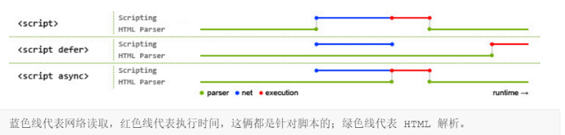

# 23 Module 的加载实现

## 1. 浏览器加载

### 1.1 传统方法

[JS 高级学习笔记（3）之 script 标签](https://www.cnblogs.com/houfee/p/9686572.html)

```js
<!-- 页面内嵌的脚本 -->
<script type="application/javascript">
 // module code
</script>
<!-- 外部脚本 -->
<script type="application/javascript" src="path/to/myModule.js">
</script>

```

异步加载

```js
<script src="path/to/myModule.js" defer></script>
<script src="path/to/myModule.js" async></script>
```



### 1.2 加载规则

浏览器加载 ES6 模块，也使用 `<script>`但是要加入 `type="module"` 属性。

```js
<script
  type='module'
  src='./foo.js'
></script>
```

浏览器对于带有 type="module" 的 `<script>`，都是异步加载，不会造成堵塞浏览器，即等到整个页面渲染完，再执行模块脚本，等同于打开了标签的 defer 属性。

如果网页有多个 `<script type="module">`，它们会按照在页面出现的顺序依次执行。

``<script>`标签的 async 属性也可以打开，这时只要加载完成，渲染引擎就会中断渲染立即执行。执行完成后，再恢复渲染。

一旦使用了 async 属性 `<script type="module">`，> 就不会按照在页面出现的顺序执行，而是只要该模块加载完成，就执行该模块。

ES6 模块也允许内嵌在网页中，语法行为与加载外部脚本完全一致。

```js
<script type='module'>import utils from "./utils.js"; // other code</script>
```

对于外部的模块脚本（上例是 foo.js ），有几点需要注意。

1. 代码是在模块作用域之中运行，而不是在全局作用域运行。模块内部的顶层变量，外部不可见
2. 模块脚本自动采用严格模式，不管有没有声明 use strict 。
3. 模块之中，可以使用 import 命令加载其他模块（ .js 后缀不可省略，需要提供绝对 URL 或相对 URL），也可以使用 export 命令输出对外接口。
4. 模块之中，顶层的 this 关键字返回 undefined ，而不是指向 window 。也就是说，在模块顶层使用 this 关键字，是无意义的。
5. 同一个模块如果加载多次，将只执行一次。

示例：

```js
import utils from 'https://example.com/js/utils.js';
const x = 1;
console.log(x === window.x); //false
console.log(this === undefined); // true
delete x; // 句法错误，严格模式禁止删除变量
```

利用顶层的 this 等于 undefined 这个语法点，可以侦测当前代码是否在 ES6 模块之中。

```js
const isNotModuleScript = this !== undefined;
```

## 2. ES6 模块与 CommonJS 模块的差异

CommonJS 模块输出的是一个值的拷贝，ES6 模块输出的是值的引用。

CommonJS 模块是运行时加载，ES6 模块是编译时输出接口。

第二个差异是因为 CommonJS 加载的是一个对象（即 module.exports 属性），该对象只有在脚本运行完才会生成。而 ES6 模块不是对象，它的对外接口只是一种静态定义，在代码静态解析阶段就会生成。

下面重点解释第一个差异。

CommonJS 模块输出的是值的拷贝，也就是说，一旦输出一个值，模块内部的变化就影响不到这个值。请看下面这个模块文件 lib.js 的例子。

```js
// lib.js
var counter = 3;
function incCounter() {
  counter++;
}
module.exports = {
  counter: counter,
  incCounter: incCounter
};
```

上面代码输出内部变量 counter 和改写这个变量的内部方法 incCounter 。然后，在 main.js 里面加载这个模块。

```js
// main.js
var mod = require('./lib');
console.log(mod.counter); // 3
mod.incCounter();
console.log(mod.counter); // 3
```

上面代码说明， lib.js 模块加载以后，它的内部变化就影响不到输出的 mod.counter 了。**这是因为 mod.counter 是一个原始类型的值，会被缓存。除非写成一个函数，才能得到内部变动后的值。**

```js
// lib.js
var counter = 3;
function incCounter() {
  counter++;
}
module.exports = {
  get counter() {
    return counter;
  },
  incCounter: incCounter
};
```

上面代码中，输出的 counter 属性实际上是一个取值器函数。现在再执行 main.js ，就可以正确读取内部变量 counter 的变动了。

```nodejs
$ node main.js
3
4
```

ES6 模块的运行机制与 CommonJS 不一样。JS 引擎对脚本静态分析的时候，遇到模块加载命令 import ，就会生成一个只读引用。等到脚本真正执行时，再根据这个只读引用，到被加载的那个模块里面去取值。

换句话说，ES6 的 import 有点像 Unix 系统的“符号连接”，原始值变了， import 加载的值也会跟着变。**因此，ES6 模块是动态引用，并且不会缓存值，模块里面的变量绑定其所在的模块。**

```js
// lib.js
export let counter = 3;
export function incCounter() {
  counter++;
}
// main.js
import { counter, incCounter } from './lib';
console.log(counter); // 3
incCounter();
console.log(counter); // 4
```

上面代码说明，ES6 模块输入的变量 counter 是活的，完全反应其所在模块 lib.js 内部的变化。

再举一个出现在 export 一节中的例子。

```js
// m1.js
export var foo = 'bar';
setTimeout(() => (foo = 'baz'), 500);
// m2.js
import { foo } from './m1.js';
console.log(foo);
setTimeout(() => console.log(foo), 500);
```

上面代码中， m1.js 的变量 foo ，在刚加载时等于 bar ，过了 500 毫秒，又变为等于 baz 。让我们看看， m2.js 能否正确读取这个变化。

```js
$ babel-node m2.js
bar
baz
```

上面代码表明，**ES6 模块不会缓存运行结果，而是动态地去被加载的模块取值，并且变量总是绑定其所在的模块。**

由于 ES6 输入的模块变量，只是一个“符号连接”，所以这个变量是只读的，对它进行重新赋值会报错。

```js
// lib.js
export let obj = {};
// main.js
import { obj } from './lib';
obj.prop = 123; // OK
obj = {}; // TypeError
```

上面代码中， main.js 从 lib.js 输入变量 obj ，可以对 obj 添加属性，但是重新赋值就会报错。因为变量 obj 指向的地址是只读的，不能重新赋值，这就好比 main.js 创造了一个名为 obj 的 const 变量。

最后， export 通过接口，输出的是同一个值。不同的脚本加载这个接口，得到的都是同样的实例。

```js
// mod.js
function C() {
  this.sum = 0;
  this.add = function () {
    this.sum += 1;
  };
  this.show = function () {
    console.log(this.sum);
  };
}
export let c = new C();
```

上面的脚本 mod.js ，输出的是一个 C 的实例。不同的脚本加载这个模块，得到的都是同一个实例。

```js
// x.js
import { c } from './mod';
c.add();
// y.js
import { c } from './mod';
c.show();
// main.js
import './x';
import './y';
```

现在执行 main.js ，输出的是 1 。

```js
$ babel-node main.js
1
```

这就证明了 x.js 和 y.js 加载的都是 C 的同一个实例。

## 3. [Node 加载](http://es6.ruanyifeng.com/#docs/module-loader)

### 3.1 概述

Node 对 es6 模块：commonjs 模块格式 和 ES6 模块格式分开，采用不同的加载方案。

在静态分析阶段，一个模块脚本只要有一行 import 或 export 语句，Node 就会认为该脚本为 ES6 模块，否则就是 Commonjs 模块。如果不输出任何接口，但是希望被 Node 认为是 ES6 模块，可以在脚本中输出：

```js
export {};
```

上面的命令并不是输出一个空对象，而是不输出任何接口的 ES6 的标准写法。

ES6 模块中，顶层的 this 指向 undefined，commonjs 模块的的顶层 this 指向当前模块，这是这两者的一个重大差异。

### 3.2 import 命令加载 Commonjs 模块

**书上的版本好像不正确，我在 node v10.15.3 测试不能实现**

Node 采用 Commonjs 模块，模块输出定义在`module.exports`属性上面。

在 Node 环境中使用 import 命令加载 Commonjs 模块，Node 会自动将 module。export 是属性当做模块的默认输出，即等同于 export default。

Commonjs 模块：

```js
// a.js
module.export = {
  foo: 'hello',
  bar: 'world'
};
// 等同于
export default {
  foo: 'hello',
  bar: 'world'
};
```

`import` 命令加载上面的模块， `module.exports` 会被视为默认输出，即 `import` 命令实际上输入的是这样一个对象 `{ default: module.exports }` 。

```js
// 写法一
import baz from './a';
// baz = {foo: 'hello', bar: 'world'};
// 写法二
import { default as baz } from './a';
// baz = {foo: 'hello', bar: 'world'};
// 写法三
import * as baz from './a';
// baz = {
// get default() {return module.exports;},
// get foo() {return this.default.foo}.bind(baz),
// get bar() {return this.default.bar}.bind(baz)
// }
```

上面代码的第三种写法，可以通过 baz.default 拿到 module.exports 。 foo 属性和 bar 属性就是可以通过这种方法拿到了 module.exports 。

```js
// b.js
module.exports = null;

// es.js
import foo from './b';
// foo = null;

import * as bar from './b';
// bar = { default:null };
```

上面代码中， es.js 采用第二种写法时，要通过 bar.default 这样的写法，才能拿到 module.exports 。

```js
// c.js
module.exports = function two() {
  return 2;
};

// es.js
import foo from './c';
foo(); // 2
import * as bar from './c';
bar.default(); // 2
bar(); // throws, bar is not a function
```

上面代码中， bar 本身是一个对象，不能当作函数调用，只能通过 bar.default 调用。

CommonJS 模块的输出缓存机制，在 ES6 加载方式下依然有效。

```js
// foo.js
module.exports = 123;
setTimeout(_ => (module.exports = null));
```

上面代码中，对于加载 foo.js 的脚本， module.exports 将一直是 123 ，而不会变成 null 。

由于 ES6 模块是编译时确定输出接口，CommonJS 模块是运行时确定输出接口，所以采用 import 命令加载 CommonJS 模块时，不允许采用下面的写法。

```js
// 不正确
import { readfile } from 'fs';
```

上面的写法不正确，因为 fs 是 CommonJS 格式，只有在运行时才能确定 readfile 接口，而 import 命令要求编译时就确定这个接口。解决方法就是改为整体输入。

```js
// 正确的写法一
import * as express from 'express';
const app = express.default();
// 正确的写法二
import express from 'express';
const app = express();
```

### 3.2 CommonJS 模块加载 ES6 模块

**书上好像不正确，我在 node v10.15.3 测试不能实现**

## 4. 循环加载

“循环加载”（circular dependency）指的是， a 脚本的执行依赖 b 脚本，而 b 脚本的执行又依赖 a 脚本。

```js
// a.js
var b = require('b');
// b.js
var a = require('a');
```

通常，“循环加载”表示存在强耦合，如果处理不好，还可能导致递归加载，使得程序无法执行，因此应该避免出现。

### 4.1 CommonJS 模块的加载原理

CommonJS 模块格式的加载原理:

**CommonJS 的一个模块，就是一个脚本文件。 require 命令第一次加载该脚本，就会执行整个脚本，然后在内存生成一个对象。**

```js
{
 id: '...',
 exports: { ... },
 loaded: true,
 ...
}

```

上面代码就是 Node 内部加载模块后生成的一个对象。该对象的 id 属性是模块名， exports 属性是模块输出的各个接口， loaded 属性是一个布尔值，表示该模块的脚本是否执行完毕。其他还有很多属性，这里都省略了。

以后需要用到这个模块的时候，就会到 exports 属性上面取值。即使再次执行 require 命令，也不会再次执行该模块，而是到缓存之中取值。也就是说，**CommonJS 模块无论加载多少次，都只会在第一次加载时运行一次，以后再加载，就返回第一次运行的结果，除非手动清除系统缓存。**

### 4.2 CommonJS 模块的循环加载

CommonJS 模块的重要特性是加载时执行，即脚本代码在 require 的时候，就会全部执行。一旦出现某个模块被"循环加载"，就只输出已经执行的部分，还未执行的部分不会输出。

当存在循环`require()`调用时，模块在返回时可能尚未完成执行：

```js
// a.js
console.log('a starting');
exports.done = false;
const b = require('./b.js');
console.log('in a, b.done = %j', b.done);
exports.done = true;
console.log('a done');
```

```js
// b.js
console.log('b starting');
exports.done = false;
const a = require('./a.js');
console.log('in b, a.done = %j', a.done);
exports.done = true;
console.log('b done');
```

```js
// main.js
console.log('main starting');
const a = require('./a.js');
const b = require('./b.js');
console.log('in main, a.done = %j, b.done = %j', a.done, b.done);
```

上面代码之中， b.js 执行到第二行，就会去加载 a.js ，这时，就发生了“循环加载”。系统会去 a.js 模块对应对象的 exports 属性取值，可是因为 a.js 还没有执行完，从 exports 属性只能取回已经执行的部分，而不是最后的值。

a.js 已经执行的部分，只有一行。

```js
exports.done = false;
```

因此，对于 b.js 来说，它从 a.js 只输入一个变量 done ，值为 false 。然后， b.js 接着往下执行，等到全部执行完毕，再把执行权交还给 a.js 。于是， a.js 接着往下执行，直到执行完毕。我们写一个脚本 main.js ，验证这个过程。

```js
var a = require('./a.js');
var b = require('./b.js');
console.log('in main, a.done = %j, b.done = %j', a.done, b.done);
```

执行 main.js ，运行结果如下。

```js
main starting
a starting
b starting
in b, a.done = false
b done
in a, b.done = true
a done
in main, a.done = true, b.done = true
```

上面的代码证明了两件事。一是，在 b.js 之中， a.js 没有执行完毕，只执行了第一行。二是， main.js 执行到第二行时，不会再次执行 b.js ，而是输出缓存的 b.js 的执行结果，即它的第四行。

```js
exports.done = true;
```

**总之，CommonJS 输入的是被输出值的拷贝，不是引用。** 另外，由于 CommonJS 模块遇到循环加载时，返回的是当前已经执行的部分的值，而不是代码全部执行后的值，两者可能会有差异。所以，输入变量的时候，必须非常小心。

```js
var a = require('a'); // 安全的写法
var foo = require('a').foo; // 危险的写法
exports.good = function (arg) {
  return a.foo('good', arg); // 使用的是 a.foo 的最新值
};
exports.bad = function (arg) {
  return foo('bad', arg); // 使用的是一个部分加载时的值
};
```

上面代码中，如果发生循环加载， require('a').foo 的值很可能后面会被改写，改用 require('a') 会更保险一点。

### 4.3 ES6 模块的循环加载

ES6 处理“循环加载”与 CommonJS 有本质的不同。**ES6 模块是动态引用，如果使用 import 从一个模块加载变量（即 import foo from 'foo' ），那些变量不会被缓存，而是成为一个指向被加载模块的引用，需要开发者自己保证，真正取值的时候能够取到值。**

未在代码中实现以下：

```js
// a.mjs
import { bar } from './b';
console.log('a.mjs');
console.log(bar);
export let foo = 'foo';
```

```js
// b.mjs
import { foo } from './a';
console.log('b.mjs');
console.log(foo);
export let bar = 'bar';
```

上面代码中， a.mjs 加载 b.mjs ， b.mjs 又加载 a.mjs ，构成循环加载。执行 a.mjs ，结果如下。

```js
$ node --experimental-modules a.mjs
b.mjs
ReferenceError: foo is not defined
```

上面代码中，执行 a.mjs 以后会报错， foo 变量未定义，这是为什么？

让我们一行行来看，ES6 循环加载是怎么处理的。首先，执行 a.mjs 以后，引擎发现它加载了 b.mjs ，因此会优先执行 b.mjs ，然后再执行 a.js 。接着，执行 b.mjs 的时候，已知它从 a.mjs 输入了 foo 接口，这时不会去执行 a.mjs ，而是认为这个接口已经存在了，继续往下执行。执行到第三行 console.log(foo) 的时候，才发现这个接口根本没定义，因此报错。

**书上的 demo 都实现不了，不知道是 node 版本的问题，还是没有按照书的说明配置环境**:cry:
